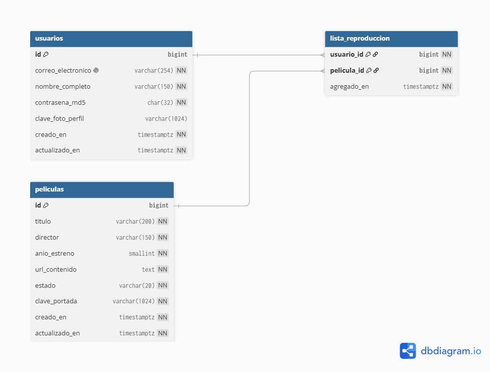

# Práctica 1 — CloudCinema

CloudCinema será una aplicación web desplegada en AWS con dos servidores intercambiables, uno en Node.js y otro en Python, una base de datos relacional compartida y almacenamiento de imágenes en S3.

## Documentación

- [Índice completo de documentación](docs/README.md)
- [Manual técnico acumulativo](docs/general/MANUAL_TECNICO.md)
- [GitFlow del equipo](docs/general/GITFLOW.md)
- [Plan de trabajo de PRA-1 a PRA-5](docs/general/PLAN_PRA_1_A_PRA_5.md)
- [Bitácora de aprendizaje](docs/general/BITACORA_APRENDIZAJE.md)
- [Decisiones de arquitectura](docs/general/DECISIONES_ARQUITECTURA.md)
- [Diagrama ER y restricciones](docs/pra-1/DIAGRAMA_ER.md)
- [Imagen del diagrama ER](docs/img/ER.png)
- [Contrato API detallado](docs/pra-1/CONTRATO_API.md)
- [Especificación OpenAPI](docs/pra-1/openapi.yaml)
- [Evidencias de PRA-2](docs/pra-2/EVIDENCIAS_PRA_2_RDS.md)
- [Evidencias de PRA-3](docs/pra-3/EVIDENCIAS_PRA_3_S3.md)
- [Evidencias de PRA-4](docs/pra-4/EVIDENCIAS_PRA_4_IAM.md)
- [Esquema PostgreSQL](database/schema.sql)
- [Permisos PostgreSQL de las aplicaciones](database/permisos_aplicacion.sql)
- [Verificación del despliegue RDS](database/verificar_rds.sql)

## Estado

**PRA-1** está integrado en `develop`. **PRA-2** tiene RDS creado y verificado, pero espera la validación desde las dos EC2. **PRA-3** tiene el bucket S3 configurado y espera las pruebas desde Node.js y Python. **PRA-4** tiene la política mínima y los dos roles preparados, pero espera que se adjunten a las EC2. Los documentos y capturas se conservan para la auditoría final.

## Arquitectura prevista

```text
Cliente web estático en S3
          │
          ▼
Application Load Balancer
       ┌──┴──┐
       ▼     ▼
   Node.js  Python
       └──┬──┘
          ├──── Amazon RDS PostgreSQL
          └──── Amazon S3 (imágenes)
```

Los servidores comparten el mismo esquema, rutas, JWT, códigos HTTP y estructuras JSON. El campo `implementacion` de `GET /salud` es la única diferencia visible permitida.

## Modelo de datos

| Entidad | Propósito | Reglas principales |
|---|---|---|
| `usuarios` | Usuarios registrados | Correo único y normalizado; foto como clave de S3 |
| `peliculas` | Cartelera compartida | Estado `DISPONIBLE` o `PROXIMO_ESTRENO`; portada como clave de S3 |
| `lista_reproduccion` | Relación usuario-película | Clave compuesta sin duplicados y fecha de agregado |



La explicación de las relaciones y restricciones está en [`docs/pra-1/DIAGRAMA_ER.md`](docs/pra-1/DIAGRAMA_ER.md). El esquema ejecutable que respalda el diagrama está en [`database/schema.sql`](database/schema.sql).

Las claves siguen los prefijos `Fotos_Perfil/` y `Fotos_Peliculas/`. Las URL se construyen al responder la API, por lo que RDS no almacena imágenes, Base64 ni direcciones dependientes de un bucket específico.

## Contrato API común

Todas las respuestas utilizan `{ "exito": true, "datos": ... }` o `{ "exito": false, "error": ... }`. Las rutas protegidas requieren el encabezado HTTP `Authorization: Bearer <JWT>` y un token firmado con un secreto compartido fuera del repositorio.

| Método | Ruta | Función | Autenticación | Éxito |
|---|---|---|---|---|
| GET | `/salud` | Comprobar disponibilidad para el Load Balancer | No | 200 |
| POST | `/api/v1/autenticacion/registro` | Registrar usuario y foto | No | 201 |
| POST | `/api/v1/autenticacion/inicio-sesion` | Validar credenciales y emitir JWT | No | 200 |
| GET | `/api/v1/perfil` | Consultar perfil | Sí | 200 |
| PUT | `/api/v1/perfil` | Actualizar nombre/foto con contraseña actual | Sí | 200 |
| GET | `/api/v1/peliculas` | Consultar cartelera | Sí | 200 |
| GET | `/api/v1/lista-reproduccion` | Consultar lista reciente | Sí | 200 |
| POST | `/api/v1/lista-reproduccion/{peliculaId}` | Agregar película disponible | Sí | 201 |
| DELETE | `/api/v1/lista-reproduccion/{peliculaId}` | Eliminar película | Sí | 200 |

Las solicitudes, respuestas, errores y validaciones exactos están en [`docs/pra-1/CONTRATO_API.md`](docs/pra-1/CONTRATO_API.md). `docs/pra-1/openapi.yaml` es la fuente legible por herramientas y debe utilizarse como referencia al implementar ambos servidores.

## Decisiones principales de PRA-1

- PostgreSQL 16 como motor objetivo de Amazon RDS.
- JWT HS256 con vigencia de una hora para evitar sesiones locales.
- `multipart/form-data` para fotografías, no Base64 dentro de JSON.
- Claves de S3 en RDS y URL construidas por los servicios.
- `snake_case` en PostgreSQL y `camelCase` en JSON.
- MD5 únicamente por requerimiento académico; no es apto para producción.

## Estructura de documentación

```text
Practica_1/
├── config/
│   ├── .env.node.example
│   └── .env.python.example
├── database/
│   ├── permisos_aplicacion.sql
│   ├── schema.sql
│   └── verificar_rds.sql
├── docs/
│   ├── README.md
│   ├── general/
│   ├── pra-1/
│   ├── pra-2/
│   ├── pra-3/
│   ├── pra-4/
│   └── img/
│       ├── ER.png
│       ├── pra-2/
│       ├── pra-3/
│       └── pra-4/
└── README.md
```

## Regla de seguridad

Este repositorio no debe contener secretos. Las credenciales y variables sensibles se configurarán mediante mecanismos externos y archivos locales ignorados por Git.
