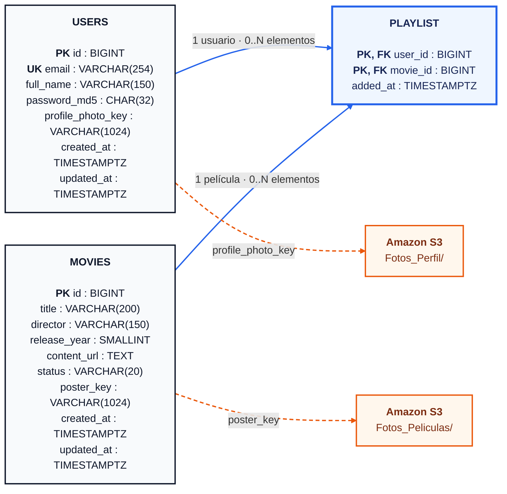

# Práctica 1 — CloudCinema

CloudCinema será una aplicación web desplegada en AWS con dos backends intercambiables, uno en Node.js y otro en Python, una base de datos relacional compartida y almacenamiento de imágenes en S3.

## Documentación

- [GitFlow del equipo](docs/GITFLOW.md)
- [Plan de trabajo de PRA-1 a PRA-5](docs/PLAN_PRA_1_A_PRA_5.md)
- [Bitácora de aprendizaje](docs/BITACORA_APRENDIZAJE.md)
- [Decisiones de arquitectura](docs/DECISIONES_ARQUITECTURA.md)
- [Diagrama ER y restricciones](docs/DIAGRAMA_ER.md)
- [Código Mermaid importable en Excalidraw](docs/DIAGRAMA_ER.mmd)
- [Contrato API detallado](docs/CONTRATO_API.md)
- [Especificación OpenAPI](docs/openapi.yaml)
- [Revisión de criterios de PRA-1](docs/REVISION_PRA_1.md)
- [Esquema PostgreSQL](database/schema.sql)

## Estado

**PRA-1 — Diseñar contrato API y modelo relacional** se encuentra en `In Progress`. El diseño técnico está versionado y falta la revisión con los responsables de Node.js y Python antes de integrarlo en `develop` y cerrar el ticket. PRA-2 a PRA-5 permanecen en Backlog.

## Arquitectura prevista

```text
Frontend estático en S3
          │
          ▼
Application Load Balancer
       ┌──┴──┐
       ▼     ▼
   Node.js  Python
       └──┬──┘
          ├──── Amazon RDS PostgreSQL
          └──── Amazon S3 (imágenes)
```

Los backends comparten el mismo esquema, rutas, JWT, códigos HTTP y estructuras JSON. El campo `implementation` de `GET /health` es la única diferencia visible permitida.

## Modelo de datos

| Entidad | Propósito | Reglas principales |
|---|---|---|
| `users` | Usuarios registrados | Correo único y normalizado; foto como key de S3 |
| `movies` | Cartelera compartida | Estado `DISPONIBLE` o `PROXIMO_ESTRENO`; póster como key de S3 |
| `playlist` | Relación usuario-película | Clave compuesta sin duplicados y fecha de agregado |



Las keys siguen los prefijos `Fotos_Perfil/` y `Fotos_Peliculas/`. Las URLs se construyen al responder la API, por lo que RDS no almacena imágenes, Base64 ni direcciones dependientes de un bucket específico.

## Contrato API común

Todas las respuestas utilizan `{ "success": true, "data": ... }` o `{ "success": false, "error": ... }`. Las rutas protegidas requieren un JWT Bearer firmado con un secreto compartido fuera del repositorio.

| Método | Ruta | Función | Auth | Éxito |
|---|---|---|---|---|
| GET | `/health` | Health check del Load Balancer | No | 200 |
| POST | `/api/v1/auth/register` | Registrar usuario y foto | No | 201 |
| POST | `/api/v1/auth/login` | Validar credenciales y emitir JWT | No | 200 |
| GET | `/api/v1/profile` | Consultar perfil | Sí | 200 |
| PUT | `/api/v1/profile` | Actualizar nombre/foto con contraseña actual | Sí | 200 |
| GET | `/api/v1/movies` | Consultar cartelera | Sí | 200 |
| GET | `/api/v1/playlist` | Consultar playlist reciente | Sí | 200 |
| POST | `/api/v1/playlist/{movieId}` | Agregar película disponible | Sí | 201 |
| DELETE | `/api/v1/playlist/{movieId}` | Eliminar película | Sí | 200 |

Los requests, responses, errores y validaciones exactos están en [`docs/CONTRATO_API.md`](docs/CONTRATO_API.md). `docs/openapi.yaml` es la fuente legible por herramientas y debe utilizarse como referencia al implementar ambos backends.

## Decisiones principales de PRA-1

- PostgreSQL 16 como motor objetivo de Amazon RDS.
- JWT HS256 con vigencia de una hora para evitar sesiones locales.
- `multipart/form-data` para fotografías, no Base64 dentro de JSON.
- Keys de S3 en RDS y URLs construidas por los servicios.
- `snake_case` en PostgreSQL y `camelCase` en JSON.
- MD5 únicamente por requerimiento académico; no es apto para producción.

## Estructura inicial

```text
Practica_1/
├── database/
│   └── schema.sql
├── docs/
│   ├── BITACORA_APRENDIZAJE.md
│   ├── CONTRATO_API.md
│   ├── DECISIONES_ARQUITECTURA.md
│   ├── DIAGRAMA_ER.mmd
│   ├── DIAGRAMA_ER.md
│   ├── GITFLOW.md
│   ├── PLAN_PRA_1_A_PRA_5.md
│   ├── REVISION_PRA_1.md
│   └── openapi.yaml
└── README.md
```

## Regla de seguridad

Este repositorio no debe contener secretos. Las credenciales y variables sensibles se configurarán mediante mecanismos externos y archivos locales ignorados por Git.
