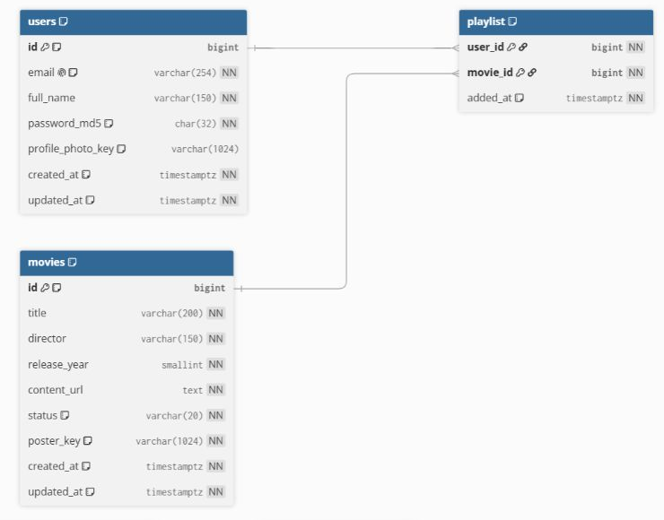

# Diagrama entidad-relación

El modelo utiliza tres entidades. `playlist` es la tabla intermedia entre usuarios y películas; su clave primaria compuesta impide que un usuario agregue la misma película más de una vez.

La versión principal fue diagramada en [dbdiagram.io](https://dbdiagram.io/) a partir de DBML. Este formato está orientado a bases de datos relacionales, muestra claves e índices con claridad y mantiene el diagrama regenerable como código.

## Cómo editar o regenerar la versión gráfica

1. Abrir [`DIAGRAMA_ER.dbml`](DIAGRAMA_ER.dbml) y copiar su contenido.
2. Entrar a [dbdiagram.io](https://dbdiagram.io/) y pegar el DBML en el editor.
3. Usar **Auto-arrange** o mover las tablas para ajustar la composición.
4. Exportar como PNG, SVG o PDF. La exportación desde la web puede requerir iniciar sesión.

El archivo [`DIAGRAMA_ER.mmd`](DIAGRAMA_ER.mmd) se conserva únicamente como alternativa compatible con Mermaid y Excalidraw; el DBML es la fuente gráfica principal.

## Relaciones

- Un usuario puede tener cero o muchas películas en su playlist.
- Una película puede aparecer en las playlists de cero o muchos usuarios.
- Cada fila de `playlist` pertenece exactamente a un usuario y una película.
- Al eliminar un usuario o película se eliminan sus relaciones mediante `ON DELETE CASCADE`.

## Restricciones importantes

| Regla | Implementación |
|---|---|
| Correo único | Índice único sobre `LOWER(email)` |
| Correo normalizado | Se almacena en minúsculas y sin espacios exteriores |
| Playlist sin duplicados | `PRIMARY KEY (user_id, movie_id)` |
| Orden por agregado reciente | `added_at` e índice `(user_id, added_at DESC)` |
| Estados permitidos | `DISPONIBLE` o `PROXIMO_ESTRENO` |
| Solo películas disponibles en playlist | Trigger `trg_playlist_available_movie` |
| Fotos fuera de RDS | Se guardan keys bajo `Fotos_Perfil/` y `Fotos_Peliculas/` |

## Correspondencia SQL ↔ JSON

La base utiliza `snake_case` y la API utiliza `camelCase`.

| PostgreSQL | JSON |
|---|---|
| `full_name` | `fullName` |
| `profile_photo_key` | No se expone; la API devuelve `profilePhotoUrl` |
| `release_year` | `releaseYear` |
| `content_url` | `contentUrl` |
| `poster_key` | No se expone; la API devuelve `posterUrl` |
| `added_at` | `addedAt` |

El archivo ejecutable del modelo está en [`../database/schema.sql`](../database/schema.sql).
