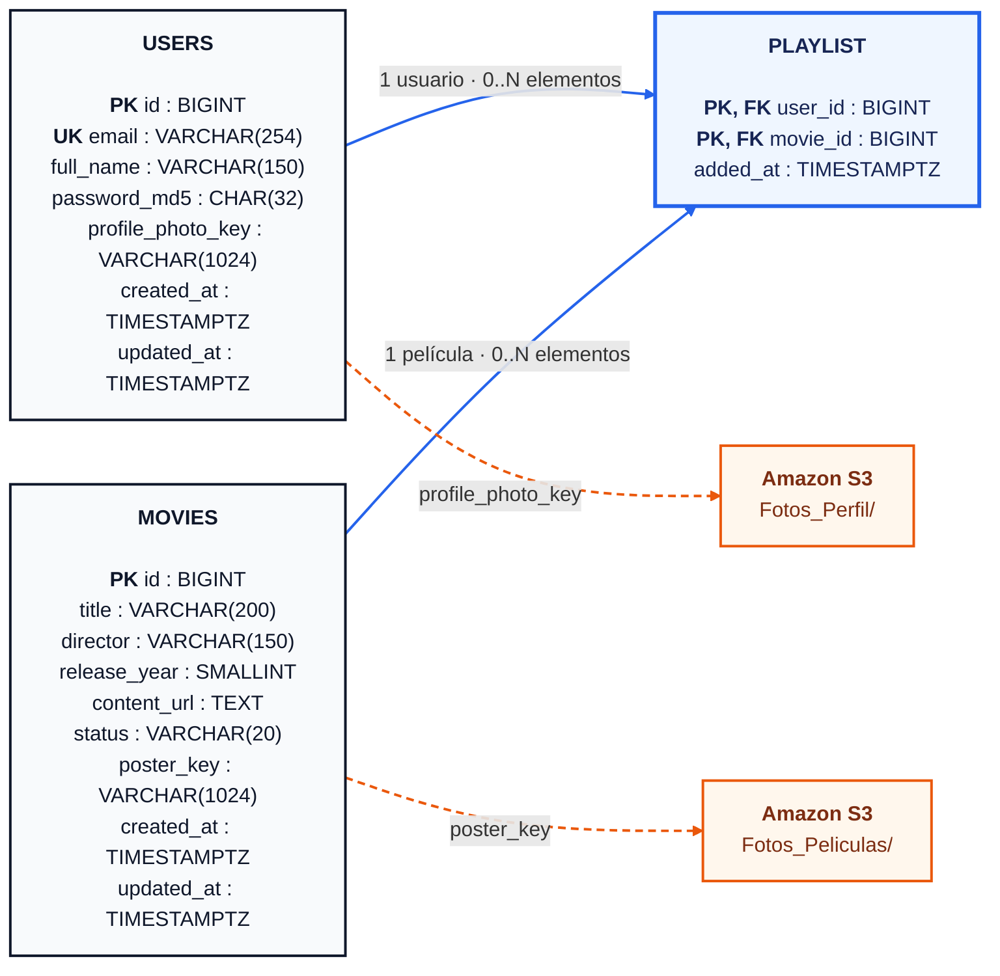

# Diagrama entidad-relación

El modelo utiliza tres entidades. `playlist` es la tabla intermedia entre usuarios y películas; su clave primaria compuesta impide que un usuario agregue la misma película más de una vez.

La versión elegida utiliza `flowchart` porque ofrece mejor estilo visual y se importa mejor en Excalidraw que el tipo rígido `erDiagram`. El código fuente independiente está en [`DIAGRAMA_ER.mmd`](DIAGRAMA_ER.mmd).

## Cómo generar la versión gráfica

1. Abrir [`DIAGRAMA_ER.mmd`](DIAGRAMA_ER.mmd) y copiar todo su contenido.
2. En Excalidraw, seleccionar **Insertar → Mermaid to Excalidraw** y pegar el código.
3. Ajustar posiciones, tipografía o colores si se desea una composición manual.
4. Exportar como SVG o PNG para las evidencias de la práctica.

También puede pegarse en [Mermaid Live Editor](https://mermaid.live/) para previsualizar y exportar un SVG.

## Relaciones

- Un usuario puede tener cero o muchas películas en su playlist.
- Una película puede aparecer en las playlists de cero o muchos usuarios.
- Cada fila de `playlist` pertenece exactamente a un usuario y una película.
- Al eliminar un usuario o película se eliminan sus relaciones mediante `ON DELETE CASCADE`.

## Restricciones importantes

| Regla | Implementación |
|---|---|
| Correo único | Índice único sobre `LOWER(email)` |
| Correo normalizado | Se almacena en minúsculas y sin espacios exteriores |
| Playlist sin duplicados | `PRIMARY KEY (user_id, movie_id)` |
| Orden por agregado reciente | `added_at` e índice `(user_id, added_at DESC)` |
| Estados permitidos | `DISPONIBLE` o `PROXIMO_ESTRENO` |
| Solo películas disponibles en playlist | Trigger `trg_playlist_available_movie` |
| Fotos fuera de RDS | Se guardan keys bajo `Fotos_Perfil/` y `Fotos_Peliculas/` |

## Correspondencia SQL ↔ JSON

La base utiliza `snake_case` y la API utiliza `camelCase`.

| PostgreSQL | JSON |
|---|---|
| `full_name` | `fullName` |
| `profile_photo_key` | No se expone; la API devuelve `profilePhotoUrl` |
| `release_year` | `releaseYear` |
| `content_url` | `contentUrl` |
| `poster_key` | No se expone; la API devuelve `posterUrl` |
| `added_at` | `addedAt` |

El archivo ejecutable del modelo está en [`../database/schema.sql`](../database/schema.sql).
