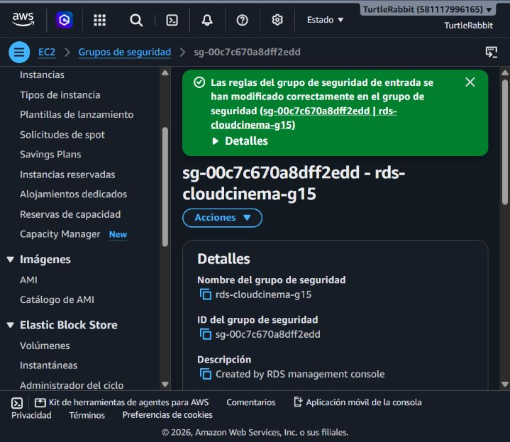
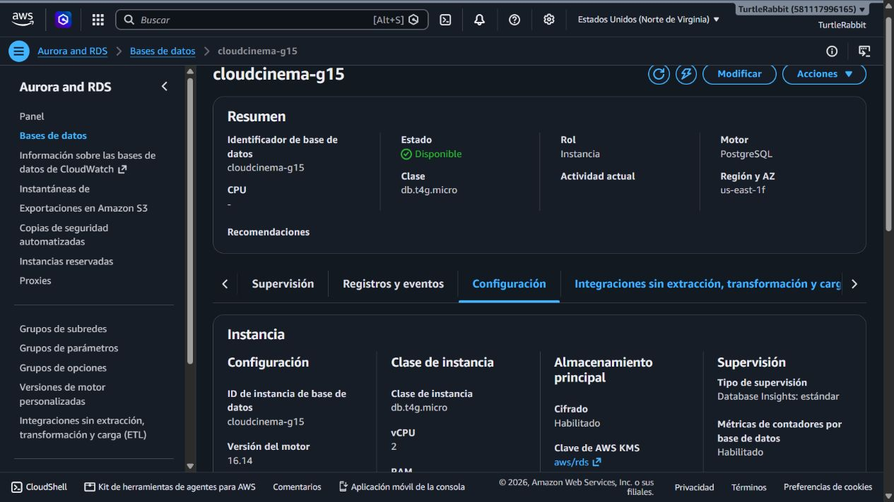
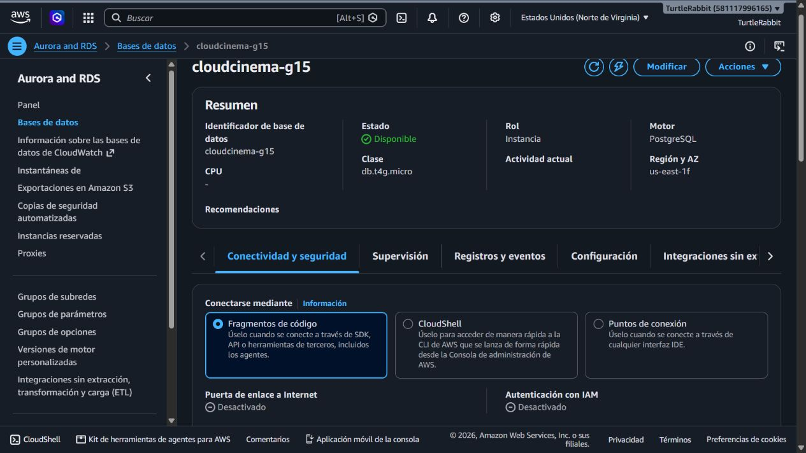
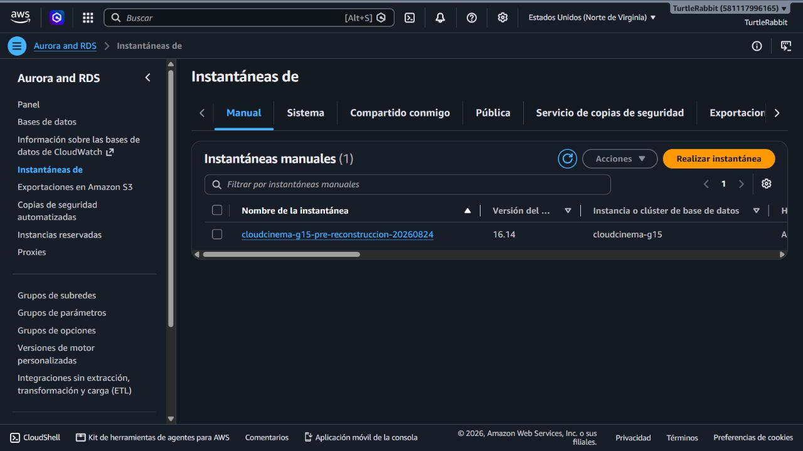

# Evidencias paso a paso — PRA-2 Amazon RDS

**Incidencia:** PRA-2 — Crear y configurar Amazon RDS  
**Región:** `us-east-1`  
**Motor:** PostgreSQL 16  
**Instancia:** `cloudcinema-g15`

## Propósito

Este documento registra visualmente la creación y configuración de Amazon RDS para CloudCinema. El procedimiento fue reconstruido desde cero y las capturas corresponden a la consola real de AWS.

Las contraseñas, tokens y llaves no se incluyen en las evidencias. Los identificadores técnicos, nombres de recursos y valores de configuración se conservan porque forman parte de la documentación académica.

## 0. Estado previo y respaldo de seguridad

Antes de reconstruir se verificó el recurso existente y se creó la instantánea `cloudcinema-g15-pre-reconstruccion-20260824`.

### Security group previo

### Configuración previa de RDS

### Conectividad previa de RDS

### Snapshot manual de recuperación

La instantánea se conservó antes de eliminar la instancia anterior y AWS confirmó el estado `Disponible`.

## 1. Creación del security group de RDS

Se crea primero un security group dedicado. De esta manera RDS puede seleccionar un recurso existente y no necesita crear reglas temporales basadas en la IP pública del equipo.

### Datos básicos

### Sin reglas de entrada iniciales y salida predeterminada

Mientras las EC2 de las Personas 2 y 3 todavía no existan, el security group no permite conexiones entrantes. Se conserva la salida predeterminada de AWS; esa regla no abre el puerto PostgreSQL hacia RDS.

### Security group creado

## 2. Motor y método de creación

Se selecciona PostgreSQL y el método de configuración completa para controlar red, costo, respaldo y seguridad.

## 3. Plantilla y disponibilidad

Se utiliza la plantilla de capa gratuita y una sola zona de disponibilidad para evitar recursos redundantes con costo adicional.

## 4. Credenciales administrativas

El usuario maestro es `admincloudcinema`. La contraseña se genera automáticamente, se guarda fuera de Git y no aparece en capturas. El identificador `cloudcinema-g15` se comprueba en la captura de aprovisionamiento.

## 5. Almacenamiento y conexión con EC2

Se configuran 20 GiB de SSD de propósito general, se desactiva el escalado automático y no se vincula una EC2 durante la creación. La clase `db.t4g.micro` se comprueba en la verificación final.

## 6. Conectividad privada

RDS utiliza la VPC predeterminada, no tiene acceso público y se asocia únicamente con el security group `rds-cloudcinema-g15` creado en el paso anterior.

## 7. Supervisión

Se conserva Database Insights estándar y se desactiva la monitorización mejorada con costo adicional.

## 8. Mantenimiento y protección

Se habilitan las actualizaciones automáticas de versiones secundarias y la protección contra eliminación. El cifrado, la base inicial `cloudcinema` y los respaldos se comprueban en las vistas finales de AWS.

## 9. Etiquetas

Se agregan las etiquetas `Proyecto=CloudCinema` e `Incidencia=PRA-2` para identificar el propósito y el ticket responsable del recurso.

## 10. Revisión previa a la creación

Antes de crear se vuelve a comprobar el mantenimiento automático y la protección contra eliminación. La configuración completa queda registrada en el conjunto de capturas anteriores y se verifica nuevamente cuando la instancia está disponible.

## 11. Aprovisionamiento

AWS crea la instancia y sus componentes asociados. La consola ofrece una sola ventana para consultar la contraseña generada; esa información se guarda en un gestor de contraseñas y no se captura.

## 12. Verificación final

### Instancia disponible

### Motor, almacenamiento y seguridad

La vista adicional confirma Single-AZ, escalado automático desactivado y protección contra eliminación habilitada.

### Red privada

### Respaldos

### Security group sin entradas públicas

### Verificación inicial y corrección del conteo de triggers

La primera ejecución confirmó conexión, PostgreSQL 16.14 y TLS 1.3. El único error fue del verificador: `information_schema.triggers` devuelve una fila por evento, por lo que un trigger definido para `INSERT OR UPDATE` se contaba dos veces. Se corrigió el script para contar nombres distintos y se ejecutó nuevamente.

### Verificación corregida y exitosa

La segunda ejecución terminó con `VERIFICACION_PRA_2_COMPLETA`. Confirmó las tablas `usuarios`, `peliculas` y `lista_reproduccion`, sus índices, los tres triggers distintos, TLS 1.3 y los roles PostgreSQL separados.

### Ejecución privada mediante CloudShell VPC

Como todavía no existen las EC2 de PRA-10 y PRA-15, se utilizó temporalmente CloudShell dentro de la misma VPC y subred para ejecutar los scripts sin hacer público RDS. Se creó el security group `cloudshell-rds-admin-g15`, se autorizó TCP 5432 únicamente desde ese grupo y se eliminaron tanto la regla como el entorno al terminar.

La captura de solicitud de contraseña no contiene la contraseña. La verificación exitosa está registrada en la captura 31.

### Valores comprobados en AWS

| Configuración | Resultado |
|---|---|
| Estado | Disponible |
| Motor | PostgreSQL 16.14 |
| Clase | `db.t4g.micro` |
| Base inicial | `cloudcinema` |
| Usuario maestro | `admincloudcinema` |
| Despliegue | Single-AZ |
| Almacenamiento | 20 GiB `gp2`, cifrado, sin escalado automático |
| Acceso público | No |
| Security group | `rds-cloudcinema-g15` (`sg-0e034b66e1c196572`), sin entradas |
| Copias automatizadas | Habilitadas, retención de 1 día |
| Protección contra eliminación | Habilitada |
| Supervisión | Database Insights estándar; monitorización mejorada desactivada |

## Trabajo pendiente para completar PRA-2

- Confirmar que la contraseña administrativa y las dos contraseñas de aplicación estén guardadas de forma privada; rotarlas si se mostraron en la terminal.
- Recibir los security groups de EC2 de Personas 2 y 3.
- Autorizar TCP 5432 únicamente desde esos dos security groups.
- Probar los usuarios separados de Node.js y Python.
