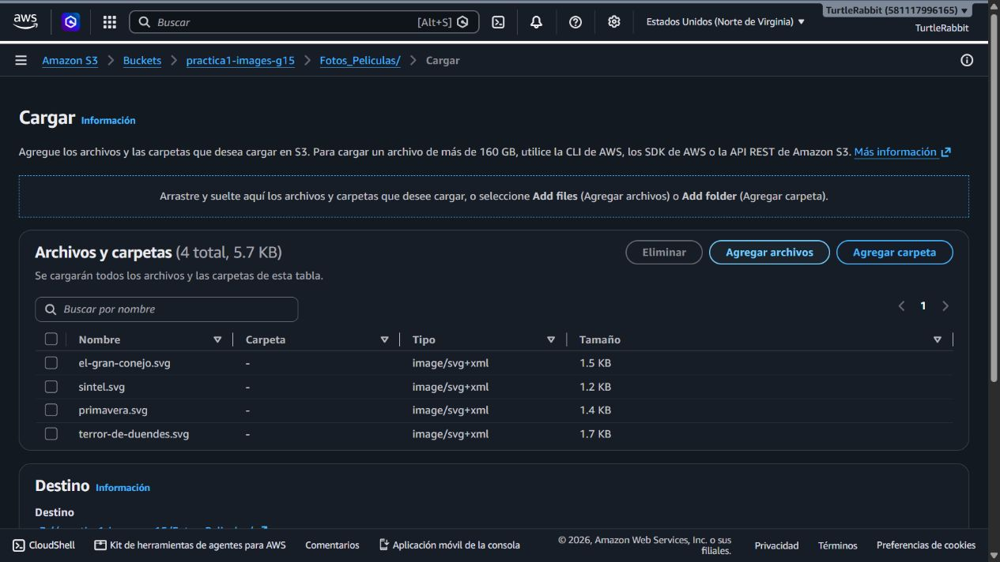
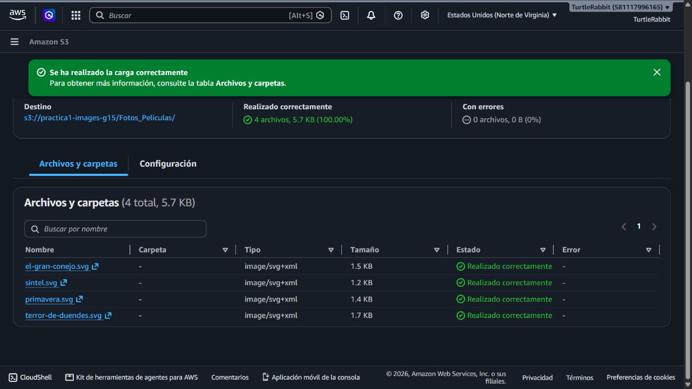
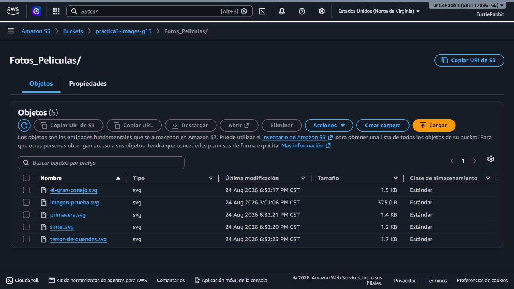
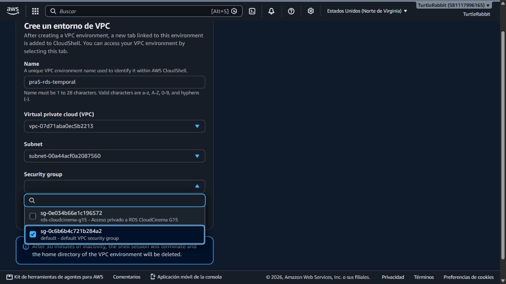

# Evidencias — PRA-5 Datos iniciales y recursos compartidos

**Responsable:** Isai Patzan — Persona 1

**Región:** `us-east-1`

**Estado:** En ejecución; S3 completado y RDS preparado para carga

## 1. Preparación de la cartelera

Se definieron cuatro registros completos en `database/seed.sql`. El script usa `MERGE`, por lo que puede ejecutarse nuevamente sin duplicar películas con el mismo título y año.

| Título | Director | Año | Estado | Clave de portada |
|---|---|---:|---|---|
| El gran conejo | Sacha Goedegebure | 2008 | `DISPONIBLE` | `Fotos_Peliculas/el-gran-conejo.svg` |
| Sintel | Colin Levy | 2010 | `DISPONIBLE` | `Fotos_Peliculas/sintel.svg` |
| Primavera | Andy Goralczyk | 2019 | `PROXIMO_ESTRENO` | `Fotos_Peliculas/primavera.svg` |
| Terror de duendes | Matthew Luhn | 2021 | `PROXIMO_ESTRENO` | `Fotos_Peliculas/terror-de-duendes.svg` |

RDS almacena la clave del objeto, no el archivo SVG ni su contenido binario.

## 2. Selección de archivos para Amazon S3

Se abrió el prefijo `Fotos_Peliculas/` del bucket `practica1-images-g15` y se seleccionaron los cuatro pósteres.



## 3. Resultado de la carga

Amazon S3 confirmó cuatro archivos cargados, 100 % completado y cero errores.



## 4. Estructura final de `Fotos_Peliculas/`

La vista del prefijo muestra los cuatro archivos nuevos. `imagen-prueba.svg` se conserva porque pertenece a las evidencias de PRA-3 y no debe eliminarse durante PRA-5.



## 5. Validación de acceso público

Se realizó una solicitud HTTP `HEAD` a cada URL pública. Los cuatro objetos respondieron `200` con tipo `image/svg+xml`.

| Objeto | Resultado |
|---|---|
| `el-gran-conejo.svg` | HTTP 200 |
| `sintel.svg` | HTTP 200 |
| `primavera.svg` | HTTP 200 |
| `terror-de-duendes.svg` | HTTP 200 |

La prueba puede repetirse con:

```bash
bash Practica_1/scripts/verificar_posteres_s3.sh
```

## 6. Preparación de acceso temporal a RDS

RDS no está expuesto públicamente. Para aplicar los datos se comenzó a preparar un entorno temporal de CloudShell dentro de la VPC `vpc-07d71aba0ec5b2213`.



La sesión temporal no terminó de abrir durante esta ejecución. Por seguridad, no se cambió RDS a acceso público ni se guardó ninguna contraseña. La carga queda lista para retomarse desde CloudShell o desde una EC2 autorizada.

## 7. Aplicación pendiente en PostgreSQL

Cuando la sesión autorizada esté disponible se deben ejecutar, en este orden:

```bash
psql "$CADENA_CONEXION_SSL" -f seed.sql
psql "$CADENA_CONEXION_SSL" -f verificar_datos_iniciales.sql
```

El resultado esperado es:

- Cuatro películas semilla.
- Dos películas disponibles.
- Dos próximos estrenos.
- Ningún campo incompleto.
- Mensaje `VERIFICACION_PRA_5_DATOS_COMPLETA`.

## 8. Validación de integración pendiente

La definición de terminado exige consultar RDS y resolver las imágenes desde ambos servidores. Esa evidencia se agregará cuando estén disponibles las EC2 de PRA-7 y PRA-12.

## 9. Seguridad de la evidencia

Las capturas y documentos muestran únicamente nombres de recursos, región, VPC, subred, grupos de seguridad y rutas. No contienen contraseñas, tokens ni llaves privadas.
