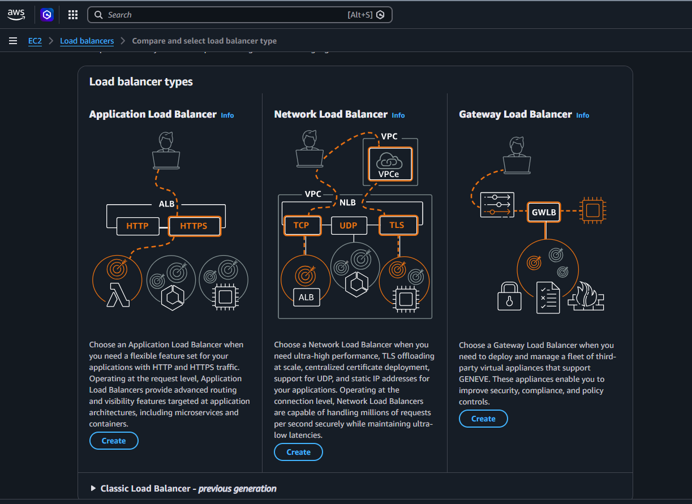
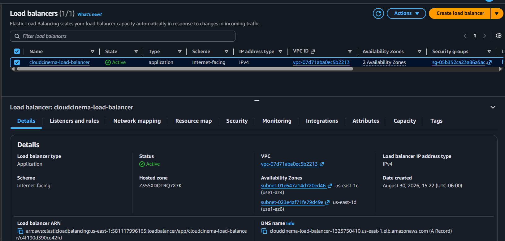
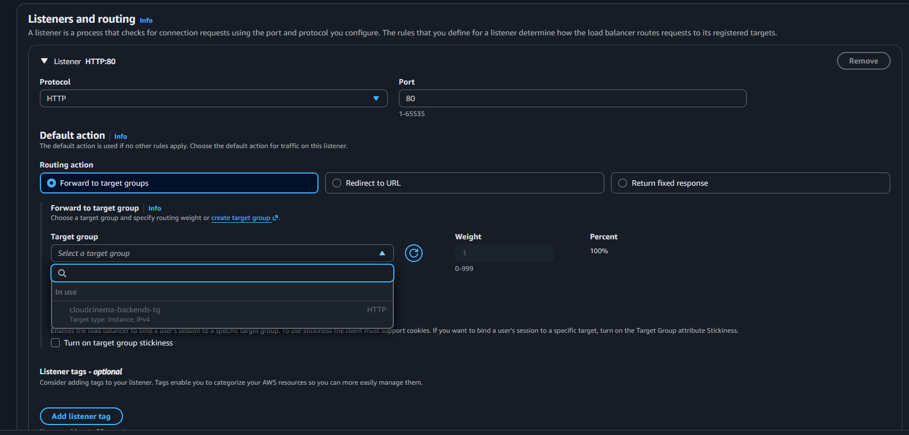
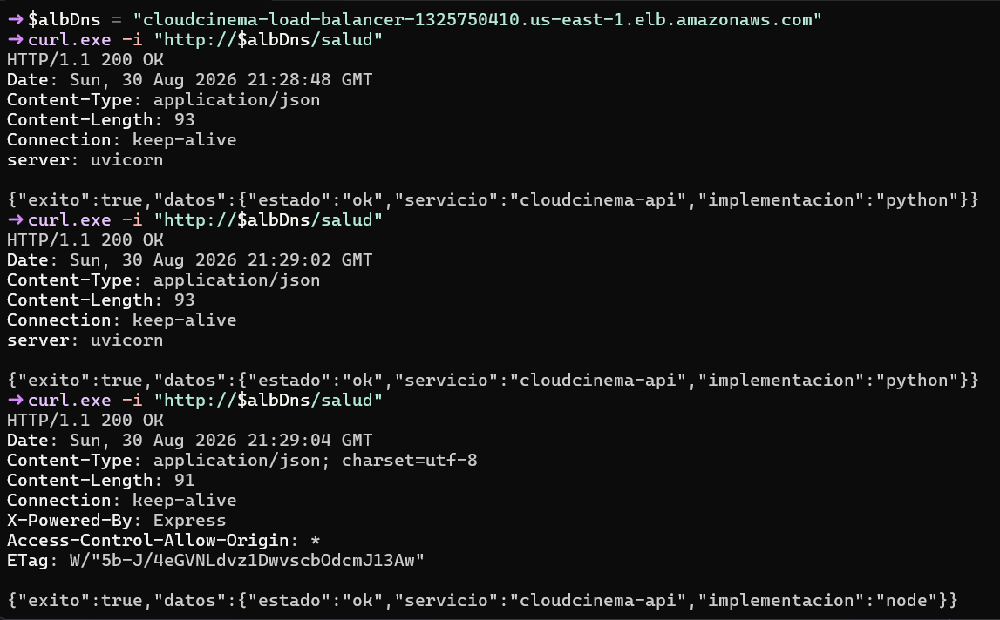

# Evidencias - Application Load Balancer

Este documento explica la configuración del Application Load Balancer (ALB)
que expone la API de CloudCinema y distribuye las solicitudes entre las
implementaciones Node.js y Python. Las capturas están en la carpeta
[`images/`](images/), separadas del documento para conservar una estructura
consistente con el resto de las evidencias.

## 1. Propósito y datos de la configuración

El ALB es el único punto de entrada público de los backends. El navegador no
accede a las IP de las EC2; CloudFront reenvía las solicitudes `/api/*` al DNS
del ALB, y este selecciona un destino saludable del target group.

| Dato | Valor |
|---|---|
| Nombre | `cloudcinema-load-balancer` |
| Tipo | Application Load Balancer |
| Esquema | Internet-facing |
| Direccionamiento | IPv4 |
| VPC | `vpc-07d71aba0ec5b2213` |
| Subred 1 | `subnet-01e647a14d720ed46` (`us-east-1c`) |
| Subred 2 | `subnet-023e4af71fe79d49e` (`us-east-1d`) |
| Security group | `cloudcinema-load-balancer-sg` (`sg-05b352ca23a86a5ac`) |
| Target group | `cloudcinema-backends-tg` |
| Listener | HTTP `:80` |
| DNS | `cloudcinema-load-balancer-1325750410.us-east-1.elb.amazonaws.com` |

## 2. Seleccionar el tipo de balanceador

Se eligió **Application Load Balancer** porque la API utiliza HTTP y necesita
enrutamiento basado en rutas, listeners y comprobaciones de salud. Un Network
Load Balancer no aporta ventajas para este tráfico de capa 7 y un Gateway Load
Balancer está destinado a appliances de red.

## 3. Configurar la red

El balanceador se creó como **Internet-facing** con IPv4 dentro de la VPC del
proyecto. Se seleccionó una subred pública en cada una de dos zonas de
disponibilidad. Las subredes tienen ruta al Internet Gateway, permitiendo que
el ALB reciba tráfico público y mantenga capacidad si una zona deja de estar
disponible.

## 4. Asociar el security group

Se seleccionó únicamente `cloudcinema-load-balancer-sg`. Este grupo permite
entrada HTTP por el puerto `80` desde Internet y salida hacia los security
groups de los backends en los puertos `3000` y `8000`. No se asoció el grupo
predeterminado de la VPC.

## 5. Crear el target group

El target group `cloudcinema-backends-tg` usa destinos de tipo **Instance**,
protocolo HTTP y versión HTTP/1. Node.js se registró en el puerto `3000` y
Python en el puerto `8000`, sobrescribiendo el puerto por destino porque ambas
aplicaciones escuchan en puertos distintos.

La comprobación de salud es `GET /salud` en el puerto de tráfico y considera
correcta la respuesta HTTP `200`. Cuando un destino no cumple esta condición,
el ALB deja de enviarle solicitudes hasta que vuelva a estar saludable.

La siguiente captura documenta una prueba de failover: Python fue detenida de
forma intencional, el target group la retiró del tráfico y Node.js permaneció
saludable. Esto demuestra que la indisponibilidad de una implementación no
interrumpe el acceso a la API.

## 6. Crear el ALB y verificar su estado

Después de asociar las subredes, el security group y el target group, AWS
aprovisionó el balanceador. El estado `Active` confirma que el recurso está
listo para recibir solicitudes.

La vista de detalles permite comprobar que el recurso es de tipo application,
usa el esquema Internet-facing, pertenece a la VPC esperada, está distribuido
en las dos zonas y expone el DNS que consume CloudFront.

## 7. Configurar el listener

Se creó un listener HTTP en el puerto `80` con acción predeterminada **Forward
to** `cloudcinema-backends-tg`. El peso `1` representa el 100 % de la acción
porque solo hay un target group; la selección entre Node.js y Python la realiza
el target group considerando únicamente destinos saludables.

La vista final del listener confirma que `HTTP:80` está asociado al target
group correcto.

## 8. Verificar la distribución

Se realizaron varias solicitudes a `GET /salud` usando el DNS del ALB. Las
respuestas identifican tanto `uvicorn` (Python) como `Express` (Node.js), lo
que comprueba que ambos destinos reciben tráfico por el mismo punto de
entrada y respetan el contrato de salud compartido.

## 9. Reglas de seguridad resultantes

- Internet → ALB: HTTP `80`.
- ALB → Node.js: TCP `3000`, únicamente mediante el security group del ALB.
- ALB → Python: TCP `8000`, únicamente mediante el security group del ALB.
- EC2 → RDS: PostgreSQL `5432`, únicamente desde los security groups de las
  instancias autorizadas.
- No se publican directamente los puertos `3000`, `8000` ni `5432`.

CloudFront termina HTTPS para el cliente y utiliza el ALB como origen de la
API. La configuración de CloudFront se documenta en
[`../cloudfront/report.md`](../cloudfront/report.md).
