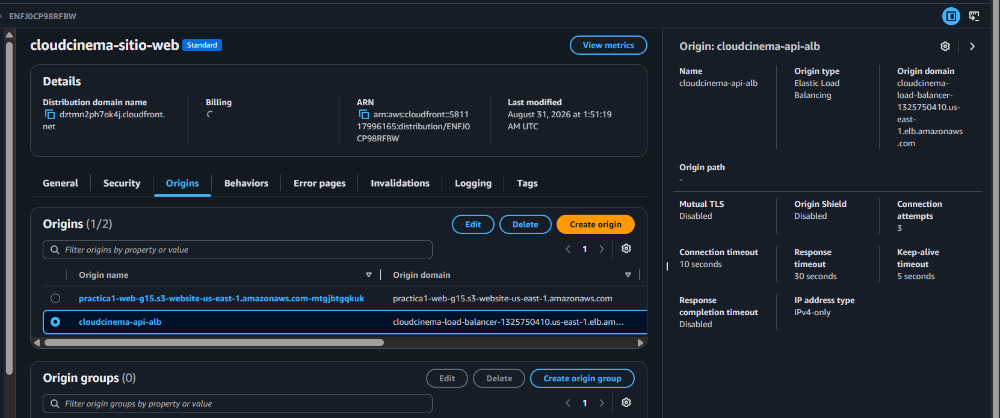
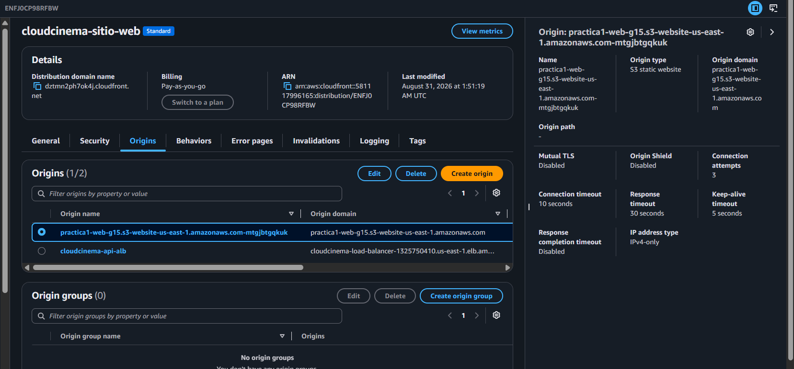
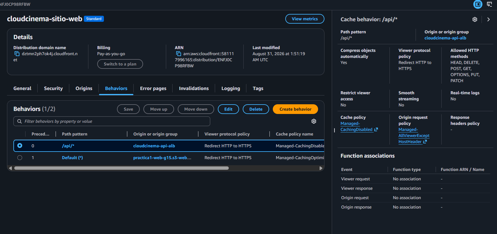
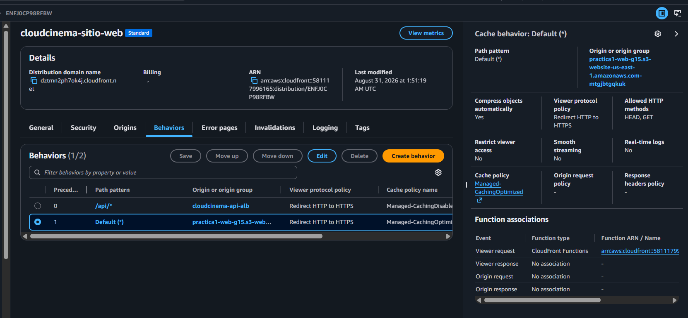
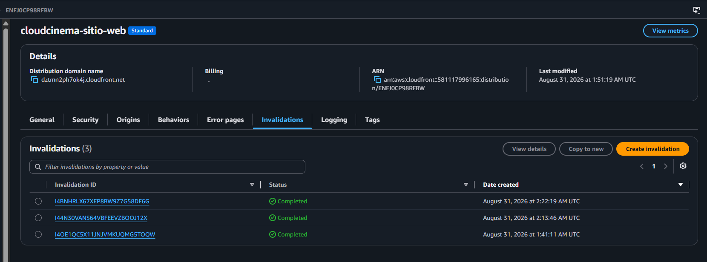

# Evidencias - Amazon CloudFront

Este documento explica la distribución CloudFront que publica CloudCinema por
HTTPS, entrega el frontend desde S3 y reenvía la API al Application Load
Balancer. Las capturas están en [`images/`](images/).

## 1. Propósito y datos de la distribución

CloudFront es la entrada pública de la aplicación. El navegador se conecta al
dominio HTTPS de CloudFront; la distribución entrega los archivos estáticos o
envía las solicitudes `/api/*` al ALB. Esto evita que el navegador consuma
directamente el endpoint HTTP de S3 o las direcciones de las EC2 y proporciona
un contexto seguro para funciones como la cámara.

| Dato | Valor |
|---|---|
| Nombre | `cloudcinema-sitio-web` |
| ID | `ENFJ0CP98RFBW` |
| Dominio público | `dztmn2ph7ok4j.cloudfront.net` |
| Región de los orígenes | `us-east-1` |
| Default root object | `index.html` |

## 2. Configurar los orígenes

Se configuraron dos orígenes independientes:

1. El website endpoint de S3 `practica1-web-g15` sirve `index.html`,
   `assets/`, `favicon.svg` e `icons.svg`.
2. El ALB `cloudcinema-load-balancer` recibe las solicitudes de API y las
   distribuye entre Node.js y Python.

El origen del ALB se configuró como Elastic Load Balancing, con comunicación
HTTP al puerto `80`. CloudFront es quien ofrece HTTPS al usuario final.



La distribución también conserva el origen del website endpoint de S3. Se usa
el endpoint de sitio estático, no el endpoint REST, porque el bucket entrega
una SPA compilada y debe servir el documento de índice y su documento de error.



## 3. Behavior para la API

El behavior `/api/*` se creó con la siguiente configuración:

| Campo | Valor | Motivo |
|---|---|---|
| Origin | `cloudcinema-api-alb` | Reenvía la API al balanceador. |
| Viewer protocol policy | Redirect HTTP to HTTPS | Fuerza acceso externo seguro. |
| Allowed methods | GET, HEAD, OPTIONS, PUT, POST, PATCH, DELETE | Cubre el contrato completo de autenticación, perfil y listas. |
| Cache policy | `CachingDisabled` | Evita cachear respuestas privadas o tokens. |
| Origin request policy | `AllViewerExceptHostHeader` | Reenvía `Authorization` y los datos de la petición sin enviar al ALB el `Host` de CloudFront. |



La caché deshabilitada es importante para login, perfil y Mi Lista: cada
solicitud debe llegar al backend y evaluarse con el JWT vigente.

## 4. Behavior predeterminado para el frontend

El behavior `Default (*)` utiliza el website endpoint de S3 y se configuró
con:

| Campo | Valor | Motivo |
|---|---|---|
| Origin | `practica1-web-g15` | Entregar el build estático. |
| Viewer protocol policy | Redirect HTTP to HTTPS | Mantener todo el sitio bajo HTTPS. |
| Allowed methods | GET, HEAD | El frontend publicado solo necesita lectura. |
| Cache policy | `CachingOptimized` | Cachear recursos estáticos y reducir solicitudes a S3. |
| Restrict viewer access | No | El sitio público no usa URLs firmadas. |



## 5. Rutas de la SPA

React Router utiliza rutas como `/login`, `/perfil` y `/mi-lista`. Para que una
visita directa a esas rutas no produzca un `404` en S3, se asoció la función de
CloudFront `cloudcinema-spa-routes` al evento **Viewer request** del behavior
predeterminado. La función reescribe las rutas sin extensión a `/index.html`;
los archivos que sí contienen extensión continúan entregándose normalmente.

Esta asociación no se aplica al behavior `/api/*`, porque las solicitudes de
la API deben conservar su ruta original.

## 6. Invalidaciones y publicación

Después de subir una nueva compilación al bucket web, se crea una invalidación
con la ruta `/*`. Esto elimina de la caché los archivos anteriores y permite
que la siguiente visita reciba la versión actualizada del frontend.



La distribución mostrada tiene invalidaciones en estado `Completed`, por lo
que el contenido publicado en S3 ya puede propagarse a los edge locations.

## 7. Verificación final

La aplicación se verifica desde:

```text
https://dztmn2ph7ok4j.cloudfront.net
```

En DevTools → **Network** se debe observar que la página y las peticiones API
usan el dominio CloudFront, por ejemplo `/api/v1/peliculas` y
`/api/v1/autenticacion/inicio-sesion`. No deben aparecer `localhost`, IPs de
EC2 ni solicitudes directas al endpoint HTTP de S3.

La distribución y sus orígenes se resumen en la captura final:


