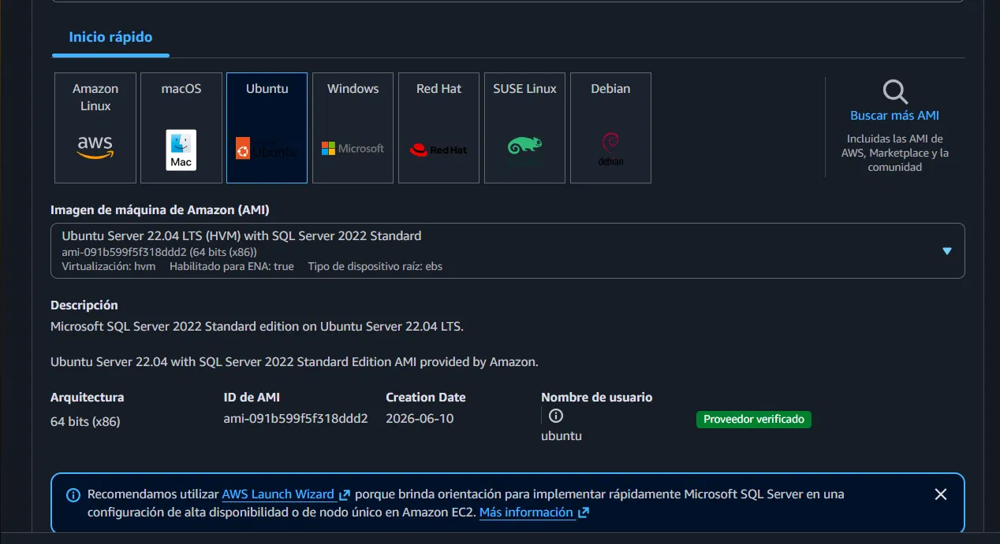
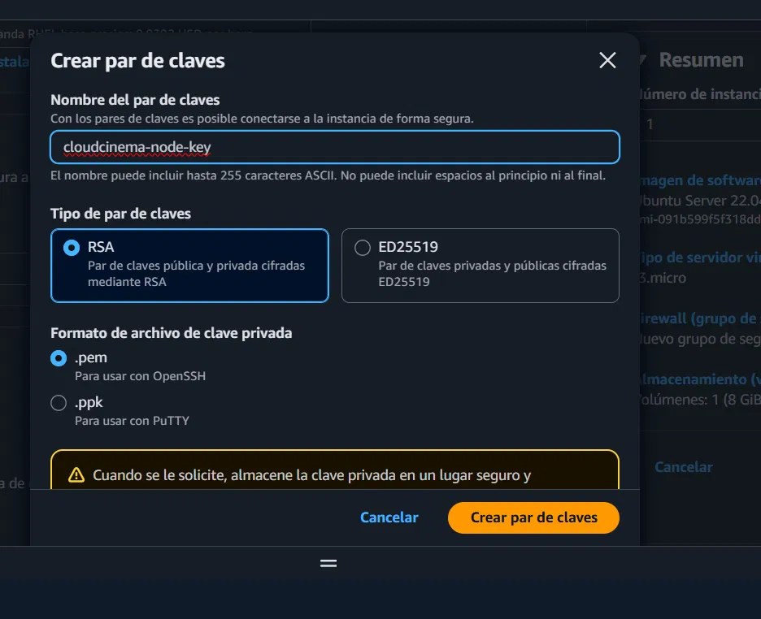
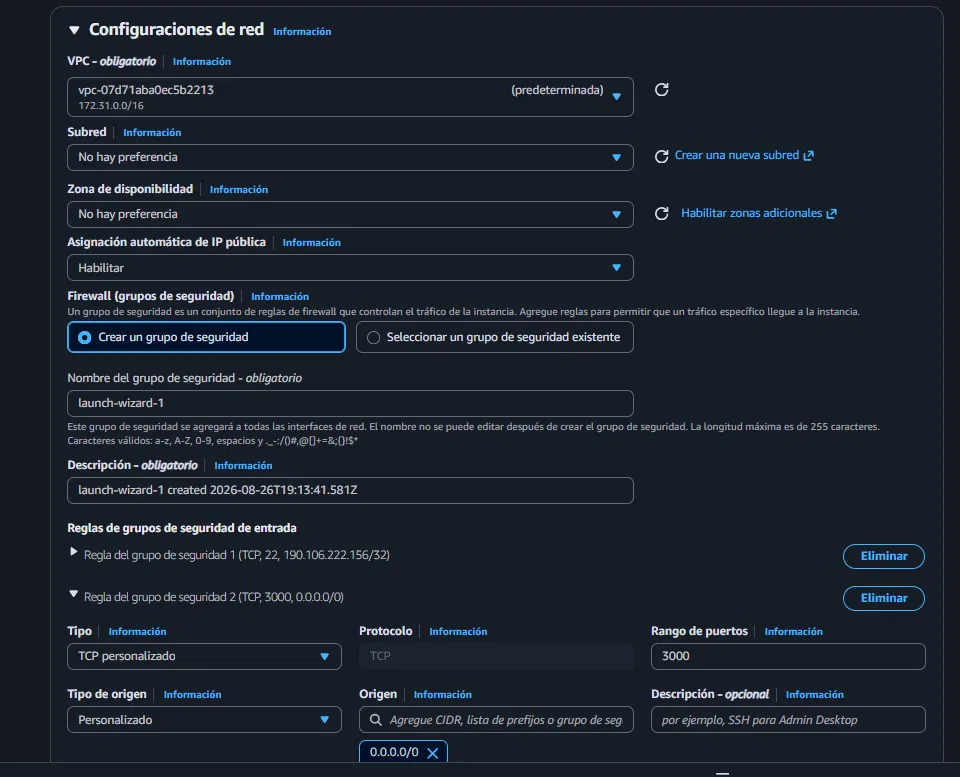
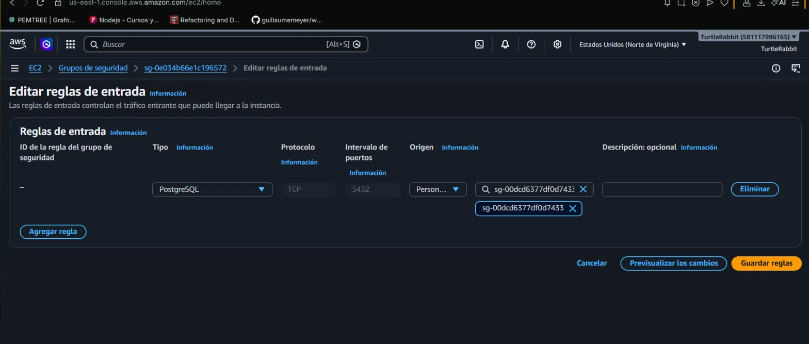

# Configuración de EC2 y Conexión con RDS — Backend Node.js

## 1. Creación de la instancia EC2

| Parámetro | Valor |
|---|---|
| Nombre | `CloudCinema-Node-Backend` |
| AMI | 
| Tipo de instancia | `t3.micro` |
| Par de claves |  |
| Configuracion de red |  |
| Almacenamiento | 8 GiB, gp2, volumen raíz |
| Perfil de instancia IAM | `CloudCinema-Node-S3-PRA3`|


## 2. Security Group de la EC2

Nombre: `cloudcinema-node-sg` (`sg-00dcd6377df0d7433`)

| Tipo | Puerto | Origen | Propósito |
|---|---|---|---|
| SSH | 22 | Mi IP (`/32`) | Acceso administrativo por terminal |
| TCP personalizado | 3000 | `0.0.0.0/0` | Exponer la API Nest.js públicamente para el balanceador |


## 3. Habilitar la conexión EC2 → RDS

La instancia RDS (`cloudcinema-g15`, motor PostgreSQL) tiene su propio Security Group: `rds-cloudcinema-g15` (`sg-0e034b66e1c196572`).

Se agregó una regla de entrada en **ese** Security Group (no en el de la EC2):

| Tipo | Puerto | Origen |
|---|---|---|
| PostgreSQL | 5432 | `sg-00dcd6377df0d7433` (Security Group de la EC2) |

Esto permite que únicamente el tráfico proveniente de la instancia EC2 pueda alcanzar la base de datos, en vez de abrir el puerto a cualquier IP.




## 4. Despliegue del backend en la instancia (SSH)

**Conexión:**
```bash
chmod 400 cloudcinema-node-key.pem
ssh -i "cloudcinema-node-key.pem" ubuntu@<IP_PUBLICA_EC2>
```

**Instalación de dependencias del sistema y Node.js (vía NVM):**
```bash
sudo apt update
sudo apt install -y git curl
curl -o- https://raw.githubusercontent.com/nvm-sh/nvm/v0.39.7/install.sh | bash
export NVM_DIR="$HOME/.nvm"
[ -s "$NVM_DIR/nvm.sh" ] && \. "$NVM_DIR/nvm.sh"
nvm install 20
```

**Clonado y build de la aplicación:**
```bash
git clone https://github.com/ipatzantzic19/SEMINARIO1_A_2S2026_G15.git
cd SEMINARIO1_A_2S2026_G15/Practica_1/api-node
npm install
npm run build
```

**Variables de entorno (`.env`):**
```env
PORT=3000
BD_HOST=cloudcinema-g15.cmpaiquocfxf.us-east-1.rds.amazonaws.com
BD_PUERTO=5432
BD_USUARIO=usuario_cloudcinema_node
BD_CONTRASENA=********
BD_NOMBRE=cloudcinema
BD_SSL=require
AWS_REGION=us-east-1
S3_BUCKET_NAME=practica1-images-g15
SECRETO_JWT=********
```


## 5. Ejecución persistente con PM2

```bash
npm install -g pm2
pm2 start dist/main.js --name "cloudcinema-api"
pm2 startup      
pm2 save
```

`pm2 startup` configura un servicio `systemd` (`pm2-ubuntu.service`) que revive automáticamente los procesos guardados si la instancia se reinicia. `pm2 save` congela la lista de procesos actuales para que sea restaurada en el próximo arranque.

**Comandos de operación útiles:**
```bash
pm2 status                                  
pm2 logs cloudcinema-api --lines 30         
pm2 restart cloudcinema-api --update-env    
```

