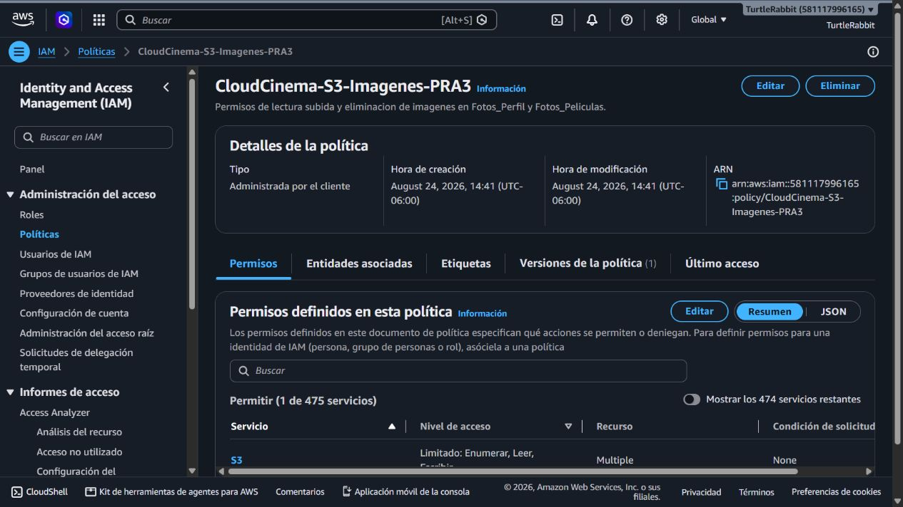
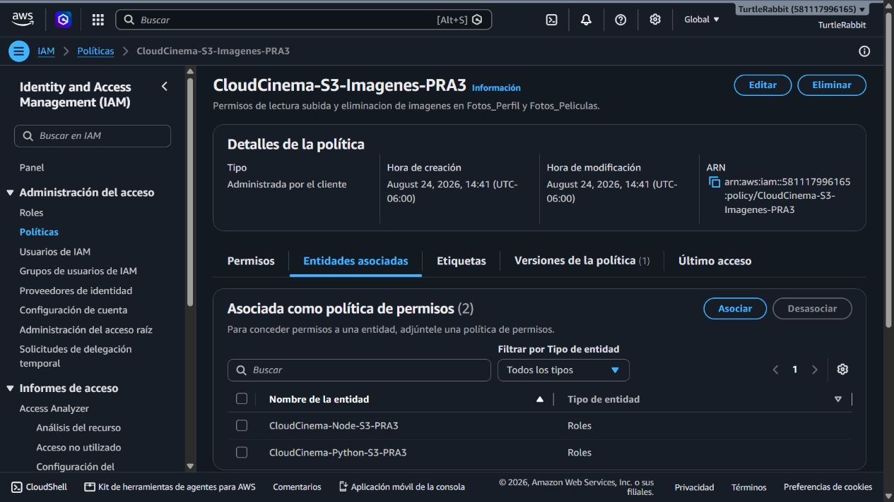
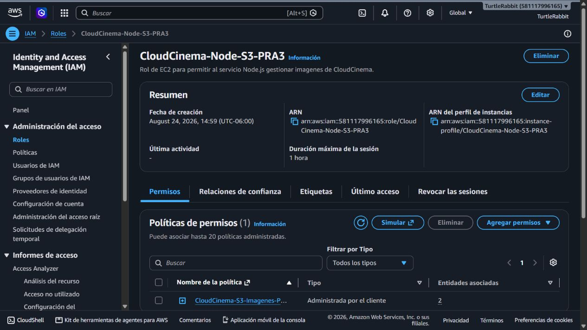
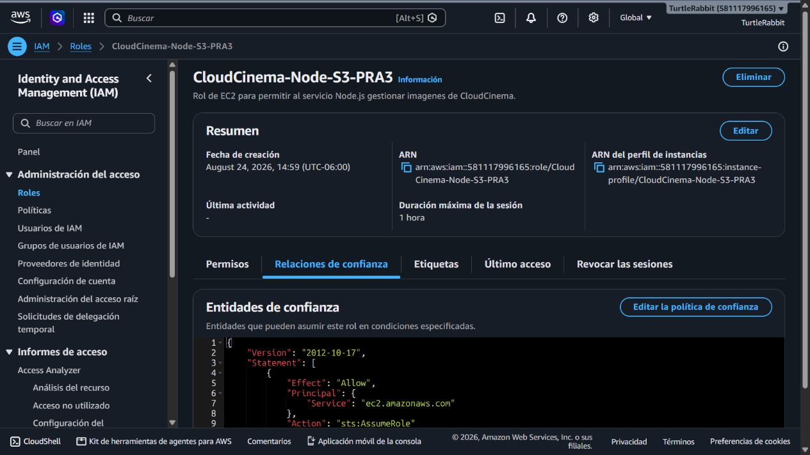
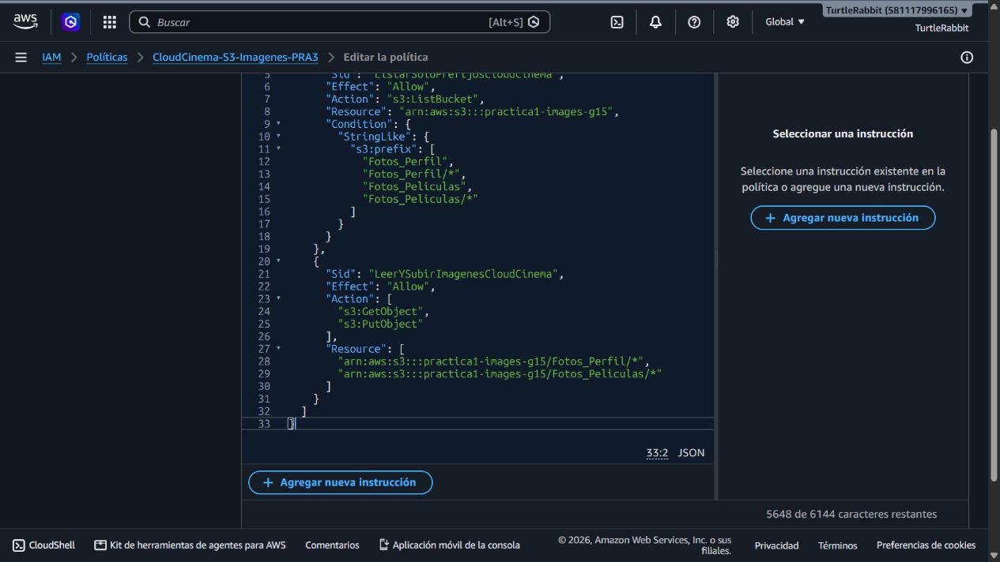
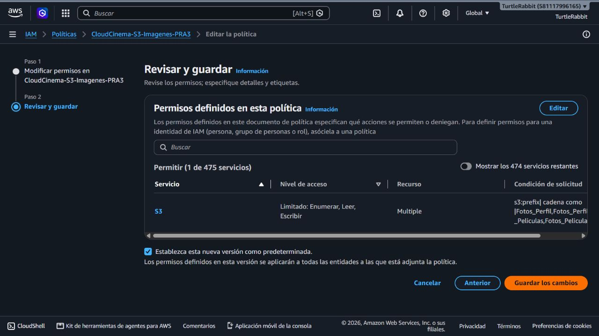
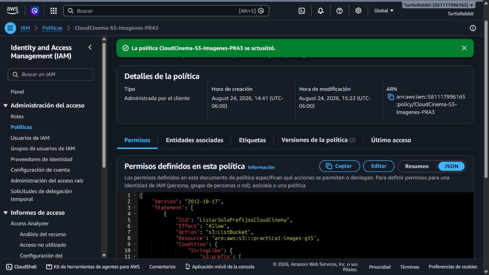
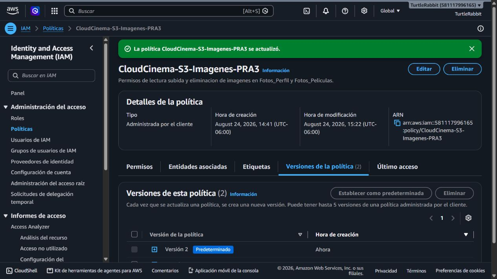
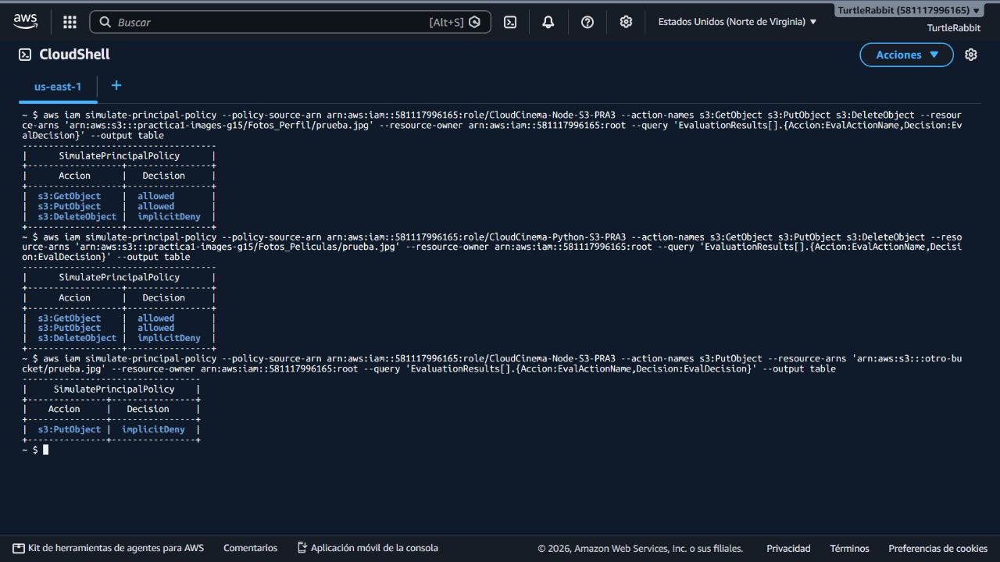
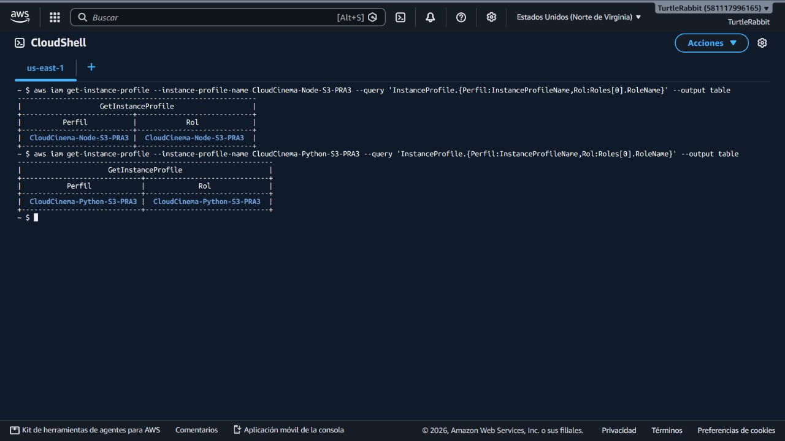

# Evidencias — PRA-4 IAM y políticas de acceso

**Fecha:** 24 de agosto de 2026  
**Región de los recursos consumidos:** `us-east-1`  
**Estado:** configuración IAM lista; integración final pendiente de las EC2.

## 1. Auditoría inicial

La política administrada ya existía por el trabajo de PRA-3 y estaba asociada a dos roles separados.





## 2. Rol de Node.js

El rol tiene perfil de instancia y su relación de confianza permite que EC2 lo asuma.





## 3. Rol de Python

El segundo backend utiliza una identidad distinta para separar auditoría y revocación.


## 4. Aplicación de mínimo privilegio

La versión inicial incluía `s3:DeleteObject` y permitía listar el bucket completo. Se creó la versión 2 con condiciones por prefijo y sin permiso de borrado.









## 5. Verificación

```text
EC2 Node.js ──asume──> CloudCinema-Node-S3-PRA3 ──┐
                                                   ├──> CloudCinema-S3-Imagenes-PRA3 ──> prefijos autorizados de S3
EC2 Python ───asume──> CloudCinema-Python-S3-PRA3 ─┘
```

El simulador de IAM produjo los siguientes resultados en los dos roles:

| Prueba | Resultado esperado | Resultado |
|---|---|---|
| Leer objeto en prefijo autorizado | Permitir | `allowed` |
| Subir objeto en prefijo autorizado | Permitir | `allowed` |
| Borrar objeto | Denegar | `implicitDeny` |
| Subir objeto a otro bucket | Denegar | `implicitDeny` |



Los perfiles de instancia de ambos roles también se verificaron mediante AWS CLI.



## 6. Pendiente externo

Persona 2 debe adjuntar `CloudCinema-Node-S3-PRA3` a la EC2 de PRA-10 y Persona 3 debe adjuntar `CloudCinema-Python-S3-PRA3` a la EC2 de PRA-15. Después se repetirá la carga desde los SDK oficiales. No hacen falta contraseñas, correos ni claves de acceso AWS para esta integración.
