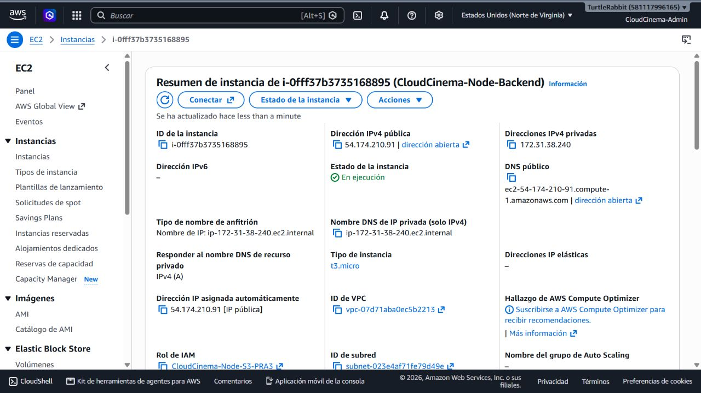
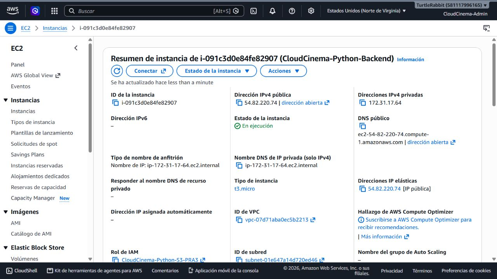

# Evidencias — PRA-4 IAM y políticas de acceso

**Fecha:** 24 de agosto de 2026  
**Región de los recursos consumidos:** `us-east-1`  
**Estado:** configuración IAM y asociación a EC2 verificadas; pruebas SDK pendientes.

## 1. Auditoría inicial

La política administrada ya existía por el trabajo de PRA-3 y estaba asociada a dos roles separados.


## 2. Rol de Node.js

El rol tiene perfil de instancia y su relación de confianza permite que EC2 lo asuma.


## 3. Rol de Python

El segundo backend utiliza una identidad distinta para separar auditoría y revocación.


## 4. Aplicación de mínimo privilegio

La versión inicial incluía `s3:DeleteObject` y permitía listar el bucket completo. Se creó la versión 2 con condiciones por prefijo y sin permiso de borrado.


## 5. Verificación

```text
EC2 Node.js ──asume──> CloudCinema-Node-S3-PRA3 ──┐
                                                   ├──> CloudCinema-S3-Imagenes-PRA3 ──> prefijos autorizados de S3
EC2 Python ───asume──> CloudCinema-Python-S3-PRA3 ─┘
```

El simulador de IAM produjo los siguientes resultados en los dos roles:

| Prueba | Resultado esperado | Resultado |
|---|---|---|
| Leer objeto en prefijo autorizado | Permitir | `allowed` |
| Subir objeto en prefijo autorizado | Permitir | `allowed` |
| Borrar objeto | Denegar | `implicitDeny` |
| Subir objeto a otro bucket | Denegar | `implicitDeny` |


Los perfiles de instancia de ambos roles también se verificaron mediante AWS CLI.


## 6. Asociación verificada en las EC2

El 1 de septiembre de 2026 se comprobó en la consola EC2 que las dos instancias estaban en ejecución y tenían asociado el rol de servicio que les corresponde.





No hacen falta contraseñas, correos ni claves de acceso AWS en los servidores: el SDK obtiene credenciales temporales mediante el perfil de instancia. Solo falta guardar evidencia de una carga real desde cada backend.
