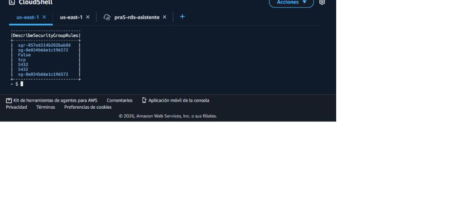
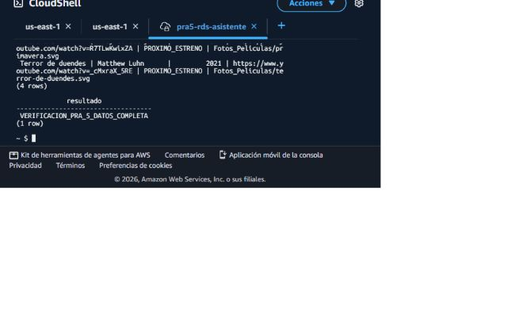
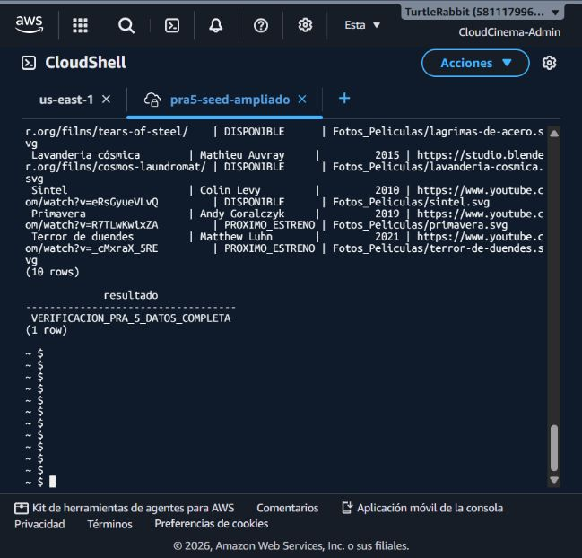

# Evidencias — PRA-5 Datos iniciales y recursos compartidos

**Responsable:** Isai Patzan — Persona 1

**Región:** `us-east-1`

**Estado:** Cartelera ampliada y verificada en S3 y RDS

## 1. Preparación de la cartelera

Se definieron diez registros completos en `database/seed.sql`. El script usa `MERGE`, por lo que puede ejecutarse nuevamente sin duplicar películas con el mismo título y año. La ampliación utiliza películas abiertas publicadas por [Blender Studio](https://studio.blender.org/films/) y pósteres SVG originales creados para CloudCinema.

| Título | Director | Año | Estado | Clave de portada |
|---|---|---:|---|---|
| El gran conejo | Sacha Goedegebure | 2008 | `DISPONIBLE` | `Fotos_Peliculas/el-gran-conejo.svg` |
| Sintel | Colin Levy | 2010 | `DISPONIBLE` | `Fotos_Peliculas/sintel.svg` |
| Primavera | Andy Goralczyk | 2019 | `PROXIMO_ESTRENO` | `Fotos_Peliculas/primavera.svg` |
| Terror de duendes | Matthew Luhn | 2021 | `PROXIMO_ESTRENO` | `Fotos_Peliculas/terror-de-duendes.svg` |
| El sueño de los elefantes | Bassam Kurdali | 2006 | `DISPONIBLE` | `Fotos_Peliculas/el-sueno-de-los-elefantes.svg` |
| Lágrimas de acero | Ian Hubert | 2012 | `DISPONIBLE` | `Fotos_Peliculas/lagrimas-de-acero.svg` |
| Lavandería cósmica | Mathieu Auvray | 2015 | `DISPONIBLE` | `Fotos_Peliculas/lavanderia-cosmica.svg` |
| Agente 327 | Hjalti Hjalmarsson | 2017 | `DISPONIBLE` | `Fotos_Peliculas/agente-327.svg` |
| Carrera por café | Hjalti Hjalmarsson | 2020 | `DISPONIBLE` | `Fotos_Peliculas/carrera-por-cafe.svg` |
| Carga | Hjalti Hjalmarsson | 2022 | `DISPONIBLE` | `Fotos_Peliculas/carga.svg` |

RDS almacena la clave del objeto, no el archivo SVG ni su contenido binario.

## 2. Selección de archivos para Amazon S3

Se abrió el prefijo `Fotos_Peliculas/` del bucket `practica1-images-g15`. La captura siguiente corresponde a la carga inicial de cuatro pósteres; la ampliación agrega seis archivos mediante el script versionado `scripts/cargar_posteres_s3.sh`.


## 3. Resultado de la carga

Amazon S3 confirmó la carga inicial de cuatro archivos, 100 % completado y cero errores. La ampliación se valida por objeto con `scripts/verificar_posteres_s3.sh`.


## 4. Estructura final de `Fotos_Peliculas/`

La vista histórica muestra los cuatro archivos iniciales. Después de la ampliación, el seed administrado contiene diez pósteres. `imagen-prueba.svg` se conserva porque pertenece a las evidencias de PRA-3 y no debe eliminarse durante PRA-5.


## 5. Validación de acceso público

Se realiza una solicitud HTTP a cada URL pública. Los objetos deben responder `200` con tipo `image/svg+xml`.

| Objeto | Resultado |
|---|---|
| `el-gran-conejo.svg` | HTTP 200 |
| `sintel.svg` | HTTP 200 |
| `primavera.svg` | HTTP 200 |
| `terror-de-duendes.svg` | HTTP 200 |
| `el-sueno-de-los-elefantes.svg` | HTTP 200 |
| `lagrimas-de-acero.svg` | HTTP 200 |
| `lavanderia-cosmica.svg` | HTTP 200 |
| `agente-327.svg` | HTTP 200 |
| `carrera-por-cafe.svg` | HTTP 200 |
| `carga.svg` | HTTP 200 |

La prueba puede repetirse con:

```bash
bash Practica_1/scripts/verificar_posteres_s3.sh
```

## 6. Acceso temporal a RDS

RDS no se expuso públicamente. Para aplicar los datos se utilizó un entorno temporal de CloudShell dentro de la VPC `vpc-07d71aba0ec5b2213`.


RDS y CloudShell utilizaban el grupo `sg-0e034b66e1c196572`, pero faltaba una regla de entrada entre recursos que compartieran ese grupo. Con autorización del responsable se agregó temporalmente TCP 5432 desde el mismo grupo y se comprobó `CONECTIVIDAD_RDS_OK`.



Después de validar los datos se revocó la regla `sgr-057e6514b202bab86`. Una consulta final devolvió `[]` para reglas de entrada en 5432. También se eliminó el entorno `pra5-rds-asistente`, incluyendo únicamente sus copias efímeras de los SQL.

Para ampliar la cartelera de cuatro a diez películas se creó posteriormente el entorno temporal `pra5-seed-ampliado` dentro de la misma VPC. Este entorno utilizó la subred `subnet-01e647a14d720ed46` y el grupo de seguridad de la aplicación Python `sg-0be0cc30c55bb82c4`, que ya estaba autorizado por RDS. Por ello no fue necesario abrir RDS a Internet ni agregar otra regla temporal.

## 7. Aplicación y verificación en PostgreSQL

Los scripts locales se transfirieron al entorno temporal y se compararon con SHA-256 antes de ejecutarlos. Después se abrió una única conexión SSL para ejecutar, en orden:

```bash
psql "$CADENA_CONEXION_SSL" -f seed.sql
psql "$CADENA_CONEXION_SSL" -f verificar_datos_iniciales.sql
```

El resultado obtenido fue:

- Diez películas semilla.
- Ocho películas disponibles.
- Dos próximos estrenos.
- Ningún campo incompleto.
- Mensaje `VERIFICACION_PRA_5_DATOS_COMPLETA`.



La ejecución de la ampliación devolvió diez filas y el mensaje de verificación completa:



## 8. Validación de integración

La validación directa confirmó diez registros en PostgreSQL: ocho disponibles y dos próximos estrenos. Las diez URL públicas de las portadas respondieron HTTP 200 con tipo `image/svg+xml`. La aplicación web publicada respondió HTTP 200. Además, veinte solicitudes consecutivas a `GET /salud` a través del ALB se distribuyeron diez a Node.js y diez a Python, confirmando que ambos servicios estaban disponibles. El endpoint de cartelera requiere una sesión autenticada y devuelve HTTP 401 cuando se consulta sin credenciales, comportamiento esperado por su política de acceso.

## 9. Seguridad de la evidencia

Las capturas y documentos muestran únicamente nombres de recursos, región, VPC, subred, grupos de seguridad y rutas. No contienen contraseñas, tokens ni llaves privadas.
