# Evidencias PRA-3 — Configurar S3 para imágenes

## Resultado

- Región: `us-east-1`.
- Bucket real: `practica1-images-g15`.
- Nombre lógico indicado por el ticket: `Practica1-Images-G15`.
- Motivo de la diferencia: Amazon S3 exige nombres en minúsculas.
- Cifrado predeterminado: SSE-S3.
- Propiedad de objetos: ACL deshabilitadas; propietario del bucket.

## Estructura creada

```text
s3://practica1-images-g15/
├── Fotos_Perfil/
└── Fotos_Peliculas/
```

S3 representa estas carpetas como prefijos de objetos; no son directorios físicos.

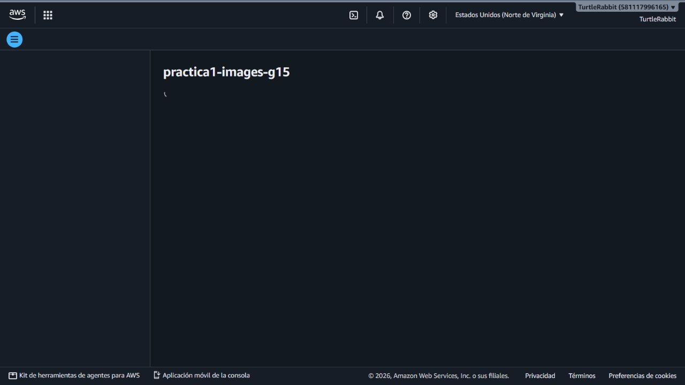

## Política de visualización

Se configuró una política de bucket que permite únicamente `s3:GetObject` sobre los objetos del bucket. No se permite escritura ni eliminación pública. La política completa está en [politica-lectura-publica.json](../../aws/s3/politica-lectura-publica.json).

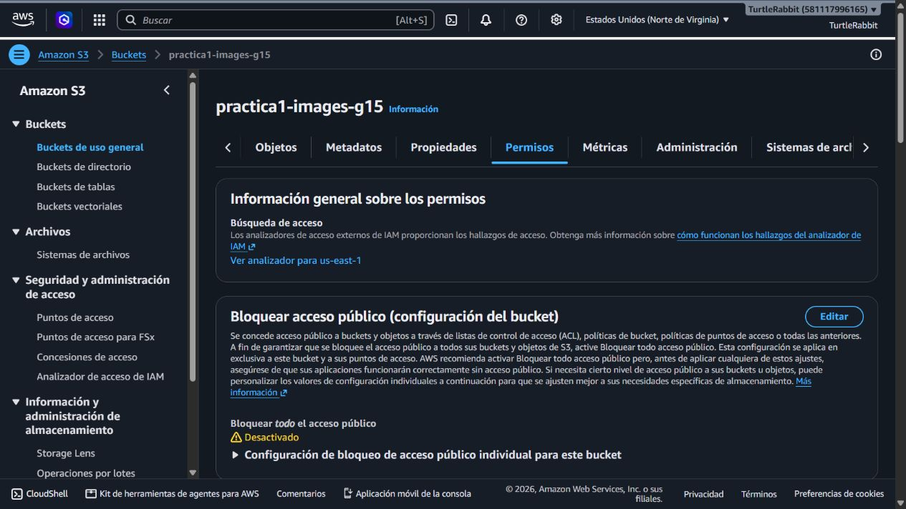

## Política IAM para los servicios

Se creó la política administrada `CloudCinema-S3-Imagenes-PRA3`. Su primera versión permitía listar el bucket y ejecutar `GetObject`, `PutObject` y `DeleteObject` dentro de `Fotos_Perfil/*` y `Fotos_Peliculas/*`. Durante PRA-4 se auditó y reemplazó por una versión mínima: `ListBucket` condicionado a esos prefijos y solo `GetObject`/`PutObject`. La versión vigente está en [politica-iam-sdk.json](../../aws/s3/politica-iam-sdk.json).

La política está adjunta a roles IAM separados por servicio. Las EC2 aún no existen, por lo que Personas 2 y 3 deberán adjuntar el perfil de instancia correspondiente en PRA-10 y PRA-15; no se deben guardar claves de acceso en el repositorio.

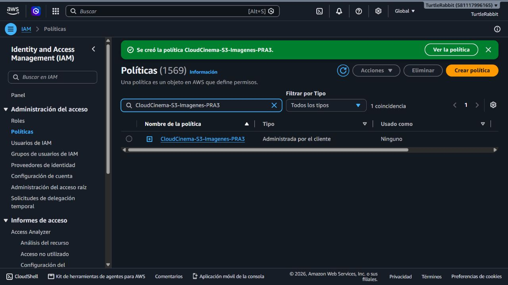

Se crearon roles separados para EC2, uno por implementación:

- `CloudCinema-Node-S3-PRA3`
- `CloudCinema-Python-S3-PRA3`

Ambos confían únicamente en el servicio EC2 y tienen asociada `CloudCinema-S3-Imagenes-PRA3`. Cuando se creen las instancias, se asignará el rol correspondiente al perfil de instancia; no se crearán access keys permanentes para la aplicación.

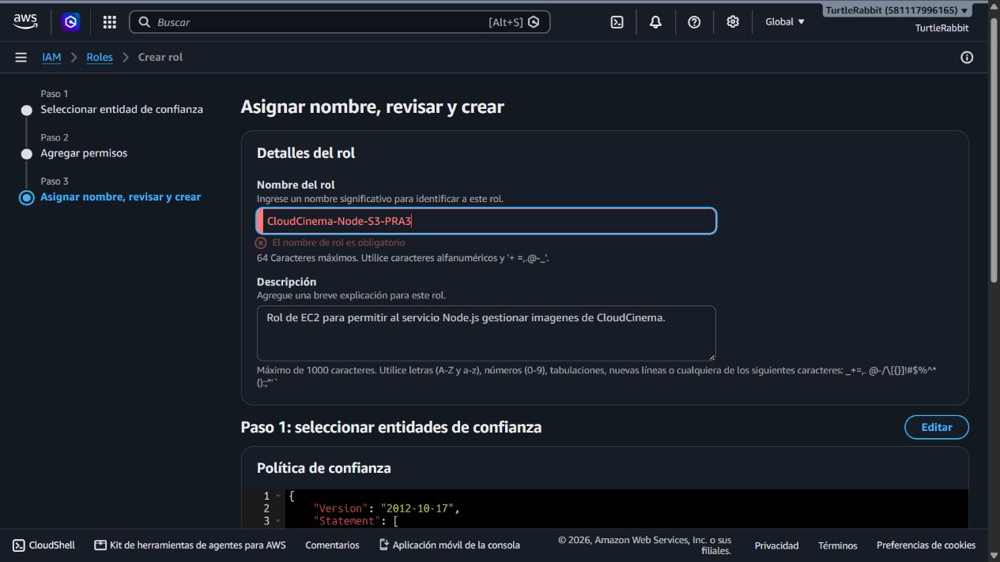

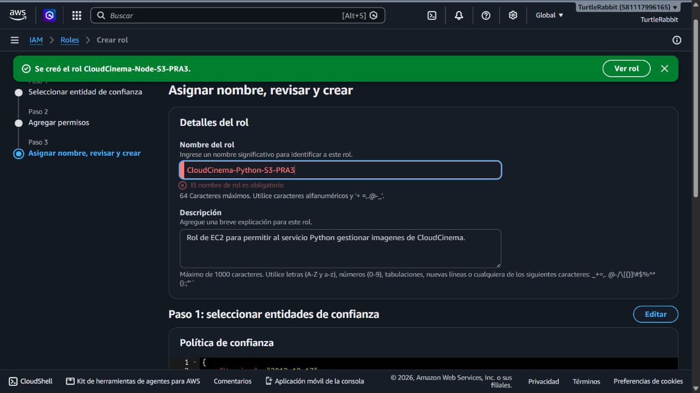

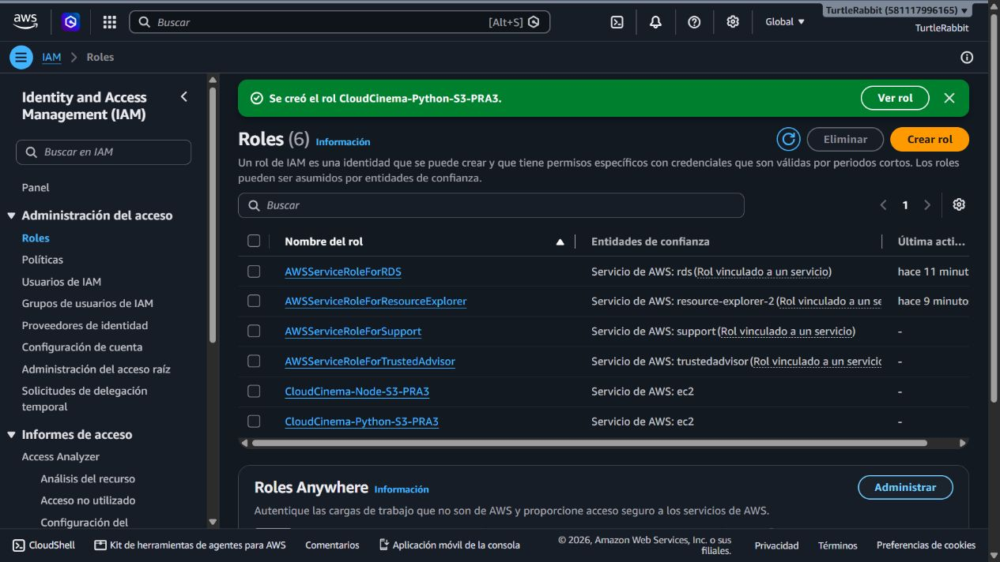

## Validación de carga y URLs

Se cargó una imagen SVG de prueba en ambos prefijos mediante AWS CLI dentro de CloudShell, como validación equivalente del permiso que usarán los SDK. La operación terminó con `PRA3_S3_UPLOAD_COMPLETA`.

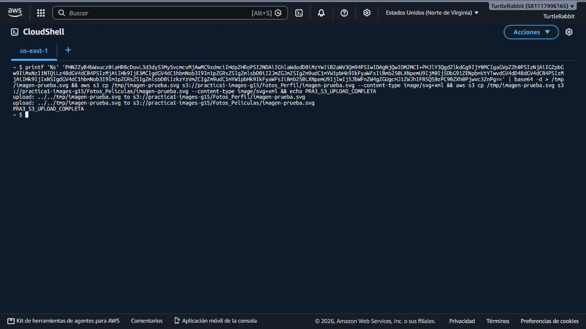

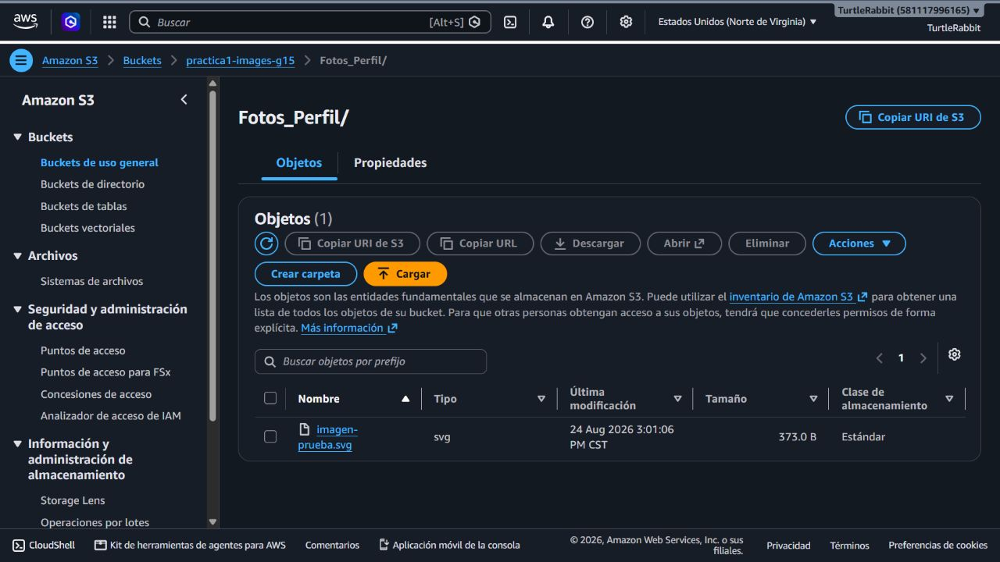

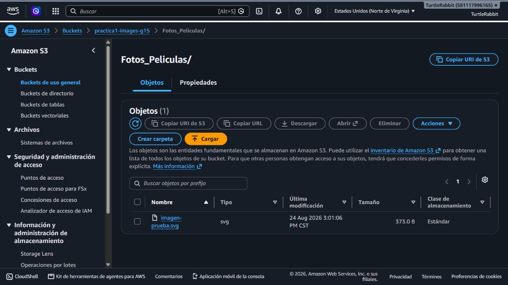

Las dos URLs públicas respondieron HTTP 200:

```text
https://practica1-images-g15.s3.us-east-1.amazonaws.com/Fotos_Perfil/imagen-prueba.svg
https://practica1-images-g15.s3.us-east-1.amazonaws.com/Fotos_Peliculas/imagen-prueba.svg
```

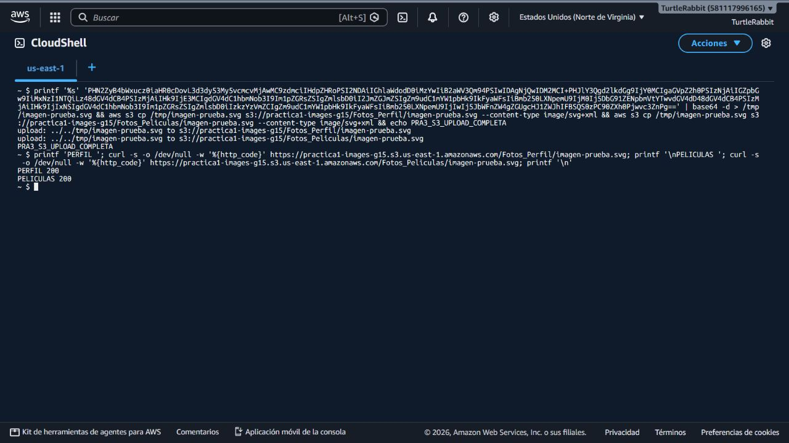

## Relación con RDS

RDS no almacenará archivos binarios. La base de datos debe conservar únicamente la URL pública o la clave del objeto, por ejemplo:

```text
https://practica1-images-g15.s3.us-east-1.amazonaws.com/Fotos_Perfil/usuario-123.svg
```

## Evidencia adicional

La captura `14-carga-imagen-pendiente.jpg` conserva la pantalla de carga de S3 y deja registrada la validación pendiente de subir imágenes reales desde los servicios.

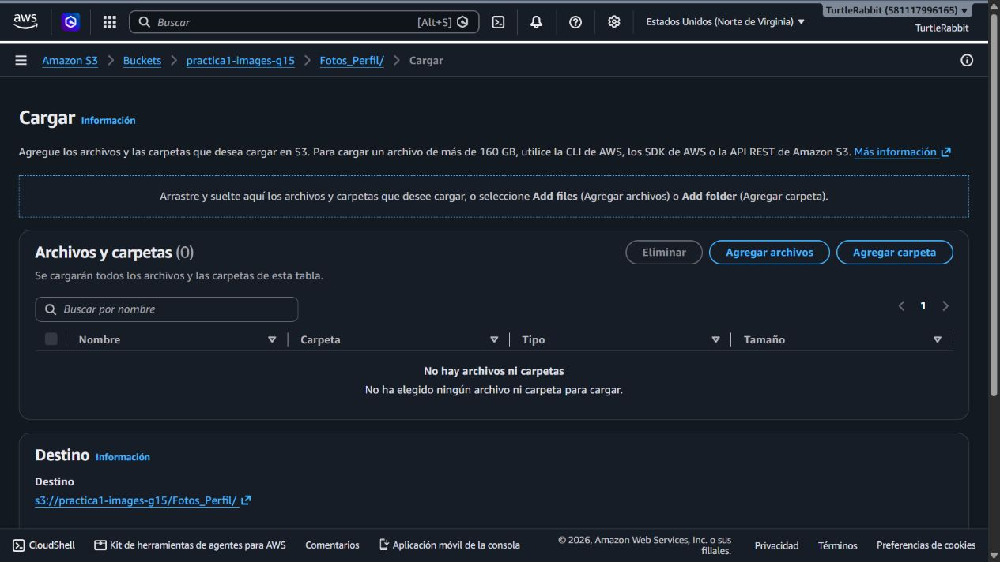

## Pendientes de integración

- Subir una imagen real desde Node.js y otra desde Python usando AWS SDK.
- Confirmar las URLs generadas desde ambos servicios.
- Asociar los roles ya creados a los perfiles de instancia cuando se creen las EC2.
- Agregar en RDS únicamente la URL o clave del objeto, no el binario.

Estos pendientes corresponden a la integración de los tickets PRA-7, PRA-12 y PRA-5; la infraestructura base de PRA-3 ya está preparada.
