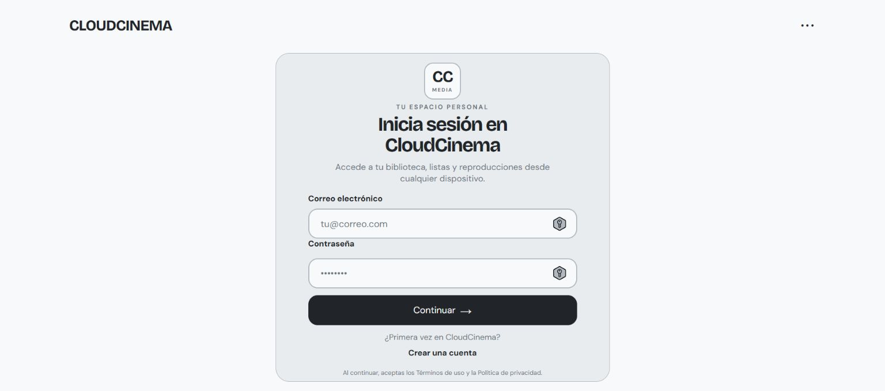
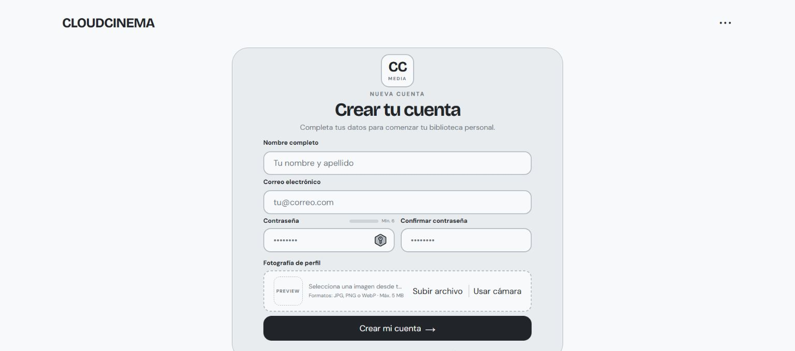
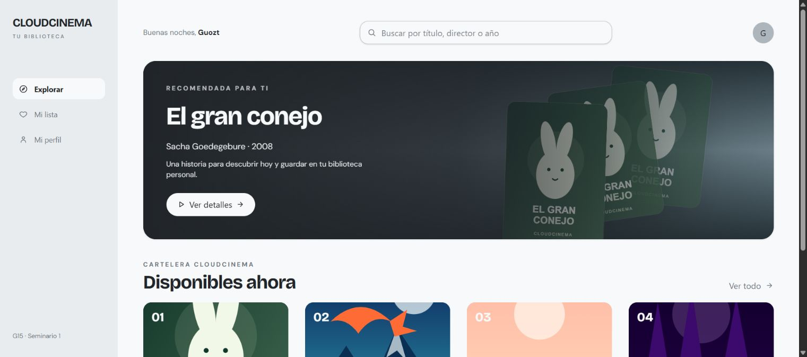
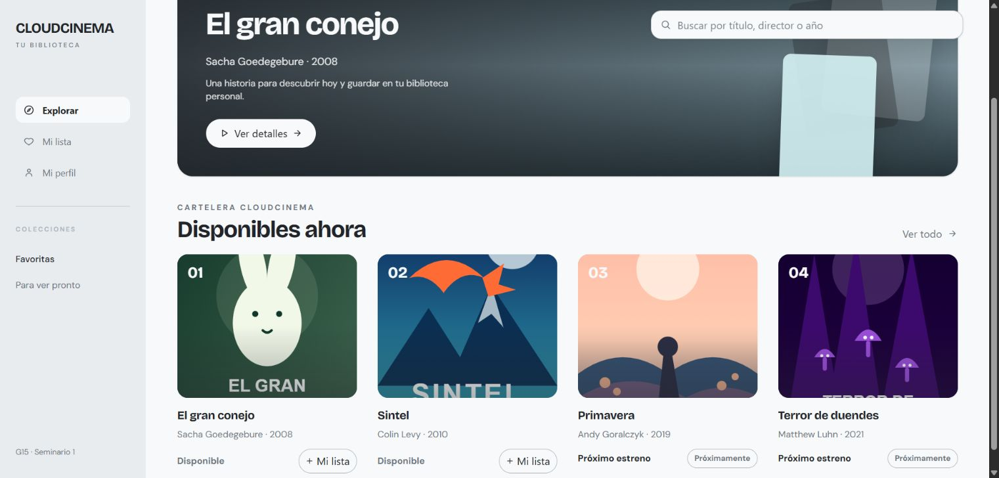
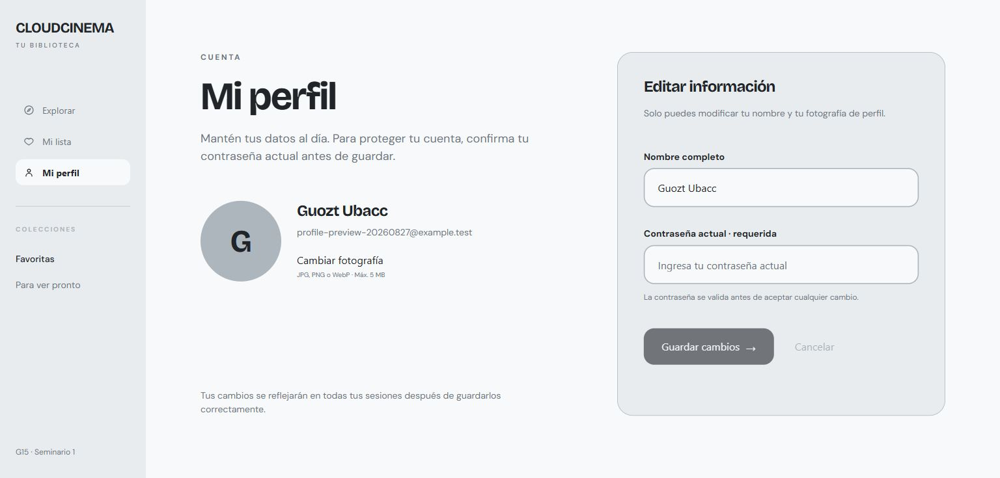
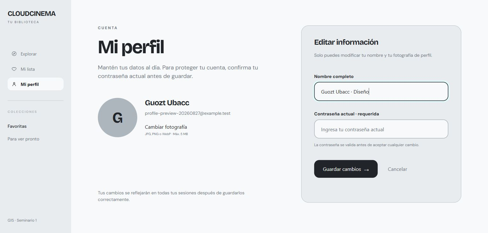
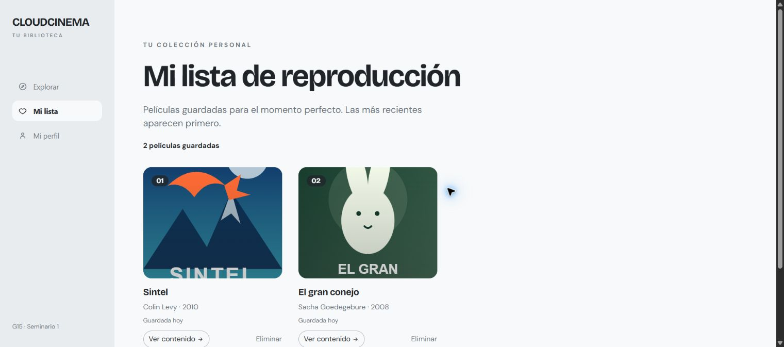
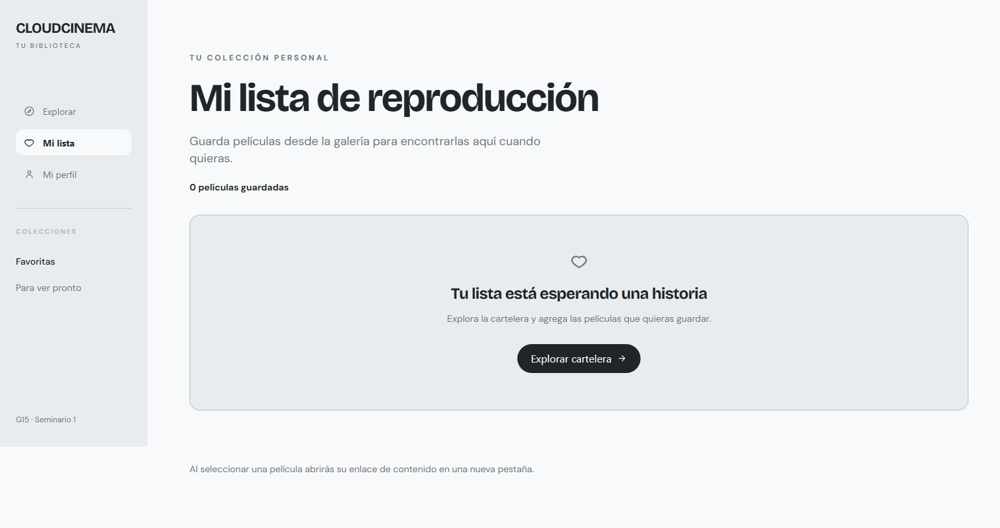

# Guía de usuario

CloudCinema es una plataforma de streaming. Esta guía resume el recorrido
principal de una persona usuaria y las acciones disponibles en cada pantalla.
La configuración técnica, el contrato del API y el modelo de datos se
documentan por separado en el [README raíz](../../README.md).

## Acceso

Al entrar a `/`, CloudCinema redirige a la pantalla de inicio de sesión. Las
rutas `/login` y `/registro` están disponibles sin autenticación. Si ya existe
una sesión vigente, estas rutas llevan al catálogo.

### Iniciar sesión

1. Escribe tu correo electrónico.
2. Escribe tu contraseña. La contraseña debe tener entre 6 y 72 caracteres.
3. Selecciona **Continuar**.

Los errores de formato aparecen debajo del campo correspondiente. Los errores
del API se muestran como un aviso general o junto al campo indicado por el
backend. Al iniciar sesión correctamente se abre `/galeria`.

### Crear una cuenta

1. Escribe tu nombre completo y correo electrónico.
2. Define una contraseña y confírmala. El indicador de contraseña muestra si
   ya se alcanzó el mínimo requerido; el indicador de confirmación avisa cuando
   ambas coinciden.
3. Selecciona una fotografía JPG, PNG o WebP de hasta 5 MiB. También puedes
   usar la cámara si el navegador y sus permisos lo permiten.
4. Selecciona **Crear mi cuenta**.

Al completar el registro, CloudCinema vuelve al login para que la nueva persona
inicie sesión. La fotografía se envía al API como parte del formulario y no se
sube hasta confirmar el registro.

## Navegación autenticada

Después de iniciar sesión, la barra de navegación permite acceder a:

| Ruta | Uso |
|---|---|
| `/galeria` | Explorar el catálogo de películas. |
| `/mi-lista` | Consultar y administrar la lista personal. |
| `/perfil` | Consultar y editar los datos del perfil. |

Estas rutas requieren una sesión vigente. Si el token expira o no existe, la
aplicación redirige a `/login`.

### Explorar el catálogo

En `/galeria` se muestran la película destacada y las tarjetas del catálogo.
Cada tarjeta indica su título, director, año y disponibilidad. Las películas
disponibles pueden abrirse para reproducirlas y agregarse a **Mi lista**; las
que están próximas a estrenarse se muestran como informativas y no permiten
acciones de reproducción.

El sidebar izquierdo permanece visible mientras se desplaza la página. No usa
una línea divisoria: la separación se consigue con el contraste entre el fondo
del menú y el área de contenido. En pantallas pequeñas, la navegación se
convierte en una barra horizontal bajo el encabezado.

La búsqueda se encuentra junto al saludo inicial y filtra por título, director
o año. Al desplazarse aproximadamente 160 píxeles, el campo se transforma en
una cápsula flotante en la parte superior para poder seguir filtrando sin
volver al inicio. Al regresar hacia arriba, vuelve a su posición original.

Las siguientes capturas fueron tomadas directamente desde la aplicación local.
La primera muestra el catálogo al entrar a la vista; la segunda muestra la
búsqueda flotante activa después de desplazarse.

### Consultar y editar el perfil

En `/perfil` se muestran el nombre, el correo y la fotografía asociados a la
sesión actual. La acción **Cambiar fotografía** abre el selector de archivos y
acepta imágenes JPG, PNG o WebP de hasta 5 MiB; la nueva imagen se previsualiza
antes de guardarla.

Para editar la información:

1. Cambia el nombre completo o selecciona una nueva fotografía.
2. Escribe la contraseña actual de la cuenta. Este dato es obligatorio aunque
   solo se modifique la fotografía.
3. Selecciona **Guardar cambios**.

La interfaz no envía la solicitud si no existe ningún cambio o si falta la
contraseña actual. Al guardar, el API valida la contraseña antes de actualizar
el nombre y/o la fotografía; una contraseña incorrecta se muestra junto al
campo para que pueda corregirse. Si la operación es exitosa, el resumen de la
izquierda y la sesión local se actualizan con los datos devueltos por el API.
**Cancelar** restaura los valores que estaban guardados.

### Administrar Mi lista

`/mi-lista` reúne las películas que agregaste desde la galería y las ordena
desde la más reciente. Cada fila muestra el póster, título, director, año y
fecha en que se guardó.

- **Ver contenido** abre la URL multimedia de la película en una nueva pestaña.
- **Eliminar** quita la película de tu colección y actualiza la lista sin
  recargar la página.

Si todavía no has agregado títulos, la vista ofrece un acceso directo para
volver a explorar la cartelera. Las películas próximas a estrenarse no pueden
agregarse desde la galería.

## Errores y permisos

- Si el API no está disponible, se muestra un mensaje para intentarlo de
  nuevo.
- Los errores de validación se corrigen directamente en el formulario antes
  de enviar datos.
- La captura de fotografía depende de que el navegador permita el acceso a la
  cámara; denegar el permiso no impide seleccionar un archivo.
