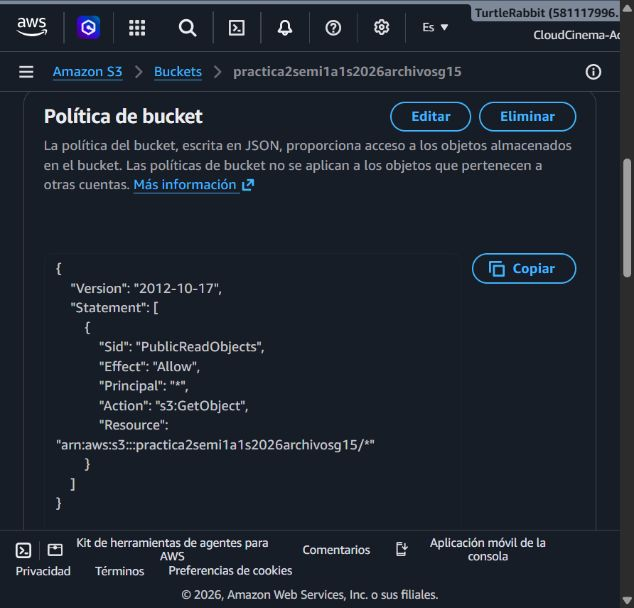
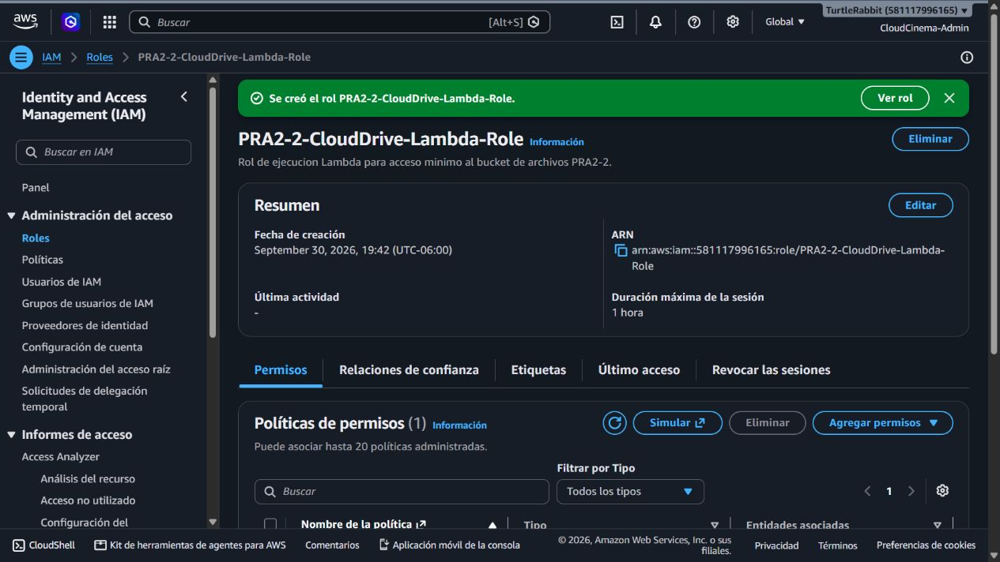
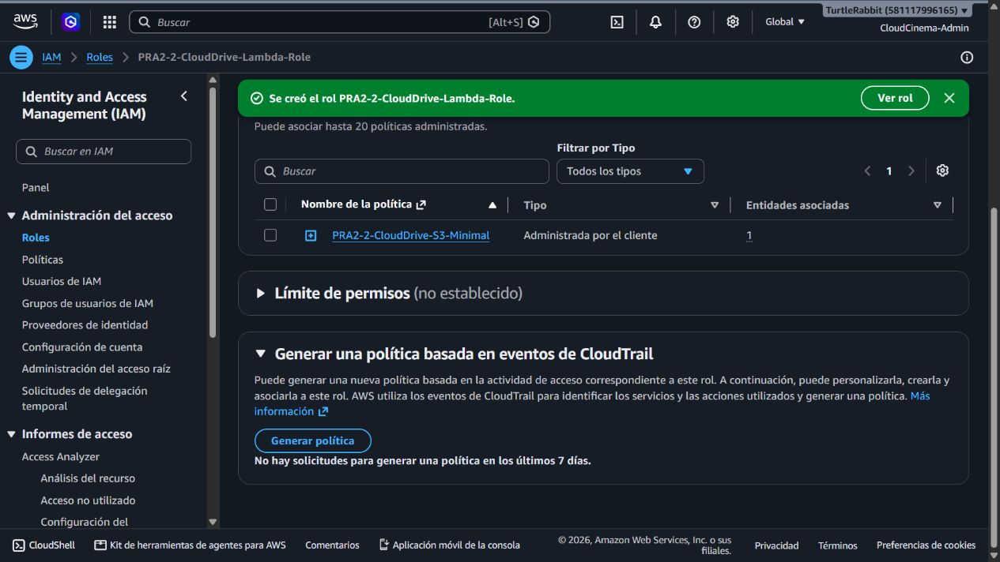
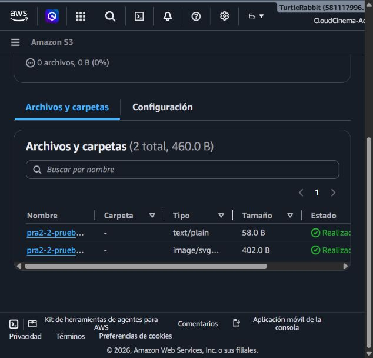

# TaskFlow + CloudDrive - Manual técnico

Este manual reúne la configuración y las validaciones de la Práctica 2. Se
actualiza por secciones conforme cada integrante completa sus tickets; por eso
en esta primera versión solo se documenta `PRA2-1`.

## 1. Datos del proyecto

| Dato | Valor |
|---|---|
| Curso | Seminario de Sistemas 1 |
| Práctica | Práctica 2 - TaskFlow + CloudDrive |
| Grupo | 15 |
| Región AWS documentada | `us-east-1` |
| Responsable de esta sección | Ebed Isai Patzan Tzic |

## 2. Alcance de esta entrega

Esta sección cubre la fundación que necesitan los backends Node.js y Python:
Amazon RDS, el esquema relacional, el contrato común de API y los artefactos
reproducibles de permisos. La configuración física de S3 y Blob Storage se
documentará en `PRA2-2` y `PRA2-3`; la integración de URLs en `PRA2-4`.

> El alcance de `PRA2-1` se verificó contra Linear: esta sección corresponde a
> la fundación de RDS, esquema, contrato común y permisos reproducibles.

## 3. Arquitectura parcial

Los dos backends de TaskFlow + CloudDrive se conectarán a una instancia nueva
de PostgreSQL en Amazon RDS, independiente de la infraestructura de la
Práctica 1. La instancia se mantiene sin acceso público y el
acceso al puerto `5432` se autoriza únicamente mediante security groups de
los servidores que consumirán la base de datos.

```text
Backend Node.js (EC2) ─┐
                       ├── TCP 5432 privado ──> Amazon RDS PostgreSQL
Backend Python (EC2) ──┘
```

## 4. PRA2-1 - Amazon RDS, esquema y contrato

### 4.1 Configuración validada

| Configuración | Valor observado |
|---|---|
| Identificador objetivo | `taskflow-g15` |
| Estado observado | `Disponible` |
| Motor | PostgreSQL 18.3 |
| Clase | `db.t4g.micro` |
| Región y AZ | `us-east-1`, `us-east-1a` |
| Acceso público | Desactivado |
| VPC | `vpc-07d71aba0ec5b2213` |
| Cifrado | Habilitado con la clave administrada `aws/rds` |
| Almacenamiento | 20 GiB, SSD de propósito general (`gp2`) |
| Despliegue | Single-AZ |
| Base inicial | `taskflow` |
| Credenciales maestras | Administradas por AWS Secrets Manager; no se guardan en el repositorio |
| Respaldos | Habilitados, retención de 1 día |
| Protección contra eliminación | Habilitada |
| Security group | `rds-taskflow-g15` (`sg-063f677d0d31377a4`) |

`cloudcinema-g15` pertenece a la Práctica 1 y no se reutilizará ni se
modificará. La instancia nueva `taskflow-g15` ya fue creada para esta
práctica con la base inicial `taskflow`, VPC `vpc-07d71aba0ec5b2213` y un
security group propio. La instancia ya está `Disponible` y AWS reporta el
endpoint `taskflow-g15.cmpaiquocfxf.us-east-1.rds.amazonaws.com`; las
credenciales se obtienen desde Secrets Manager y no se copian al repositorio.

### 4.2 Evidencia de creación y configuración

Las capturas anteriores son reales, pero corresponden a la configuración
histórica de `cloudcinema-g15` (Práctica 1). Se conservan como referencia y
no se presentan como evidencia final de TaskFlow + CloudDrive. Para la nueva
instancia se agregaron en esta misma carpeta capturas de AWS a pantalla
completa y sin secretos; las evidencias nuevas están identificadas con los
prefijos `22-` a `25-`.

1. Security group inicial y reglas de red:
   - [Formulario del security group](Document/img/pra2-1-rds/03-security-group-formulario.jpg)
   - [Security group sin entradas](Document/img/pra2-1-rds/04-security-group-sin-entradas.jpg)
   - [Security group creado](Document/img/pra2-1-rds/05-security-group-creado.jpg)
2. Motor, plantilla, capacidad y almacenamiento:
   - [Motor y método](Document/img/pra2-1-rds/06-motor-y-metodo.jpg)
   - [Plantilla y disponibilidad](Document/img/pra2-1-rds/07-plantilla-y-disponibilidad.jpg)
   - [Identificador y credenciales](Document/img/pra2-1-rds/08-identificador-y-credenciales.jpg)
   - [Clase y almacenamiento](Document/img/pra2-1-rds/09-clase-y-almacenamiento.jpg)
3. Red, supervisión, protección y revisión:
   - [Conectividad privada](Document/img/pra2-1-rds/10-conectividad-privada.jpg)
   - [Supervisión](Document/img/pra2-1-rds/11-supervision.jpg)
   - [Configuración adicional](Document/img/pra2-1-rds/12-configuracion-adicional.jpg)
   - [Etiquetas](Document/img/pra2-1-rds/13-etiquetas.jpg)
   - [Revisión antes de crear](Document/img/pra2-1-rds/14-revision-antes-de-crear.jpg)
4. Estado y configuración final:
   - [TaskFlow RDS en aprovisionamiento](Document/img/pra2-1-rds/21-taskflow-creando.jpg)
   - [Security group sin entradas públicas](Document/img/pra2-1-rds/22-security-group-sin-entradas.jpg)
   - [TaskFlow RDS disponible](Document/img/pra2-1-rds/23-taskflow-disponible.jpg)
   - [Configuración final y cifrado](Document/img/pra2-1-rds/24-taskflow-configuracion.jpg)
   - [Mantenimiento y respaldos](Document/img/pra2-1-rds/25-taskflow-respaldos.jpg)

### 4.3 Validaciones

| Validación | Resultado | Evidencia |
|---|---|---|
| La instancia nueva aparece en RDS | Confirmado: `taskflow-g15` está `Disponible` | [Estado final](Document/img/pra2-1-rds/23-taskflow-disponible.jpg) |
| El motor y la clase son los esperados | Confirmado: PostgreSQL 18.3 y `db.t4g.micro` | [Configuración](Document/img/pra2-1-rds/24-taskflow-configuracion.jpg) |
| La base no está expuesta a Internet | Confirmado: acceso público desactivado | [Conectividad](Document/img/pra2-1-rds/23-taskflow-disponible.jpg) |
| El security group no tiene entrada pública | Confirmado: se eliminó la entrada temporal `74.244.67.20/32`; quedan 0 entradas hasta recibir los SG de las EC2 | [Security group](Document/img/pra2-1-rds/22-security-group-sin-entradas.jpg) |
| El almacenamiento está cifrado y protegido | Confirmado: cifrado habilitado con `aws/rds` y protección contra eliminación habilitada | [Configuración](Document/img/pra2-1-rds/24-taskflow-configuracion.jpg) |
| Los respaldos están activos | Confirmado: automatizados, retención de 1 día | [Respaldos](Document/img/pra2-1-rds/25-taskflow-respaldos.jpg) |
| El esquema de TaskFlow está aplicado en RDS | Pendiente: ejecutar `schema.sql` en la instancia nueva | [Script de validación](database/verificar_schema.sql) |

### 4.4 Pendientes y dependencias

- No usar ni modificar `cloudcinema-g15`, que corresponde a la Práctica 1.
- Recibir los security groups definitivos de las dos EC2 y autorizar TCP `5432`
  únicamente desde ellos.
- Mantener `rds-taskflow-g15` sin entradas hasta recibir los security groups
  definitivos de las EC2; luego autorizar TCP `5432` solo desde ellos.
- Validar la conexión desde Node.js y Python cuando existan las instancias y
  sus variables de entorno.
- Agregar el endpoint y los usuarios de aplicación solo en un mecanismo
  privado de secretos; no deben entrar al repositorio.

### 4.5 Artefactos entregados

- [Esquema PostgreSQL](database/schema.sql)
- [Permisos de la aplicación](database/permisos_aplicacion.sql)
- [Consultas de verificación](database/verificar_schema.sql)
- [Contrato común OpenAPI](contracts/openapi.yaml)
- [Diagrama entidad-relación](docs/diagrama-er.md)
- [Política IAM limitada para RDS](aws/iam/pra2-1-rds-administrator-policy.json)
- [Variables de entorno de ejemplo](config/.env.example)

El contrato usa `camelCase` en JSON y el esquema usa `snake_case` en
PostgreSQL. Los backends deben devolver el mismo sobre de respuesta
`{ exito, datos }` o `{ exito: false, error }`, aunque la implementación
interna sea distinta.

## 5. Referencias

- [Amazon RDS User Guide](https://docs.aws.amazon.com/rds/)
- [Conexión a una instancia PostgreSQL de RDS](https://docs.aws.amazon.com/AmazonRDS/latest/UserGuide/USER_ConnectToPostgreSQLInstance.html)
Este manual se actualiza por secciones conforme cada integrante entrega su
ticket. Las evidencias de PRA2-2 fueron tomadas directamente de la consola de
AWS y se almacenan en Practica_2/Document/img/pra2-2-s3/.

## PRA2-2 - Persistencia AWS: S3 de archivos, IAM, permisos y CORS

### Alcance

Este bucket corresponde al almacenamiento de archivos de CloudDrive, no al
bucket de hosting del frontend. S3 conserva los binarios y RDS conserva los
metadatos y las URL. El enunciado exige el patrón
practica2semi1<<Sección>>1s2026Archivosg#; para el grupo G15, sección A, se
implementó el nombre en minúsculas requerido por S3:

    practica2semi1a1s2026archivosg15

| Propiedad | Configuración validada |
| --- | --- |
| Región | us-east-1 |
| ARN | arn:aws:s3:::practica2semi1a1s2026archivosg15 |
| Tipo | Bucket de uso general |
| Propiedad de objetos | Propietario del bucket; ACL deshabilitadas |
| Versionado | Habilitado |
| Cifrado predeterminado | SSE-S3 |
| Bloqueo de acceso público | Desactivado para permitir lectura pública controlada |

### Evidencias AWS










### CORS

Se registró la configuración de aws/s3/cors.json. Permite GET y HEAD para
visualización, y PUT/POST para el flujo con URL firmada que deberá entregar el
backend o Lambda. El origen * es provisional para la fase de integración; debe
reemplazarse por el origen real del frontend cuando el equipo confirme su URL.

La CORS de S3 no otorga permisos de escritura. El bloqueo de acceso público se
desactivó únicamente para que la política de bucket pueda exponer objetos por
URL; la política solo concede s3:GetObject, por lo que no existe escritura ni
eliminación anónima.

### IAM de mínimo privilegio

La política propuesta está en
aws/s3/taskflow-clouddrive-policy.json. Solo permite localizar/listar los
prefijos de CloudDrive y administrar objetos de profiles/* y files/*. No
contiene s3:*, permisos de administración de la cuenta ni escritura pública.

La política se asoció al rol de ejecución de Lambda
PRA2-2-CloudDrive-Lambda-Role, ARN
arn:aws:iam::581117996165:role/PRA2-2-CloudDrive-Lambda-Role. No se colocan
claves de acceso en el repositorio. El backend debe confirmar si reutilizará
este rol para la integración final y agregar los permisos de logging Lambda si
los necesita.

### Convención y validaciones

La estructura de objetos está documentada en
docs/pra2-2-s3-object-layout.md. Las claves propuestas son:

    profiles/{userId}/{uuid}-{safe-file-name}
    files/{userId}/{uuid}-{safe-file-name}

| Validación | Resultado |
| --- | --- |
| Bucket creado y accesible | Validado en consola AWS |
| Región y ARN | Validados en Propiedades |
| Versionado y SSE-S3 | Validados en Propiedades |
| Propietario del bucket / ACL deshabilitadas | Validado en Permisos |
| Bloqueo de acceso público | Desactivado de forma controlada y visible en Permisos |
| CORS | Guardado y visible en Permisos |
| Política pública | Validada: solo s3:GetObject sobre objetos del bucket |
| Escritura/eliminación anónima | No permitidas por la política aplicada |
| Imagen y texto públicos por URL | Validados con HTTP 200; TXT text/plain y SVG image/svg+xml |

Los archivos de prueba sin datos sensibles fueron cargados en la raíz del
bucket para la prueba de humo. Las claves de aplicación deben seguir la
convención profiles/{userId}/... y files/{userId}/... definida para el backend.
La validación reproducible es:

    Invoke-WebRequest -Uri https://practica2semi1a1s2026archivosg15.s3.us-east-1.amazonaws.com/pra2-2-prueba.txt -UseBasicParsing
    Invoke-WebRequest -Uri https://practica2semi1a1s2026archivosg15.s3.us-east-1.amazonaws.com/pra2-2-prueba.svg -UseBasicParsing

### Dependencias pendientes del equipo

- Daniel, responsable de Node.js/Lambda/API Gateway (PRA2-6/PRA2-9), debe
  confirmar que Lambda consumirá el rol
  PRA2-2-CloudDrive-Lambda-Role y entregar el origen final del frontend para
  reemplazar AllowedOrigins: ["*"] por dominios concretos.
- El responsable de integración (PRA2-4) debe confirmar el modelo final de
  URL/metadatos para que el backend y RDS usen la misma convención.
- La implementación equivalente de Blob (PRA2-3) debe conservar una
  convención compatible para que la comparación multi-cloud no mezcle formatos.
- Falta que el backend pruebe la carga autenticada y que el equipo confirme el
  origen final de CORS. La escritura anónima debe permanecer cerrada.

## Archivos de configuración

- aws/s3/cors.json
- aws/s3/public-read-object-policy.json
- aws/s3/taskflow-clouddrive-policy.json
- config/s3.env.example
- docs/pra2-2-s3-object-layout.md
Este manual se actualiza por secciones conforme cada integrante entrega su
ticket. Esta rama documenta PRA2-3; las capturas se agregarán únicamente
después de crear y validar los recursos reales en Azure.

## PRA2-3 - Persistencia Azure: Blob Storage de archivos, acceso y CORS

### Alcance

El recurso corresponde al almacenamiento de archivos de CloudDrive, no al
contenedor de hosting del frontend. RDS conserva los metadatos y las URL; los
objetos binarios viven en Blob Storage. El enunciado solicita el equivalente
en Azure del nombre de archivos:

    practica2semi1<<Sección>>1s2026Archivosg#

Para el grupo G15, sección A, el nombre compatible con las reglas de Azure es:

    practica2semi1a1s2026archivosg15

El nombre propuesto para la Storage Account es
`practica2semi1a1s2026g15` (minúsculas, sin guiones y con 24 caracteres), y
el contenedor de blobs usará `practica2semi1a1s2026archivosg15`.

### Configuración planificada

| Componente | Configuración | Estado |
| --- | --- | --- |
| Storage Account | `practica2semi1a1s2026g15` | Pendiente de acceso a Azure |
| Región | East US, equivalente operativo a `us-east-1` | Pendiente |
| Tipo de cuenta | StorageV2, rendimiento Standard, redundancia LRS | Pendiente |
| Blob Container | `practica2semi1a1s2026archivosg15` | Pendiente |
| Acceso anónimo | Nivel Blob: lectura de objetos, sin listado | Pendiente |
| Escritura anónima | No permitida | Diseño definido |
| CORS | GET/HEAD para lectura; PUT/POST solo para el flujo controlado | Plantilla preparada |
| Permisos de Functions | Managed Identity con `Storage Blob Data Contributor` | Pendiente |

La lectura pública se limitará a blobs para permitir la visualización por URL
sin exponer el listado del contenedor. La carga, reemplazo y eliminación
deben ejecutarse mediante Azure Functions usando identidad administrada o un
SAS de alcance y duración controlados; nunca mediante escritura anónima.

### Artefactos preparados

- `azure/blob/cors.json`: plantilla de CORS; `*` es provisional y debe
  reemplazarse por el origen real del frontend.
- `azure/blob/object-layout.md`: convención equivalente a S3.
- `config/azure-blob.env.example`: nombres y endpoint no sensibles.

### Evidencias Azure

La sesión está autenticada como `taskflow_semi1@hotmail.com`, pero el
directorio no tiene suscripciones disponibles: Azure muestra `Suscripciones:
Filtrado (0 de 0)`. La evidencia real está en:


No se crearon recursos ni se automatizaron credenciales. Cuando una
suscripción esté disponible, se deben
guardar capturas reales y legibles en `Document/img/pra2-3-azure-blob/` para:

1. Storage Account y región.
2. Blob Container y nivel de acceso.
3. Configuración CORS.
4. Asignación de `Storage Blob Data Contributor` a la identidad de Azure
   Functions.
5. Prueba de URL de un SVG y un TXT.

### Validaciones pendientes

| Validación | Resultado |
| --- | --- |
| Storage Account creado | Bloqueada: el directorio muestra 0 suscripciones |
| Container creado | Bloqueada: no hay suscripción seleccionable |
| Lectura de objetos por URL | Pendiente de crear el container y los objetos |
| Escritura anónima cerrada | Diseño preparado; falta validación en portal |
| CORS | Plantilla preparada; falta aplicar en Storage Account |
| Permisos para Azure Functions | Falta identidad administrada de la Function |
| Comparación de estructura con S3 | Convención documentada |

### Dependencias e impedimentos

- La cuenta ya está autenticada, pero el directorio
  `f8cdef31-a31e-4b4a-93e4-5f571e91255a` muestra 0 suscripciones. Se requiere
  habilitar o agregar una suscripción para crear recursos y tomar capturas de
  configuración.
- Javier, responsable de la vertical Python/Azure, debe confirmar la región,
  la suscripción y la identidad administrada que usará Azure Functions.
- El responsable de frontend debe entregar el origen final para sustituir
  `AllowedOrigins: ["*"]` por el dominio real.
- PRA2-4 debe confirmar que las URL y metadatos de Blob mantengan el contrato
  común con RDS y S3.

## Archivos de configuración

- `azure/blob/cors.json`
- `azure/blob/object-layout.md`
- `config/azure-blob.env.example`
## PRA2-4 - Integración de persistencia: RDS + S3 + Blob

Esta sección define el contrato lógico entre la base de datos y los
almacenamientos de objetos. RDS no guarda binarios: guarda únicamente
metadatos, la clave del objeto y su URL HTTPS.

### Mapeo de RDS

La tabla `usuarios` referencia la imagen de perfil mediante
`url_imagen_perfil`. La tabla `archivos` usa los siguientes campos mínimos:

| Campo | Uso |
| --- | --- |
| `usuario_id` | Propietario del archivo y límite de acceso lógico |
| `nombre_original` | Nombre mostrado al usuario |
| `tipo_mime` | Tipo MIME validado por el backend |
| `tamano_bytes` | Tamaño del objeto, no del registro binario |
| `proveedor_almacenamiento` | `S3` o `BLOB` |
| `clave_objeto` | Clave/prefijo interno del objeto |
| `url_objeto` | URL HTTPS consumible por frontend |
| `creado_en` | Fecha de registro |

El esquema común se encuentra en `database/schema.sql` y el contrato HTTP en
`contracts/openapi.yaml`. El campo `proveedor_almacenamiento` permite que
Node.js y Python usen la misma tabla sin mezclar las claves de cada proveedor.

### Flujo de imagen de perfil

1. El frontend envía el archivo al endpoint serverless de carga.
2. La función valida identidad, MIME, tamaño y nombre.
3. La función guarda el objeto en `profiles/{userId}/...` de S3 o Blob.
4. La función devuelve una URL HTTPS del objeto.
5. El backend actualiza `usuarios.url_imagen_perfil` dentro de una operación
   autenticada.
6. El frontend recupera el perfil y usa esa URL para visualizar la imagen.

Si falla el almacenamiento, no se debe guardar una URL que no haya sido
confirmada por el proveedor.

### Flujo de archivos de CloudDrive

1. El usuario autenticado solicita la carga.
2. Node.js o Python obtiene una URL firmada o invoca la función serverless.
3. El objeto se almacena en `files/{userId}/{uuid}-{safe-file-name}`.
4. Se comprueba que la respuesta del proveedor incluya la clave y la URL.
5. Se inserta el registro de metadatos en `archivos`.
6. Las consultas de archivos filtran siempre por `usuario_id`.
7. La eliminación coordina primero el objeto y después el metadato, según la
   política acordada por el equipo.

### Datos de prueba y estado

Las URLs S3 de prueba creadas en PRA2-2 fueron:

    https://practica2semi1a1s2026archivosg15.s3.us-east-1.amazonaws.com/pra2-2-prueba.svg
    https://practica2semi1a1s2026archivosg15.s3.us-east-1.amazonaws.com/pra2-2-prueba.txt

Ambas respondieron HTTP 200 y sus tipos fueron `image/svg+xml` y `text/plain`.
La URL equivalente de Blob queda pendiente porque el equipo aún no dispone de
una suscripción Azure para crear el recurso y el container. No se debe marcar
como válida ninguna URL Blob inventada.

### Dependencias para cerrar el ticket

- PRA2-3: Storage Account, container, objeto SVG, objeto TXT y URL Blob reales.
- PRA2-1: ejecución del esquema en la instancia RDS compartida y confirmación
  del acceso del backend.
- Backend Node.js/Python: confirmar quién registra el metadato después de la
  carga y cómo se manejará la eliminación coordinada.
- Frontend: consumir `url_imagen_perfil` y `url_objeto` sin reconstruir URLs.

No se agregan capturas nuevas en este ticket porque no se modificó una consola
cloud. Las evidencias de S3 pertenecen a PRA2-2 y las de Blob se agregarán
cuando exista una suscripción Azure.
## PRA2-5 - RDS + S3 de archivos + Blob de archivos

Este documento consolida la fundación de persistencia para que Node.js,
Python y frontend consuman el mismo contrato. Las credenciales y secretos no
forman parte del repositorio.

### Arquitectura

    Frontend
       |
       | URL HTTPS + API común
       v
    Node.js / Python
       |------------------------------|
       |                                |
       v                                v
    RDS PostgreSQL                 S3 / Azure Blob
    metadatos, claves, URLs        objetos binarios

RDS conserva usuarios, tareas y metadatos de archivos. S3 y Blob Storage
conservan los binarios. El frontend nunca debe reconstruir URLs concatenando
partes del proveedor: debe consumir `url_imagen_perfil` y `url_objeto`.

### RDS y modelo relacional

La instancia de la Práctica 2 es `taskflow-g15`. El esquema común define:

- `usuarios.url_imagen_perfil`: URL HTTPS del objeto de perfil.
- `archivos.usuario_id`: propietario lógico del objeto.
- `archivos.nombre_original`: nombre mostrado.
- `archivos.tipo_mime`: MIME validado.
- `archivos.tamano_bytes`: tamaño del objeto.
- `archivos.proveedor_almacenamiento`: `S3` o `BLOB`.
- `archivos.clave_objeto`: prefijo y nombre interno.
- `archivos.url_objeto`: URL HTTPS del objeto.
- `archivos.creado_en`: fecha de registro.

Los binarios no se guardan en PostgreSQL. El esquema y el contrato común se
entregan en PRA2-1 y deben integrarse antes del cierre final.

### S3 de archivos

- Bucket: `practica2semi1a1s2026archivosg15`.
- Región: `us-east-1`.
- Versionado y SSE-S3 habilitados; ACL deshabilitadas.
- Convención: `profiles/{userId}/...` y `files/{userId}/...`.
- IAM de aplicación limitado a los prefijos de CloudDrive.
- Lectura pública limitada a `s3:GetObject`; escritura anónima no permitida.
- CORS preparado para el frontend; el origen `*` es provisional.

Las evidencias de S3 y sus archivos de configuración pertenecen a PRA2-2.
Los objetos SVG y TXT de prueba respondieron HTTP 200.

### Blob Storage de archivos

El contenedor debe usar el equivalente solicitado por el enunciado:

    practica2semi1a1s2026archivosg15

La Storage Account propuesta es `practica2semi1a1s2026g15`. El acceso de
lectura debe ser a nivel Blob sin listado público, mientras las cargas y
eliminaciones deben pasar por Azure Functions con Managed Identity o SAS
limitado. CORS debe reemplazar `*` por el origen final del frontend.

Actualmente la cuenta Azure autenticada no tiene suscripciones disponibles,
por lo que Storage Account, Container, permisos, CORS y URLs Blob todavía no
pueden validarse. La captura del bloqueo está en
`Document/img/pra2-3-azure-blob/00-suscripciones-no-disponibles.jpg`.

### Flujos de aplicación

#### Imagen de perfil

1. Frontend solicita la carga autenticada.
2. Function valida usuario, MIME, tamaño y nombre.
3. Function almacena el objeto bajo `profiles/{userId}/`.
4. Se devuelve una URL HTTPS real.
5. Backend actualiza `usuarios.url_imagen_perfil`.
6. Frontend usa la URL registrada.

#### Archivo de CloudDrive

1. Frontend solicita carga para el usuario autenticado.
2. Function o backend autorizado almacena el objeto bajo `files/{userId}/`.
3. Se verifica la respuesta del proveedor.
4. Backend registra la fila de `archivos`.
5. Las consultas filtran por `usuario_id`.
6. La eliminación coordina el objeto y su metadato.

### Estado de cierre

| Elemento | Estado |
| --- | --- |
| RDS, esquema y contrato | Preparado en PRA2-1; falta validar handoff con backends |
| S3 de archivos, IAM y CORS | Configurado y validado en PRA2-2 |
| Blob Storage, permisos y CORS | Bloqueado por falta de suscripción Azure |
| URLs reales S3 | Validadas con SVG y TXT |
| URL real Blob | Pendiente |
| Capturas consolidadas multi-cloud | Pendientes de Azure |

### Dependencias de handoff

- El compañero que active Azure debe entregar la suscripción, región,
  Storage Account, Container, identidad administrada y URLs Blob.
- PRA2-4 debe ejecutar la prueba conjunta de metadatos con RDS usando una URL
  S3 y una URL Blob reales.
- Node.js, Python y frontend deben consumir el contrato común sin duplicar la
  lógica de construcción de URLs.
