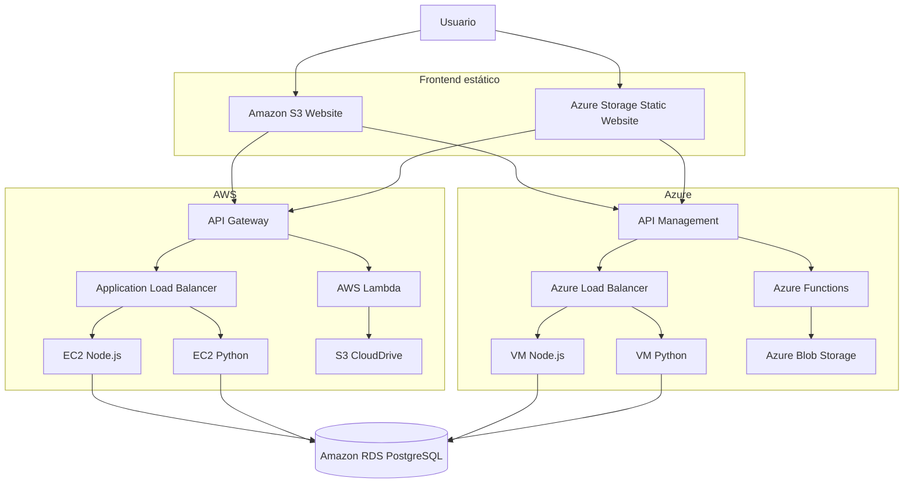

# TaskFlow + CloudDrive

Manual técnico general de la Práctica 2 de Seminario de Sistemas 1. El proyecto
implementa una aplicación web de gestión de tareas y archivos con despliegue
multicloud, dos implementaciones equivalentes del backend y servicios
serverless para la carga de objetos.

> Este documento resume la arquitectura, los recursos y las decisiones de
> configuración. Las capturas, pruebas y procedimientos completos se encuentran
> en los informes enlazados en [Documentación detallada](#documentación-detallada).

## Contenido

1. [Descripción general](#descripción-general)
2. [Arquitectura](#arquitectura)
3. [Componentes implementados](#componentes-implementados)
4. [Configuración por servicio](#configuración-por-servicio)
5. [Flujos principales](#flujos-principales)
6. [Seguridad](#seguridad)
7. [Ejecución y despliegue](#ejecución-y-despliegue)
8. [Verificación](#verificación)
9. [Documentación detallada](#documentación-detallada)
10. [Estructura del proyecto](#estructura-del-proyecto)

## Descripción general

TaskFlow permite:

- registrar usuarios e iniciar sesión;
- crear, consultar, completar y eliminar tareas;
- seleccionar AWS o Azure como proveedor desde el cliente;
- cargar imágenes de perfil, archivos de texto y archivos generales;
- consultar los objetos almacenados en CloudDrive;
- mantener disponible la API mediante dos backends balanceados por nube.

La solución conserva un contrato HTTP común para Node.js y Python. El frontend
no consume directamente las máquinas virtuales: utiliza API Gateway en AWS o
API Management en Azure como puntos públicos de entrada.

### Tecnologías principales

| Capa | Tecnologías |
| --- | --- |
| Cliente web | React 19, TypeScript, Vite, Axios, TanStack Query, Zustand y Zod |
| Backend Node.js | NestJS, Express, PostgreSQL y PM2 |
| Backend Python | FastAPI, Uvicorn, PostgreSQL y systemd |
| Base de datos | Amazon RDS for PostgreSQL |
| AWS | S3, EC2, Application Load Balancer, API Gateway, Lambda e IAM |
| Azure | Storage Account, Virtual Machines, Load Balancer, API Management, Functions, Managed Identity y RBAC |

## Arquitectura



### Puntos de entrada públicos

| Servicio | URL |
| --- | --- |
| Sitio web en AWS | [practica2semi1a1s2026paginawebg15.s3-website-us-east-1.amazonaws.com](http://practica2semi1a1s2026paginawebg15.s3-website-us-east-1.amazonaws.com) |
| Sitio web en Azure | [pra2semi1a1s2026webg15.z13.web.core.windows.net](https://pra2semi1a1s2026webg15.z13.web.core.windows.net/) |
| API Gateway de AWS | [oaxm8gpqm0.execute-api.us-east-1.amazonaws.com](https://oaxm8gpqm0.execute-api.us-east-1.amazonaws.com) |
| API Management de Azure | [taskflow-g15-apim.azure-api.net](https://taskflow-g15-apim.azure-api.net) |

## Componentes implementados

### Cliente web

La SPA se encuentra en [`frontend/`](frontend/). Incluye autenticación,
administración de tareas, CloudDrive y selección del proveedor activo. La
configuración se valida con Zod y separa las bases de la API transaccional de
las rutas serverless de carga.

Variables disponibles:

| Variable | Propósito |
| --- | --- |
| `VITE_APP_MODE` | Selecciona ejecución real o local |
| `VITE_DEFAULT_CLOUD` | Define AWS o Azure como proveedor inicial |
| `VITE_API_TIMEOUT_MS` | Tiempo máximo de espera de las solicitudes |
| `VITE_AWS_API_BASE_URL` | Base de autenticación y tareas en AWS |
| `VITE_AWS_UPLOAD_BASE_URL` | Base de cargas serverless en AWS |
| `VITE_AZURE_API_BASE_URL` | Base de autenticación y tareas en Azure |
| `VITE_AZURE_UPLOAD_BASE_URL` | Base de cargas serverless en Azure |

Las variables `VITE_*` son públicas en el bundle; nunca deben contener
contraseñas, tokens privados ni claves de acceso.

### APIs equivalentes

- [`api-node/`](api-node/) contiene la implementación Node.js.
- [`api-python/`](api-python/) contiene la implementación Python.
- [`contracts/openapi.yaml`](contracts/openapi.yaml) es el contrato compartido.
- [`docs/paridad-backends.md`](docs/paridad-backends.md) documenta la paridad
  funcional y las reglas comunes.

Ambos backends exponen `GET /health` y las operaciones de autenticación y
tareas bajo `/api/v1`. Los balanceadores utilizan `/health` para retirar
automáticamente los destinos que no respondan.

### Persistencia

Amazon RDS almacena usuarios, tareas y metadatos. Los archivos binarios no se
guardan en PostgreSQL: AWS utiliza S3 y Azure utiliza Blob Storage. La base
conserva la clave, URL, proveedor, tipo MIME y demás datos necesarios para
consultar cada objeto.

### Cargas serverless

Las rutas `/upload/image`, `/upload/text` y `/upload/file` mantienen el
mismo contrato en ambas nubes:

- API Gateway invoca funciones Lambda y almacena objetos en S3.
- API Management expone Azure Functions y almacena objetos en Blob Storage.

El contrato completo está en
[`docs/contrato-serverless.md`](docs/contrato-serverless.md).

## Configuración por servicio

### Amazon RDS

| Parámetro | Configuración |
| --- | --- |
| Instancia | `taskflow-g15` |
| Motor | PostgreSQL 18.3 |
| Región | `us-east-1` |
| Base / puerto | `taskflow` / `5432` |
| VPC | `vpc-07d71aba0ec5b2213` |
| Security group | `rds-taskflow-g15` (`sg-063f677d0d31377a4`) |
| Transporte | TLS con el bundle global de Amazon RDS |

Los scripts de [`database/`](database/) crean el esquema, aplican permisos,
generan el usuario de aplicación y verifican la instalación. El orden operativo
está descrito en [`docs/runbook-bd-rds.md`](docs/runbook-bd-rds.md).

### Sitio web estático en Amazon S3

| Parámetro | Configuración |
| --- | --- |
| Bucket | `practica2semi1a1s2026paginawebg15` |
| Región | `us-east-1` |
| Hosting | Static website; `index.html` como índice y error |
| Ownership | ACL deshabilitadas |
| Cifrado | SSE-S3 |
| Versionado | Desactivado |
| Lectura pública | Política limitada a `s3:GetObject` |
| IAM de publicación | `taskflow-web-g15` / `TaskFlow-Web-S3-G15` |

Se conservan bloqueadas las ACL públicas y se habilita exclusivamente la
política necesaria para servir objetos. Los archivos reproducibles están en
[`aws/s3-web/`](aws/s3-web/) y las evidencias en el
[informe de publicación en S3](docs/evidence/s3-web/report.md).

### Sitio web estático en Azure Storage

| Parámetro | Configuración |
| --- | --- |
| Cuenta | `pra2semi1a1s2026webg15` |
| Grupo de recursos | `rg-practica2-semi1a1s2026-g15` |
| Región | East US |
| Tipo | StorageV2, Standard LRS |
| Contenedor | `$web` |
| Índice / error | `index.html` / `index.html` |
| TLS mínimo | 1.2 |
| Acceso anónimo general | Deshabilitado |

La cuenta del frontend es independiente de la cuenta usada para CloudDrive.
Los parámetros reproducibles están en
[`azure/static-web/`](azure/static-web/) y el procedimiento completo en el
[informe de publicación en Azure](docs/evidence/azure-web/report.md).

### Balanceo en AWS

| Parámetro | Configuración |
| --- | --- |
| ALB | `taskflow-g15-alb`, público y regional |
| Región | `us-east-1` |
| DNS | `taskflow-g15-alb-416879263.us-east-1.elb.amazonaws.com` |
| Security group | `taskflow-g15-alb-sg` (`sg-054b4346318f3c030`) |
| Destinos | EC2 Node.js y EC2 Python |
| Protocolo | HTTP/1.1 en puerto `3000` |
| Health check | `GET /health`, respuesta `200` |
| Entrada pública | API Gateway |

API Gateway publica `GET /health` y `ANY /api/v1/{proxy+}` hacia el ALB,
además de las rutas de carga integradas con Lambda.

### Balanceo en Azure

| Parámetro | Configuración |
| --- | --- |
| Load Balancer | `taskflow-g15-lb-azure` |
| SKU / alcance | Standard, público y regional |
| Grupo de recursos | `rg-taskflow-g15` |
| Región | West US 2 |
| Frontend | `taskflow-g15-lb-front` |
| IP pública | `172.193.203.197`, estática |
| Backend pool | `taskflow-g15-api-pool` |
| Red | `vnet-westus2-1` / `snet-westus2-1` |
| Regla | TCP `3000` → `3000` |
| Sonda | HTTP `:3000/health`, intervalo de 5 segundos |
| Entrada pública | API Management |

API Management expone el backend bajo `/backend` y dirige las solicitudes al
Load Balancer. El detalle de ambas nubes está en el
[informe de balanceadores](docs/evidence/load-balancers/report.md).

### Almacenamiento de archivos

| Proveedor | Recurso | Controles principales |
| --- | --- | --- |
| AWS | S3 para CloudDrive | IAM de mínimo privilegio, CORS y convención de claves |
| Azure | Blob Storage | Identidad administrada, RBAC, CORS y contenedores separados |

Las convenciones están documentadas en
[`docs/pra2-2-s3-object-layout.md`](docs/pra2-2-s3-object-layout.md) y
[`azure/blob/object-layout.md`](azure/blob/object-layout.md).

## Flujos principales

### Autenticación y tareas

1. El usuario abre cualquiera de los dos sitios publicados.
2. El frontend selecciona AWS o Azure.
3. Axios envía la solicitud al gateway correspondiente.
4. El gateway dirige la operación al balanceador.
5. El balanceador selecciona una implementación saludable.
6. Node.js o Python procesa el contrato común y consulta RDS mediante TLS.

### Carga de archivos

1. El frontend selecciona el endpoint de carga del proveedor activo.
2. El gateway valida y dirige la solicitud a Lambda o Azure Functions.
3. La función almacena el objeto en S3 o Blob Storage.
4. La respuesta conserva el formato común definido para CloudDrive.

### Alta disponibilidad

Cada nube mantiene una instancia Node.js y una instancia Python en el backend
pool. Las sondas de salud evitan enviar tráfico a una implementación detenida.
Las pruebas documentadas comprobaron la continuidad del servicio al retirar
temporalmente uno de los destinos.

## Seguridad

- RDS acepta PostgreSQL únicamente desde orígenes autorizados y exige conexión
  cifrada.
- Los puertos de aplicación de las VMs se limitan al tráfico requerido por los
  balanceadores y sus sondas.
- Las instancias de AWS utilizan roles IAM; no se almacenan access keys en el
  repositorio.
- Azure Functions utiliza Managed Identity y RBAC para acceder a Blob Storage.
- Las políticas S3 separan lectura pública del sitio y permisos de
  administración.
- CORS enumera los orígenes publicados y los métodos necesarios para cada API.
- Los secretos se mantienen fuera de Git, en archivos de entorno protegidos o
  en la configuración segura del proveedor.

Los archivos `.env.example` solo describen nombres y formatos; deben copiarse
y completarse localmente sin versionar credenciales reales.

## Ejecución y despliegue

### Frontend local

```bash
cd Practica_2/frontend
pnpm install
cp .env.example .env
pnpm dev
```

Comandos disponibles:

| Comando | Uso |
| --- | --- |
| `pnpm dev` | Servidor local de Vite |
| `pnpm build` | Typecheck y build de producción |
| `pnpm build:hosting` | Build y preparación para hosting estático |
| `pnpm lint` | Análisis estático |
| `pnpm test` | Pruebas automatizadas |

El proyecto fuerza el uso de pnpm mediante el script `preinstall`.

### Backends

Las instrucciones específicas se mantienen junto a cada implementación:

- [API Node.js](api-node/README.md)
- [API Python](api-python/README.md)
- [Despliegue Node.js en AWS y Azure](docs/pra2-6-10-despliegue-node-aws-azure.md)
- [Despliegue Python en AWS y Azure](docs/pra2-13-14-despliegue-azure-python.md)

En producción, Node.js se mantiene con PM2 y arranque mediante systemd. Python
se instala como una unidad systemd endurecida. Ambos servicios deben responder
`200 OK` en `/health` antes de incorporarse al backend pool.

## Verificación

Comprobaciones mínimas posteriores a un despliegue:

```bash
# Salud por AWS
curl -i https://oaxm8gpqm0.execute-api.us-east-1.amazonaws.com/health

# Salud por Azure
curl -i https://taskflow-g15-apim.azure-api.net/backend/health

# Calidad del frontend
cd Practica_2/frontend
pnpm lint
pnpm test
pnpm build
```

También se debe comprobar:

- carga del frontend desde S3 y Azure Storage;
- preflight CORS desde ambos orígenes publicados;
- autenticación y CRUD de tareas en AWS y Azure;
- carga y consulta de archivos con ambos proveedores;
- alternancia entre respuestas Node.js y Python;
- continuidad al retirar temporalmente un destino.

## Documentación detallada

### Uso e integración

| Documento | Contenido |
| --- | --- |
| [Guía de usuario](docs/user-guide.md) | Registro, acceso, tareas, selección de nube y CloudDrive |
| [Integración del frontend](docs/api/frontend-integration.md) | Variables, endpoints, formatos y validación del cliente |
| [Contrato OpenAPI](contracts/openapi.yaml) | Fuente de verdad del API transaccional |
| [Contrato serverless](docs/contrato-serverless.md) | Formato común de las cargas |
| [Paridad de backends](docs/paridad-backends.md) | Compatibilidad entre Node.js y Python |

### Infraestructura y evidencias

| Componente | Informe |
| --- | --- |
| Amazon RDS | [Runbook de base de datos](docs/runbook-bd-rds.md) |
| Sitio estático en Amazon S3 | [Configuración y publicación](docs/evidence/s3-web/report.md) |
| Sitio estático en Azure Storage | [Configuración y publicación](docs/evidence/azure-web/report.md) |
| Balanceadores AWS y Azure | [Implementación, pruebas y failover](docs/evidence/load-balancers/report.md) |
| EC2 Node.js | [Despliegue y evidencias](docs/evidence/ec2-node/reporte.md) |
| EC2 Python | [Despliegue y evidencias](docs/evidence/ec2-python/report.md) |
| VM Node.js en Azure | [Despliegue y evidencias](docs/evidence/azure-vm-node/reporte.md) |
| VM Python en Azure | [Despliegue y evidencias](docs/evidence/azure-vm-python/report.md) |
| AWS Lambda | [Funciones y evidencias](docs/evidence/aws-Lambda/reporte.md) |
| Amazon API Gateway | [Configuración y evidencias](docs/evidence/Api-gateway/reporte.md) |
| Azure Functions y API Management | [Configuración y evidencias](docs/evidence/azure-serverless/report.md) |

## Estructura del proyecto

```text
Practica_2/
├── api-node/           # Backend NestJS
├── api-python/         # Backend FastAPI
├── aws/                # IAM, S3, Lambda, API Gateway y scripts AWS
├── azure/              # Blob, Functions, APIM, VMs y sitio estático
├── config/             # Plantillas de configuración compartida
├── contracts/          # Contrato OpenAPI
├── database/           # Esquema, permisos y verificaciones PostgreSQL
├── docs/               # Manuales, contratos, informes y evidencias
└── frontend/           # SPA React + TypeScript
```

Las guías temporales de configuración no forman parte de la entrega. La
documentación oficial se concentra en este manual, la guía de usuario y los
informes versionados.
