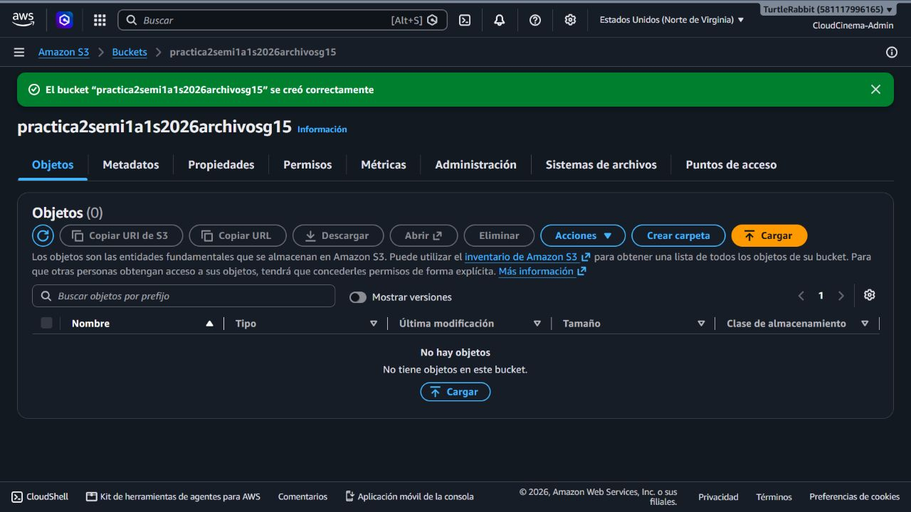
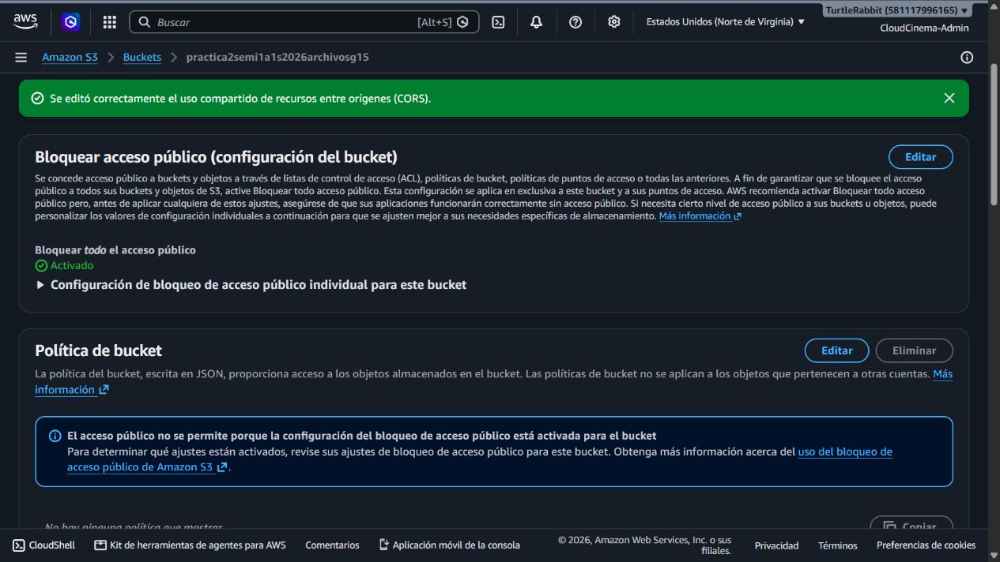
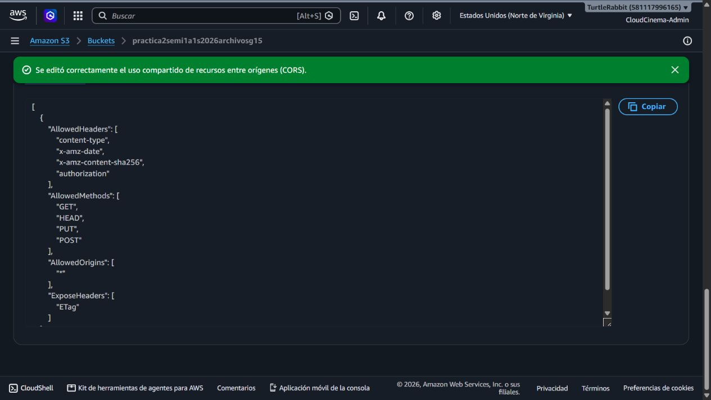

# TaskFlow + CloudDrive - Manual técnico

Este manual se actualiza por secciones conforme cada integrante entrega su
ticket. Las evidencias de PRA2-2 fueron tomadas directamente de la consola de
AWS y se almacenan en Practica_2/Document/img/pra2-2-s3/.

## PRA2-2 - Persistencia AWS: S3 de archivos, IAM, permisos y CORS

### Alcance

Este bucket corresponde al almacenamiento de archivos de CloudDrive, no al
bucket de hosting del frontend. S3 conserva los binarios y RDS conserva los
metadatos y las URL. El enunciado exige el patrón
practica2semi1<<Sección>>1s2026Archivosg#; para el grupo G15, sección A, se
implementó el nombre en minúsculas requerido por S3:

    practica2semi1a1s2026archivosg15

| Propiedad | Configuración validada |
| --- | --- |
| Región | us-east-1 |
| ARN | arn:aws:s3:::practica2semi1a1s2026archivosg15 |
| Tipo | Bucket de uso general |
| Propiedad de objetos | Propietario del bucket; ACL deshabilitadas |
| Versionado | Habilitado |
| Cifrado predeterminado | SSE-S3 |
| Bloqueo de acceso público | Activado inicialmente |

### Evidencias AWS

### CORS

Se registró la configuración de aws/s3/cors.json. Permite GET y HEAD para
visualización, y PUT/POST para el flujo con URL firmada que deberá entregar el
backend o Lambda. El origen * es provisional para la fase de integración; debe
reemplazarse por el origen real del frontend cuando el equipo confirme su URL.

La CORS de S3 no otorga permisos de escritura. La escritura anónima sigue
bloqueada mientras el bloqueo de acceso público esté activo.

### IAM de mínimo privilegio

La política propuesta está en
aws/s3/taskflow-clouddrive-policy.json. Solo permite localizar/listar los
prefijos de CloudDrive y administrar objetos de profiles/* y files/*. No
contiene s3:*, permisos de administración de la cuenta ni escritura pública.

La política aún debe asociarse al rol de ejecución de Lambda/API Gateway o al
usuario IAM de integración que el equipo defina. No se colocan claves de acceso
en el repositorio.

### Convención y validaciones

La estructura de objetos está documentada en
docs/pra2-2-s3-object-layout.md. Las claves propuestas son:

    profiles/{userId}/{uuid}-{safe-file-name}
    files/{userId}/{uuid}-{safe-file-name}

| Validación | Resultado |
| --- | --- |
| Bucket creado y accesible | Validado en consola AWS |
| Región y ARN | Validados en Propiedades |
| Versionado y SSE-S3 | Validados en Propiedades |
| Propietario del bucket / ACL deshabilitadas | Validado en Permisos |
| Bloqueo de acceso público | Activado y visible en Permisos |
| CORS | Guardado y visible en Permisos |
| Escritura anónima | Bloqueada por configuración actual |
| Imagen y texto públicos por URL | Pendiente de aplicar lectura pública y cargar archivos de prueba |

### Dependencias pendientes del equipo

- Daniel, responsable de Node.js/Lambda/API Gateway (PRA2-6/PRA2-9), debe
  confirmar el rol de ejecución que consumirá S3 y el origen final del frontend
  para reemplazar AllowedOrigins: ["*"] por dominios concretos.
- El responsable de integración (PRA2-4) debe confirmar el modelo final de
  URL/metadatos para que el backend y RDS usen la misma convención.
- La implementación equivalente de Blob (PRA2-3) debe conservar una
  convención compatible para que la comparación multi-cloud no mezcle formatos.
- Después de esa confirmación se debe asociar la política IAM, habilitar la
  lectura pública únicamente para objetos de visualización y probar un archivo
  de imagen y uno de texto mediante URL. La escritura anónima debe permanecer
  cerrada.

## Archivos de configuración

- aws/s3/cors.json
- aws/s3/taskflow-clouddrive-policy.json
- config/s3.env.example
- docs/pra2-2-s3-object-layout.md
