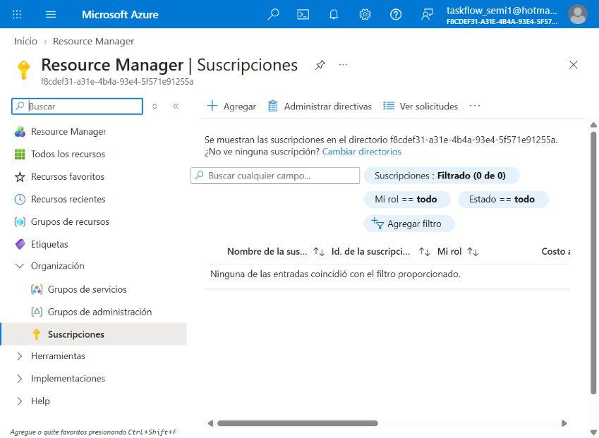

# TaskFlow + CloudDrive - Manual técnico

Este manual se actualiza por secciones conforme cada integrante entrega su
ticket. Esta rama documenta PRA2-3; las capturas se agregarán únicamente
después de crear y validar los recursos reales en Azure.

## PRA2-3 - Persistencia Azure: Blob Storage de archivos, acceso y CORS

### Alcance

El recurso corresponde al almacenamiento de archivos de CloudDrive, no al
contenedor de hosting del frontend. RDS conserva los metadatos y las URL; los
objetos binarios viven en Blob Storage. El enunciado solicita el equivalente
en Azure del nombre de archivos:

    practica2semi1<<Sección>>1s2026Archivosg#

Para el grupo G15, sección A, el nombre compatible con las reglas de Azure es:

    practica2semi1a1s2026archivosg15

El nombre propuesto para la Storage Account es
`practica2semi1a1s2026g15` (minúsculas, sin guiones y con 24 caracteres), y
el contenedor de blobs usará `practica2semi1a1s2026archivosg15`.

### Configuración planificada

| Componente | Configuración | Estado |
| --- | --- | --- |
| Storage Account | `practica2semi1a1s2026g15` | Pendiente de acceso a Azure |
| Región | East US, equivalente operativo a `us-east-1` | Pendiente |
| Tipo de cuenta | StorageV2, rendimiento Standard, redundancia LRS | Pendiente |
| Blob Container | `practica2semi1a1s2026archivosg15` | Pendiente |
| Acceso anónimo | Nivel Blob: lectura de objetos, sin listado | Pendiente |
| Escritura anónima | No permitida | Diseño definido |
| CORS | GET/HEAD para lectura; PUT/POST solo para el flujo controlado | Plantilla preparada |
| Permisos de Functions | Managed Identity con `Storage Blob Data Contributor` | Pendiente |

La lectura pública se limitará a blobs para permitir la visualización por URL
sin exponer el listado del contenedor. La carga, reemplazo y eliminación
deben ejecutarse mediante Azure Functions usando identidad administrada o un
SAS de alcance y duración controlados; nunca mediante escritura anónima.

### Artefactos preparados

- `azure/blob/cors.json`: plantilla de CORS; `*` es provisional y debe
  reemplazarse por el origen real del frontend.
- `azure/blob/object-layout.md`: convención equivalente a S3.
- `config/azure-blob.env.example`: nombres y endpoint no sensibles.

### Evidencias Azure

La sesión está autenticada como `taskflow_semi1@hotmail.com`, pero el
directorio no tiene suscripciones disponibles: Azure muestra `Suscripciones:
Filtrado (0 de 0)`. La evidencia real está en:

No se crearon recursos ni se automatizaron credenciales. Cuando una
suscripción esté disponible, se deben
guardar capturas reales y legibles en `Document/img/pra2-3-azure-blob/` para:

1. Storage Account y región.
2. Blob Container y nivel de acceso.
3. Configuración CORS.
4. Asignación de `Storage Blob Data Contributor` a la identidad de Azure
   Functions.
5. Prueba de URL de un SVG y un TXT.

### Validaciones pendientes

| Validación | Resultado |
| --- | --- |
| Storage Account creado | Bloqueada: el directorio muestra 0 suscripciones |
| Container creado | Bloqueada: no hay suscripción seleccionable |
| Lectura de objetos por URL | Pendiente de crear el container y los objetos |
| Escritura anónima cerrada | Diseño preparado; falta validación en portal |
| CORS | Plantilla preparada; falta aplicar en Storage Account |
| Permisos para Azure Functions | Falta identidad administrada de la Function |
| Comparación de estructura con S3 | Convención documentada |

### Dependencias e impedimentos

- La cuenta ya está autenticada, pero el directorio
  `f8cdef31-a31e-4b4a-93e4-5f571e91255a` muestra 0 suscripciones. Se requiere
  habilitar o agregar una suscripción para crear recursos y tomar capturas de
  configuración.
- Javier, responsable de la vertical Python/Azure, debe confirmar la región,
  la suscripción y la identidad administrada que usará Azure Functions.
- El responsable de frontend debe entregar el origen final para sustituir
  `AllowedOrigins: ["*"]` por el dominio real.
- PRA2-4 debe confirmar que las URL y metadatos de Blob mantengan el contrato
  común con RDS y S3.

## Archivos de configuración

- `azure/blob/cors.json`
- `azure/blob/object-layout.md`
- `config/azure-blob.env.example`
