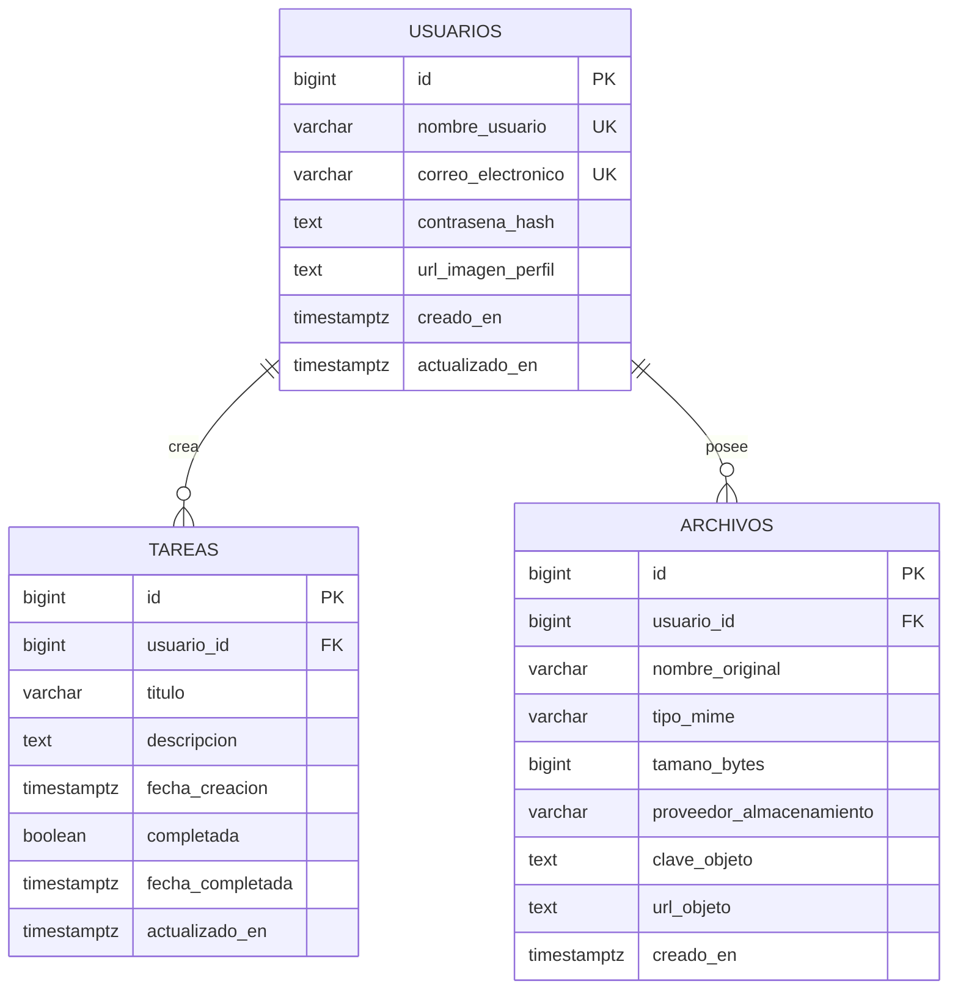

# Diagrama entidad-relación de TaskFlow + CloudDrive

El esquema separa la identidad, las tareas y los metadatos de archivos. Los
archivos binarios no se almacenan en RDS: `archivos.url_objeto` y
`archivos.clave_objeto` apuntan al objeto alojado en S3 o Blob Storage.

## Reglas principales

- Cada usuario tiene un `nombre_usuario` y un `correo_electronico` únicos.
- Cada tarea y archivo pertenece a exactamente un usuario.
- El borrado de un usuario elimina sus tareas y metadatos mediante
  `ON DELETE CASCADE`.
- `contrasena_hash` solo contiene un hash generado por el backend con bcrypt o
  Argon2; no se acepta texto plano.
- `proveedor_almacenamiento` distingue `S3` de `BLOB` y la URL debe ser HTTPS.
- Los binarios se cargan mediante los flujos serverless de cada proveedor.
