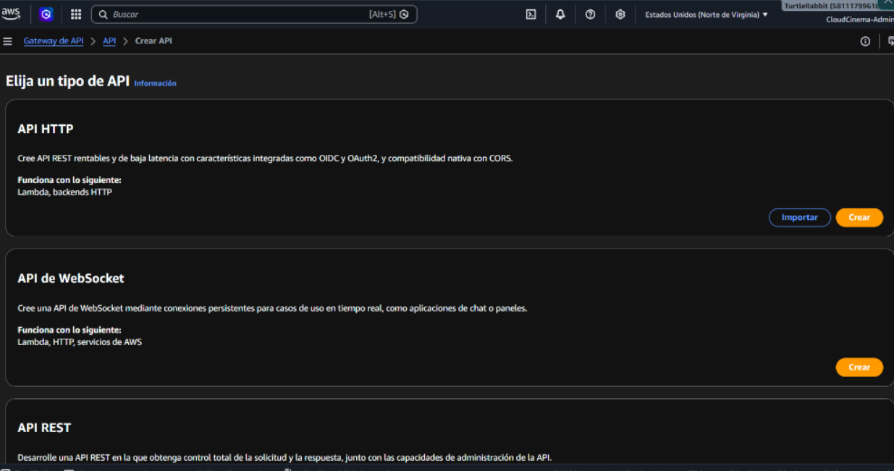
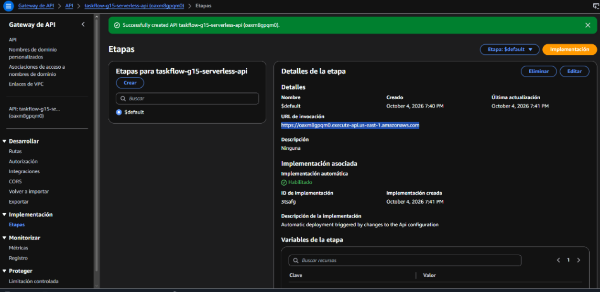
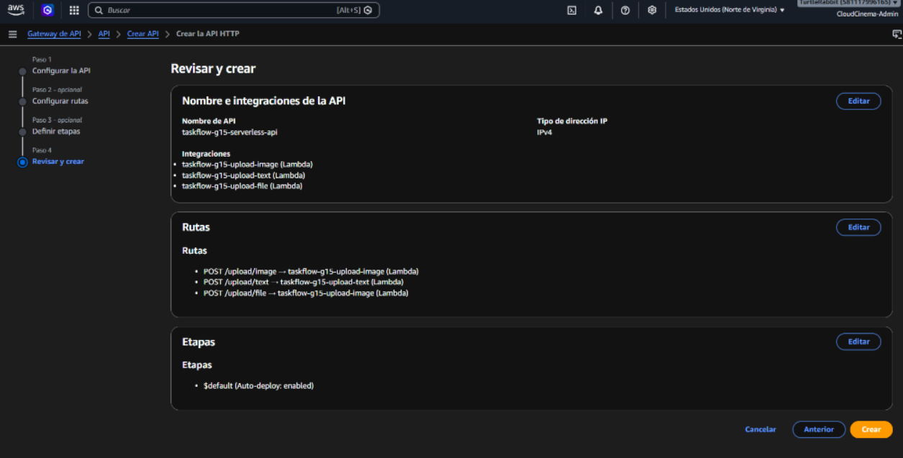
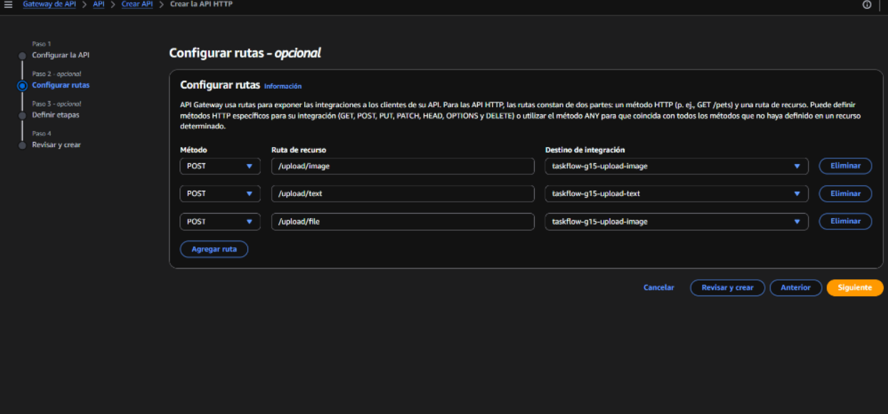
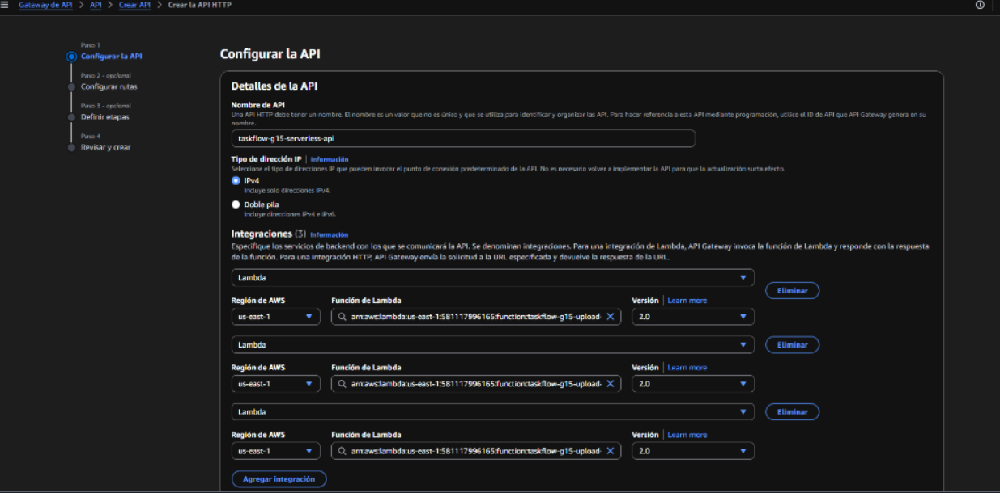
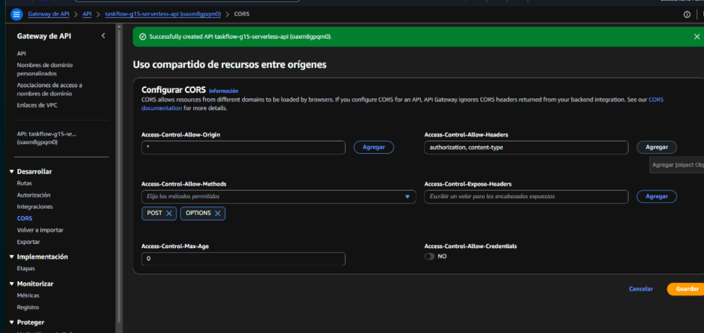

# Reporte de Configuración y Evidencias — Amazon API Gateway

**Componente:** Amazon API Gateway HTTP API (`taskflow-g15-serverless-api`)  
**ID de API:** `oaxm8gpqm0`  
**URL Base de Invocación:** `https://oaxm8gpqm0.execute-api.us-east-1.amazonaws.com`  

---

## 1. Descripción General del Componente

Amazon API Gateway actúa como el punto de entrada único (*Single Entry Point*) desacoplado para todas las peticiones de carga de archivos procedentes del cliente Web estático o herramientas de desarrollo hacia las funciones serverless de AWS Lambda.

Permite direccionar el tráfico mediante el protocolo HTTP API (v2) de AWS, gestionando la resolución de rutas, la integración transparente con AWS Lambda mediante el formato de carga útil 2.0 y el manejo unificado de políticas CORS (*Cross-Origin Resource Sharing*).

---

## 2. Explicación Técnica de la Configuración y Funcionamiento

1. **Creación de la API HTTP:**
   Se configuró una API de tipo **HTTP API** para minimizar la latencia y los costos de invocación. La etapa (*Stage*) predeterminada `$default` se habilitó con despliegue automático (*Auto-deploy*), lo que garantiza que cualquier cambio en las rutas o integraciones se aplique en tiempo real.

2. **Enrutamiento HTTP:**
   Se definieron 3 rutas principales mapeadas a los métodos `POST`:
   - `POST /upload/image`: Enruta hacia la Lambda de imágenes (`lambda-image-upload`).
   - `POST /upload/text`: Enruta hacia la Lambda de texto (`lambda-text-upload`).
   - `POST /upload/file`: Enruta hacia la Lambda de archivos generales (`lambda-file-upload`).

3. **Integración con AWS Lambda:**
   Cada ruta utiliza el tipo de integración **AWS Lambda Proxy Integration**, enviando la petición completa en formato JSON (incluyendo headers, query params, cuerpo y contexto de solicitud `isBase64Encoded`) hacia la función correspondiente.

4. **Gestión de CORS (Cross-Origin Resource Sharing):**
   Se configuró la política global de CORS a nivel de API Gateway para responder automáticamente a las peticiones preliminares de comprobación (*Preflight `OPTIONS` requests*) generadas por los navegadores web cuando la aplicación estática se consume desde un dominio externo:
   - `Access-Control-Allow-Origin`: `*`
   - `Access-Control-Allow-Methods`: `POST, OPTIONS`
   - `Access-Control-Allow-Headers`: `Content-Type, Authorization, X-Requested-With`

---

## 3. Evidencias de Configuración en Consola AWS

### 3.1 Inicio e Identificación de API Gateway
Pantalla principal de inicio del servicio API Gateway en AWS Console mostrando la API HTTP creada para la práctica.

---

### 3.2 Detalles de la API y Etapa de Despliegue
Detalle de la API `taskflow-g15-serverless-api` (ID `oaxm8gpqm0`), mostrando la URL de invocación `https://oaxm8gpqm0.execute-api.us-east-1.amazonaws.com` y la etapa `$default` configurada con despliegue automático habilitado.

---

### 3.3 Configuración General de la API
Visualización del panel de configuración de la API HTTP, verificando el nombre, ID y protocolo HTTP de la solución serverless.

---

### 3.4 Matriz de Rutas Creadas
Listado y jerarquía de rutas HTTP registradas (`POST /upload/image`, `POST /upload/text` y `POST /upload/file`) asociadas al endpoint serverless.

---

### 3.5 Integraciones con Funciones AWS Lambda
Configuración de las integraciones proxy hacia los handlers de Lambda Node.js para procesar la carga binaria y registrar los binarios en S3.

---

### 3.6 Configuración de Políticas CORS
Panel de configuración CORS en API Gateway especificando los orígenes permitidos `*`, métodos `POST, OPTIONS` y cabeceras autorizadas `Content-Type, Authorization`.

