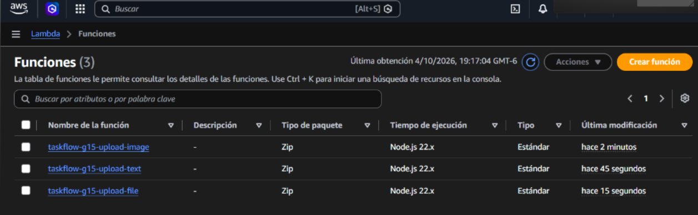
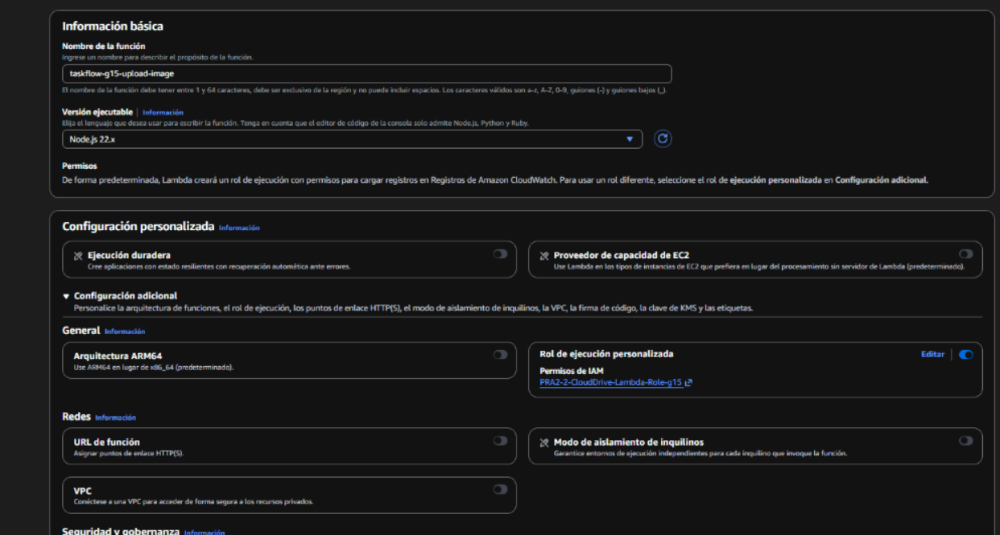
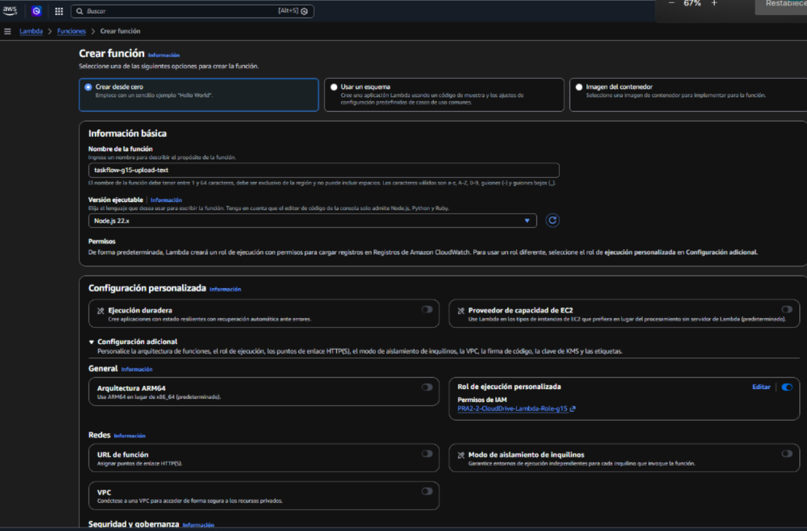
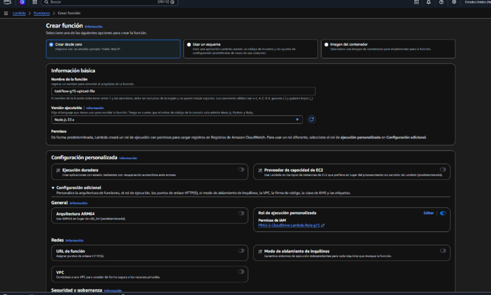
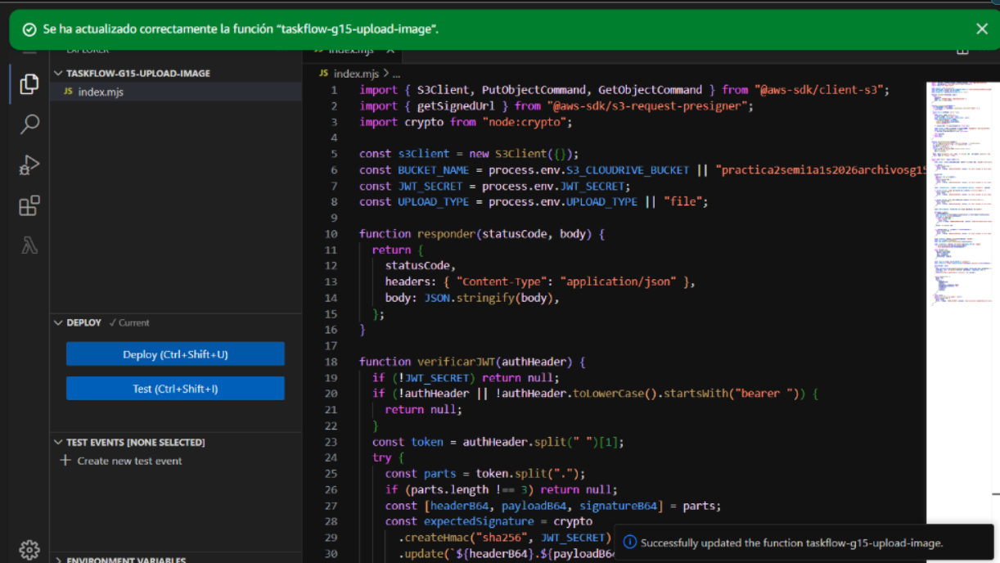
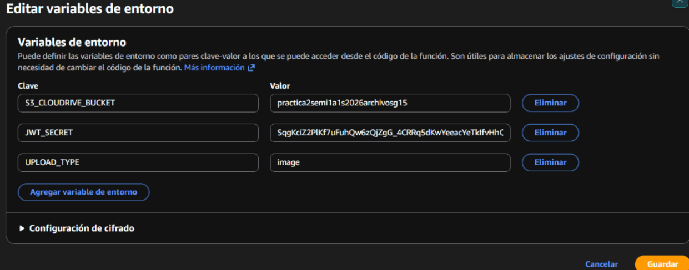

# Reporte de Configuración y Evidencias — Funciones AWS Lambda (Serverless)

**Componente:** Funciones Serverless AWS Lambda (Node.js)  
**Bucket Asociado:** `practica2semi1a1s2026archivosg15`  
**Región AWS:** `us-east-1`  

---

## 1. Descripción General del Componente

Las funciones AWS Lambda representan la capa serverless encargada del procesamiento, decodificación Base64, sanitización de nombres de archivo y almacenamiento directo de objetos binarios en Amazon S3.

Esta arquitectura desacopla el backend principal de la carga pesada de archivos, permitiendo escalar automáticamente ante múltiples solicitudes simultáneas sin saturar los recursos de las máquinas virtuales.

---

## 2. Explicación Técnica del Código y Funcionamiento

1. **Estructura de las Funciones Lambda:**
   - **`lambda-image-upload` (`taskflow-g15-upload-image`):** Procesa imágenes JPEG, PNG, GIF y WebP. Si `destino: "perfil"`, permite la subida pública previa al registro y guarda en `profiles/pendientes/`. Si es para CloudDrive (`"archivo"`), exige token JWT y guarda en `files/{userId}/`.
   - **`lambda-text-upload` (`taskflow-g15-upload-text`):** Procesa archivos de texto plano (`.txt`, `.md`, `.csv`) con límite de 1 MiB. Exige token JWT y guarda en `files/{userId}/`.
   - **`lambda-file-upload` (`taskflow-g15-upload-file`):** Procesa cualquier tipo de archivo binario o documento general (PDFs, ZIPs, Word) con límite de 3 MiB. Exige token JWT y guarda en `files/{userId}/`.

2. **Decodificación y Limpieza de Payloads:**
   - Detecta automáticamente si la petición de API Gateway llega codificada en Base64 (`event.isBase64Encoded`).
   - Remueve los prefijos `data:...;base64,` introducidos habitualmente por los navegadores web en FileReader.
   - Aplica la normalización Unicode **NFKD** para eliminar acentos y caracteres especiales del nombre original (`nombreSeguro`).

3. **Autenticación Multi-usuario con JWT:**
   - Verifica la firma HMAC-SHA256 (`HS256`) de la cabecera `Authorization: Bearer <TOKEN>` usando la clave compartida `JWT_SECRET`.
   - Extrae dinámicamente el identificador de usuario (`sub`) del payload del token para crear la ruta privada `files/{userId}/{uuid}-{nombreSeguro}`.

4. **Soporte Híbrido de SDK y Respuestas CORS:**
   - Implementa soporte dual para el SDK de AWS v3 (`@aws-sdk/client-s3`) y v2 (`aws-sdk`), previniendo errores de inicialización `Runtime.Unknown`.
   - Incluye las cabeceras `Access-Control-Allow-Origin: *` y responde a peticiones `OPTIONS` de preflight.

---

## 3. Evidencias de Configuración en AWS Console

### 3.1 Lista de Funciones Lambda Desplegadas
Panel principal de AWS Lambda mostrando el listado de funciones serverless configuradas para la solución de TaskFlow + CloudDrive.

---

### 3.2 Función de Carga de Imágenes (`taskflow-g15-upload-image`)
Detalle de la función Lambda configurada para recibir y procesar las imágenes de perfil e imágenes del CloudDrive.

---

### 3.3 Función de Carga de Texto (`taskflow-g15-upload-text`)
Detalle de la función Lambda encargada de la recepción y sanitización de documentos de texto plano.

---

### 3.4 Función de Carga de Archivos Generales (`taskflow-g15-upload-file`)
Detalle de la función Lambda configurada para la carga de documentos PDF y archivos binarios pesados.

---

### 3.5 Editor de Código y Handlers Node.js
Vista del editor de código en AWS Lambda mostrando la estructura del handler `index.js` y la lógica de decodificación.

---

### 3.6 Variables de Entorno de las Funciones
Configuración de las variables de entorno (`BUCKET_NAME` y `JWT_SECRET`) asignadas a las funciones Lambda.

