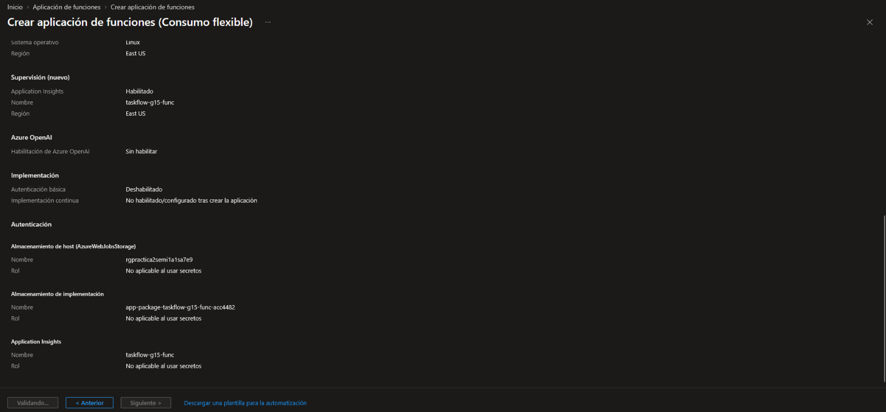
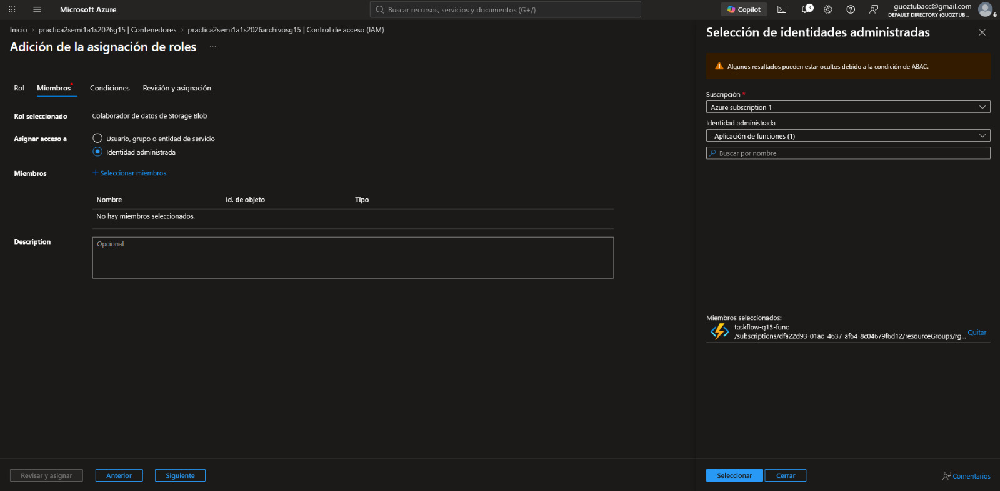
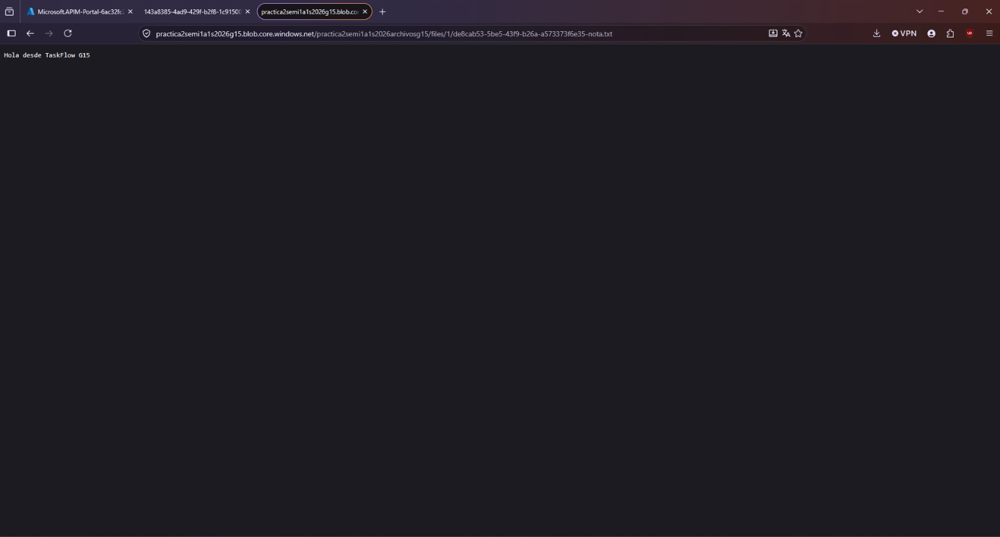
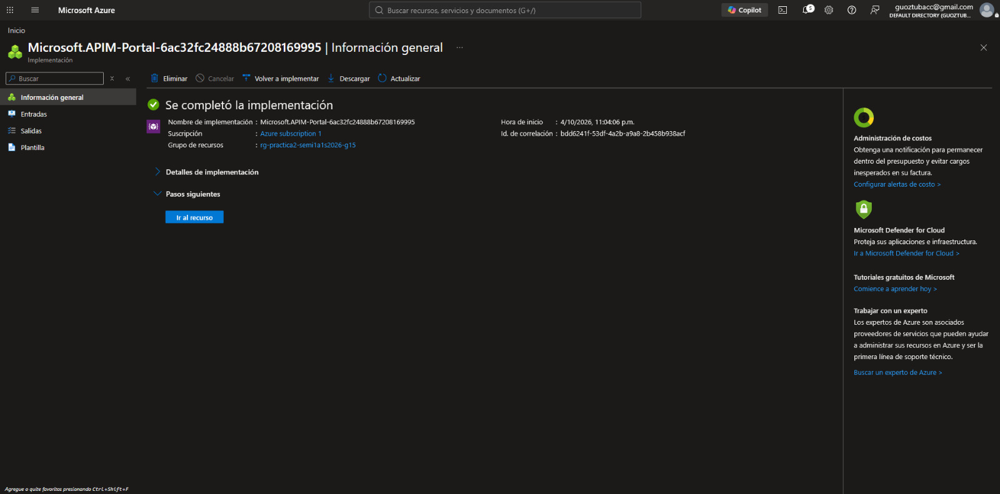
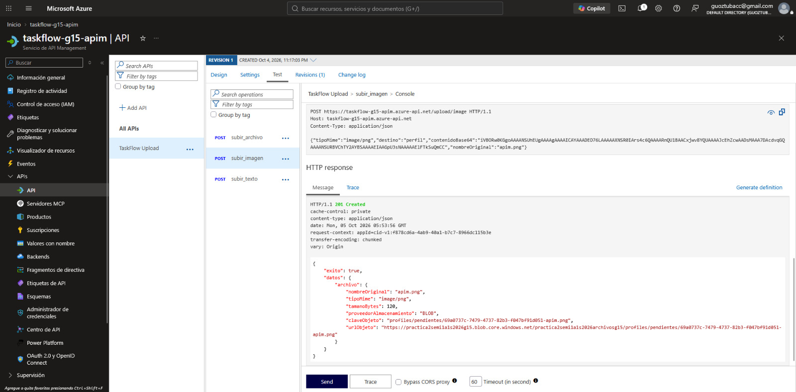
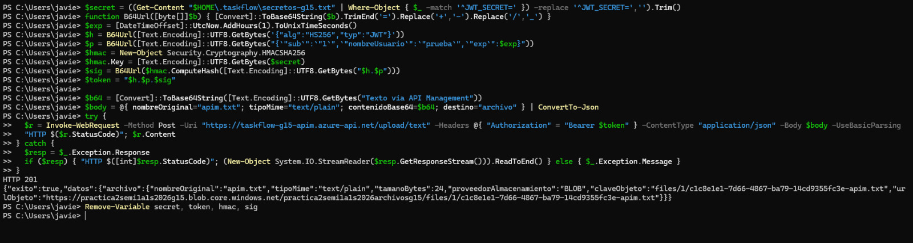
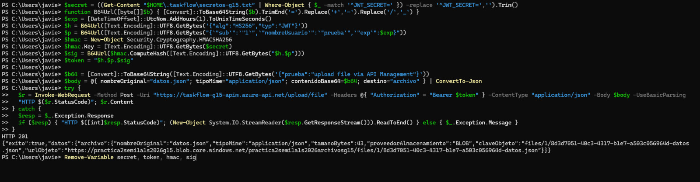
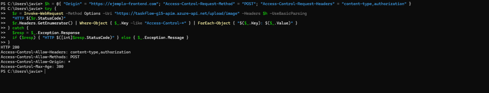
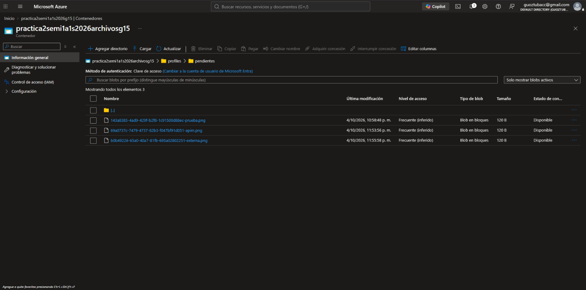

# Evidencias — PRA2-14 Azure Functions y API Management

**Proyecto:** TaskFlow + CloudDrive · Práctica 2 · Grupo 15  
**Responsable:** Javier Velásquez  
**Componente:** Carga serverless a Blob Storage: Function App `taskflow-g15-func` y API Management `taskflow-g15-apim` (API `TaskFlow Upload`)  
**Grupo de recursos:** `rg-practica2-semi1a1s2026-g15`  
**Región Azure:** East US  
**URL base de carga:** `https://taskflow-g15-apim.azure-api.net`  
**Actualizado:** 6 de octubre de 2026

Las capturas están en [`images/`](images/). La visión general de la vertical
está en
[`pra2-15-vertical-python-azure.md`](../../pra2-15-vertical-python-azure.md).
Las claves de función, las claves de suscripción, el `JWT_SECRET` y los tokens
no forman parte de este documento.

---

## 1. Alcance

Tres funciones HTTP en Python que suben imágenes, texto y archivos genéricos a
Blob Storage, idénticas al
[contrato serverless](../../contrato-serverless.md) que comparten con las
Lambdas de AWS, publicadas detrás de API Management. Las funciones no escriben
en RDS: devuelven el objeto y el frontend registra sus metadatos con
`POST /api/v1/files` en el backend.

```text
Frontend (perfil Azure) ─HTTPS─> APIM taskflow-g15-apim · API TaskFlow Upload (/upload/*)
                                   │ inyecta x-functions-key
                                   └─> Function App taskflow-g15-func
                                         subir_imagen · subir_texto · subir_archivo
                                         │ identidad administrada · Storage Blob Data Contributor
                                         └─> Blob practica2semi1a1s2026g15 / practica2semi1a1s2026archivosg15
Navegador ─lectura pública por urlObjeto─> Blob
```

## 2. Diseño de las funciones

| Elemento | Valor |
|---|---|
| Modelo | Azure Functions para Python, modelo v2, runtime v4 |
| Enrutamiento | [`function_app.py`](../../../azure/functions/function_app.py) solo enruta; `routePrefix` vacío en [`host.json`](../../../azure/functions/host.json), así que las rutas no llevan `/api` |
| Autorización | `authLevel=function`: sin la clave de función no se puede invocar; API Management la inyecta |
| Lógica | Paquete [`carga/`](../../../azure/functions/carga/): `servicio` (orden de validación), `validaciones`, `seguridad` (JWT igual que el backend), `nombres`, `almacenamiento`, `respuestas`, `mensajes` y `configuracion` |
| Credencial | `DefaultAzureCredential` con la identidad administrada; sin connection strings ni claves de cuenta |
| Subida | `upload_blob(..., overwrite=False)`; la URL se toma del SDK después de confirmar la subida |
| Pruebas | 347 pruebas con `pytest`, sin red ni Azure ([README](../../../azure/functions/README.md)) |

| Ruta | Función | Tipos admitidos | Límite | Token |
|---|---|---|---|---|
| `POST /upload/image` | `subir_imagen` | JPEG, PNG, GIF y WebP, comprobados por firma | 3 MiB | No con `destino: "perfil"`; sí en otro caso |
| `POST /upload/text` | `subir_texto` | `text/plain`, `text/markdown`, `text/csv` en UTF-8 estricto | 1 MiB | Sí |
| `POST /upload/file` | `subir_archivo` | Cualquier tipo salvo los bloqueados (ejecutables, HTML, SVG y scripts) | 3 MiB | Sí |

| Validación | Regla |
|---|---|
| Orden | Token (401) → estructura (400) → contenido (400) → subida (500 si falla, sin URL) → 201 ([contrato §6](../../contrato-serverless.md#6-orden-de-validación-determinista)) |
| Cuerpo | JSON con `nombreOriginal`, `tipoMime`, `contenidoBase64` y `destino` opcional; sin multipart ni campos extra |
| Clave del objeto | `profiles/pendientes/{uuid}-{nombre-seguro}` para el perfil y `files/{userId}/{uuid}-{nombre-seguro}` para lo demás |
| Errores | Mismo sobre y catálogo que el backend ([contrato §8](../../contrato-serverless.md#8-errores)) |

## 3. Function App

| Parámetro | Valor |
|---|---|
| Nombre | `taskflow-g15-func` |
| Grupo de recursos y región | `rg-practica2-semi1a1s2026-g15`, East US |
| Plan | Consumo flexible, Linux, instancias de 2048 MB, sin redundancia de zona |
| Pila | Python 3.11 |
| Almacenamiento interno | Cuenta propia del host, distinta de la cuenta de archivos |
| Supervisión | Application Insights `taskflow-g15-func` |
| Autenticación básica de publicación | Deshabilitada |
| Despliegue | Extensión de Azure Functions de VS Code; `.funcignore` excluye pruebas, `.venv` y la configuración local |
| Variables de aplicación (solo nombres) | `AZURE_STORAGE_BLOB_ENDPOINT`, `AZURE_STORAGE_CONTAINER_NAME`, `JWT_SECRET` |

## 4. Identidad y acceso a Blob

| Elemento | Valor |
|---|---|
| Identidad | Administrada, asignada por el sistema |
| Rol | `Storage Blob Data Contributor` (Colaborador de datos de Storage Blob) |
| Alcance | Solo el contenedor `practica2semi1a1s2026archivosg15`: más estrecho que la Storage Account que propone el [handoff](../../azure-functions-handoff.md) |
| Lectura | Pública a nivel Blob (PRA2-3): se lee un objeto conociendo su URL, sin poder listar el contenedor |
| Escritura anónima | No permitida: solo la identidad de la Function App escribe |

## 5. API Management

La instancia publica dos API distintas. Este reporte cubre `TaskFlow Upload`;
`TaskFlow Backend` pertenece a PRA2-19.

| | `TaskFlow Upload` (PRA2-14) | `TaskFlow Backend` (PRA2-19) |
|---|---|---|
| Sufijo | Vacío: `/upload/image`, `/upload/text`, `/upload/file` | `/backend` |
| Destino | Function App `taskflow-g15-func` | Azure Load Balancer `taskflow-g15-lb-azure` → VM Node.js y VM Python |
| Orígenes CORS | `*` | Sitio de Azure y sitio de S3 del frontend |
| Caché de la comprobación previa | `300` s | `600` s |
| Política versionada | [`cors-policy.xml`](../../../azure/apim/cors-policy.xml) | [`backend-policy.xml`](../../../azure/apim/backend-policy.xml) |
| Documentación | Este reporte | [Informe de balanceadores §3.2](../load-balancers/report.md) |

### 5.1 `TaskFlow Upload`

| Parámetro | Valor |
|---|---|
| Instancia | `taskflow-g15-apim`, nivel Consumo, East US |
| API | `TaskFlow Upload` (`taskflow-upload`), creada desde la Function App |
| Operaciones | `POST /upload/image`, `POST /upload/text`, `POST /upload/file` |
| Suscripción | No requerida: el frontend llama sin clave y API Management agrega la clave de la función |

Al principio la API exigía suscripción, y una llamada sin clave respondió
`401` desde API Management. Se desmarcó la suscripción obligatoria porque el
frontend es público y no puede guardar secretos; la misma llamada respondió
entonces `201`. La función sigue protegida por su clave, que solo conoce API
Management.

### 5.2 Política CORS de `TaskFlow Upload`

Aplicada en *Todas las operaciones* → *Procesamiento de entrada*
([instrucciones](../../../azure/apim/README.md)). Las funciones no emiten
cabeceras CORS ([contrato §10](../../contrato-serverless.md#10-capa-de-api-cors-rutas-y-límites)).

| Aspecto | Valor |
|---|---|
| Orígenes | `*` |
| Métodos | `POST`, `OPTIONS` |
| Encabezados | `Content-Type`, `Authorization` |
| Caché de la comprobación previa | `300` s |
| Credenciales | No (el token viaja en `Authorization`, no en cookies) |

## 6. Uso desde el frontend

Con el perfil Azure, el frontend usa `https://taskflow-g15-apim.azure-api.net`
como base de carga (`TaskFlow Upload`) y
`https://taskflow-g15-apim.azure-api.net/backend` como base de la API
(configuración pública en
[`hosting-config.mjs`](../../../frontend/scripts/hosting-config.mjs)). Con el
perfil AWS, las mismas rutas `/upload/*` van a API Gateway y a las Lambdas.

| Flujo | Llamada a `TaskFlow Upload` | Siguiente paso |
|---|---|---|
| Registro con imagen de perfil | `POST /upload/image` sin token, `destino: "perfil"` → objeto en `profiles/pendientes/` | `urlObjeto` se envía como `urlImagenPerfil` en `POST /api/v1/auth/register` |
| Archivo de CloudDrive | `POST /upload/image`, `/upload/text` o `/upload/file` con `Authorization: Bearer` → objeto en `files/{userId}/` | `datos.archivo` se registra con `POST /api/v1/files` |

El listado de CloudDrive desde el sitio de Azure está en el
[informe de balanceadores §4.1](../load-balancers/report.md).

---

## 7. Evidencia

### 7.1 Revisión de la Function App



**Qué demuestra:** plan Consumo flexible, Linux, East US, Application Insights
habilitado y autenticación básica deshabilitada.

---

### 7.2 Funciones desplegadas


**Qué demuestra:** `taskflow-g15-func` está en ejecución (Linux, Consumo
flexible, 2048 MB) con las tres funciones HTTP habilitadas: `subir_archivo`,
`subir_imagen` y `subir_texto`.

---

### 7.3 Asignación del rol



**Qué demuestra:** en el control de acceso del contenedor
`practica2semi1a1s2026archivosg15` se asigna "Colaborador de datos de Storage
Blob" a la identidad administrada de `taskflow-g15-func`.

---

### 7.4 Prueba directa de la función


**Qué demuestra:** antes de configurar API Management, `/upload/image` con
`destino: "perfil"` responde `201` con `proveedorAlmacenamiento: "BLOB"`. La
clave de función se ingresa de forma oculta.

---

### 7.5 Lectura pública de la imagen


**Qué demuestra:** el objeto de `profiles/pendientes/` se abre en el navegador
por su URL de Blob.

---

### 7.6 Lectura pública de un texto



**Qué demuestra:** un objeto de texto de `files/1/` se abre por su URL de Blob
y muestra su contenido.

---

### 7.7 Implementación de API Management



**Qué demuestra:** la instancia `taskflow-g15-apim` se implementó en
`rg-practica2-semi1a1s2026-g15`.

---

### 7.8 API creada desde la Function App


**Qué demuestra:** el asistente *Create from Function App* sobre
`taskflow-g15-func` con la base `https://taskflow-g15-apim.azure-api.net`. El
sufijo propuesto se dejó vacío en la API final, por eso las rutas son
`/upload/...`.

---

### 7.9 Importación de las funciones


**Qué demuestra:** `subir_archivo`, `subir_imagen` y `subir_texto` se importan
como operaciones `POST`.

---

### 7.10 Prueba en el portal de API Management



**Qué demuestra:** la consola de prueba de `TaskFlow Upload` envía
`POST /upload/image` con `destino: "perfil"` y recibe `201 Created` con la
clave `profiles/pendientes/69a0737c-7479-4737-82b3-f047bf91d051-apim.png`.

---

### 7.11 Llamada externa sin clave


**Qué demuestra:** desde PowerShell, `POST /upload/image` a API Management,
sin clave de suscripción ni token, responde `201` con un objeto en
`profiles/pendientes/`: el frontend no necesita ningún secreto.

---

### 7.12 Texto con token



**Qué demuestra:** `POST /upload/text` con `Authorization: Bearer` responde
`201`. El token se firma localmente y no se imprime.

---

### 7.13 Archivo genérico con token



**Qué demuestra:** `POST /upload/file` con un JSON responde `201` con
`tipoMime: "application/json"`.

---

### 7.14 Comprobación previa de CORS



**Qué demuestra:** `OPTIONS /upload/image` con un origen externo responde
`200` con los encabezados de la política de `TaskFlow Upload`.

---

### 7.15 Objetos en el contenedor



**Qué demuestra:** `profiles/pendientes/` contiene las tres imágenes de prueba
de 120 B: la directa, la del portal y la externa.

---

## 8. Validaciones

### 8.1 Cargas por API Management (5 de octubre de 2026)

Base `https://taskflow-g15-apim.azure-api.net`, sin clave de suscripción. En
las tres respuestas, `proveedorAlmacenamiento` es `BLOB` y `urlObjeto` es
`https://practica2semi1a1s2026g15.blob.core.windows.net/practica2semi1a1s2026archivosg15/`
seguido de `claveObjeto`.

| Petición | Autenticación | HTTP | `tipoMime` | `tamanoBytes` | `claveObjeto` |
|---|---|---|---|---|---|
| `POST /upload/image` con `destino: "perfil"` | Sin token | `201` | `image/png` | `120` | `profiles/pendientes/69a0737c-7479-4737-82b3-f047bf91d051-apim.png` |
| `POST /upload/text` | Token Bearer | `201` | — | `24` | `files/1/c1c8e1e1-7d66-4867-ba79-14cd9355fc3e-apim.txt` |
| `POST /upload/file` | Token Bearer | `201` | `application/json` | `43` | `files/1/8d3d7051-40c3-4317-b1e7-a503c056964d-datos.json` |

### 8.2 Comprobación previa de CORS y suscripción

```text
OPTIONS /upload/image  ->  HTTP 200
Access-Control-Allow-Origin: *
Access-Control-Allow-Methods: POST
Access-Control-Allow-Headers: content-type,authorization
Access-Control-Max-Age: 300
```

| Llamada sin clave de suscripción | Resultado |
|---|---|
| Con la suscripción obligatoria | `401` de API Management |
| Tras desmarcar la suscripción obligatoria | `201` |

### 8.3 Resumen

| Validación | Resultado | Evidencia |
|---|---|---|
| Las tres rutas funcionan por API Management | `201` en `/upload/image`, `/upload/text` y `/upload/file` | [7.10](#710-prueba-en-el-portal-de-api-management) a [7.13](#713-archivo-genérico-con-token) y 8.1 |
| El perfil se sube sin token | `201` con clave `profiles/pendientes/...` | [7.11](#711-llamada-externa-sin-clave) |
| El frontend no necesita clave | `201` sin clave de suscripción (antes, `401`) | 8.2 |
| Los objetos son legibles por URL | Abiertos en el navegador | [7.5](#75-lectura-pública-de-la-imagen) y [7.6](#76-lectura-pública-de-un-texto) |
| CORS en la capa de API | `OPTIONS` → `200` con los cuatro encabezados | [7.14](#714-comprobación-previa-de-cors) y 8.2 |
| Escritura con identidad, no con claves | Rol sobre el contenedor; sin connection strings | [7.3](#73-asignación-del-rol) |

## 9. Artefactos versionados

| Artefacto | Uso |
|---|---|
| [`azure/functions/`](../../../azure/functions/README.md) | Código, pruebas y README de las funciones |
| [`azure/functions/local.settings.json.example`](../../../azure/functions/local.settings.json.example) | Configuración local de ejemplo, sin valores reales |
| [`azure/apim/cors-policy.xml`](../../../azure/apim/cors-policy.xml) | Política CORS de `TaskFlow Upload` |
| [`azure/apim/README.md`](../../../azure/apim/README.md) | Dónde se aplica cada política y cómo cambiarla |
| [`docs/contrato-serverless.md`](../../contrato-serverless.md) | Contrato común Lambda / Azure Function |
| [`docs/azure-functions-handoff.md`](../../azure-functions-handoff.md) | Procedimiento de asignación del rol |

## 10. Decisiones y limitaciones

| Decisión | Motivo |
|---|---|
| Functions en Python, idénticas al contrato de las Lambdas | El frontend usa el mismo cuerpo y las mismas respuestas en las dos nubes |
| Rol de Blob acotado al contenedor | Mínimo privilegio: la Function App no puede tocar otros contenedores |
| Identidad administrada | Ningún secreto de almacenamiento en la configuración |
| Suscripción de API Management no requerida | El frontend es público; la función queda protegida por su clave, que inyecta API Management |
| CORS en API Management y no en la Function App | Lo exige el contrato §10, igual que en API Gateway |

| Limitación vigente | Impacto |
|---|---|
| CORS de `TaskFlow Upload` con origen `*` | Cualquier origen puede llamar a las rutas de carga desde un navegador; `TaskFlow Backend` sí está limitado a los dos sitios del frontend |
| Caché de la comprobación previa de `300` s | El contrato §10 fija `600` s; el navegador repite la comprobación previa con más frecuencia |
| Sin política de 404 en `TaskFlow Upload` | Una ruta o método inexistente devuelve la respuesta propia de API Management, no el sobre `NO_ENCONTRADO` del contrato §10 |
| Imágenes de perfil huérfanas | Si el registro no se completa, el objeto de `profiles/pendientes/` queda sin usuario asociado |
