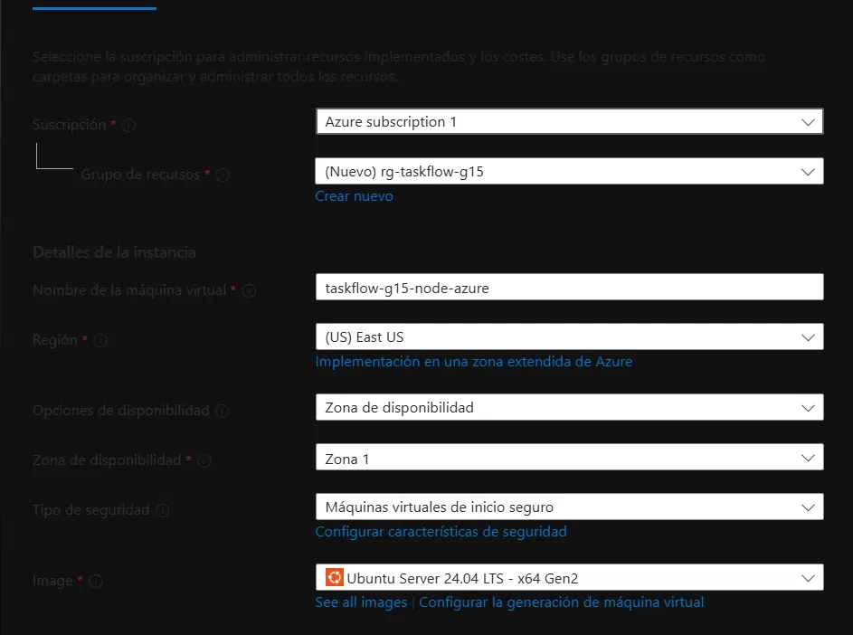
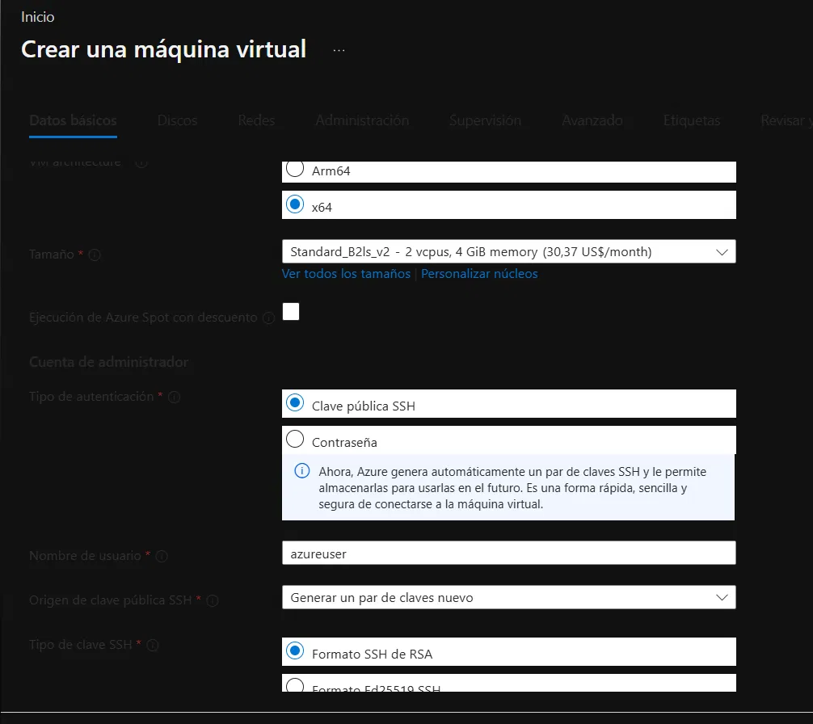
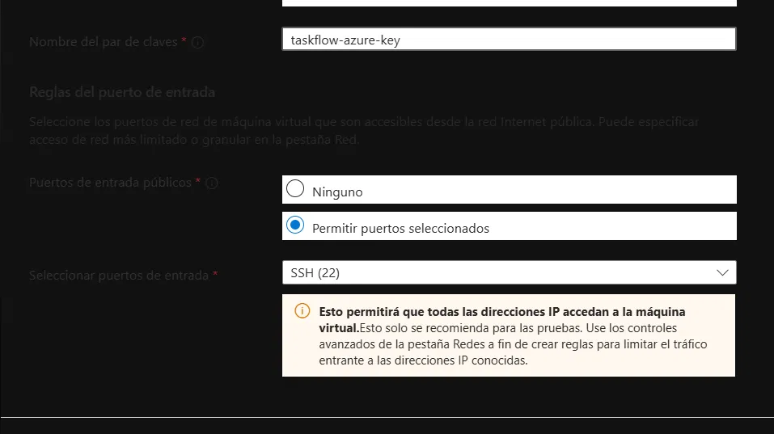
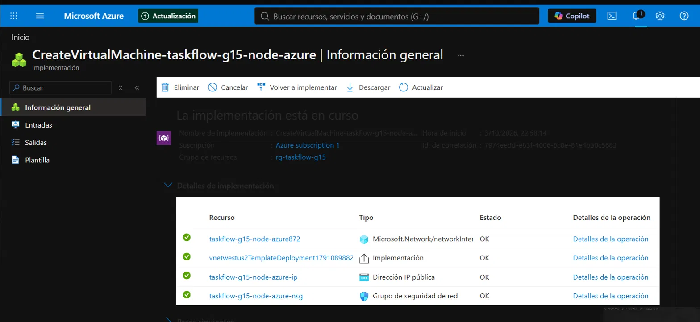
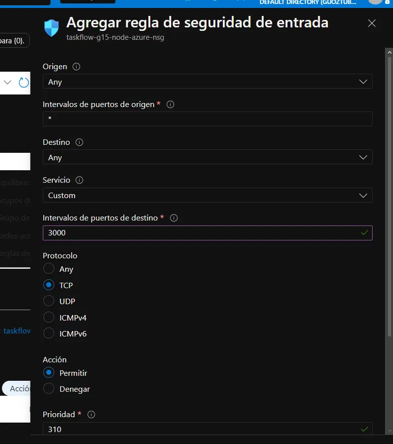
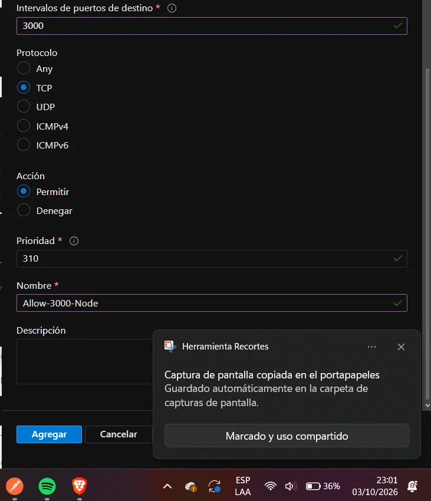

# Reporte de Configuración y Evidencias — Azure Virtual Machine Backend Node.js

**Componente:** Máquina Virtual Azure Backend Node.js (`taskflow-g15-node-azure`)  
**Grupo de Recursos:** `rg-taskflow-g15`  
**Región Azure:** West US 2  
**IP Pública Estática:** `20.59.57.131`  
**IP Privada:** `172.16.0.4`  

---

## 1. Descripción General del Componente

La Máquina Virtual en Microsoft Azure (`taskflow-g15-node-azure`) despliega la réplica del backend Node.js (NestJS) para garantizar la arquitectura **Multi-Cloud** exigida por el proyecto.

Permite atender peticiones desde la infraestructura de Azure, conectándose de forma remota a la base de datos Amazon RDS PostgreSQL y manteniendo total paridad de endpoints, formato de errores y respuestas JWT con la instancia EC2 de AWS.

---

## 2. Explicación Técnica de la Configuración y Funcionamiento

1. **Aprovisionamiento de la Máquina Virtual:**
   - Nombre de VM: `taskflow-g15-node-azure`
   - Tamaño / Familia: `Standard_D2als_v7` (AMD x64, 2 vCPU, 4 GiB RAM).
   - Sistema Operativo: Ubuntu Server 24.04 LTS.
   - Red Virtual (VNet): `vnet-westus2-1` / Subred `snet-westus2-1` (`172.16.0.0/24`), compartida con la VM de Python para la posterior integración con Azure Load Balancer.

2. **Network Security Group (NSG) y Reglas de Entrada:**
   - **Regla `SSH`:** Puerto TCP `22` autorizado para administración remota por clave SSH.
   - **Regla `Allow-3000-Node`:** Puerto TCP `3000` autorizado desde `0.0.0.0/0` para permitir el consumo de la API de Node.js.

3. **Conexión Cifrada a Amazon RDS:**
   - La VM se conecta al endpoint de PostgreSQL en Amazon RDS (`taskflow-g15.cmpaiquocfxf.us-east-1.rds.amazonaws.com`) utilizando la IP pública de la VM autorizada en el Security Group de RDS.
   - La comunicación incluye SSL/TLS para resguardar las credenciales e información de los usuarios en tránsito.

4. **Despliegue y Ejecución con PM2:**
   - Se clonó el repositorio, instalaron las dependencias y compiló el proyecto NestJS (`npm run build`).
   - El proceso se ejecuta de forma ininterrumpida administrado por PM2 (`taskflow-node`), monitoreado en tiempo real.

---

## 3. Evidencias de Configuración en Azure Portal

### 3.1 Información General de la Máquina Virtual
Panel de información general en Microsoft Azure Portal mostrando el estado `Running` (En ejecución), la suscripción, grupo de recursos `rg-taskflow-g15` y la IP pública `20.59.57.131`.

---

### 3.2 Configuración de Redes y Subred VNet
Detalle de la interfaz de red (NIC `taskflow-g15-node-azureVMNic`), mostrando la asociación a la Virtual Network `vnet-westus2-1` y subred `snet-westus2-1` con IP privada `172.16.0.4`.

---

### 3.3 Reglas del Network Security Group (NSG)
Panel de reglas de seguridad de red en Azure verificando los puertos de entrada habilitados (`22` SSH y `3000` HTTP Node.js API).

---

### 3.4 Configuración de IP Pública Estática
Panel de detalles de la IP pública en Azure confirmando la asignación de la dirección estática `20.59.57.131` en el grupo de recursos `rg-taskflow-g15`.

---

### 3.5 Discos y Tamaño de Instancia
Visualización de las propiedades de computación (`Standard_D2als_v7`) y el disco de sistema operativo Linux EBS/Managed Disk asociado.

---

### 3.6 Monitoreo y Métricas de Rendimiento
Métricas de rendimiento en tiempo real en Azure Portal mostrando el consumo de CPU, red y disponibilidad del servidor Node.js.

