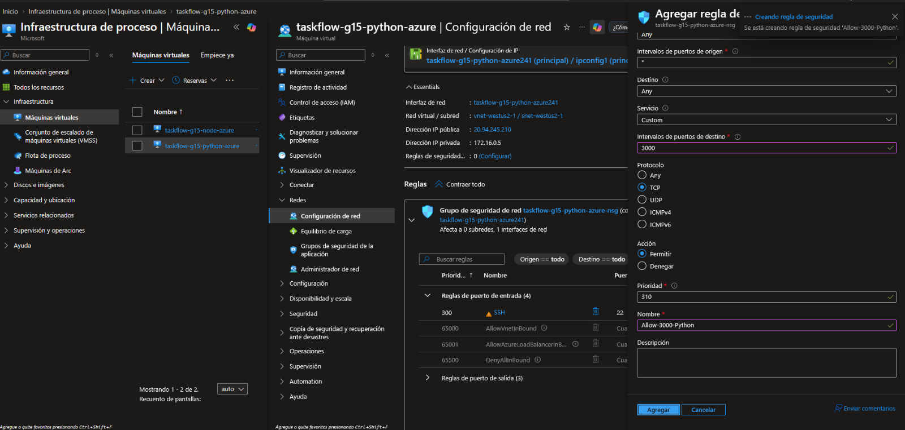
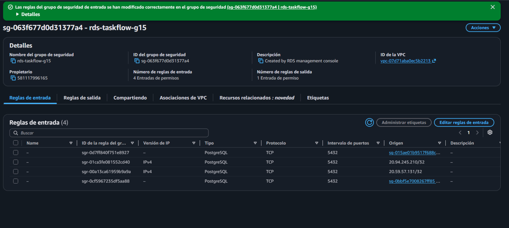

# Evidencias — PRA2-13 VM de Azure Python

**Proyecto:** TaskFlow + CloudDrive · Práctica 2 · Grupo 15  
**Responsable:** Javier Velásquez  
**Componente:** Backend Python (FastAPI) en una máquina virtual de Azure (`taskflow-g15-python-azure`)  
**Grupo de recursos:** `rg-taskflow-g15`  
**Región Azure:** West US 2  
**IP pública estática:** `20.94.245.210`  
**IP privada:** `172.16.0.5`  
**Actualizado:** 6 de octubre de 2026

Las capturas están en [`images/`](images/). La visión general de la vertical
Python está en
[`pra2-15-vertical-python-azure.md`](../../pra2-15-vertical-python-azure.md).
Las contraseñas, el `JWT_SECRET` y las llaves SSH no forman parte de este
documento.

---

## 1. Alcance

El mismo backend Python de la EC2, instalado con el mismo instalador y
conectado al mismo RDS de AWS. La VM es uno de los dos destinos del Azure Load
Balancer (PRA2-19), al que el frontend llega por API Management.

```text
Frontend (S3 o Azure) ─HTTPS─> APIM taskflow-g15-apim /backend ─HTTP─> Azure LB 172.193.203.197:3000
                                                                         │  pool taskflow-g15-api-pool
                                                                         ├─TCP 3000─> VM Node.js  172.16.0.4
                                                                         └─TCP 3000─> VM Python   172.16.0.5 (esta)
VM Python ─TCP 5432 · TLS verify-full─> RDS taskflow-g15 en AWS (regla por IP /32)
```

## 2. Configuración validada

| Parámetro | Valor |
|---|---|
| VM | `taskflow-g15-python-azure` |
| Grupo de recursos | `rg-taskflow-g15` |
| Región | West US 2, sin redundancia de infraestructura |
| Imagen | Ubuntu Server 24.04 LTS x64 Gen2 (24.04.4), Python 3.12.3 |
| Tipo de seguridad | Estándar |
| Tamaño | `Standard_D2als_v7`: AMD x64, 2 vCPU, 4 GiB |
| Red virtual / subred | `vnet-westus2-1` / `snet-westus2-1` |
| IP privada | `172.16.0.5` (destino del backend pool del Azure LB) |
| IP pública | `20.94.245.210`, SKU estándar, estática |
| NSG | `taskflow-g15-python-azure-nsg` |
| Administración | Usuario `azureuser` con clave SSH (la llave privada no se versiona) |
| Servicio | systemd `taskflow-python`; `/etc/taskflow/python.env` con `root:taskflow` y `640` |
| Puerto | `3000` |

## 3. Tamaño elegido

El tamaño previsto era `Standard_B2ls_v2`, pero la cuota de vCPU de la
familia Bsv2 estándar de la suscripción en West US 2 era **0** y el portal
marcó "Cuota insuficiente: límite de la familia". En lugar de esperar un
aumento de cuota se eligió una familia con cupo y sin restricciones en la
suscripción: `Standard_D2als_v7`, con 2 vCPU y 4 GiB, suficiente para la API.

## 4. Red y NSG

| Elemento | Decisión |
|---|---|
| Red virtual | La misma `vnet-westus2-1` / `snet-westus2-1` de la VM Node.js (`taskflow-g15-node-azure`, `172.16.0.4`), para que un único Azure Load Balancer reparta entre ambas. Por eso la VM está en West US 2 |
| NSG, prioridad 300 | SSH `22` |
| NSG, prioridad 310 | `Allow-3000-Python`: TCP `3000`, acción Permitir |
| IP pública estática | La regla del RDS depende de esta IP; al ser estática, no cambia con reinicios |

## 5. Conexión al RDS

Una VM de Azure no puede referenciar un security group de AWS, así que el
acceso se autoriza por IP. El RDS es accesible públicamente, pero solo admite
los orígenes autorizados por regla, nunca `0.0.0.0/0`.

| Elemento | Valor |
|---|---|
| Security group del RDS | `rds-taskflow-g15` (`sg-063f677d0d31377a4`) |
| Regla | PostgreSQL TCP `5432` desde `20.94.245.210/32`, descripción `taskflow-python-azure` |
| Cifrado | TLS `verify-full` con el bundle de RDS |
| Credenciales | Las mismas `taskflow_api` y `JWT_SECRET` que la EC2, escritas con `sudoedit` en el archivo de entorno |

## 6. Despliegue

1. Paquete del backend generado con `git archive` desde el repositorio.
2. Copia por `scp` del paquete y de
   [`instalar_ec2.sh`](../../../api-python/deploy/instalar_ec2.sh), el mismo
   instalador de la EC2.
3. Primera ejecución del instalador, archivo de entorno completado con
   `sudoedit` y segunda ejecución, que arranca el servicio y consulta
   `/health`.
4. Prueba de humo dentro de la VM y `/health` desde fuera.
5. 6 de octubre de 2026: `CORS_ORIGINS` actualizado en
   `/etc/taskflow/python.env` con `http://localhost:3000`,
   `http://practica2semi1a1s2026paginawebg15.s3-website-us-east-1.amazonaws.com`
   y `https://pra2semi1a1s2026webg15.z13.web.core.windows.net` (separados por
   comas, sin barra final) y reinicio de `taskflow-python`.

La secuencia completa por línea de comandos está en
[`deploy-azure-vm-python.sh`](../../../azure/vm-python/deploy-azure-vm-python.sh).

---

## 7. Evidencia

### 7.1 Cuota de la familia Bsv2


**Qué demuestra:** con el filtro `B2ls_v2`, el portal indica cuota
insuficiente: el uso de la familia Bsv2 estándar en West US 2 es "2 of 0". Es
el motivo del cambio de tamaño de la sección 3.

---

### 7.2 Datos básicos de la VM


**Qué demuestra:** imagen Ubuntu Server 24.04 LTS x64 Gen2, tamaño
`Standard_D2als_v7`, tipo de seguridad Estándar, autenticación por clave
pública SSH y usuario `azureuser`.

---

### 7.3 Implementación completada


**Qué demuestra:** la implementación
`CreateVirtualMachine-taskflow-g15-python-azure` terminó correctamente en
`rg-taskflow-g15`.

---

### 7.4 Red y regla del NSG



**Qué demuestra:** la VM usa `vnet-westus2-1` / `snet-westus2-1`, la IP
pública `20.94.245.210` y la IP privada `172.16.0.5`, junto a
`taskflow-g15-node-azure`; se agrega la regla `Allow-3000-Python` (TCP `3000`,
prioridad 310).

---

### 7.5 Reglas del RDS



**Qué demuestra:** `rds-taskflow-g15` tiene cuatro reglas TCP `5432`: los
security groups de las dos EC2 y las IP `/32` de las dos VM de Azure,
incluida `20.94.245.210/32`. No hay orígenes abiertos.

---

### 7.6 Instalación del servicio


**Qué demuestra:** el archivo de entorno tiene `root:taskflow 640`, el puerto
`5432` del RDS es alcanzable desde la VM y el instalador deja
`taskflow-python.service` activo con `GET /health` en `200`.

---

### 7.7 Prueba de humo y `/health`


**Qué demuestra:** `smoke_test.py` dentro de la VM termina con 20/20 OK y 0
FALLO contra el RDS real, y `GET /health` desde fuera responde `200` con
`implementacion: "python"`.

---

## 8. Validaciones

### 8.1 `GET /health`

```text
HTTP/1.1 200 OK
content-type: application/json

{"exito":true,"datos":{"estado":"ok","servicio":"taskflow-api","implementacion":"python"}}
```

Verificado el 5 de octubre de 2026 y de nuevo el 6 de octubre de 2026, tras
reiniciar el servicio con los nuevos `CORS_ORIGINS`.

### 8.2 Prueba de humo

[`smoke_test.py`](../../../api-python/scripts/smoke_test.py) dentro de la VM,
contra el RDS real (5 de octubre de 2026): **20/20 OK, 0 FALLO**. Cubre salud,
registro, registro repetido (409), login incorrecto (401) y correcto, el
ciclo completo de tareas, los metadatos `S3` y `BLOB` y el acceso sin token
(401).

### 8.3 Comprobación previa de CORS (6 de octubre de 2026)

Ejecutada dentro de la VM contra `http://localhost:3000/api/v1/auth/login`:
petición `OPTIONS` con `Origin`, `Access-Control-Request-Method: POST` y
`Access-Control-Request-Headers: content-type`, filtrando las líneas `HTTP`,
`access-control-allow-origin` y `Disallowed`. El resultado fue idéntico al de
la EC2. Cada bloque va precedido de un comentario con el origen enviado:

```text
# Origin: https://pra2semi1a1s2026webg15.z13.web.core.windows.net
HTTP/1.1 200 OK
access-control-allow-origin: https://pra2semi1a1s2026webg15.z13.web.core.windows.net

# Origin: http://practica2semi1a1s2026paginawebg15.s3-website-us-east-1.amazonaws.com
HTTP/1.1 200 OK
access-control-allow-origin: http://practica2semi1a1s2026paginawebg15.s3-website-us-east-1.amazonaws.com

# Origin: https://origen-no-permitido.example
HTTP/1.1 400 Bad Request
Disallowed CORS origin
```

### 8.4 Resumen

| Validación | Resultado | Evidencia |
|---|---|---|
| El servicio responde y alcanza el RDS | `200`, `implementacion: "python"` | [7.7](#77-prueba-de-humo-y-health) y 8.1 |
| La API completa funciona contra el RDS real | Humo 20/20 OK, 0 FALLO | [7.7](#77-prueba-de-humo-y-health) y 8.2 |
| Los dos sitios del frontend son orígenes permitidos | `200` con su propio origen | 8.3 |
| Un origen ajeno se rechaza | `400 Disallowed CORS origin` | 8.3 |
| El RDS solo admite la IP de la VM, no cualquier origen | Regla `20.94.245.210/32` | [7.5](#75-reglas-del-rds) |
| El archivo de secretos está protegido | `root:taskflow 640` | [7.6](#76-instalación-del-servicio) |

## 9. Integración con el balanceador (PRA2-19)

La IP privada `172.16.0.5` está en el backend pool `taskflow-g15-api-pool`
del Azure Load Balancer `taskflow-g15-lb-azure` (regla TCP `3000` → `3000`,
sonda HTTP `:3000/health` cada 5 s). API Management publica la API
`TaskFlow Backend` en `https://taskflow-g15-apim.azure-api.net/backend` con la
IP del balanceador como backend. La configuración, la respuesta de Python por
`/backend/health` y las pruebas de failover (VM Node.js detenida → responde
Python, y al revés) están en el
[informe de balanceadores](../load-balancers/report.md), secciones 3.1, 3.2 y
5.4 a 5.6.

## 10. Artefactos versionados

| Artefacto | Uso |
|---|---|
| [`azure/vm-python/deploy-azure-vm-python.sh`](../../../azure/vm-python/deploy-azure-vm-python.sh) | Creación de la VM, regla del NSG, regla del RDS y despliegue de referencia |
| [`api-python/deploy/instalar_ec2.sh`](../../../api-python/deploy/instalar_ec2.sh) | Instalador compartido con la EC2 |
| [`api-python/deploy/taskflow-python.service`](../../../api-python/deploy/taskflow-python.service) | Unidad systemd endurecida |
| [`api-python/deploy/python.env.example`](../../../api-python/deploy/python.env.example) | Plantilla del archivo de entorno, sin secretos |
| [`api-python/scripts/smoke_test.py`](../../../api-python/scripts/smoke_test.py) | Prueba de humo |

## 11. Decisiones y limitaciones

| Decisión | Motivo |
|---|---|
| Mismo instalador que la EC2 | El mismo servicio, permisos y verificación en las dos nubes |
| Misma VNet y subred que la VM Node.js | Un único Azure Load Balancer reparte entre ambas |
| IP pública estática | La regla `/32` del RDS depende de ella |
| `Standard_D2als_v7` en lugar de `Standard_B2ls_v2` | Cuota 0 en la familia Bsv2 |
| `CORS_ORIGINS` con los dos sitios publicados y `localhost:3000` | Igual que en la EC2; el resto de orígenes se rechaza |

| Limitación | Impacto | Estado |
|---|---|---|
| NSG con TCP `3000` abierto a Internet | La API también es alcanzable por la IP pública de la VM, sin pasar por APIM ni por el balanceador | Pendiente de evaluar con el balanceador |
| NSG con SSH `22` abierto a cualquier origen | Superficie de ataque mayor; el acceso exige igualmente la llave SSH | Limitarlo a la IP del administrador |
| `/etc/taskflow/python.env` se mantiene a mano | Si cambia un secreto, hay que actualizar esta VM además de la EC2 | Procedimiento manual con `sudoedit` |
| Tramo APIM → balanceador → VM en HTTP | El cifrado lo ofrece APIM hacia el navegador | Arquitectura de laboratorio ([informe de balanceadores §2](../load-balancers/report.md)) |
