# Informe de configuración y publicación del sitio web estático en Azure Storage

**Proyecto:** TaskFlow + CloudDrive · Práctica 2 · Grupo 15.  
**Fecha de las capturas de despliegue/publicación:** 4 de octubre de 2026, según el portal.  
**Actualización de evidencia:** 6 de octubre de 2026.  
**Estado:** frontend publicado; APIM y el balanceador responden a health/preflight, y CloudDrive Azure muestra archivos. La autenticación, CRUD completo y cobertura de todos los tipos de carga aún no se certifican.

## 1. Alcance y resultado

Se creó una cuenta exclusiva para el frontend, se habilitó Static Website y se cargó el build React en `$web`. La aplicación abre desde el endpoint público.

Las capturas iniciales documentan la creación y publicación del sitio; las pruebas posteriores de APIM y CloudDrive se insertan también en este informe. No se infiere cobertura funcional más allá de lo que muestran esas evidencias.

**URL:** https://pra2semi1a1s2026webg15.z13.web.core.windows.net/  
**Origen para CORS:** https://pra2semi1a1s2026webg15.z13.web.core.windows.net

Las capturas principales aparecen junto a la configuración o resultado que acreditan. Los estados intermedios se conservan como historial y no sustituyen la evidencia final.

## 2. Recursos utilizados

| Parámetro | Valor evidenciado |
|---|---|
| Suscripción | Azure subscription 1 |
| Grupo de recursos | `rg-practica2-semi1a1s2026-g15` |
| Cuenta de almacenamiento web | `pra2semi1a1s2026webg15` |
| Región | East US / eastus |
| Tipo | StorageV2, uso general v2 |
| Rendimiento / redundancia | Estándar / LRS |
| Estado de aprovisionamiento | Correcto |
| Cuenta de archivos independiente | `practica2semi1a1s2026g15`; no reutilizada para frontend |

**Naming:** el nombre largo del enunciado no cabe en el límite de Storage Account. El servicio crea obligatoriamente `$web` para hosting. Se documenta la cuenta abreviada y el contenedor nativo; la aceptación literal del nombre debe confirmarse con el auxiliar.
[Reglas de nombres](https://learn.microsoft.com/en-us/azure/azure-resource-manager/management/resource-name-rules).

### Evidencia — cuenta creada

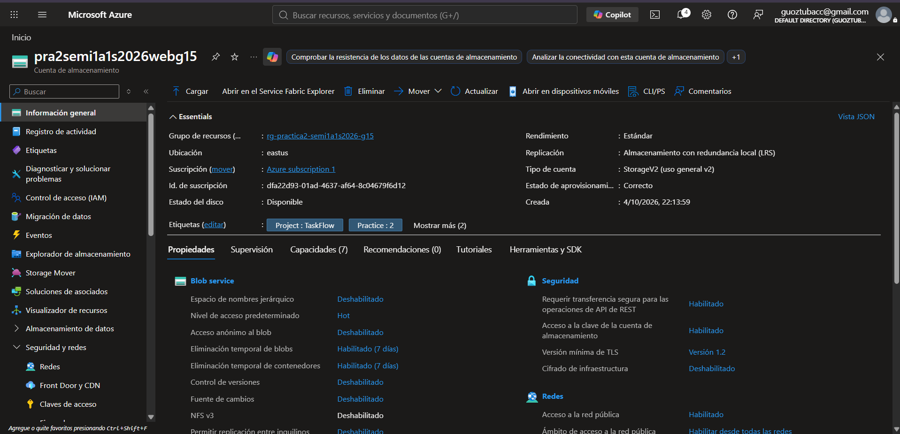

Esta captura reemplaza como evidencia de estado a la implementación inicial `Accepted`, conservada en el inventario.

## 3. Creación y configuración

### 3.1 Datos básicos

Se seleccionaron grupo del proyecto, nombre dedicado, East US, servicio Blob Storage/Data Lake Storage, Estándar y LRS.

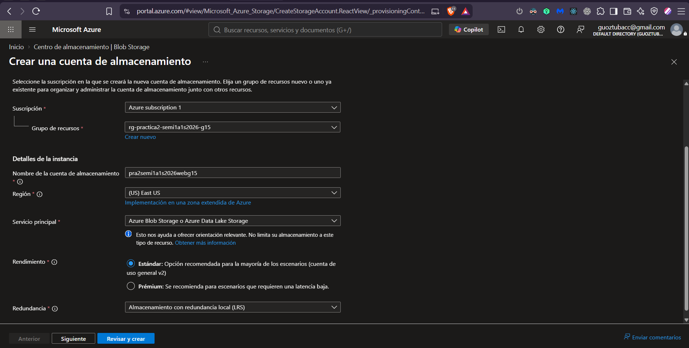

### 3.2 Avanzado

Nombres jerárquicos, SFTP, NFS y replicación entre inquilinos deshabilitados. Nivel de acceso **Frecuente / Hot**. El cifrado de tránsito SMB permanece marcado en la sección Azure Files; no habilita Data Lake ni significa que el frontend use Azure Files.

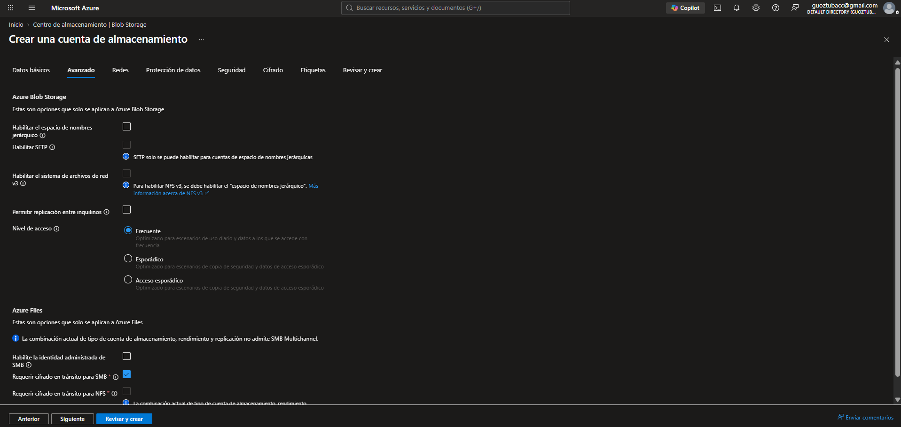

### 3.3 Red pública

Acceso público `Enable`, alcance `Enabled from all networks`. La captura del panel es anterior a pulsar Save; Información general también muestra estos valores en el recurso.

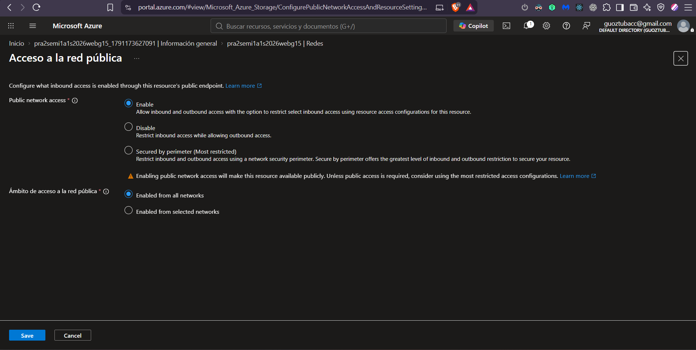

Esta conectividad no autoriza escrituras anónimas. Storage tiene controles propios de red; no se creó un NSG para la cuenta de hosting.

### 3.4 Protección de datos

- Eliminación temporal de blobs: habilitada, **7 días**.
- Eliminación temporal de contenedores: habilitada, **7 días**, visible en Información general.
- Restauración a un momento dado, control de versiones y fuente de cambios: deshabilitados.
- Azure Backup y eliminación permanente de elementos eliminados temporalmente: sin marcar en la captura de Protección de datos.

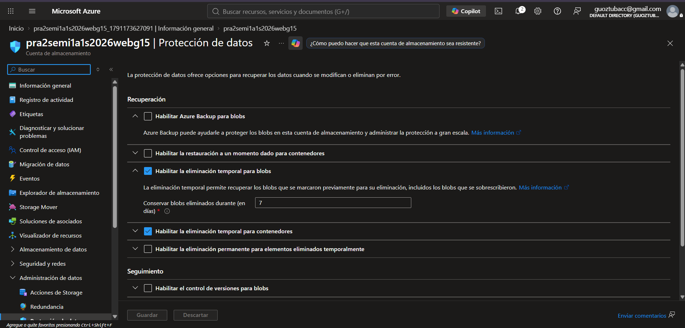

### 3.5 Seguridad y autenticación de publicación

| Ajuste | Resultado y fuente |
|---|---|
| Transferencia segura | Habilitado, capturas de Configuración |
| Acceso anónimo al blob | Deshabilitado |
| Shared Key | Deshabilitado seleccionado en la captura final; usuario confirmó «listo arreglado» |
| Microsoft Entra predeterminado | Habilitado en las capturas de Configuración |
| TLS mínimo | Versión 1.2 |
| Carga de blobs | Explorador identifica Cuenta de usuario de Microsoft Entra |

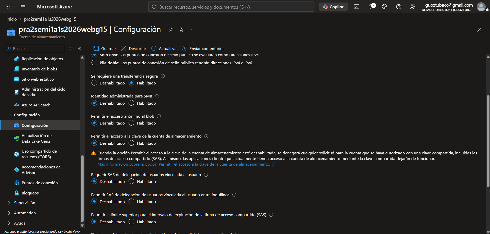

**Límite de la evidencia:** la imagen conserva el botón Guardar disponible y no muestra notificación posterior. Se registra la confirmación del usuario, no una lectura cloud independiente del valor persistido.

La publicación utiliza identidad Entra, no claves en el frontend. Las capturas iniciales con Shared Key habilitado son historial, no configuración final.
[Autorización sin Shared Key](https://learn.microsoft.com/en-us/azure/storage/common/shared-key-authorization-prevent).

### 3.6 Permisos

**Colaborador de datos de Storage Blob** está asignado al usuario publicador con alcance **Este recurso**. Es la traducción del rol Storage Blob Data Contributor. El usuario también tiene Propietario heredado de la suscripción, que ya existía; no se creó como requisito de esta publicación.

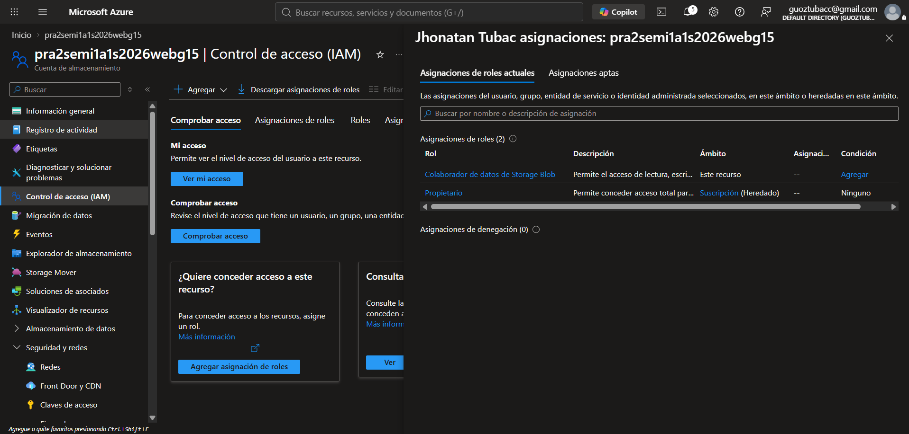

Se agregó por confusión **Storage Actions Blob Data Operator**, que no era necesario. El usuario confirmó por escrito su eliminación. La captura anterior se conserva como historial; no existe todavía una captura posterior que pruebe esa eliminación.

No se retiró el rol correcto ni se modificaron roles de otros recursos.
[Roles de Storage](https://learn.microsoft.com/en-us/azure/role-based-access-control/built-in-roles/storage).

### 3.7 Cifrado y etiquetas

Claves administradas por Microsoft; cifrado de infraestructura deshabilitado.

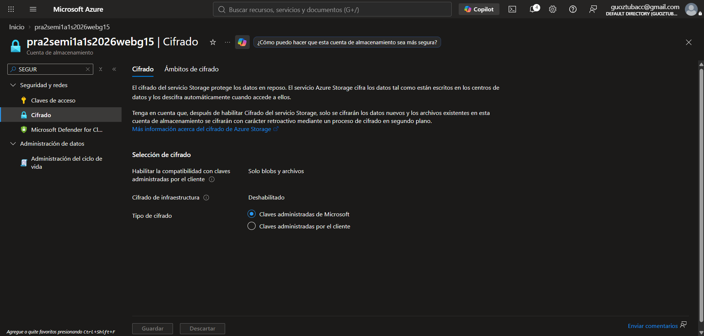

| Clave | Valor |
|---|---|
| Project | TaskFlow |
| Practice | 2 |
| Group | 15 |
| Purpose | frontend-web |

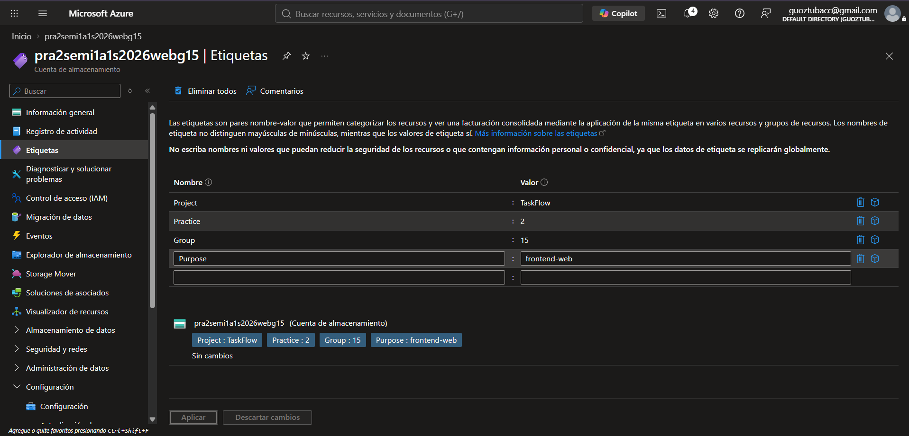

## 4. Habilitación de Static Website

Dentro de la cuenta creada: **Administración de datos → Sitio web estático**. Se habilitó y guardó:

| Campo | Valor real |
|---|---|
| Sitio web estático | Habilitado |
| Contenedor automático | `$web` |
| Nombre del documento de índice | `index.html` |
| Ruta del documento de error | `index.html` |
| Punto de conexión principal | https://pra2semi1a1s2026webg15.z13.web.core.windows.net/ |

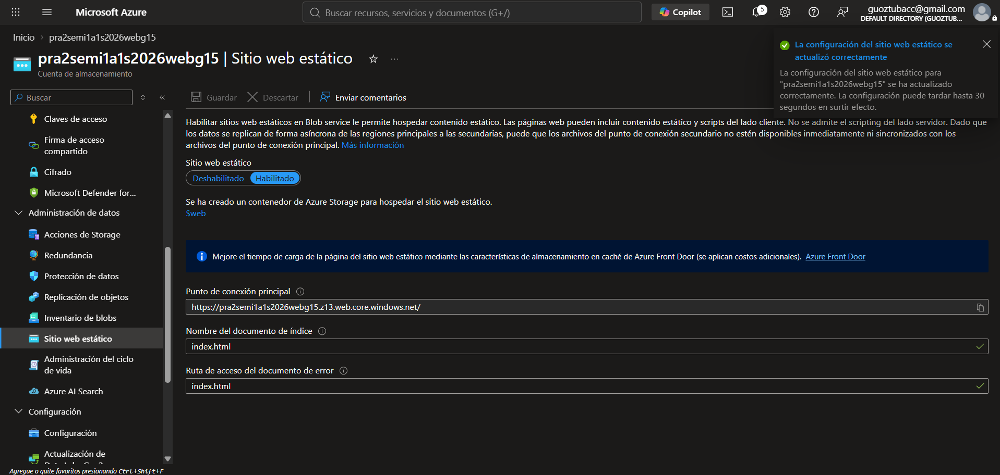

El endpoint web es público de lectura aunque el acceso anónimo al Blob esté deshabilitado. No se cambió el nivel de acceso del contenedor para imitar una política pública de S3.
[Hosting estático en Storage](https://learn.microsoft.com/en-us/azure/storage/blobs/storage-blob-static-website).

El documento de error `index.html` no garantiza respuesta HTTP 200 para rutas inexistentes. La integridad y códigos de los assets deben verificarse por separado.

## 5. Build y publicación

Se ejecutó localmente **`corepack pnpm build`**; TypeScript y Vite terminaron correctamente. El build no fue asociado a un commit nuevo: había cambios sin confirmar en el workspace.

Se configuró únicamente `Practica_2/frontend/dist/config.js`:

```javascript
window.TASKFLOW_CONFIG = { mode: 'mock', defaultCloud: 'azure' };
```

No se cambió globalmente `public/config.js` para AWS. No contiene secretos. Regenerar el build sobrescribe ese archivo generado, por lo que se debe aplicar la configuración de destino antes de una publicación nueva.

El usuario cargó el build mediante el portal; la cuenta usa **Cuenta de usuario de Microsoft Entra** según el explorador.

```text
$web/
  index.html
  config.js
  favicon.svg
  assets/...
```

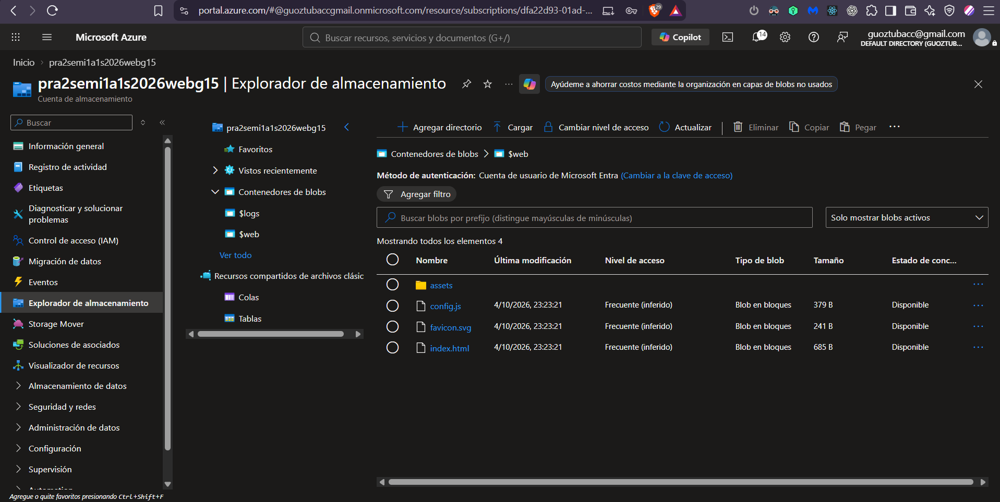

**Incidencia de carga:** algunos assets se subieron inicialmente en raíz; fueron eliminados y organizados en `assets/`. La captura que incluye elementos eliminados temporalmente se conserva como historial. No fue necesario desactivar la retención ni vaciar esos elementos.

La estructura raíz está acreditada. La captura no muestra el contenido interno de assets ni los MIME de cada objeto; no se inventa esa comprobación.

## 6. Resultado público

La captura original del primer despliegue muestra el formulario de login con cuenta demo y aviso de datos simulados. Es evidencia histórica de que el host servía la aplicación, no del estado funcional integrado que se documenta en la sección 7.

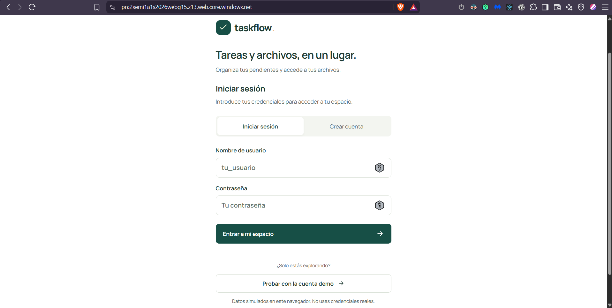

**Esta captura prueba hosting y carga visual, no autenticación real ni operaciones contra BD.** Las pruebas posteriores de health/preflight y el estado actual de CloudDrive se documentan aparte.

## 7. Verificación posterior de la integración Azure

El frontend Azure usa APIM como entrada pública; APIM envía las solicitudes de backend a la IP del Load Balancer, no directamente a las VM. La configuración y las pruebas registradas muestran respuesta de health y preflight:

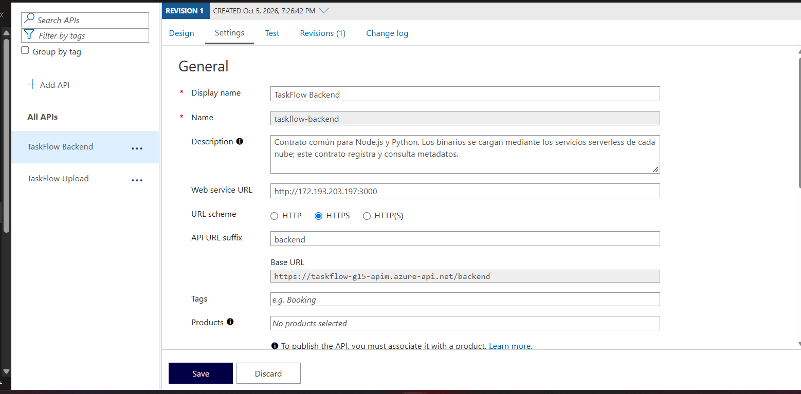

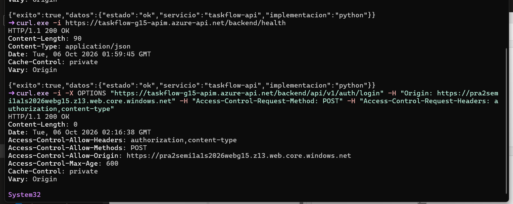

Las capturas posteriores del sitio muestran TaskFlow y CloudDrive desde el perfil Azure. La lista de archivos acredita la integración visible con Blob Storage, pero no toda la autenticación ni las operaciones CRUD.

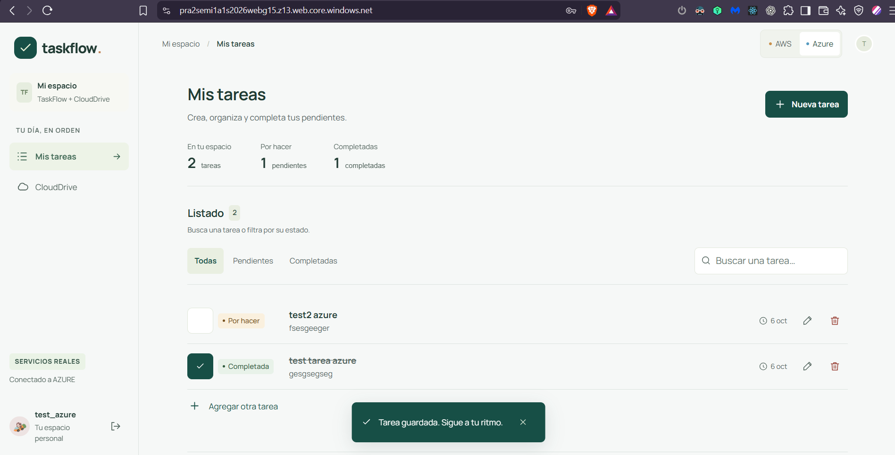

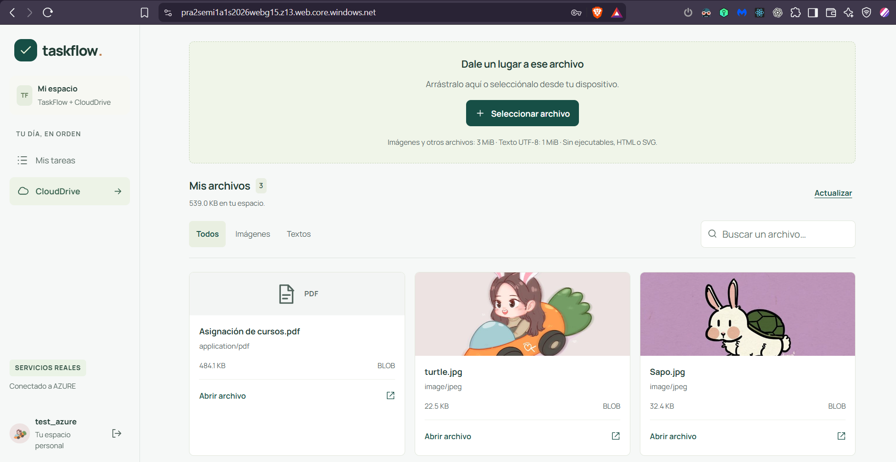

| Verificación | Estado documentado |
|---|---|
| Cuenta de almacenamiento y Static Website | Creados y publicados; ver secciones 2–6 |
| APIM → Load Balancer y `/backend/health` | Configuración y respuesta capturadas arriba |
| Preflight de backend | Respuesta capturada; falta certificar todos los orígenes y rutas |
| CloudDrive Azure | Archivos visibles en la interfaz; captura incluida arriba |
| CORS de carga Azure | El preflight de upload observado devuelve `Access-Control-Allow-Origin: *`; falta restringirlo a los sitios publicados |
| Autenticación, CRUD completo y todos los tipos de carga | No se demuestran exhaustivamente con estas capturas |
| MIME/caché de todos los objetos | No medidos para cada asset |
| Pruebas de failover | Documentadas en el informe de balanceadores |

## 8. Conclusión

El sitio estático de Azure está creado y publica el frontend. Las pruebas posteriores documentan la ruta pública APIM → Load Balancer, la respuesta health/preflight y archivos visibles en CloudDrive. 