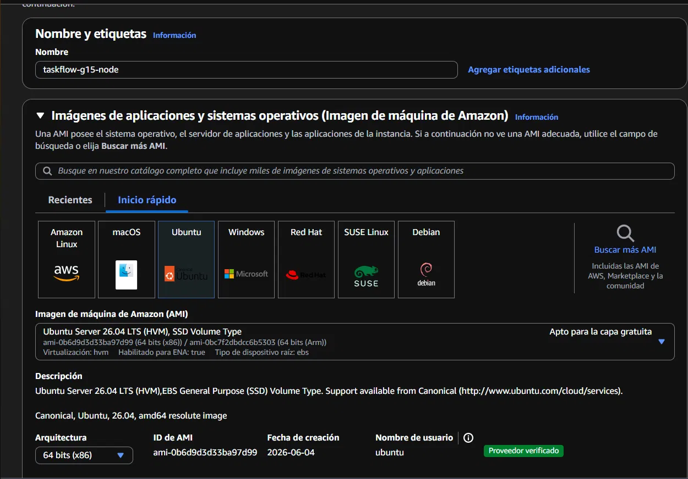
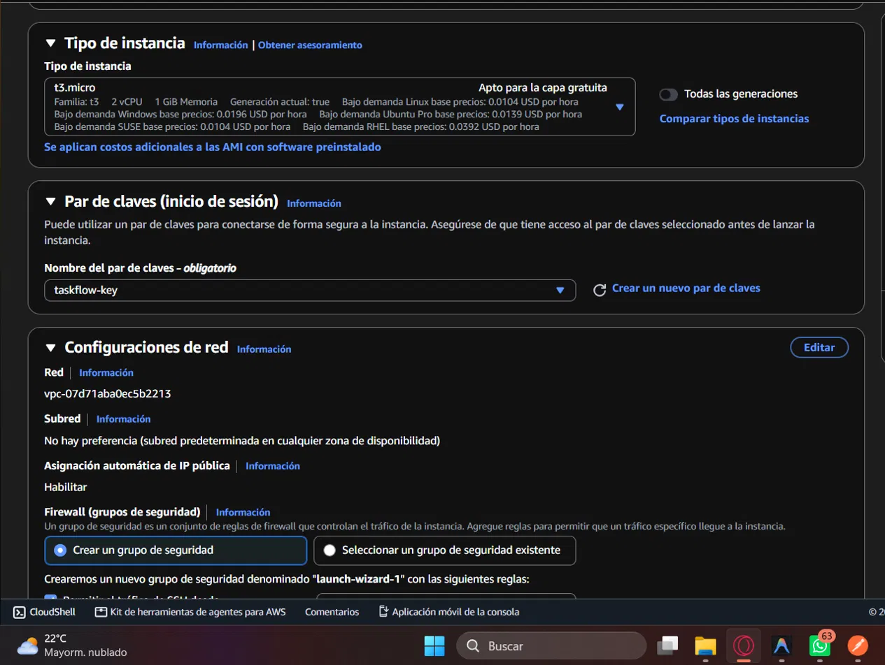
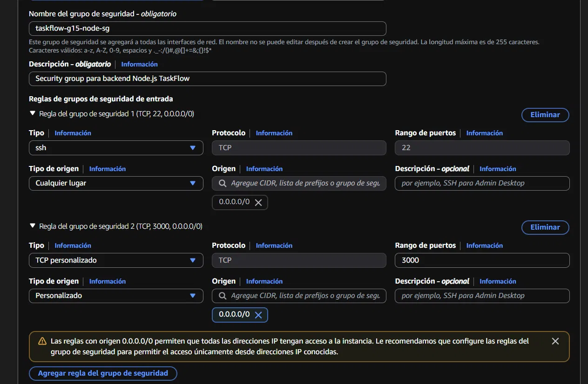
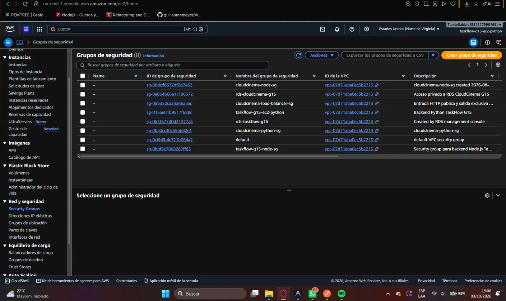
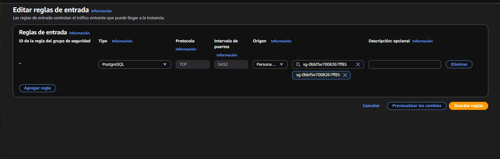

# Reporte de Configuración y Evidencias — AWS EC2 Backend Node.js

**Responsable:** Daniel Abraham Ortiz Chinchilla  
**Componente:** Servidor EC2 Backend Node.js (`taskflow-g15-node`)  
**ID de Instancia:** `i-0c9189f79dbfccc3e`  
**Security Group:** `taskflow-g15-node-sg` (`sg-0bbf5e7008267ff85`)  
**Región AWS:** `us-east-1`  

---

## 1. Descripción General del Componente

La instancia Amazon EC2 `taskflow-g15-node` alberga la API REST principal desarrollada en **NestJS (TypeScript)**. 

Se encarga de gestionar la lógica de negocio central del sistema: autenticación de usuarios (registro y login con emisión de tokens JWT), administración de tareas (CRUD completo) y registro de metadatos de archivos guardados en la capa de persistencia.

---

## 2. Explicación Técnica de la Configuración y Funcionamiento

1. **Instancia y Sistema Operativo:**
   - Tipo de Instancia: `t3.micro` en la VPC predeterminada de AWS (`vpc-07d71aba0ec5b2213`).
   - Sistema Operativo: Ubuntu Server 24.04 LTS.
   - Entorno de Ejecución: Node.js v20.x LTS y PM2 Process Manager.

2. **Gestión de Servicio Persistente con PM2:**
   - La aplicación fue compilada (`npm run build`) e iniciada bajo el administrador de procesos PM2 con el nombre `taskflow-node`.
   - Se configuró la persistencia mediante `pm2 startup` y `pm2 save`, garantizando que el servicio se reinicie automáticamente ante reinicios de la instancia virtual.

3. **Conexión Privada a RDS PostgreSQL:**
   - La aplicación se conecta mediante variables de entorno (`DB_HOST`, `DB_PORT`, `DB_USER`, `DB_PASSWORD`, `DB_NAME`) hacia la instancia compartida Amazon RDS `taskflow-g15`.
   - El puerto TCP `5432` de RDS no está expuesto públicamente a Internet; el tráfico viaja de forma privada autorizando directamente el Security Group de esta EC2 (`taskflow-g15-node-sg`) en las reglas de entrada de RDS.

4. **Security Group y Reglas de Red (`taskflow-g15-node-sg`):**
   - **Reglas Inbound (Entrada):**
     - Puerto TCP `3000`: Permitido desde `0.0.0.0/0` para la atención de solicitudes HTTP.
     - Puerto TCP `22`: Permitido desde `0.0.0.0/0` (o IP del administrador) para gestión SSH.
   - **Reglas Outbound (Salida):**
     - Puerto TCP `5432`: Autorizado hacia el Security Group de RDS `rds-taskflow-g15` (`sg-063f677d0d31377a4`).

---

## 3. Evidencias de Configuración en Consola AWS

### 3.1 Lista de Instancias EC2 y Estado de Ejecución
Consola de AWS EC2 mostrando la instancia `taskflow-g15-node` (ID `i-0c9189f79dbfccc3e`) en estado `Running` (En ejecución).

---

### 3.2 Detalles de Red e IP Pública de la EC2
Vista detallada de la instancia mostrando las direcciones IP públicas, privadas y la VPC asociada a la solución.

---

### 3.3 Configuración de Almacenamiento y Seguridad
Panel de detalles de seguridad y volumen de disco EBS asignado a la máquina virtual en AWS.

---

### 3.4 Security Group de Node.js (`taskflow-g15-node-sg`)
Visualización del Security Group creado para proteger la instancia y controlar los puertos autorizados.

---

### 3.5 Reglas de Entrada del Security Group
Detalle de las reglas de entrada especificando el puerto `3000` para la API NestJS y el puerto `22` para acceso SSH.

