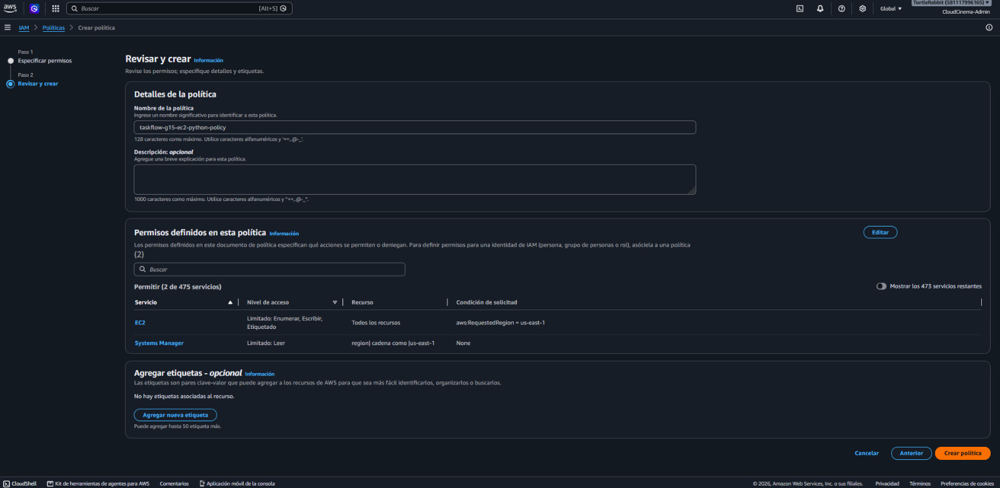
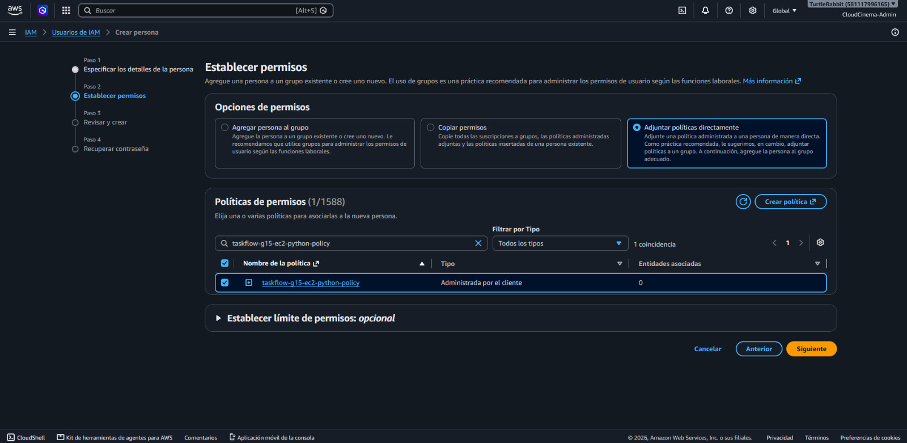
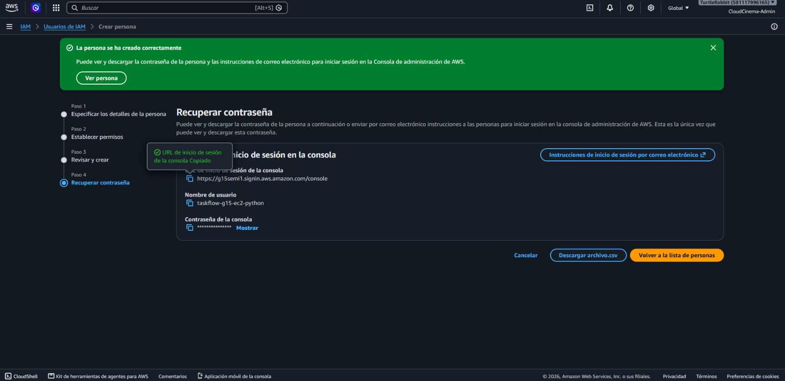
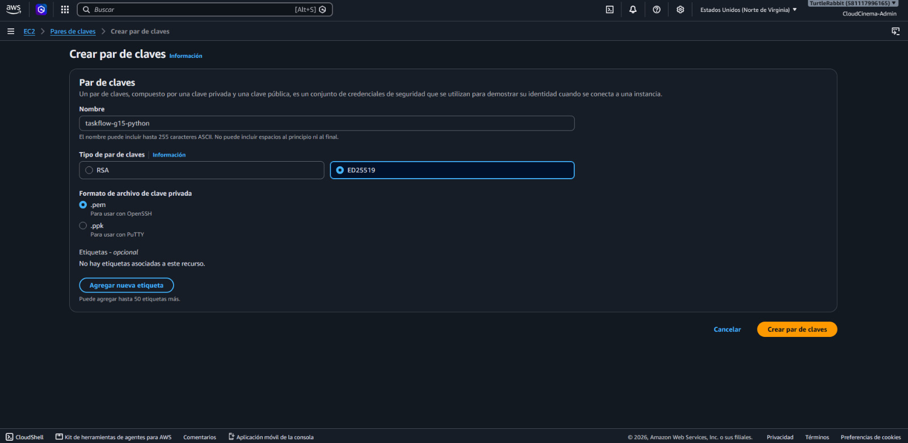
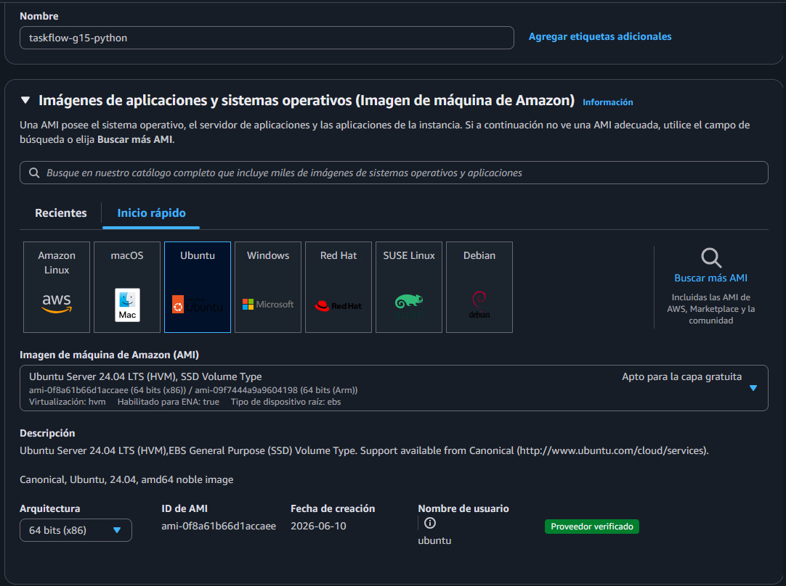

# Evidencias — PRA2-12 EC2 Python (AWS)

**Proyecto:** TaskFlow + CloudDrive · Práctica 2 · Grupo 15  
**Responsable:** Javier Velásquez  
**Componente:** Backend Python (FastAPI) en Amazon EC2 (`taskflow-g15-python`)  
**ID de instancia:** `i-04b5b489c8561cc48`  
**Security group:** `taskflow-g15-ec2-python` (`sg-015ae01b9517f688c`)  
**Región AWS:** `us-east-1`  
**Actualizado:** 6 de octubre de 2026

Las capturas están en [`images/`](images/). La visión general de la vertical
Python y el backend (PRA2-11) están en
[`pra2-15-vertical-python-azure.md`](../../pra2-15-vertical-python-azure.md).
Las contraseñas, el `JWT_SECRET` y las llaves SSH no forman parte de este
documento.

---

## 1. Alcance

Despliegue del backend Python en una EC2 como servicio systemd, conectado al
RDS compartido `taskflow-g15` con el usuario de aplicación `taskflow_api` y
TLS `verify-full`. La instancia es uno de los dos destinos del Application
Load Balancer de AWS (PRA2-19); el navegador no la consume directamente.

```text
Frontend (S3 o Azure) ─HTTPS─> API Gateway oaxm8gpqm0 ─HTTP─> ALB taskflow-g15-alb :80
                                                                  │  target group taskflow-g15-api-tg
                                                                  ├─HTTP :3000─> EC2 Node.js
                                                                  └─HTTP :3000─> EC2 Python (esta)
EC2 Python ─TCP 5432 · TLS verify-full─> RDS taskflow-g15 (regla por security group)
```

## 2. Configuración validada

| Parámetro | Valor |
|---|---|
| Instancia | `taskflow-g15-python` (`i-04b5b489c8561cc48`) |
| Tipo | `t3.micro` |
| Imagen | Ubuntu Server 24.04 LTS (x86), Python 3.12 del sistema |
| Red | VPC predeterminada `vpc-07d71aba0ec5b2213` |
| Par de claves | `taskflow-g15-python`, ED25519, formato `.pem` (la llave privada no se versiona) |
| Security group | `taskflow-g15-ec2-python` (`sg-015ae01b9517f688c`) |
| IP pública | `54.175.232.11`, observada el 6 de octubre de 2026. No es una IP elástica: cambió tras un reinicio (antes `3.88.231.32`) |
| Punto de entrada real | ALB `taskflow-g15-alb` (DNS `taskflow-g15-alb-416879263.us-east-1.elb.amazonaws.com`), publicado por API Gateway |
| Servicio | systemd `taskflow-python`, usuario de sistema `taskflow` sin shell |
| Código | `/opt/taskflow-python`, propiedad de `root`, de solo lectura para el servicio |
| Configuración | `/etc/taskflow/python.env`, `root:taskflow`, permisos `640` |
| Puerto | `3000` |

## 3. IAM de mínimo privilegio

La EC2 la crea y administra el usuario de IAM `taskflow-g15-ec2-python`, con
la política administrada por el cliente `taskflow-g15-ec2-python-policy`
adjunta directamente
([JSON versionado](../../../aws/iam/pra2-12-ec2-python-policy.json)).

| Instrucción (`Sid`) | Permisos | Límite |
|---|---|---|
| `Ec2DescribeEnRegion` | `ec2:Describe*` (solo lectura) | Condición `aws:RequestedRegion = us-east-1` |
| `Ec2GestionEnRegion` | Ciclo de vida de instancias, security groups y sus reglas, pares de claves y `CreateTags` | Condición `aws:RequestedRegion = us-east-1` |
| `LeerAmiUbuntu` | `ssm:GetParameter`, `ssm:GetParameters` | Solo el parámetro público de la AMI de Ubuntu Server 24.04 de Canonical |

La política no concede IAM, RDS, S3 ni otros servicios. El backend no llama a
APIs de AWS: solo abre una conexión PostgreSQL al RDS, así que la instancia
no tiene claves de acceso de AWS.

## 4. Red y seguridad

| Regla de entrada de `taskflow-g15-ec2-python` | Origen | Motivo |
|---|---|---|
| TCP `3000` | `taskflow-g15-alb-sg` (`sg-054b4346318f3c030`) | Solo el ALB alcanza la API |
| SSH `22` | IP del administrador (`/32`) | Administración |

El `3000` pasó por tres estados: limitado a la IP del desarrollador al crear
el grupo, abierto a `0.0.0.0/0` mientras no existía el balanceador y, con
PRA2-19, restringido al security group del ALB. Por eso la API ya no responde
en la IP pública: se prueba por el balanceador o desde la propia instancia.

| Regla en el RDS | Origen |
|---|---|
| `rds-taskflow-g15` (`sg-063f677d0d31377a4`), PostgreSQL TCP `5432` | `sg-015ae01b9517f688c` (esta EC2) |

La regla del RDS referencia el security group y no una IP, así que sigue
siendo válida aunque cambie la IP pública de la instancia.

## 5. Servicio y variables de entorno

El instalador idempotente
[`instalar_ec2.sh`](../../../api-python/deploy/instalar_ec2.sh) instala los
paquetes, crea el usuario `taskflow`, copia el código, crea el entorno
virtual, descarga el bundle de certificados de RDS en
`/etc/taskflow/global-bundle.pem` e instala la unidad
[`taskflow-python.service`](../../../api-python/deploy/taskflow-python.service)
(con `NoNewPrivileges`, `PrivateTmp` y `ProtectSystem=full`). No arranca el
servicio mientras queden marcadores `REEMPLAZAR_` y nunca imprime el archivo
de entorno.

| Variable (solo nombres) | Valor o uso |
|---|---|
| `DB_HOST`, `DB_PORT`, `DB_NAME` | Endpoint del RDS, `5432`, `taskflow` |
| `DB_USER`, `DB_PASSWORD` | `taskflow_api` y su contraseña (canal privado) |
| `DB_SSLMODE`, `DB_SSLROOTCERT` | `verify-full` y `/etc/taskflow/global-bundle.pem` |
| `PORT` | `3000` |
| `JWT_SECRET`, `JWT_EXPIRES_IN` | Secreto HS256 compartido y vigencia de 3600 s |
| `CORS_ORIGINS` | `http://localhost:3000`, `http://practica2semi1a1s2026paginawebg15.s3-website-us-east-1.amazonaws.com` y `https://pra2semi1a1s2026webg15.z13.web.core.windows.net`, separados por comas y sin barra final |

La plantilla sin secretos es
[`python.env.example`](../../../api-python/deploy/python.env.example).
`CORS_ORIGINS` se actualizó el 6 de octubre de 2026 con los dos sitios
publicados del frontend (PRA2-17 y PRA2-18), editando
`/etc/taskflow/python.env` y reiniciando `taskflow-python`; la comprobación
está en la sección 7.

## 6. Usuario de base de datos `taskflow_api`

El backend nunca usa el usuario maestro. `taskflow_api` es un rol con `LOGIN`
y sin atributos de administración, miembro del rol de grupo `taskflow_app`
([runbook §7](../../runbook-bd-rds.md#7-crear-el-usuario-taskflow_api)). Se
creó desde esta EC2 con
[`crear_usuario_api.sql`](../../../database/crear_usuario_api.sql), que lee la
contraseña de una variable de entorno y verifica el rol antes de confirmar la
transacción. Salida de la ejecución:

```text
BEGIN
SET
DO
CREATE ROLE
ALTER ROLE
GRANT ROLE
NOTICE:  Rol taskflow_api listo: LOGIN, miembro de taskflow_app, sin privilegios de administración.
DO
COMMIT
```

---

## 7. Evidencia

### 7.1 Política de IAM en JSON


**Qué demuestra:** la política tiene las tres instrucciones de la versión del
repositorio, con la condición de región en las dos de EC2.

---

### 7.2 Revisión de la política



**Qué demuestra:** el nombre `taskflow-g15-ec2-python-policy` y que solo
concede EC2 (enumerar, escribir y etiquetar, limitado a `us-east-1`) y lectura
de Systems Manager.

---

### 7.3 Usuario de IAM con la política adjunta



**Qué demuestra:** la política se adjunta directamente al usuario nuevo, sin
grupos ni políticas administradas por AWS.

---

### 7.4 Usuario creado



**Qué demuestra:** existe el usuario `taskflow-g15-ec2-python`; la contraseña
de consola aparece enmascarada.

---

### 7.5 Creación del security group


**Qué demuestra:** el grupo `taskflow-g15-ec2-python` se creó en la VPC
`vpc-07d71aba0ec5b2213` con SSH y TCP `3000` limitados a la IP del
desarrollador. Es el estado inicial; la regla vigente del `3000` es la de la
sección 4.

---

### 7.6 Par de claves



**Qué demuestra:** el par `taskflow-g15-python` es de tipo ED25519 en formato
`.pem`.

---

### 7.7 AMI de la instancia



**Qué demuestra:** la instancia usa Ubuntu Server 24.04 LTS de Canonical (x86,
proveedor verificado).

---

### 7.8 Regla del RDS


**Qué demuestra:** `rds-taskflow-g15` admite PostgreSQL (TCP `5432`) desde
`sg-015ae01b9517f688c` (Python) y `sg-0bbf5e7008267ff85` (Node.js), sin
orígenes abiertos.

---

### 7.9 `GET /health` en la EC2


**Qué demuestra:** uvicorn responde `200` con `implementacion: "python"`; el
servicio está activo y alcanza el RDS.

---

## 8. Validaciones

### 8.1 `GET /health`

```text
HTTP/1.1 200 OK
content-type: application/json

{"exito":true,"datos":{"estado":"ok","servicio":"taskflow-api","implementacion":"python"}}
```

Verificado el 5 de octubre de 2026 y de nuevo el 6 de octubre de 2026, tras
reiniciar el servicio con los nuevos `CORS_ORIGINS`.

### 8.2 Prueba de humo

[`smoke_test.py`](../../../api-python/scripts/smoke_test.py) contra el RDS
real con `taskflow_api` (3 y 4 de octubre de 2026): **20/20 OK, 0 FALLO**.

| Bloque | Comprobaciones |
|---|---|
| Salud | `GET /health` (200, `implementacion=python`) |
| Autenticación | Registro (201), registro repetido (409), login incorrecto (401), login correcto (200) |
| Tareas | Crear, listar, obtener, editar, completar, descompletar, eliminar y 404 posterior |
| Archivos `S3` y `BLOB` | Registrar, listar y eliminar el metadato |
| Seguridad | `GET /api/v1/tasks` sin token (401) |

### 8.3 Comprobación previa de CORS (6 de octubre de 2026)

Ejecutada dentro de la instancia contra
`http://localhost:3000/api/v1/auth/login`: petición `OPTIONS` con `Origin`,
`Access-Control-Request-Method: POST` y
`Access-Control-Request-Headers: content-type`, filtrando las líneas `HTTP`,
`access-control-allow-origin` y `Disallowed`. Cada bloque va precedido de un
comentario con el origen enviado:

```text
# Origin: https://pra2semi1a1s2026webg15.z13.web.core.windows.net
HTTP/1.1 200 OK
access-control-allow-origin: https://pra2semi1a1s2026webg15.z13.web.core.windows.net

# Origin: http://practica2semi1a1s2026paginawebg15.s3-website-us-east-1.amazonaws.com
HTTP/1.1 200 OK
access-control-allow-origin: http://practica2semi1a1s2026paginawebg15.s3-website-us-east-1.amazonaws.com

# Origin: https://origen-no-permitido.example
HTTP/1.1 400 Bad Request
Disallowed CORS origin
```

### 8.4 Resumen

| Validación | Resultado | Evidencia |
|---|---|---|
| El servicio responde y alcanza el RDS | `200`, `implementacion: "python"` | [7.9](#79-get-health-en-la-ec2) y 8.1 |
| La API completa funciona contra el RDS real | Humo 20/20 OK | 8.2 |
| Los dos sitios del frontend son orígenes permitidos | `200` con su propio origen | 8.3 |
| Un origen ajeno se rechaza | `400 Disallowed CORS origin` | 8.3 |
| El RDS no está abierto a cualquier origen | Regla `5432` por security group | [7.8](#78-regla-del-rds) |
| El usuario de aplicación no administra la base | Verificado por el script antes del `COMMIT` | Sección 6 |

## 9. Integración con el balanceador (PRA2-19)

La EC2 es destino del target group `taskflow-g15-api-tg` del ALB
`taskflow-g15-alb` (listener HTTP `:80`, health check HTTP `:3000/health`
esperando `200`). API Gateway `oaxm8gpqm0` publica `GET /health` y
`ANY /api/v1/{proxy+}` hacia el ALB. La configuración, las respuestas de
Python a través del balanceador y las pruebas de failover (Node.js fuera de
servicio → responde Python, y al revés) están en el
[informe de balanceadores](../load-balancers/report.md), secciones 3.3, 3.4 y
5.1 a 5.3.

## 10. Artefactos versionados

| Artefacto | Uso |
|---|---|
| [`aws/scripts/deploy-ec2-python.sh`](../../../aws/scripts/deploy-ec2-python.sh) | Despliegue de referencia en la EC2 |
| [`api-python/deploy/instalar_ec2.sh`](../../../api-python/deploy/instalar_ec2.sh) | Instalador idempotente del servicio |
| [`api-python/deploy/taskflow-python.service`](../../../api-python/deploy/taskflow-python.service) | Unidad systemd endurecida |
| [`api-python/deploy/python.env.example`](../../../api-python/deploy/python.env.example) | Plantilla del archivo de entorno, sin secretos |
| [`aws/iam/pra2-12-ec2-python-policy.json`](../../../aws/iam/pra2-12-ec2-python-policy.json) | Política IAM de mínimo privilegio |
| [`database/crear_usuario_api.sql`](../../../database/crear_usuario_api.sql) | Creación y verificación de `taskflow_api` |
| [`api-python/scripts/smoke_test.py`](../../../api-python/scripts/smoke_test.py) | Prueba de humo para cualquier backend del contrato |

## 11. Decisiones y limitaciones

| Decisión | Motivo |
|---|---|
| `3000` restringido al security group del ALB | La API solo entra por el balanceador; nadie la alcanza saltándoselo |
| Regla del RDS por security group | Sobrevive a los cambios de IP pública de la instancia |
| Secretos solo en `/etc/taskflow/python.env` (`root:taskflow 640`) | Nunca en el repositorio ni en argumentos de comandos |
| Sin claves de AWS en la instancia | El backend solo usa PostgreSQL |
| `CORS_ORIGINS` con los dos sitios publicados y `localhost:3000` | Los navegadores de ambos hostings llegan a la misma API; el resto de orígenes se rechaza |

| Limitación | Impacto |
|---|---|
| Sin IP elástica | La IP pública cambia al detener o reiniciar la instancia; no afecta a la API (entra por el ALB) ni al RDS (regla por security group), pero sí a la conexión SSH |
| SSH `22` limitado a la IP del administrador | Si esa IP cambia, hay que actualizar la regla antes de administrar la instancia |
| Tramo ALB → EC2 en HTTP | El cifrado lo ofrece API Gateway hacia el navegador; dentro de la VPC el tráfico va en HTTP |
| Destinos del ALB en una sola zona (`us-east-1c`) | El balanceo cubre la caída de un backend, no la de una zona ([informe de balanceadores §3.3](../load-balancers/report.md)) |
