# Informe de implementación y pruebas de balanceadores de carga

**Proyecto:** TaskFlow + CloudDrive · Grupo 15  
**Actualizado:** 6 de octubre de 2026  
**Evidencias:** capturas insertadas directamente en las secciones correspondientes.

> **Estado:** los balanceadores y las rutas principales están creados; las comprobaciones de salud y failover registradas respondieron correctamente. La evidencia de CloudDrive en AWS ya está agregada. El cierre completo queda condicionado a completar las verificaciones de CORS y seguridad indicadas al final.

## 1. Resumen ejecutivo

| Componente | Resultado registrado |
|---|---|
| Balanceador Azure | Creado; Node y Python aparecen saludables y responden a través del punto de entrada. |
| Balanceador AWS | Creado; el target group mostró ambos targets saludables y se probaron las rutas del API Gateway. |
| Failover | Se comprobó que, al retirar un backend, el otro podía responder en cada nube. |
| Frontend real | Se cargó la aplicación desde los hosts estáticos de AWS y Azure. La interfaz llama a los gateways públicos, no directamente a las VMs. |
| CloudDrive Azure | La interfaz muestra archivos en Azure; captura en la sección 4.1. |
| CloudDrive AWS | La interfaz muestra archivos con proveedor S3 y un aviso de carga exitosa; captura en la sección 7. |
| Seguridad y CORS | Hay verificaciones pendientes antes de afirmar que ambos perfiles y todos los flujos están completamente listos. |

## 2. Arquitectura implementada

El frontend es contenido estático. El navegador elige el servicio AWS o Azure y envía las solicitudes de aplicación a su API pública. El balanceador queda detrás del gateway; no se configura el navegador para conectarse directamente a una EC2 o VM.

**Flujo AWS:** frontend S3 → navegador → HTTPS → API Gateway → HTTP → ALB:80 → HTTP:3000 → Node/Python.  
**Flujo Azure:** frontend Storage → navegador → HTTPS → APIM → HTTP → Azure LB:3000 → HTTP:3000 → Node/Python.

Los endpoints públicos están declarados en la configuración de ejecución del frontend (dist/aws/config.js y dist/azure/config.js). Cada perfil establece su nube inicial, y la aplicación tiene las URLs de API de AWS y Azure para permitir seleccionar el servicio desde la interfaz. Las rutas de tareas y autenticación pasan por el gateway correspondiente y luego por el balanceador de esa nube.

Las cargas de CloudDrive siguen rutas independientes del balanceador:

- **AWS:** frontend → API Gateway → Lambda → S3.
- **Azure:** frontend → APIM (TaskFlow Upload) → Azure Function → Blob Storage.

No se creó un dominio propio ni se instalaron certificados en las VMs. Los gateways administrados ofrecen HTTPS en el punto público, pero el tramo desde API Gateway/APIM al balanceador y de este a los backends usa HTTP. Es una arquitectura de laboratorio: usar cuentas y datos de prueba, no credenciales reales.

## 3. Inventario configurado

### 3.1 Azure Load Balancer

| Parámetro | Valor evidenciado |
|---|---|
| Nombre | `taskflow-g15-lb-azure` |
| SKU | Standard |
| Tipo de frontend | Público |
| Alcance | Regional |
| Grupo de recursos | `rg-taskflow-g15` |
| Región | West US 2 (`westus2`) |
| Frontend | `taskflow-g15-lb-front` |
| IP pública del frontend | `172.193.203.197` · estática |
| Red virtual / subred | `vnet-westus2-1` / `snet-westus2-1` (`172.16.0.0/24`) |
| Backend pool | `taskflow-g15-api-pool` |
| Backend Node | `172.16.0.4` |
| Backend Python | `172.16.0.5` |
| Regla de balanceo | TCP · puerto frontend `3000` → puerto backend `3000` |
| Sonda de estado | HTTP `:3000/health` · intervalo de 5 s · respuesta esperada `200` |
| Entrada pública de API | APIM: `https://taskflow-g15-apim.azure-api.net/backend` |
| Backend configurado en APIM | `http://172.193.203.197:3000` |

El pool contiene las IP privadas de Node y Python; la regla distribuye por TCP 3000 y la sonda HTTP consulta `/health` cada cinco segundos. La métrica registrada mostró ambas instancias saludables:

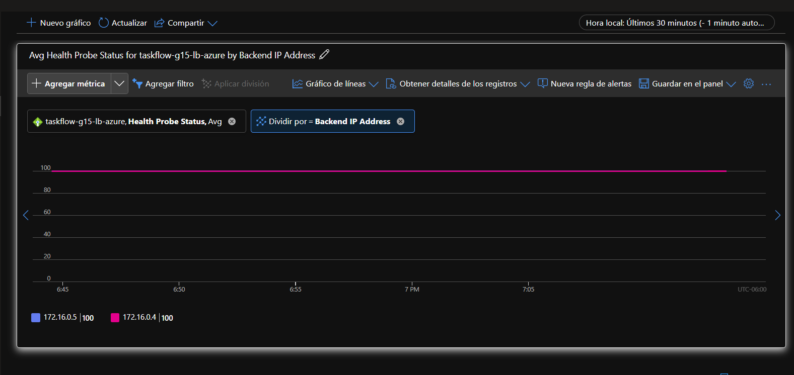

### 3.2 API Management hacia el balanceador Azure

APIM usa como backend la IP pública estática del Load Balancer, no las IP de las VM. La ruta publicada ante el frontend conserva el prefijo `/backend`; la política CORS permite el origen web configurado.

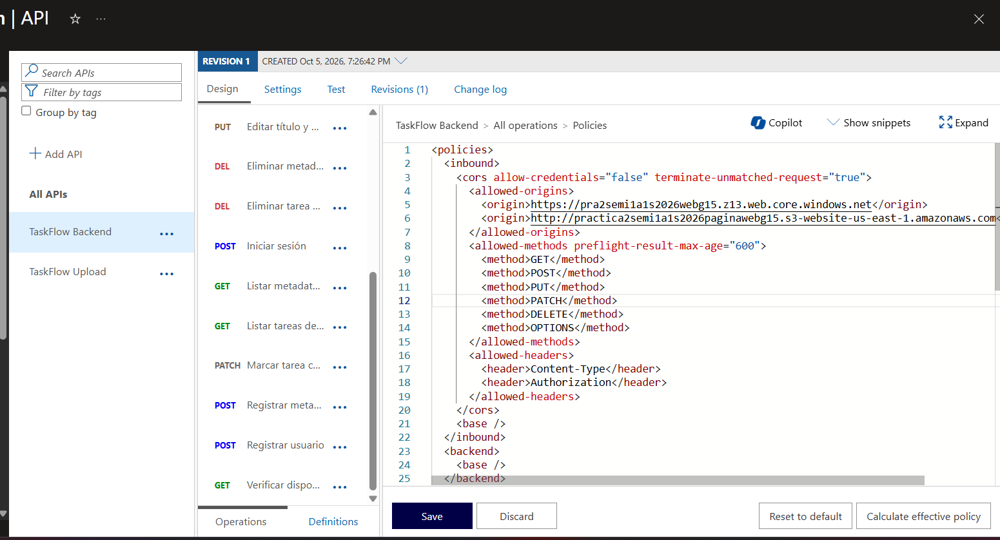

La prueba registrada contra `/backend/health` y el preflight OPTIONS devolvió respuestas correctas:

### 3.3 Application Load Balancer de AWS

| Parámetro | Valor evidenciado |
|---|---|
| Nombre | `taskflow-g15-alb` |
| Tipo | Application Load Balancer (ALB) |
| Esquema | `internet-facing` (público) |
| Alcance | Regional |
| Región | `us-east-1` |
| DNS público | `taskflow-g15-alb-416879263.us-east-1.elb.amazonaws.com` |
| Zonas de disponibilidad asociadas | `us-east-1a` y `us-east-1c` |
| Grupo de seguridad | `taskflow-g15-alb-sg` (`sg-054b4346318f3c030`) |
| Listener | HTTP · puerto `80` |
| Target group | `taskflow-g15-api-tg` |
| Protocolo/versión hacia targets | HTTP · HTTP/1.1 · puerto `3000` |
| Health check | HTTP `:3000/health` · respuesta esperada `200` |
| Entrada pública de API | API Gateway HTTP API: `https://oaxm8gpqm0.execute-api.us-east-1.amazonaws.com` |
| Rutas integradas hacia el ALB | `GET /health` y `ANY /api/v1/{proxy+}` |

El target group reenvía HTTP por el puerto 3000 y verifica `/health`. El listener HTTP:80 del ALB distribuye únicamente a targets saludables. La captura confirma el estado saludable de Node y Python:

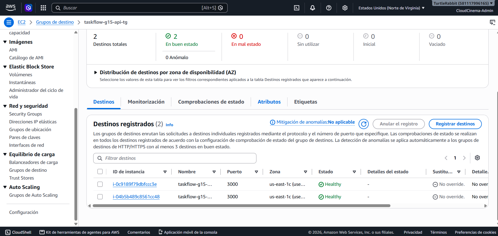

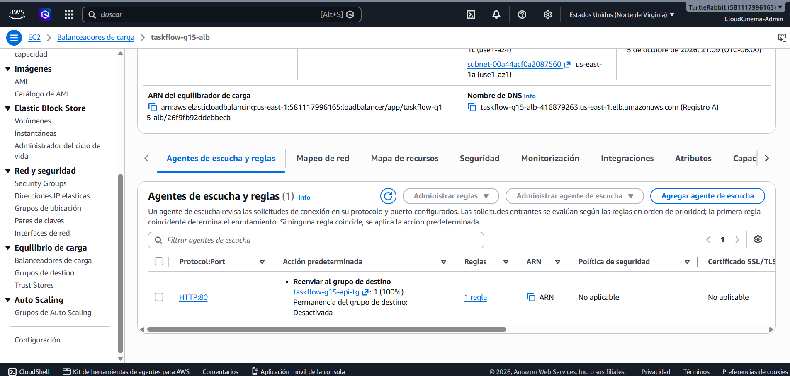

Las respuestas de prueba a través del balanceador identificaron ambas implementaciones:

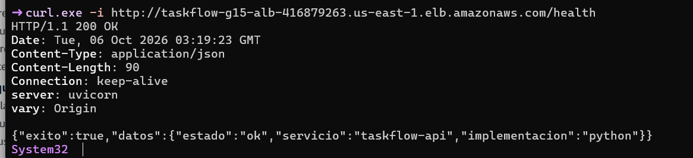

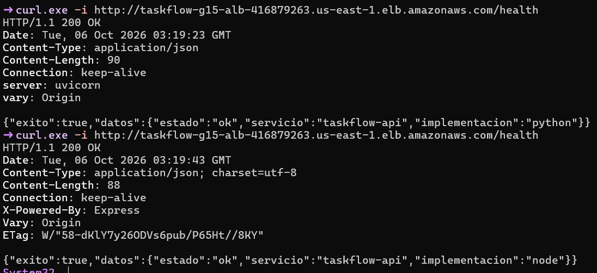

El ALB está asociado a `us-east-1a` y `us-east-1c`; las dos instancias registradas estaban en `us-east-1c`. Por tanto, aunque el balanceador cubre dos zonas, la evidencia no demuestra redundancia de los backends entre zonas de disponibilidad.

### 3.4 API Gateway hacia el ALB

API Gateway publica `/health` y el proxy de `/api/v1/{proxy+}`; ambas rutas se integran con el ALB. La configuración CORS del gateway se conserva como parte del acceso desde el sitio web:

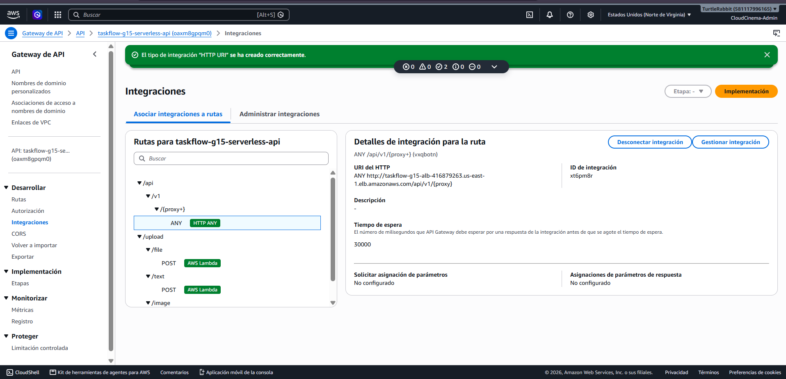

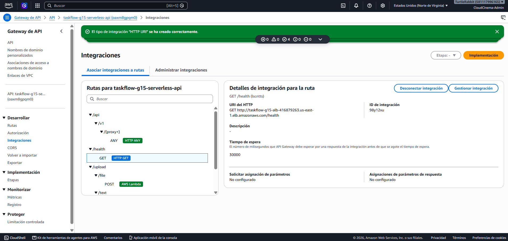

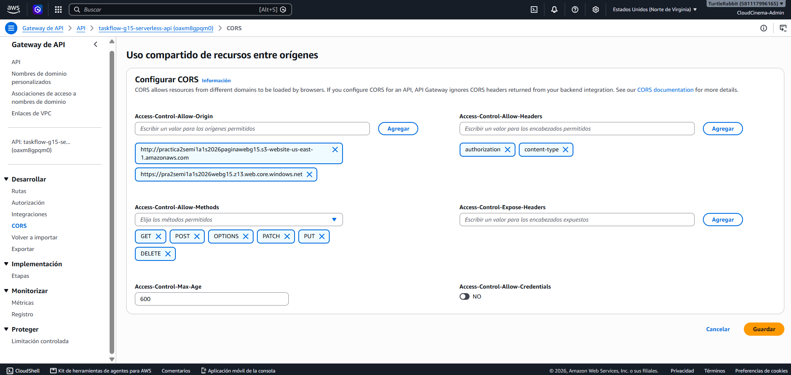

## 4. Publicación y verificación de los frontends

### 4.1 Sitio estático y CloudDrive Azure

Los archivos del sitio se publicaron en el contenedor `$web`. Las capturas siguientes muestran la publicación y que TaskFlow abre y presenta tareas y archivos en el perfil Azure.

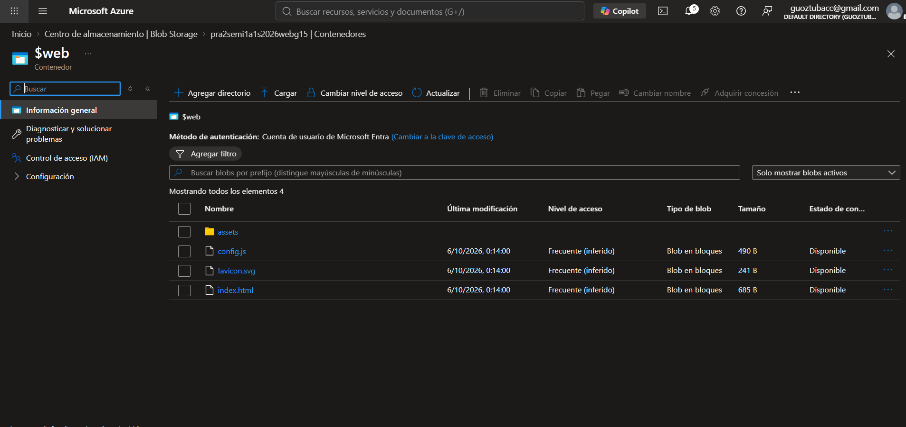

### 4.2 Sitio estático AWS

Los objetos `index.html`, `config.js`, `favicon.svg` y `assets/` se publicaron en el bucket del frontend. La captura de la interfaz confirma que TaskFlow abre desde el sitio S3.

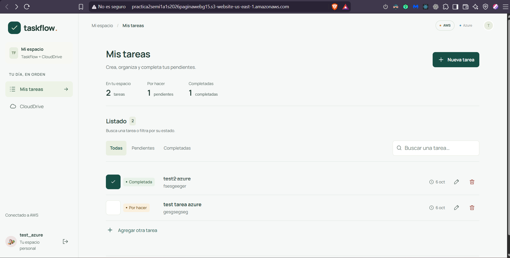

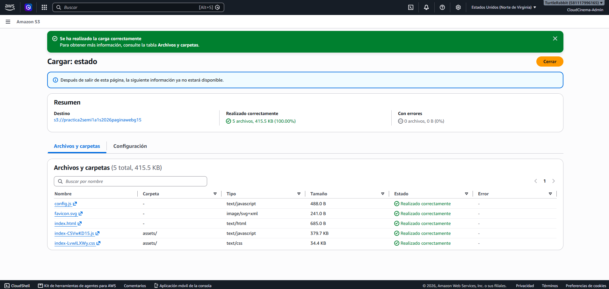

La captura 76 corresponde únicamente a los archivos estáticos del frontend; la evidencia del flujo de CloudDrive AWS se presenta por separado en la sección 7.

## 5. Pruebas de failover

Se retiró de servicio un backend a la vez. La respuesta del servicio restante confirmó disponibilidad de health/API durante esas pruebas.

### 5.1 Failover AWS — Node fuera de servicio

Con Node retirado del target group, la respuesta del gateway llegó desde Python:

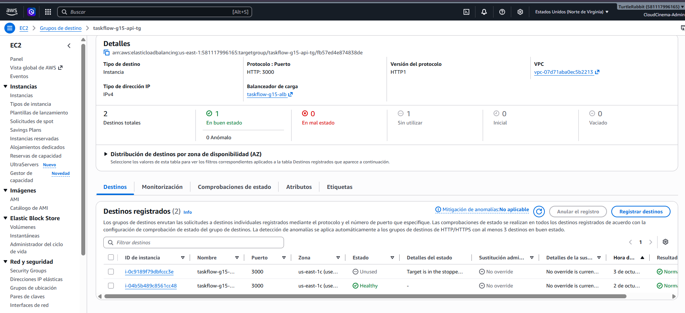

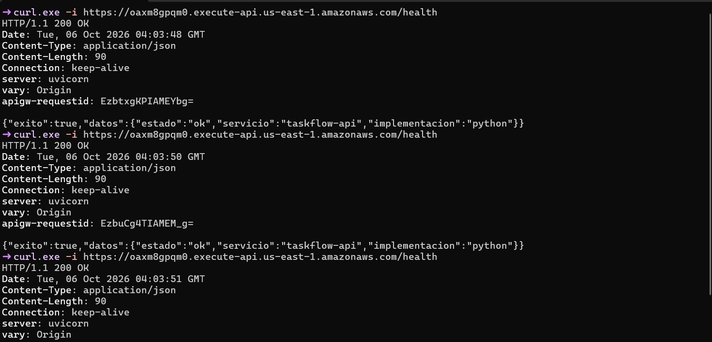

### 5.2 Failover AWS — Python fuera de servicio

Al detener Python, Node se mantuvo saludable y atendió la solicitud:

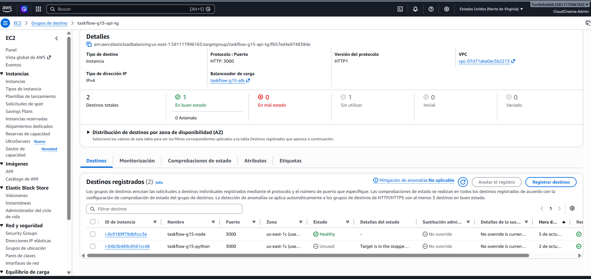

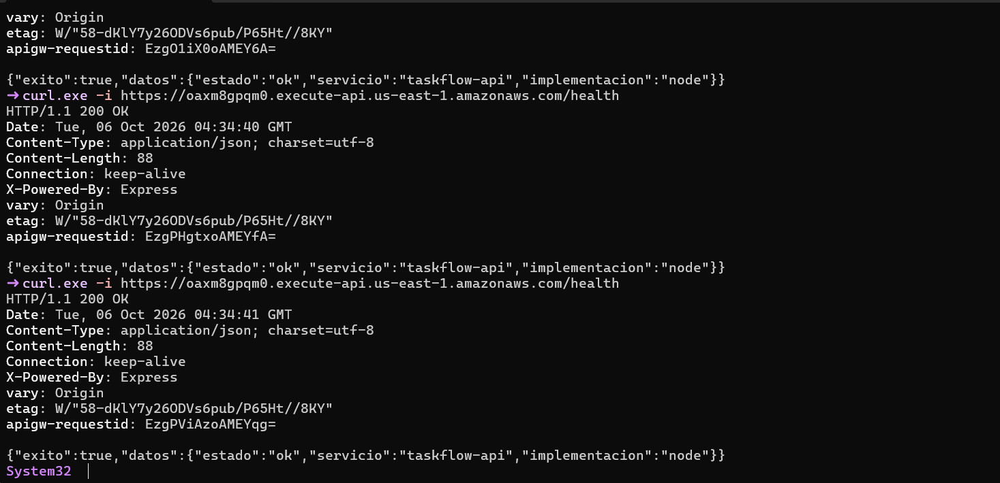

### 5.3 Restauración de AWS

Después de iniciar ambos servicios, los dos targets volvieron a estar saludables:

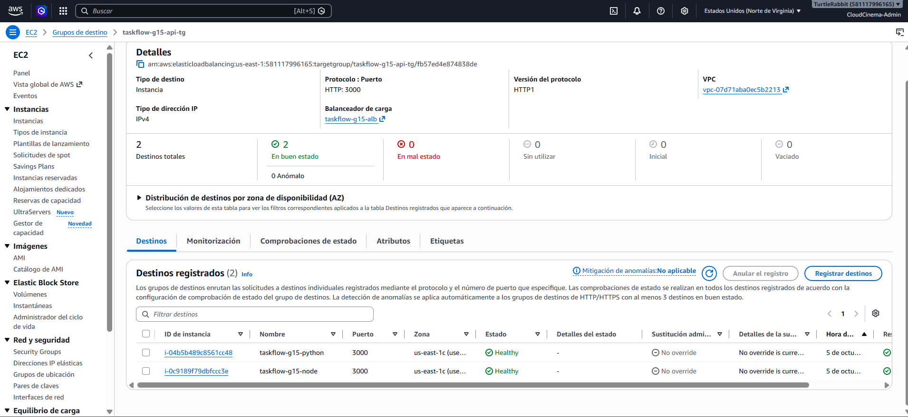

### 5.4 Failover Azure — Python fuera de servicio

Con la VM de Python detenida, APIM y el Load Balancer dirigieron la respuesta a Node:

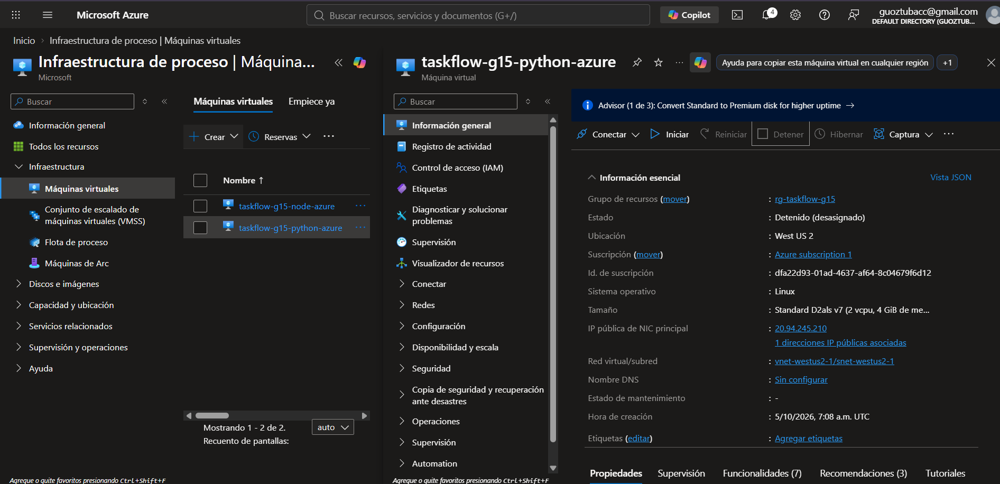

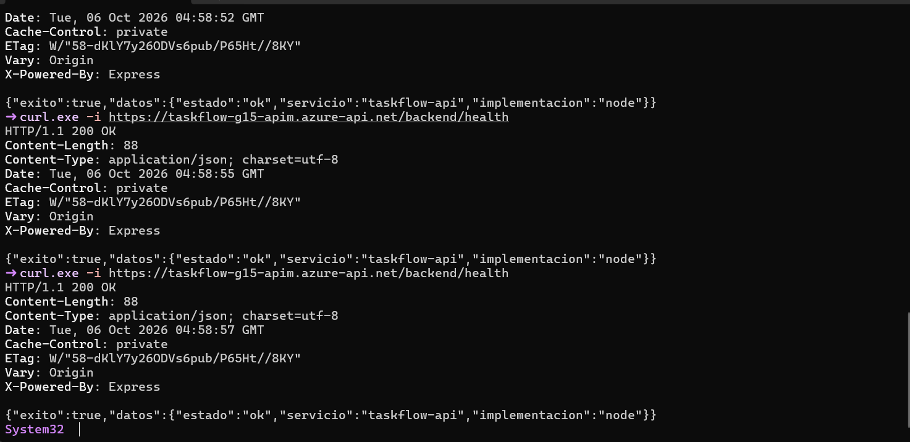

### 5.5 Failover Azure — Node fuera de servicio

Al detener Node, Python permaneció disponible y respondió por APIM:

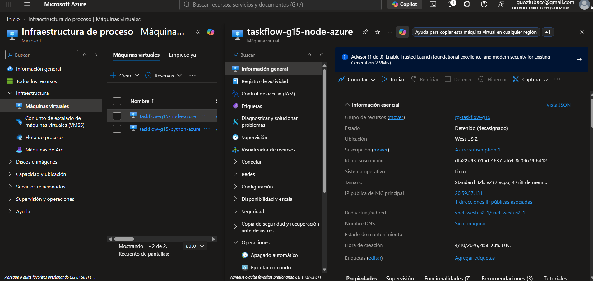

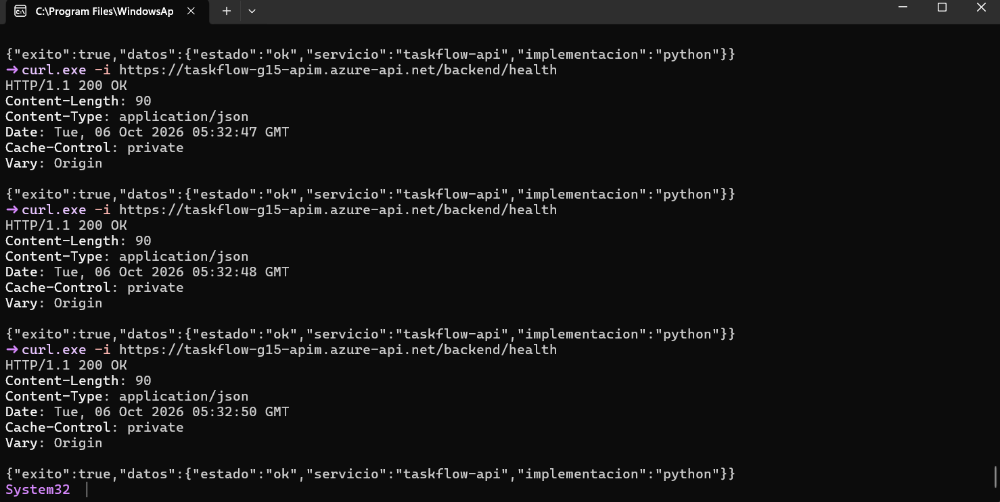

### 5.6 Restauración de Azure

Al terminar la prueba, ambas VM quedaron nuevamente en servicio:

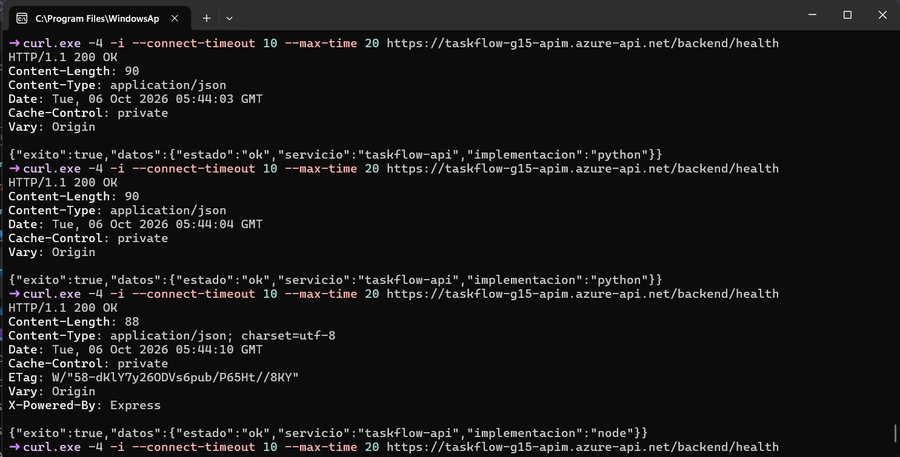

Estas pruebas acreditan respuestas de health/API, no continuidad de sesión, JWT, transacciones, persistencia de datos ni recuperación entre AWS y Azure. El selector AWS/Azure es una selección manual de proveedor; no se configuró failover automático entre nubes. El balanceador distribuye tráfico entre targets saludables, pero no garantiza alternancia por petición.

## 6. Hallazgos y límites

1. **CORS al usar Azure frontend contra AWS:** el navegador mantiene como Origin el dominio donde se abrió el frontend. Si desde el sitio Azure se selecciona AWS, el backend AWS debe permitir el origen Azure. La prueba aportada mostró que API Gateway tenía CORS, pero Python podía responder “Disallowed CORS origin”; falta confirmar la corrección de CORS_ORIGINS y repetir el preflight desde ambos orígenes.
2. **CORS de cargas Azure:** se observó Access-Control-Allow-Origin: * en el preflight de upload. Debe restringirse a los orígenes publicados antes de considerar cerrado el hardening.
3. **SSH de Node en AWS:** la captura registrada muestra el puerto 22 abierto a 0.0.0.0/0. Restringirlo a la IP administrativa autorizada y verificar la regla final.
4. **Transporte:** API Gateway/APIM termina HTTPS hacia el navegador; el tramo hacia los balanceadores/backends es HTTP. El endpoint estático de website de S3 también es HTTP.
5. **Intermitencia observada en APIM:** hubo timeouts transitorios. Después, la ruta correcta /backend/health respondió varias veces con HTTP 200 usando IPv4. No se determinó la causa raíz, así que no se afirma que el problema esté resuelto de forma permanente.
6. **Alcance funcional:** las capturas de dashboard muestran que la aplicación carga y lista tareas; por sí solas no prueban CRUD completo, persistencia compartida, equivalencia de datos entre backends ni continuidad de CloudDrive.
7. **Alta disponibilidad:** en AWS los targets observados se ubicaban en una sola zona. No se documentó aquí una prueba de pérdida de zona ni redundancia completa de almacenamiento/base de datos.

## 7. CloudDrive AWS

Con AWS seleccionado, la interfaz muestra `test_aws_text.txt` y `turtle.jpg` con proveedor S3. El aviso **«Archivo guardado. Ya está en tu CloudDrive.»** confirma que una carga terminó correctamente. Esta evidencia acredita el resultado visible y el listado; no representa por sí sola pruebas exhaustivas de todos los tipos de archivo ni operaciones CRUD completas.

**Límite de esta evidencia:** la captura confirma una operación puntual de guardado y la respuesta visible en la interfaz. Los preflight OPTIONS de las rutas `/upload/*` respondieron correctamente; esto no sustituye la validación funcional completa de los POST ni certifica todos los tipos de archivo.

## 8. Conclusión

PRA2-19 cuenta con los balanceadores, los gateways y los health checks descritos; las pruebas registradas mostraron que Node y Python pueden atender cuando el otro backend se retira del servicio. El frontend llega a ellos a través de API Gateway o APIM, no mediante una conexión directa a las VMs. También se agregó evidencia de una carga y listado de archivos en CloudDrive AWS.

El informe no declara validadas las comprobaciones pendientes de CORS, seguridad ni la cobertura funcional completa que las capturas disponibles no prueban. Después de completar los puntos anteriores, se podrá evaluar el cierre del ticket.
