# Informe de configuración y publicación del sitio web estático en Amazon S3

**Proyecto:** TaskFlow + CloudDrive · Práctica 2 · Grupo 15.  
**Fecha:** 4 de octubre de 2026, según las capturas aportadas.  
**Estado:** sitio estático publicado. La evidencia de CloudDrive AWS acredita una operación puntual exitosa; la estabilidad de todos los flujos de carga no está certificada.

## 1. Propósito y configuración registrada

Se creó un bucket independiente para el frontend estático. No se utiliza el
bucket de archivos de CloudDrive ni se modifican recursos de Practica_1.
Este informe reúne la configuración del bucket, la publicación del sitio y las
capturas principales junto a cada resultado. También distingue lo observado de
lo que todavía falta comprobar.

| Dato | Valor registrado | Fuente |
|---|---|---|
| Bucket | `practica2semi1a1s2026paginawebg15` | Creación y consola S3 |
| Región | `us-east-1` | Formulario de creación |
| Tipo / namespace | Uso general / global | Formulario de creación |
| ARN del bucket | `arn:aws:s3:::practica2semi1a1s2026paginawebg15` | Política pública |
| Usuario IAM | `taskflow-web-g15` | Captura del usuario |
| Política IAM | `TaskFlow-Web-S3-G15` | Política y asociación al usuario |
| ACL | Deshabilitadas | Falta captura específica de ownership |
| Cifrado seleccionado | SSE-S3 | Formulario de creación |
| Versionado seleccionado | Desactivado | Formulario de creación |
| Website hosting | Habilitado | Propiedades del bucket |
| Website endpoint | `http://practica2semi1a1s2026paginawebg15.s3-website-us-east-1.amazonaws.com` | Propiedades y sitio abierto |
| Origen registrado para integración CORS | El mismo esquema y host, sin ruta | Configuración de integración |

## 2. Política IAM y usuario específico

Se creó `TaskFlow-Web-S3-G15` como política administrada por el cliente, limitada
al servicio S3. Su artefacto está en
[`administrator-policy.json`](../../../aws/s3-web/administrator-policy.json).
La captura acredita existencia y resumen de permisos, no un simulador de
permisos efectivos ni una revisión completa de todos los JSON desplegados.

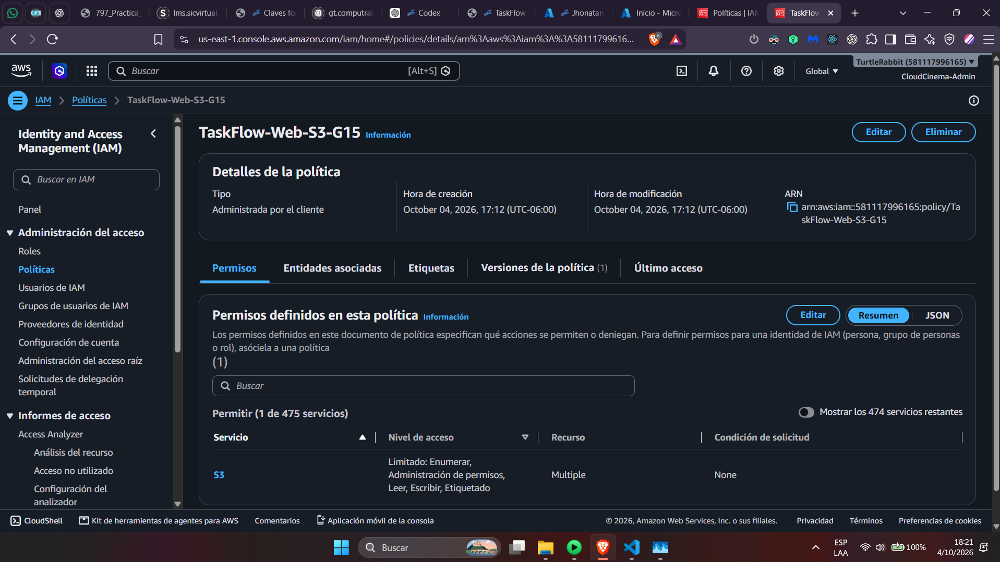

El usuario `taskflow-web-g15` tiene la política adjunta directamente. La captura
muestra una política de permisos asociada y acceso a consola habilitado.

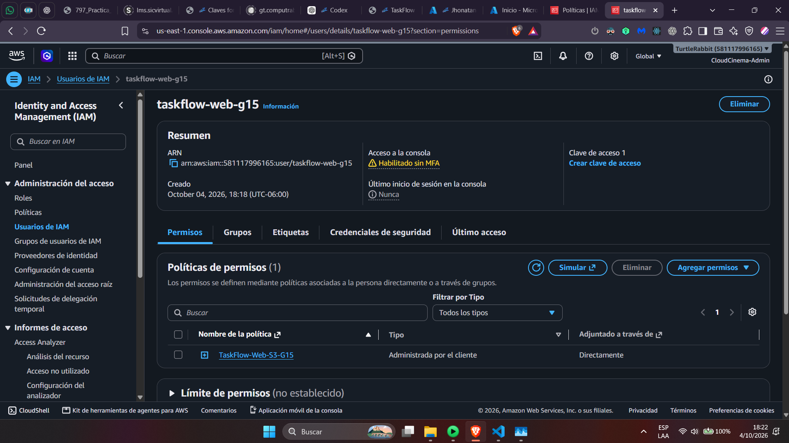

**Pendiente de seguridad:** en esa captura la consola indica **sin MFA**.
Habilitarlo antes de considerar terminado el endurecimiento de la identidad.
Las capturas de creación/publicación muestran la sesión `CloudCinema-Admin`;
no se atribuyen esas operaciones al usuario limitado sin evidencia adicional.

## 3. Creación del bucket, etiquetas y cifrado

Se eligió uso general, namespace global, región `us-east-1` y nombre web propio.

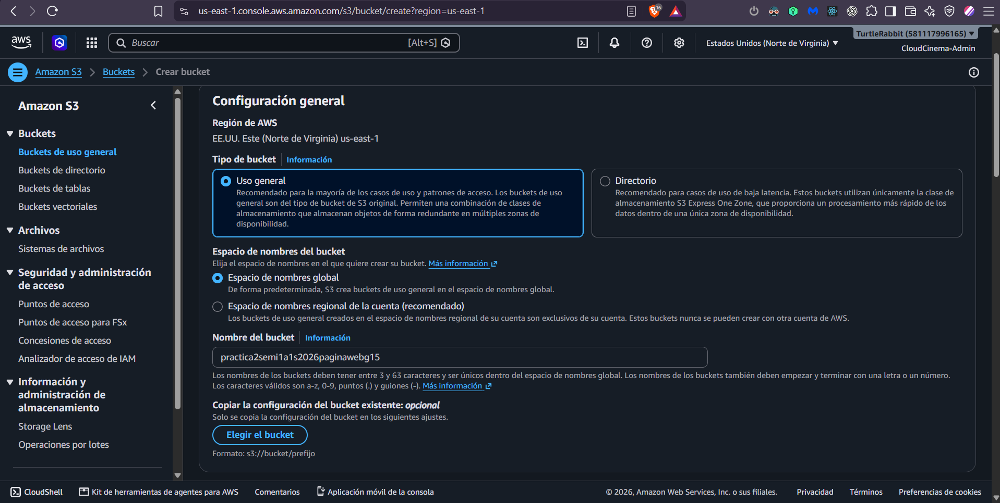

Las etiquetas se definieron como pares clave/valor. El formulario registra:

| Clave | Valor |
|---|---|
| Project | TaskFlow |
| Practice | 2 |
| Group | 15 |
| Purpose | frontend-web |

En el mismo formulario se seleccionó SSE-S3.

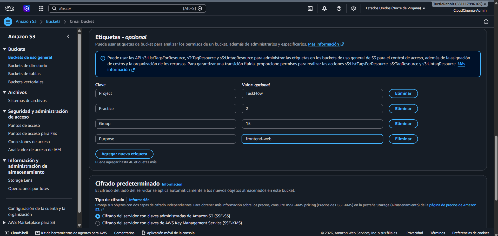

La consola confirmó que el bucket se creó correctamente.

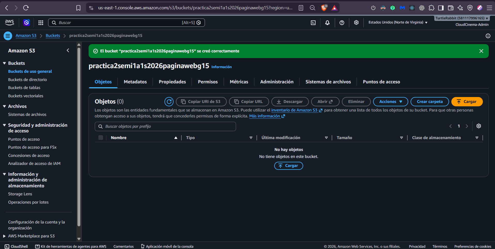

## 4. Hosting estático

Se habilitó alojamiento de buckets como sitio web. La consola muestra el
website endpoint que posteriormente se abrió en el navegador.

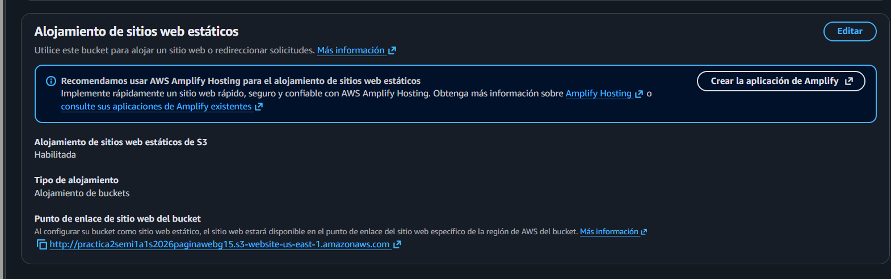

El artefacto previsto usa `index.html`:
[`website.json`](../../../aws/s3-web/website.json). La captura disponible no
muestra el formulario del documento índice; el sitio cargado corrobora la
entrada funcional, no una inspección de todos los parámetros de hosting.

## 5. Acceso público mediante política, no ACL

La política guardada permite al público únicamente `s3:GetObject` sobre
`arn:aws:s3:::practica2semi1a1s2026paginawebg15/*`. No concede escritura,
borrado ni listado anónimo. La consola muestra la confirmación de guardado.

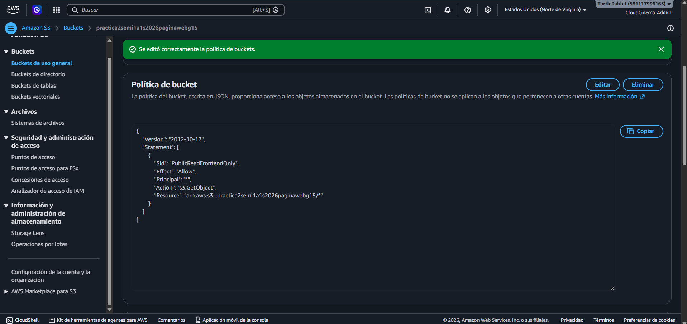

La configuración del bucket mantiene el bloqueo de ACL y permite políticas
públicas:

| Opción | Valor final confirmado |
|---|---|
| BlockPublicAcls | true |
| IgnorePublicAcls | true |
| BlockPublicPolicy | false |
| RestrictPublicBuckets | false |

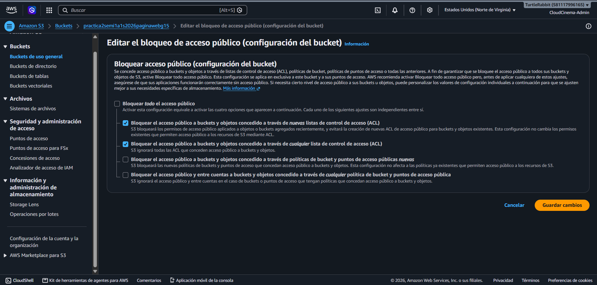

Esta imagen corresponde al editor antes de pulsar Guardar; el guardado final
se reportó completado, aunque no se dispone de una captura del resumen posterior.
Los archivos de referencia son
[política pública](../../../aws/s3-web/public-read-policy.json) y
[bloqueo público](../../../aws/s3-web/public-access-block.json).

Las imágenes `05-public-access-unchecked-draft.png` y
`06-public-access-initial.png` se conservan como historial en `images/`.
Muestran estados intermedios distintos y **no son la configuración final**.
No es necesario repetirlas en el manual.

## 6. Publicación del build

Se cargaron en raíz `index.html`, `config.js`, `favicon.svg` y `assets/`, sin
un prefijo adicional `dist/`. La consola muestra los objetos publicados el
4 de octubre de 2026.

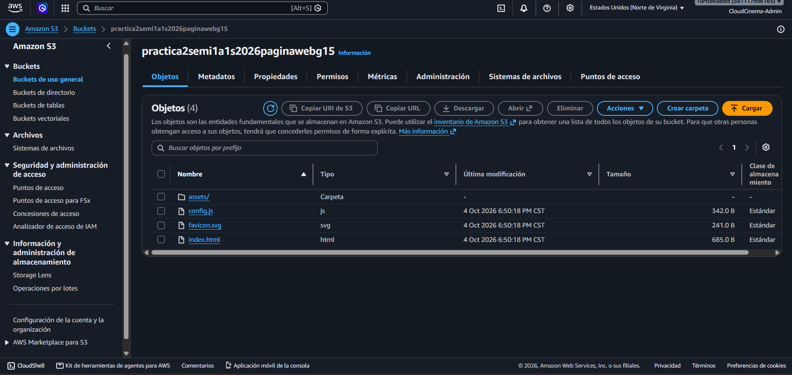

El cliente se construye con React/TypeScript, Vite y pnpm. Los comandos son
`corepack pnpm lint`, `corepack pnpm test` y `corepack pnpm build`.
La validación local anterior pasó 33 pruebas, lint y build; no hay captura de
esos comandos en las imágenes aportadas ni identificación de commit del
build subido. Esa validación no se confunde con pruebas cloud.

## 7. Sitio accesible y coordinación

Esta captura histórica muestra el formulario servido desde el website endpoint,
sin localhost. También contiene la opción de cuenta demo, por lo que solo
acredita que el sitio se publicó en S3; no demuestra login ni persistencia real.

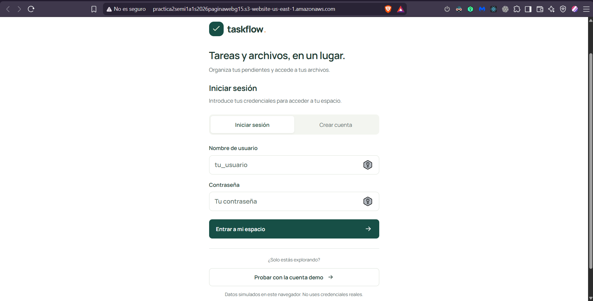

El origen público se compartió con el equipo para configurar CORS en los
servicios que reciben solicitudes del frontend. El bucket estático es el host
del cliente, no un target de backend; los balanceadores y gateways se describen
en el informe de balanceadores.

La captura siguiente muestra el CloudDrive AWS con archivos S3 y un aviso de
guardado exitoso. Esta operación puntual no certifica por sí sola la estabilidad
de todos los tipos y rutas de carga.

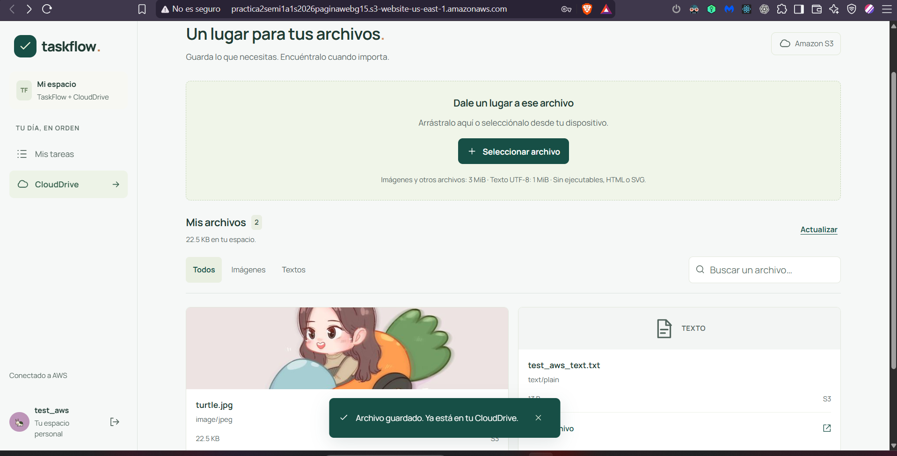

## 8. Conclusión y cierre

La publicación estática y la política de lectura están documentadas. El
website endpoint es HTTP; no se deben usar credenciales reales en este sitio.
Una captura demuestra un guardado puntual de CloudDrive, pero no basta para
certificar la estabilidad de todo el flujo. Las demás verificaciones de
autenticación, CORS, seguridad y persistencia se mantienen separadas de la
evidencia del hosting estático.
