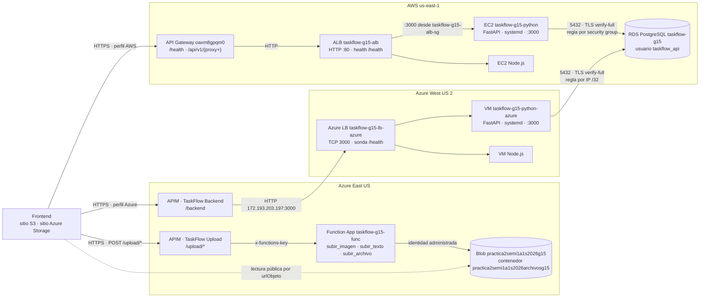

# PRA2-15 - Vertical Python + Azure Serverless

Esta sección es la visión general del bloque de Javier: el backend Python
(PRA2-11), su despliegue en AWS EC2 (PRA2-12) y en una VM de Azure (PRA2-13),
las Azure Functions de carga con API Management (PRA2-14) y su documentación
(PRA2-15). Está escrita para integrarse al [manual técnico](../README.md). La
configuración detallada, las capturas y las validaciones de cada
implementación viven en su reporte de `docs/evidence/`; aquí solo se resumen.
Las contraseñas, el `JWT_SECRET`, las claves de función y las llaves SSH no
aparecen en este documento ni en el repositorio.

| Dato | Valor |
|---|---|
| Curso | Seminario de Sistemas 1 |
| Práctica | Práctica 2 - TaskFlow + CloudDrive |
| Grupo | 15 |
| Tickets | PRA2-11, PRA2-12, PRA2-13, PRA2-14 y PRA2-15 |
| Responsable de esta sección | Javier Velásquez |
| Regiones | AWS `us-east-1`; Azure West US 2 (VM) y East US (Functions y API Management) |
| Actualizado | 6 de octubre de 2026 |

## Implementación → reporte

| Ticket | Implementación | Reporte de evidencias |
|---|---|---|
| PRA2-12 | EC2 `taskflow-g15-python` (AWS) | [`evidence/ec2-python/report.md`](evidence/ec2-python/report.md) |
| PRA2-13 | VM `taskflow-g15-python-azure` (Azure) | [`evidence/azure-vm-python/report.md`](evidence/azure-vm-python/report.md) |
| PRA2-14 | Function App `taskflow-g15-func` + API Management `taskflow-g15-apim` | [`evidence/azure-serverless/report.md`](evidence/azure-serverless/report.md) |

El balanceo de las cuatro instancias (PRA2-19) se documenta en el
[informe de balanceadores](evidence/load-balancers/report.md).

## Arquitectura de la vertical

El mismo backend Python corre en dos nubes contra una única base PostgreSQL
en Amazon RDS. El navegador no llama a las instancias: en AWS entra por API
Gateway hacia el Application Load Balancer, y en Azure por la API
`TaskFlow Backend` de API Management hacia el Azure Load Balancer. Cada
balanceador reparte entre Node.js y Python. La carga de archivos a Azure pasa
por la API `TaskFlow Upload` de API Management, que entrega la petición a tres
Azure Functions; estas escriben en Blob Storage con identidad administrada y
devuelven la URL del objeto, que el frontend registra después en el backend
con `POST /api/v1/files`.

| Componente | Recurso | Ubicación |
|---|---|---|
| Backend Python en AWS | EC2 `taskflow-g15-python` (`i-04b5b489c8561cc48`), destino del ALB `taskflow-g15-alb` | `us-east-1` |
| Backend Python en Azure | VM `taskflow-g15-python-azure` (`172.16.0.5`), destino del Azure LB `taskflow-g15-lb-azure` | `rg-taskflow-g15`, West US 2 |
| Base de datos compartida | RDS `taskflow-g15`, base `taskflow` | `us-east-1` |
| Funciones de carga | Function App `taskflow-g15-func` | `rg-practica2-semi1a1s2026-g15`, East US |
| Capa de API | API Management `taskflow-g15-apim`: `TaskFlow Upload` (PRA2-14) y `TaskFlow Backend` (PRA2-19) | `rg-practica2-semi1a1s2026-g15`, East US |
| Almacenamiento de objetos | Storage Account `practica2semi1a1s2026g15`, contenedor `practica2semi1a1s2026archivosg15` (PRA2-3) | East US |

## PRA2-11 - Backend Python y paridad con Node.js

### Alcance

Implementación en Python del contrato común
[`contracts/openapi.yaml`](../contracts/openapi.yaml), con el mismo
comportamiento observable que el backend Node.js: rutas, códigos HTTP, sobre
de respuesta, mensajes de error, validaciones, JWT y bcrypt.

### Configuración validada

| Aspecto | Valor |
|---|---|
| Lenguaje | Python 3.11+ (3.12 del sistema en Ubuntu 24.04) |
| Framework | FastAPI con uvicorn |
| Acceso a datos | psycopg 3 con pool de conexiones (`psycopg-pool`) |
| Contraseñas | bcrypt, costo 10, escribe `$2b$` y acepta solo `$2a$` y `$2b$` |
| Tokens | JWT HS256 (PyJWT) con el mismo `JWT_SECRET` que Node.js y las funciones |
| Puerto | `3000` |
| Dependencias | [`api-python/requirements.txt`](../api-python/requirements.txt) |

| Módulo | Responsabilidad |
|---|---|
| [`app/main.py`](../api-python/app/main.py) | Aplicación, CORS y manejadores de error |
| [`app/acuerdos.py`](../api-python/app/acuerdos.py) | Única fuente de las decisiones de paridad: catálogo de errores y mensajes, bcrypt, JWT, fechas e identificación del servicio |
| `app/autenticacion/`, `app/tareas/`, `app/archivos/`, `app/salud/` | Routers, esquemas y servicios por recurso |
| [`app/seguridad.py`](../api-python/app/seguridad.py) | Hash y verificación bcrypt; emisión y validación del JWT |
| [`app/database.py`](../api-python/app/database.py) | Pool de PostgreSQL con TLS |
| [`scripts/smoke_test.py`](../api-python/scripts/smoke_test.py) | Prueba de humo contra cualquier backend que cumpla el contrato |

| Método | Ruta | Éxito |
|---|---|---|
| `GET` | `/health` | 200 (503 `BD_NO_DISPONIBLE` si no alcanza RDS) |
| `POST` | `/api/v1/auth/register` · `/api/v1/auth/login` | 201 · 200 |
| `GET` · `POST` | `/api/v1/tasks` | 200 · 201 |
| `GET` · `PUT` · `PATCH` · `DELETE` | `/api/v1/tasks/{taskId}` | 200 · 200 · 200 · 204 |
| `GET` · `POST` | `/api/v1/files` | 200 · 201 |
| `GET` · `DELETE` | `/api/v1/files/{fileId}` | 200 · 204 |

Las rutas de tareas y archivos exigen `Authorization: Bearer <token>`; el
usuario sale siempre del token. La tabla completa de errores está en
[`api-python/README.md`](../api-python/README.md).

### Reglas de paridad

Las reglas se acordaron con Daniel y están cerradas. Viven en dos lugares:
[`app/acuerdos.py`](../api-python/app/acuerdos.py) (código) y
[`docs/paridad-backends.md`](paridad-backends.md) (especificación para
replicarlas en Node.js, con checklist en su §21).

| Regla | Detalle | Referencia |
|---|---|---|
| Sobre de respuesta | `{ exito, datos }` o `{ exito: false, error }` | [paridad §1](paridad-backends.md#1-formato-general-de-respuestas) |
| Recurso ajeno o inexistente | El mismo 404, sin revelar que existe | [paridad §15](paridad-backends.md#15-aislamiento-entre-usuarios) |
| IDs de ruta | `^[1-9][0-9]*$` hasta BIGINT; sin token, el 401 va antes que el 400 | [paridad §12](paridad-backends.md#12-ids-de-ruta-taskid-fileid) |
| JWT | HS256, `exp` sin tolerancia, `iat` no se valida | [paridad §9](paridad-backends.md#9-jwt) |
| Método no permitido y barra final | 404 `NO_ENCONTRADO`, sin redirección | [paridad §16](paridad-backends.md#16-rutas-inexistentes-métodos-barra-final-cors) |
| Fechas | Entrada ISO 8601 con zona; salida en UTC | [paridad §11](paridad-backends.md#11-fechas) |
| `GET /health` | `SELECT 1` con límite de 2 s; identifica `implementacion` | [paridad §17](paridad-backends.md#17-get-health) |

### Validaciones

| Validación | Resultado |
|---|---|
| Pruebas automáticas (`pytest`, unitarias y de integración contra el PostgreSQL local de Docker) | 195 pruebas |
| Prueba de humo contra el RDS real desde la EC2 (3 y 4 de octubre de 2026) | 20/20 OK, 0 FALLO |
| Prueba de humo contra el RDS real desde la VM de Azure (5 de octubre de 2026) | 20/20 OK, 0 FALLO |

La prueba de humo cubre: salud; registro; registro repetido (409); login con
contraseña incorrecta (401); login correcto; el ciclo de tareas (crear,
listar, obtener, editar, completar, descompletar, eliminar y 404 posterior);
metadatos de archivos `S3` y `BLOB` (registrar, listar y eliminar), y acceso
sin token (401). Sirve igual para el backend Node.js
([paridad §20.8](paridad-backends.md#208-prueba-de-humo-compartida)).

### Artefactos entregados

- [Código del backend](../api-python/app/)
- [Pruebas automáticas](../api-python/tests/)
- [Prueba de humo](../api-python/scripts/smoke_test.py)
- [README del módulo](../api-python/README.md)
- [Variables de entorno de ejemplo](../api-python/.env.example)
- [Reglas de paridad](paridad-backends.md)

## PRA2-12 - EC2 Python

Backend Python en la EC2 `taskflow-g15-python` (`t3.micro`, Ubuntu 24.04) como
servicio systemd, conectado al RDS con `taskflow_api` y TLS `verify-full`. El
`3000` solo admite el security group del ALB (`taskflow-g15-alb-sg`) y la
regla del RDS referencia el security group de la EC2. La IP pública no es
elástica (`54.175.232.11` el 6 de octubre de 2026); el punto de entrada es el
balanceador. `/health` 200, humo 20/20 y CORS limitado a los dos sitios del
frontend. Detalle: [reporte de la EC2 Python](evidence/ec2-python/report.md).

## PRA2-13 - VM de Azure Python

El mismo backend e instalador en `taskflow-g15-python-azure`
(`Standard_D2als_v7`, elegido por cuota 0 en Bsv2), en la VNet compartida con
la VM Node.js para un único Azure Load Balancer. IP pública estática
`20.94.245.210`, autorizada como `/32` en el RDS. `/health` 200, humo 20/20 y
CORS limitado a los dos sitios del frontend. Detalle:
[reporte de la VM de Azure Python](evidence/azure-vm-python/report.md).

## PRA2-14 - Azure Functions y API Management

Tres funciones Python (`subir_imagen`, `subir_texto`, `subir_archivo`) que
cumplen el [contrato serverless](contrato-serverless.md) y escriben en Blob
con identidad administrada acotada al contenedor. Se publican en la API
`TaskFlow Upload` de API Management, sin suscripción y con la clave de función
inyectada. Las tres rutas responden `201`; el frontend las usa para la imagen
de perfil y CloudDrive. Detalle:
[reporte de Azure Serverless](evidence/azure-serverless/report.md).

## Artefactos reproducibles versionados

| Artefacto | Ticket | Uso |
|---|---|---|
| [`api-python/`](../api-python/README.md) | PRA2-11 | Backend Python, pruebas y README |
| [`api-python/app/acuerdos.py`](../api-python/app/acuerdos.py) | PRA2-11 | Decisiones de paridad en código |
| [`docs/paridad-backends.md`](paridad-backends.md) | PRA2-11 | Especificación de paridad Node.js / Python |
| [`api-python/scripts/smoke_test.py`](../api-python/scripts/smoke_test.py) | PRA2-11 a PRA2-13 | Prueba de humo para cualquier backend |
| [`api-python/deploy/instalar_ec2.sh`](../api-python/deploy/instalar_ec2.sh) | PRA2-12 y PRA2-13 | Instalador idempotente del servicio |
| [`api-python/deploy/taskflow-python.service`](../api-python/deploy/taskflow-python.service) | PRA2-12 y PRA2-13 | Unidad systemd endurecida |
| [`api-python/deploy/python.env.example`](../api-python/deploy/python.env.example) | PRA2-12 y PRA2-13 | Plantilla del archivo de entorno, sin secretos |
| [`aws/iam/pra2-12-ec2-python-policy.json`](../aws/iam/pra2-12-ec2-python-policy.json) | PRA2-12 | Política IAM de mínimo privilegio |
| [`aws/scripts/deploy-ec2-python.sh`](../aws/scripts/deploy-ec2-python.sh) | PRA2-12 | Despliegue de referencia en la EC2 |
| [`database/crear_usuario_api.sql`](../database/crear_usuario_api.sql) | PRA2-12 | Creación y verificación de `taskflow_api` |
| [`azure/vm-python/deploy-azure-vm-python.sh`](../azure/vm-python/deploy-azure-vm-python.sh) | PRA2-13 | Creación de la VM, regla del RDS y despliegue de referencia |
| [`azure/functions/`](../azure/functions/README.md) | PRA2-14 | Código y pruebas de las Azure Functions |
| [`azure/apim/cors-policy.xml`](../azure/apim/cors-policy.xml) | PRA2-14 | Política CORS de `TaskFlow Upload` ([instrucciones](../azure/apim/README.md)) |
| [`docs/contrato-serverless.md`](contrato-serverless.md) | PRA2-14 | Contrato común Lambda / Azure Function |

## Decisiones transversales

| Decisión | Motivo |
|---|---|
| Un instalador para la EC2 y la VM | El mismo servicio, los mismos permisos y la misma verificación en las dos nubes |
| Secretos solo en `/etc/taskflow/python.env` (`root:taskflow 640`) y en la configuración de la Function App | Nunca en el repositorio ni en argumentos de comandos |
| Mismo `JWT_SECRET` en los backends y las funciones | Un token emitido por cualquier backend vale para cargar archivos en cualquier nube |
| Regla del RDS por security group en AWS y por IP `/32` en Azure | Azure no puede referenciar un security group de AWS; la IP de la VM es estática |
| Backends detrás de un balanceador por nube | El navegador entra por API Gateway o API Management; las instancias no son el punto de entrada |
| `CORS_ORIGINS` con los dos sitios publicados y `localhost:3000` | Los dos hostings del frontend llegan a cualquiera de los backends; otros orígenes reciben `400` |
| CORS de carga en API Management y no en la Function App | Lo exige el contrato §10, igual que en API Gateway |

Las limitaciones vigentes de cada implementación están en la última sección de
su reporte.

## Conclusión: AWS frente a Azure

| Aspecto | AWS | Azure |
|---|---|---|
| Cuotas y tamaños de VM | `t3.micro` se lanzó sin ajustes de cuota | La cuota de la familia Bsv2 era 0: hubo que elegir `Standard_D2als_v7` |
| Acceso a la base de datos | La regla del RDS referencia el security group de la EC2 y sobrevive a cambios de IP (la EC2 no tiene IP elástica) | La VM está en otra nube: la regla del RDS es por IP y exige una IP pública estática |
| Identidad | El backend no usa APIs de AWS; IAM limita a quien administra la EC2 | La Function App escribe en Blob con identidad administrada y RBAC sobre el contenedor, sin secretos de almacenamiento |
| Capa de API serverless | API Gateway HTTP API, con CORS integrado en su configuración | API Management: importación directa de la Function App, inyección de la clave de función y CORS como política XML; exige suscripción por defecto, y hubo que desactivarla |
| Balanceo | API Gateway → ALB de capa 7 (listener HTTP, target group con health check); el `3000` de la EC2 solo admite el security group del ALB | API Management → Azure Load Balancer de capa 4 (regla TCP con sonda HTTP); el balanceador no tiene security group propio y el NSG de la VM se gestiona aparte |
| Aprovisionamiento | La EC2 se lanzó directamente desde el asistente | El nivel Consumo de API Management evitó la espera de los niveles dedicados: la API quedó creada en unos 13 minutos |

En la práctica, AWS resultó más directo para el cómputo y la red: cuotas
holgadas, reglas entre security groups y un balanceador de capa 7 que limita
el acceso a las instancias con una sola referencia. Azure fue más cómodo para
la parte serverless segura: la identidad administrada eliminó las claves de
almacenamiento y API Management resolvió en un solo recurso la clave de
función, el CORS y la publicación, además de servir como entrada HTTPS del
balanceador. Las dos nubes sirven el mismo backend contra la misma base, con
la misma prueba de humo en 20/20.
