# PRA2-15 - Vertical Python + Azure Serverless

Esta sección documenta el bloque de Javier: el backend Python (PRA2-11), su
despliegue en AWS EC2 (PRA2-12) y en una VM de Azure (PRA2-13), las Azure
Functions de carga con API Management (PRA2-14) y su documentación (PRA2-15).
Está escrita para integrarse al [manual técnico](../README.md). Las
contraseñas, el `JWT_SECRET`, las claves de función y las llaves SSH se
comparten **solo por mensaje privado** y no aparecen en este documento ni en
el repositorio.

| Dato | Valor |
|---|---|
| Curso | Seminario de Sistemas 1 |
| Práctica | Práctica 2 - TaskFlow + CloudDrive |
| Grupo | 15 |
| Tickets | PRA2-11, PRA2-12, PRA2-13, PRA2-14 y PRA2-15 |
| Responsable de esta sección | Javier Velásquez |
| Regiones | AWS `us-east-1`; Azure West US 2 (VM) y East US (Functions y API Management) |

## Arquitectura de la vertical

El mismo backend Python corre en dos nubes contra una única base PostgreSQL
en Amazon RDS. La carga de archivos a Azure pasa por API Management, que
entrega la petición a tres Azure Functions; estas escriben en Blob Storage con
identidad administrada y devuelven la URL del objeto, que el frontend registra
después en el backend con `POST /api/v1/files`.

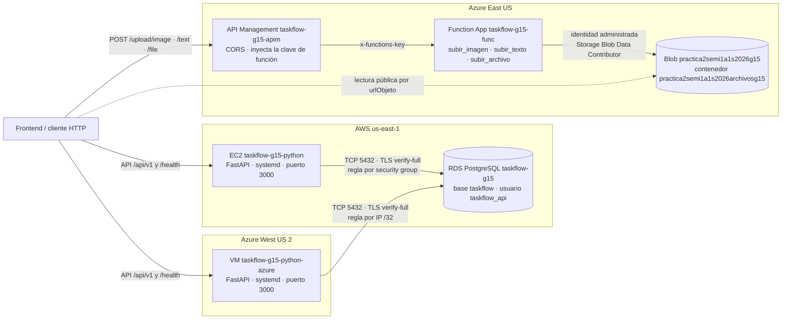

| Componente | Recurso | Ubicación |
|---|---|---|
| Backend Python en AWS | EC2 `taskflow-g15-python` (`i-04b5b489c8561cc48`) | `us-east-1`, VPC `vpc-07d71aba0ec5b2213` |
| Backend Python en Azure | VM `taskflow-g15-python-azure` | `rg-taskflow-g15`, West US 2 |
| Base de datos compartida | RDS `taskflow-g15`, base `taskflow` | `us-east-1` |
| Funciones de carga | Function App `taskflow-g15-func` | `rg-practica2-semi1a1s2026-g15`, East US |
| Capa de API de carga | API Management `taskflow-g15-apim` | `rg-practica2-semi1a1s2026-g15`, East US |
| Almacenamiento de objetos | Storage Account `practica2semi1a1s2026g15`, contenedor `practica2semi1a1s2026archivosg15` (PRA2-3, Isai) | East US |

## PRA2-11 - Backend Python y paridad con Node.js

### Alcance

Implementación en Python del contrato común
[`contracts/openapi.yaml`](../contracts/openapi.yaml), con el mismo
comportamiento observable que el backend Node.js: rutas, códigos HTTP, sobre
de respuesta, mensajes de error, validaciones, JWT y bcrypt.

### Configuración validada

| Aspecto | Valor |
|---|---|
| Lenguaje | Python 3.11+ (3.12 del sistema en Ubuntu 24.04) |
| Framework | FastAPI con uvicorn |
| Acceso a datos | psycopg 3 con pool de conexiones (`psycopg-pool`) |
| Contraseñas | bcrypt, costo 10, escribe `$2b$` y acepta solo `$2a$` y `$2b$` |
| Tokens | JWT HS256 (PyJWT) con el mismo `JWT_SECRET` que Node.js y las funciones |
| Puerto | `3000` |
| Dependencias | [`api-python/requirements.txt`](../api-python/requirements.txt) |

| Módulo | Responsabilidad |
|---|---|
| [`app/main.py`](../api-python/app/main.py) | Aplicación, CORS y manejadores de error |
| [`app/acuerdos.py`](../api-python/app/acuerdos.py) | Única fuente de las decisiones de paridad: catálogo de errores y mensajes, bcrypt, JWT, fechas e identificación del servicio |
| `app/autenticacion/`, `app/tareas/`, `app/archivos/`, `app/salud/` | Routers, esquemas y servicios por recurso |
| [`app/seguridad.py`](../api-python/app/seguridad.py) | Hash y verificación bcrypt; emisión y validación del JWT |
| [`app/database.py`](../api-python/app/database.py) | Pool de PostgreSQL con TLS |
| [`scripts/smoke_test.py`](../api-python/scripts/smoke_test.py) | Prueba de humo contra cualquier backend que cumpla el contrato |

| Método | Ruta | Éxito |
|---|---|---|
| `GET` | `/health` | 200 (503 `BD_NO_DISPONIBLE` si no alcanza RDS) |
| `POST` | `/api/v1/auth/register` · `/api/v1/auth/login` | 201 · 200 |
| `GET` · `POST` | `/api/v1/tasks` | 200 · 201 |
| `GET` · `PUT` · `PATCH` · `DELETE` | `/api/v1/tasks/{taskId}` | 200 · 200 · 200 · 204 |
| `GET` · `POST` | `/api/v1/files` | 200 · 201 |
| `GET` · `DELETE` | `/api/v1/files/{fileId}` | 200 · 204 |

Las rutas de tareas y archivos exigen `Authorization: Bearer <token>`; el
usuario sale siempre del token. La tabla completa de errores está en
[`api-python/README.md`](../api-python/README.md).

### Reglas de paridad

Las reglas se acordaron con Daniel y están cerradas. Viven en dos lugares:
[`app/acuerdos.py`](../api-python/app/acuerdos.py) (código) y
[`docs/paridad-backends.md`](paridad-backends.md) (especificación para
replicarlas en Node.js, con checklist en su §21).

| Regla | Detalle | Referencia |
|---|---|---|
| Sobre de respuesta | `{ exito, datos }` o `{ exito: false, error }` | [paridad §1](paridad-backends.md#1-formato-general-de-respuestas) |
| Recurso ajeno o inexistente | El mismo 404, sin revelar que existe | [paridad §15](paridad-backends.md#15-aislamiento-entre-usuarios) |
| IDs de ruta | `^[1-9][0-9]*$` hasta BIGINT; sin token, el 401 va antes que el 400 | [paridad §12](paridad-backends.md#12-ids-de-ruta-taskid-fileid) |
| JWT | HS256, `exp` sin tolerancia, `iat` no se valida | [paridad §9](paridad-backends.md#9-jwt) |
| Método no permitido y barra final | 404 `NO_ENCONTRADO`, sin redirección | [paridad §16](paridad-backends.md#16-rutas-inexistentes-métodos-barra-final-cors) |
| Fechas | Entrada ISO 8601 con zona; salida en UTC | [paridad §11](paridad-backends.md#11-fechas) |
| `GET /health` | `SELECT 1` con límite de 2 s; identifica `implementacion` | [paridad §17](paridad-backends.md#17-get-health) |

### Validaciones

| Validación | Resultado |
|---|---|
| Pruebas automáticas (`pytest`, unitarias y de integración contra el PostgreSQL local de Docker) | 195 pruebas |
| Prueba de humo contra el RDS real desde la EC2 (3 y 4 de octubre de 2026) | 20/20 OK, 0 FALLO |
| Prueba de humo contra el RDS real desde la VM de Azure (5 de octubre de 2026) | 20/20 OK, 0 FALLO |

La prueba de humo cubre: salud; registro; registro repetido (409); login con
contraseña incorrecta (401); login correcto; el ciclo de tareas (crear,
listar, obtener, editar, completar, descompletar, eliminar y 404 posterior);
metadatos de archivos `S3` y `BLOB` (registrar, listar y eliminar), y acceso
sin token (401). Sirve igual para el backend Node.js
([paridad §20.8](paridad-backends.md#208-prueba-de-humo-compartida)).

### Artefactos entregados

- [Código del backend](../api-python/app/)
- [Pruebas automáticas](../api-python/tests/)
- [Prueba de humo](../api-python/scripts/smoke_test.py)
- [README del módulo](../api-python/README.md)
- [Variables de entorno de ejemplo](../api-python/.env.example)
- [Reglas de paridad](paridad-backends.md)

## PRA2-12 - EC2 Python

### Alcance

Despliegue del backend Python en una EC2 de AWS como servicio systemd,
conectado al RDS `taskflow-g15` con el usuario de aplicación `taskflow_api` y
TLS `verify-full`.

### Configuración validada

| Configuración | Valor |
|---|---|
| Instancia | `taskflow-g15-python` (`i-04b5b489c8561cc48`) |
| Tipo | `t3.micro` |
| Imagen | Ubuntu Server 24.04 LTS (x86), Python 3.12 del sistema |
| Región y red | `us-east-1`, VPC predeterminada `vpc-07d71aba0ec5b2213` |
| Par de claves | `taskflow-g15-python`, ED25519, formato `.pem` (la llave privada no se versiona) |
| Security group | `taskflow-g15-ec2-python` (`sg-015ae01b9517f688c`) |
| Servicio | systemd `taskflow-python`, usuario de sistema `taskflow` sin shell |
| Código | `/opt/taskflow-python`, propiedad de `root` y de solo lectura para el servicio |
| Configuración | `/etc/taskflow/python.env`, `root:taskflow`, permisos `640` |
| IP pública | No se documenta: cambia cada vez que la instancia se detiene |

### IAM de mínimo privilegio

La EC2 la crea y administra el usuario de IAM `taskflow-g15-ec2-python`, con
la política administrada por el cliente `taskflow-g15-ec2-python-policy`
adjuntada directamente. Su JSON está versionado en
[`aws/iam/pra2-12-ec2-python-policy.json`](../aws/iam/pra2-12-ec2-python-policy.json).

| Instrucción (`Sid`) | Permisos | Límite |
|---|---|---|
| `Ec2DescribeEnRegion` | `ec2:Describe*` (solo lectura) | Condición `aws:RequestedRegion = us-east-1` |
| `Ec2GestionEnRegion` | Ciclo de vida de instancias (`RunInstances`, `Start`, `Stop`, `Reboot`, `Terminate`), security groups y sus reglas, pares de claves y `CreateTags` | Condición `aws:RequestedRegion = us-east-1` |
| `LeerAmiUbuntu` | `ssm:GetParameter`, `ssm:GetParameters` | Solo el parámetro público de la AMI de Ubuntu Server 24.04 de Canonical |

La política no concede IAM, RDS, S3 ni ningún otro servicio, y no puede actuar
fuera de `us-east-1`. El backend no llama a APIs de AWS: solo abre una
conexión PostgreSQL al RDS, así que la instancia no necesita claves de acceso
de AWS.

### Security group y puertos

| Regla de entrada | Origen | Motivo |
|---|---|---|
| TCP `3000` | `0.0.0.0/0` | Al crear el grupo estaba limitada a la IP del desarrollador; se abrió para que el balanceador (PRA2-19) y el equipo alcancen la API |
| SSH `22` | IP del desarrollador | Administración |

En el RDS, el security group `rds-taskflow-g15` (`sg-063f677d0d31377a4`)
admite TCP `5432` con origen `sg-015ae01b9517f688c`: la regla referencia el
grupo, no una IP, y sigue siendo válida aunque cambie la IP pública de la EC2.

### Servicio y variables de entorno

El instalador idempotente
[`deploy/instalar_ec2.sh`](../api-python/deploy/instalar_ec2.sh) instala los
paquetes, crea el usuario `taskflow`, copia el código, crea el entorno
virtual, descarga el bundle de certificados de RDS en
`/etc/taskflow/global-bundle.pem` e instala la unidad
[`taskflow-python.service`](../api-python/deploy/taskflow-python.service)
(con `NoNewPrivileges`, `PrivateTmp` y `ProtectSystem=full`). No arranca el
servicio mientras queden marcadores `REEMPLAZAR_` y nunca imprime el archivo
de entorno.

| Variable (solo nombres) | Uso |
|---|---|
| `DB_HOST`, `DB_PORT`, `DB_NAME` | Endpoint del RDS, `5432`, `taskflow` |
| `DB_USER`, `DB_PASSWORD` | `taskflow_api` y su contraseña (canal privado) |
| `DB_SSLMODE`, `DB_SSLROOTCERT` | `verify-full` y `/etc/taskflow/global-bundle.pem` |
| `PORT` | `3000` |
| `JWT_SECRET`, `JWT_EXPIRES_IN` | Secreto HS256 compartido y vigencia de 3600 s |
| `CORS_ORIGINS` | Orígenes del frontend |

La plantilla sin secretos es
[`deploy/python.env.example`](../api-python/deploy/python.env.example).

### Usuario de base de datos `taskflow_api`

El backend nunca usa el usuario maestro. `taskflow_api` es un rol con `LOGIN`
y sin atributos de administración, miembro del rol de grupo `taskflow_app`,
que solo tiene los permisos que la API necesita sobre `usuarios`, `tareas` y
`archivos` ([runbook §6-§9](runbook-bd-rds.md#7-crear-el-usuario-taskflow_api)).
Se creó desde la EC2 con
[`database/crear_usuario_api.sql`](../database/crear_usuario_api.sql), que lee
la contraseña de una variable de entorno y verifica el rol antes de confirmar
la transacción. Salida de la ejecución:

```text
BEGIN
SET
DO
CREATE ROLE
ALTER ROLE
GRANT ROLE
NOTICE:  Rol taskflow_api listo: LOGIN, miembro de taskflow_app, sin privilegios de administración.
DO
COMMIT
```

### Evidencia

1. **Política de IAM en JSON.** Muestra las tres instrucciones de la política
   versionada, con la condición de región en las dos de EC2.

   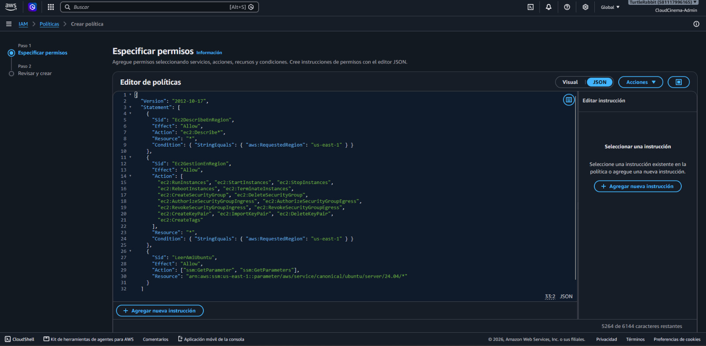

2. **Revisión de la política.** Confirma el nombre
   `taskflow-g15-ec2-python-policy` y que solo concede EC2 (enumerar,
   escribir y etiquetar, con `aws:RequestedRegion = us-east-1`) y lectura de
   Systems Manager.

   

3. **Usuario de IAM con la política adjunta.** La política se adjunta
   directamente al usuario nuevo.

   

4. **Usuario creado.** Se creó `taskflow-g15-ec2-python`; la contraseña de
   consola aparece enmascarada.

   

5. **Creación del security group.** Grupo `taskflow-g15-ec2-python` en la VPC
   `vpc-07d71aba0ec5b2213`, con SSH y TCP `3000` limitados inicialmente a la
   IP del desarrollador (el `3000` se abrió después a `0.0.0.0/0`).

   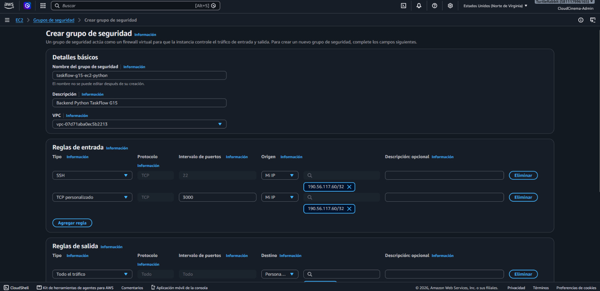

6. **Par de claves.** Par `taskflow-g15-python` de tipo ED25519 en formato
   `.pem`.

   

7. **AMI de la instancia.** Instancia `taskflow-g15-python` con Ubuntu Server
   24.04 LTS de Canonical (x86, proveedor verificado).

   

8. **Regla del RDS.** El security group `rds-taskflow-g15` admite PostgreSQL
   (TCP `5432`) desde `sg-015ae01b9517f688c` (Python) y desde
   `sg-0bbf5e7008267ff85` (Node.js), sin orígenes abiertos.

   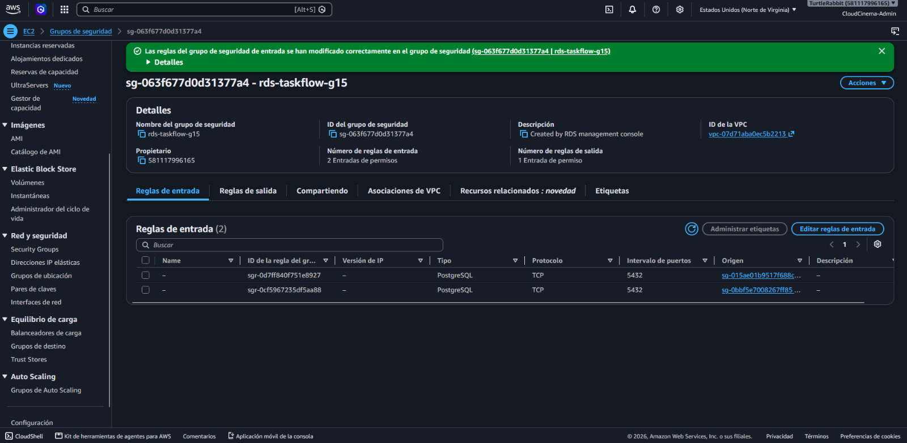

9. **`GET /health` en la EC2.** HTTP `200` servido por uvicorn con
   `implementacion: "python"`: el servicio corre y alcanza el RDS.

   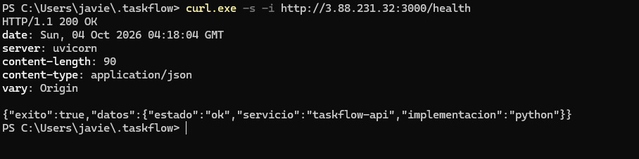

### Validaciones

| Validación | Resultado | Evidencia |
|---|---|---|
| El servicio responde y alcanza el RDS | HTTP `200`, `estado: "ok"`, `implementacion: "python"` (5 de octubre de 2026) | [Captura 9](../Document/img/pra2-12-ec2-python/09-health-200.jpeg) |
| La API completa funciona contra el RDS real con `taskflow_api` | Prueba de humo 20/20 OK (3 y 4 de octubre de 2026) | [Pruebas y evidencia](#pruebas-y-evidencia) |
| El RDS no está abierto a cualquier origen | Regla `5432` por security group | [Captura 8](../Document/img/pra2-12-ec2-python/08-rds-regla-desde-sg-python.jpeg) |
| El usuario de aplicación no tiene privilegios de administración | Verificado por el propio script antes del `COMMIT` | Salida del script, arriba |

### Artefactos entregados

- [Script de despliegue de referencia](../aws/scripts/deploy-ec2-python.sh)
- [Instalador](../api-python/deploy/instalar_ec2.sh), [unidad systemd](../api-python/deploy/taskflow-python.service) y [plantilla de entorno](../api-python/deploy/python.env.example)
- [Política IAM](../aws/iam/pra2-12-ec2-python-policy.json)
- [Creación del usuario de aplicación](../database/crear_usuario_api.sql)

## PRA2-13 - VM de Azure Python

### Alcance

El mismo backend Python en una máquina virtual de Azure, instalado con el
mismo instalador que la EC2 y conectado al mismo RDS de AWS.

### Configuración validada

| Configuración | Valor |
|---|---|
| VM | `taskflow-g15-python-azure` |
| Grupo de recursos | `rg-taskflow-g15` |
| Región | West US 2, sin redundancia de infraestructura |
| Imagen | Ubuntu Server 24.04 LTS x64 Gen2 (24.04.4), Python 3.12.3 |
| Tipo de seguridad | Estándar |
| Tamaño | `Standard_D2als_v7`: AMD x64, 2 vCPU, 4 GiB (el portal estimó 58.69 USD al mes por la VM) |
| Red virtual / subred | `vnet-westus2-1` / `snet-westus2-1` |
| IP privada | `172.16.0.5` |
| IP pública | `20.94.245.210`, SKU estándar, estática |
| NSG | `taskflow-g15-python-azure-nsg` |
| Administración | Usuario `azureuser` con clave SSH (la llave privada no se versiona) |
| Servicio | systemd `taskflow-python`; `/etc/taskflow/python.env` con `root:taskflow` y `640` |

### Tamaño elegido

El tamaño previsto era `Standard_B2ls_v2`, pero la cuota de vCPU de la
familia Bsv2 estándar de la suscripción en West US 2 era **0**, y el portal
marcó "Cuota insuficiente: límite de la familia". En lugar de esperar un
aumento de cuota, se eligió una familia con cupo disponible y sin
restricciones en la suscripción: `Standard_D2als_v7`, con 2 vCPU y 4 GiB,
suficiente para la API.

### Red

| Elemento | Decisión |
|---|---|
| Red virtual | La misma `vnet-westus2-1` / `snet-westus2-1` de la VM Node.js de Daniel (`taskflow-g15-node-azure`), para que un único Azure Load Balancer reparta entre ambas (PRA2-19). Por eso la VM está en West US 2 |
| NSG, prioridad 300 | SSH `22` |
| NSG, prioridad 310 | `Allow-3000-Python`: TCP `3000`, acción Permitir |
| IP pública estática | La regla del RDS depende de esta IP; si cambiara, la regla dejaría de servir |

### Conexión al RDS

Una VM de Azure no puede referenciar un security group de AWS, así que el
acceso se autoriza por IP. El RDS es accesible públicamente, pero solo admite
los orígenes autorizados por regla, nunca `0.0.0.0/0`.

| Elemento | Valor |
|---|---|
| Security group del RDS | `rds-taskflow-g15` (`sg-063f677d0d31377a4`) |
| Regla | PostgreSQL TCP `5432` desde `20.94.245.210/32`, descripción `taskflow-python-azure` |
| Cifrado | TLS `verify-full` con el bundle de RDS |
| Credenciales | Las mismas `taskflow_api` y `JWT_SECRET` que la EC2, escritas a mano con `sudoedit` |

### Despliegue

1. Paquete del backend generado con `git archive` desde el repositorio.
2. Copia por `scp` del paquete y de
   [`instalar_ec2.sh`](../api-python/deploy/instalar_ec2.sh), el mismo
   instalador de la EC2.
3. Primera ejecución del instalador, archivo de entorno completado con
   `sudoedit` y segunda ejecución, que arranca el servicio y consulta
   `/health`.
4. Prueba de humo dentro de la VM y `/health` desde fuera.

La secuencia completa por línea de comandos está en
[`azure/vm-python/deploy-azure-vm-python.sh`](../azure/vm-python/deploy-azure-vm-python.sh).

### Evidencia

1. **Cuota de la familia Bsv2.** Con el filtro `B2ls_v2`, el portal indica
   cuota insuficiente: el uso de la familia Bsv2 estándar en West US 2 es
   "2 of 0".

   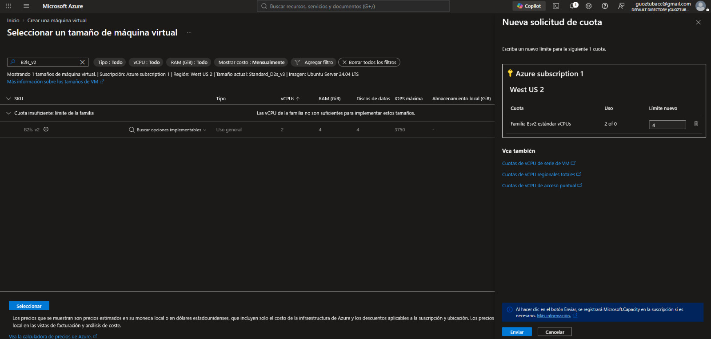

2. **Datos básicos de la VM.** Imagen Ubuntu Server 24.04 LTS x64 Gen2,
   tamaño `Standard_D2als_v7`, tipo de seguridad Estándar, autenticación por
   clave pública SSH y usuario `azureuser`.

   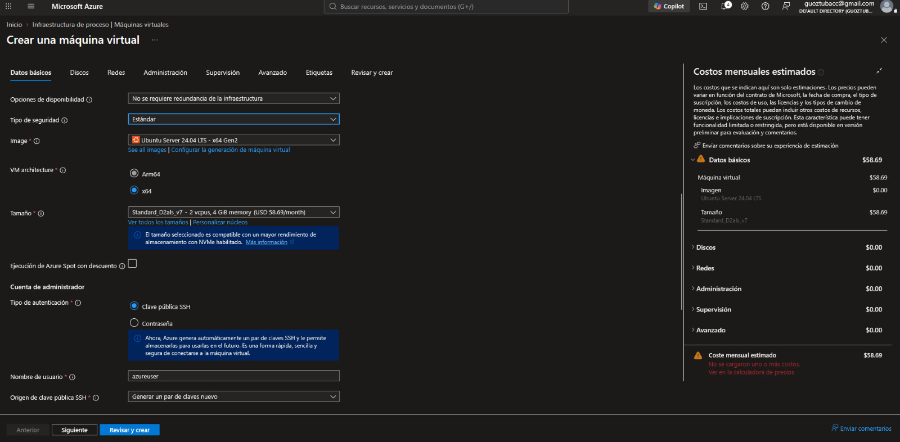

3. **Implementación completada.** `CreateVirtualMachine-taskflow-g15-python-azure`
   terminó correctamente en `rg-taskflow-g15`.

   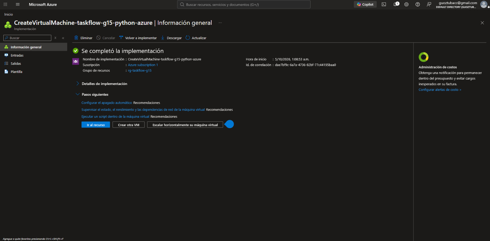

4. **Red y NSG.** La VM usa `vnet-westus2-1` / `snet-westus2-1`, la IP
   pública `20.94.245.210` y la IP privada `172.16.0.5`, junto a
   `taskflow-g15-node-azure`; se agrega la regla `Allow-3000-Python` (TCP
   `3000`, prioridad 310).

   

5. **Reglas del RDS.** `rds-taskflow-g15` tiene cuatro reglas TCP `5432`: los
   security groups de las dos EC2 y las IP `/32` de las dos VM de Azure,
   incluida `20.94.245.210/32`.

   

6. **Instalación del servicio.** El archivo de entorno tiene `root:taskflow
   640`, el puerto `5432` del RDS está abierto desde la VM, y el instalador
   deja `taskflow-python.service` activo con `GET /health` en `200`.

   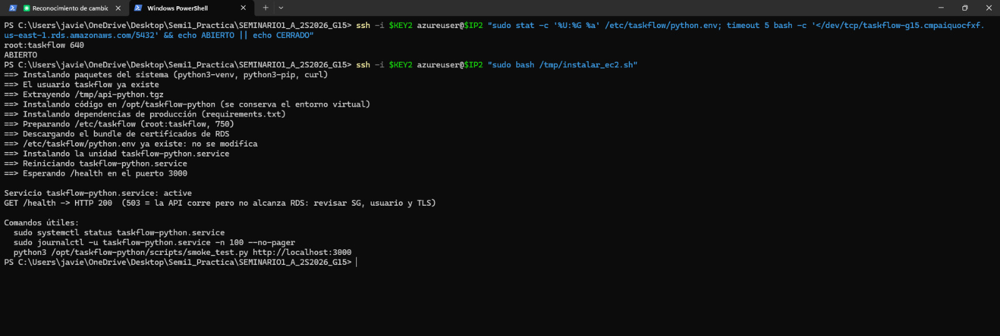

7. **Prueba de humo y `/health`.** `smoke_test.py` dentro de la VM termina
   con 20/20 OK y 0 FALLO, y `GET /health` desde fuera responde `200` con
   `implementacion: "python"`.

   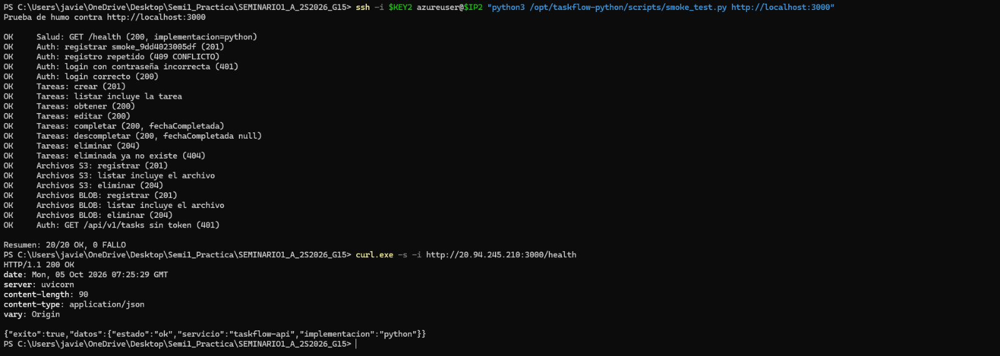

### Validaciones

| Validación | Resultado | Evidencia |
|---|---|---|
| El servicio responde desde Internet y alcanza el RDS | HTTP `200`, `estado: "ok"`, `implementacion: "python"` (5 de octubre de 2026) | [Captura 7](../Document/img/pra2-13-azure-vm-python/07-smoke-test-y-health.jpeg) |
| La API completa funciona contra el RDS real | Prueba de humo 20/20 OK, 0 FALLO | [Captura 7](../Document/img/pra2-13-azure-vm-python/07-smoke-test-y-health.jpeg) |
| El RDS solo admite la IP de la VM, no cualquier origen | Regla `20.94.245.210/32` | [Captura 5](../Document/img/pra2-13-azure-vm-python/05-rds-regla-ip-vm.jpeg) |
| El archivo de secretos está protegido | `root:taskflow 640` | [Captura 6](../Document/img/pra2-13-azure-vm-python/06-instalacion-servicio.jpeg) |

### Artefactos entregados

- [Script de creación y despliegue de referencia](../azure/vm-python/deploy-azure-vm-python.sh)
- [Instalador compartido con la EC2](../api-python/deploy/instalar_ec2.sh)
- [Registro del despliegue en Azure](pra2-13-14-despliegue-azure-python.md)

## PRA2-14 - Azure Functions y API Management

### Alcance

Tres funciones HTTP en Python que suben imágenes, texto y archivos genéricos a
Blob Storage, idénticas al
[contrato serverless](contrato-serverless.md) que comparten con las Lambdas de
Daniel, publicadas detrás de API Management.

### Diseño de las funciones

| Elemento | Valor |
|---|---|
| Modelo | Azure Functions para Python, modelo v2, runtime v4 |
| Enrutamiento | [`function_app.py`](../azure/functions/function_app.py) solo enruta; `routePrefix` vacío en [`host.json`](../azure/functions/host.json), así que las rutas no llevan `/api` |
| Autorización | `authLevel=function`: sin la clave de función no se puede invocar; API Management la inyecta |
| Lógica | Paquete [`carga/`](../azure/functions/carga/): `servicio` (orden de validación), `validaciones`, `seguridad` (JWT igual que el backend), `nombres` (nombre seguro y clave), `almacenamiento`, `respuestas`, `mensajes` y `configuracion` |
| Credencial | `DefaultAzureCredential` con la identidad administrada; sin connection strings ni claves de cuenta |
| Subida | `upload_blob(..., overwrite=False)`; la URL se toma del SDK después de confirmar la subida |
| Escritura en RDS | No: el frontend registra `datos.archivo` con `POST /api/v1/files` |
| Pruebas | 347 pruebas con `pytest`, sin red ni Azure ([README](../azure/functions/README.md)) |

| Ruta | Función | Tipos admitidos | Límite | Token |
|---|---|---|---|---|
| `POST /upload/image` | `subir_imagen` | JPEG, PNG, GIF y WebP, comprobados por firma | 3 MiB | No con `destino: "perfil"`; sí en otro caso |
| `POST /upload/text` | `subir_texto` | `text/plain`, `text/markdown`, `text/csv` en UTF-8 estricto | 1 MiB | Sí |
| `POST /upload/file` | `subir_archivo` | Cualquier tipo salvo los bloqueados (ejecutables, HTML, SVG y scripts, por tipo, extensión, firma o marcado) | 3 MiB | Sí |

| Validación | Regla |
|---|---|
| Orden | Token (401) → estructura (400, todos los campos) → contenido (400, primer error) → subida (500 si falla, sin URL) → 201 ([contrato §6](contrato-serverless.md#6-orden-de-validación-determinista)) |
| Cuerpo | JSON con `nombreOriginal`, `tipoMime`, `contenidoBase64` y `destino` opcional; sin multipart, sin campos extra ni coerción |
| Base64 | Se valida con expresión regular antes de decodificar; el límite se aplica a los bytes decodificados |
| Clave del objeto | `profiles/pendientes/{uuid}-{nombre-seguro}` para el perfil y `files/{userId}/{uuid}-{nombre-seguro}` para lo demás |
| Errores | Mismo sobre y catálogo que el backend ([contrato §8](contrato-serverless.md#8-errores)) |

### Function App

| Configuración | Valor |
|---|---|
| Nombre | `taskflow-g15-func` |
| Grupo de recursos y región | `rg-practica2-semi1a1s2026-g15`, East US |
| Plan | Consumo flexible, Linux, instancias de 2048 MB |
| Pila | Python 3.11 |
| Almacenamiento interno | Cuenta propia del host, distinta de la cuenta de archivos |
| Supervisión | Application Insights `taskflow-g15-func` |
| Autenticación básica de publicación | Deshabilitada |
| Despliegue | Extensión de Azure Functions de VS Code; `.funcignore` excluye pruebas, `.venv` y la configuración local |
| Variables de aplicación (solo nombres) | `AZURE_STORAGE_BLOB_ENDPOINT`, `AZURE_STORAGE_CONTAINER_NAME`, `JWT_SECRET` |

### Identidad y acceso a Blob

| Elemento | Valor |
|---|---|
| Identidad | Administrada, asignada por el sistema |
| Rol | `Storage Blob Data Contributor` (Colaborador de datos de Storage Blob) |
| Alcance | Solo el contenedor `practica2semi1a1s2026archivosg15`: más estrecho que la Storage Account que propone el [handoff](azure-functions-handoff.md) |
| Lectura | Pública a nivel Blob (PRA2-3): se lee un objeto conociendo su URL, pero no se puede listar el contenedor |
| Escritura anónima | No permitida: solo la identidad de la Function App puede escribir |

### API Management

| Configuración | Valor |
|---|---|
| Instancia | `taskflow-g15-apim`, nivel Consumo, East US |
| Dirección base | `https://taskflow-g15-apim.azure-api.net` |
| API | `TaskFlow Upload` (`taskflow-upload`), creada desde la Function App, con sufijo de URL vacío |
| Operaciones | `POST /upload/image`, `POST /upload/text`, `POST /upload/file` |
| Suscripción | **No requerida**: el frontend llama sin clave; API Management agrega por sí mismo la clave de la función |

Al principio la API exigía suscripción, y una llamada sin clave de suscripción
respondió `401` desde API Management. Se desmarcó la suscripción obligatoria
porque el frontend es público y no puede guardar secretos; la misma llamada
respondió entonces `201`. La función sigue protegida por su clave, que solo
conoce API Management.

### Política CORS

La política se aplica en *Todas las operaciones* → *Procesamiento de entrada*
y está versionada en [`azure/apim/cors-policy.xml`](../azure/apim/cors-policy.xml)
([instrucciones](../azure/apim/README.md)). Las funciones no emiten cabeceras
CORS ([contrato §10](contrato-serverless.md#10-capa-de-api-cors-rutas-y-límites)).

| Aspecto | Valor | Motivo |
|---|---|---|
| Orígenes | `*`, temporal | El origen del frontend publicado (PRA2-17 y PRA2-18) aún no existe; se reemplazará por ese origen |
| Métodos | `POST`, `OPTIONS` | Las tres rutas son `POST`; `OPTIONS` atiende la comprobación previa del navegador |
| Encabezados | `Content-Type`, `Authorization` | Cuerpo JSON y token Bearer |
| Caché de la comprobación previa | `300` s | Valor configurado en la política; coincide con el de API Gateway de Daniel. El contrato pide `600` s (ver limitaciones) |
| Credenciales | No | El token viaja en `Authorization`, no en cookies, y `*` no admite credenciales |

### Evidencia

1. **Revisión de la Function App.** Plan Consumo flexible, Linux, East US,
   Application Insights habilitado y autenticación básica deshabilitada.

   

2. **Funciones desplegadas.** `taskflow-g15-func` está en ejecución, con
   Linux, Consumo flexible, 2048 MB, y las tres funciones HTTP habilitadas:
   `subir_archivo`, `subir_imagen` y `subir_texto`.

   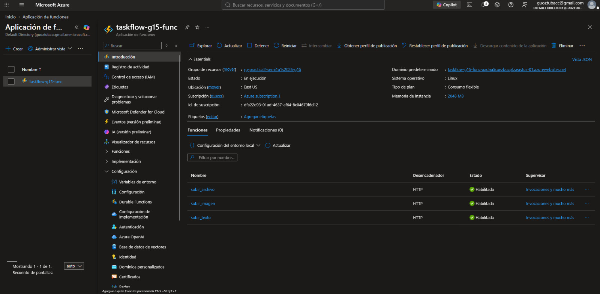

3. **Asignación del rol.** En el control de acceso del contenedor
   `practica2semi1a1s2026archivosg15` se asigna "Colaborador de datos de
   Storage Blob" a la identidad administrada de `taskflow-g15-func`.

   

4. **Prueba directa de la función.** Antes de configurar API Management, una
   llamada a `/upload/image` con `destino: "perfil"` responde `201` con
   `proveedorAlmacenamiento: "BLOB"`. La clave de función se ingresa de forma
   oculta y no aparece.

   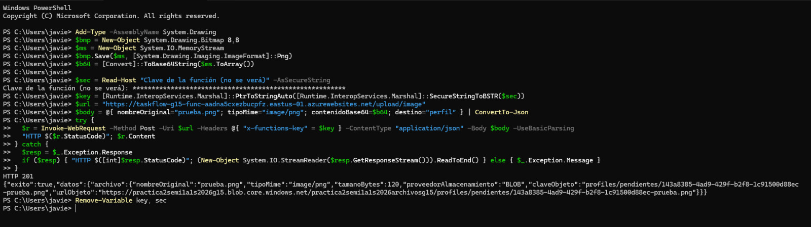

5. **Lectura pública de la imagen.** El objeto de `profiles/pendientes/` se
   abre en el navegador por su URL de Blob.

   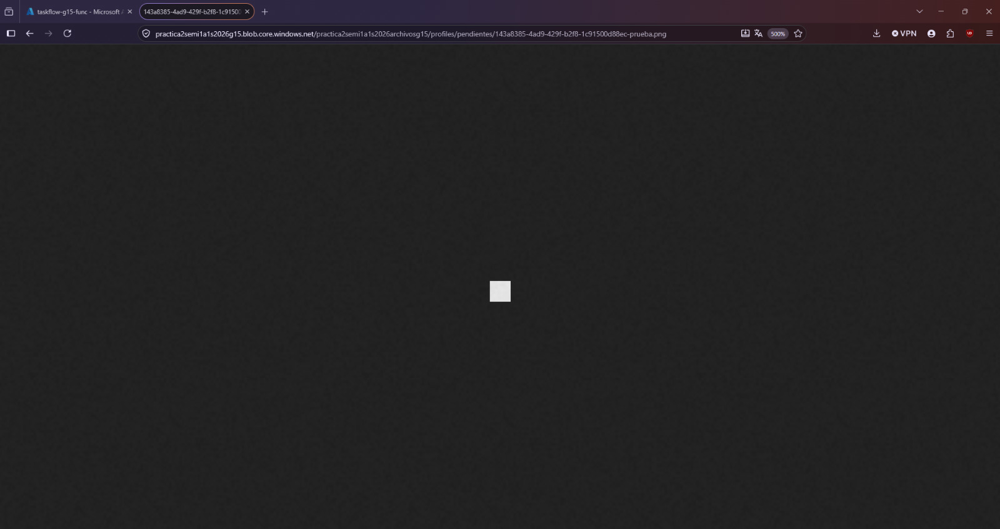

6. **Lectura pública de un texto.** Un objeto de texto de `files/1/` se abre
   por su URL de Blob y muestra su contenido.

   

7. **Implementación de API Management.** La instancia se implementó en
   `rg-practica2-semi1a1s2026-g15`.

   

8. **API creada desde la Function App.** Asistente *Create from Function App*
   sobre `taskflow-g15-func` con la base `https://taskflow-g15-apim.azure-api.net`.
   El sufijo que el asistente propone se dejó vacío en la API final, por eso
   las rutas son `/upload/...`.

   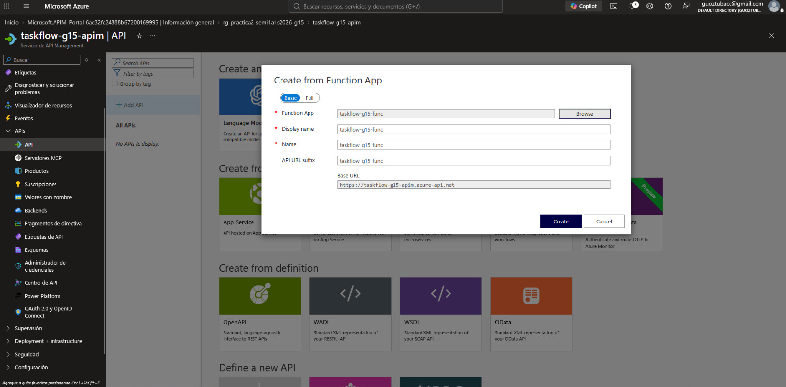

9. **Importación de las funciones.** Se importan `subir_archivo`,
   `subir_imagen` y `subir_texto` como operaciones `POST`.

   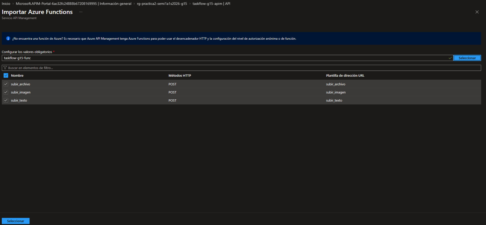

10. **Prueba en el portal de API Management.** La consola de prueba de la API
    `TaskFlow Upload` envía `POST /upload/image` con `destino: "perfil"` y
    recibe `201 Created` con la clave
    `profiles/pendientes/69a0737c-7479-4737-82b3-f047bf91d051-apim.png`.

    

11. **Llamada externa sin clave.** Desde PowerShell, `POST /upload/image` a
    la dirección de API Management, sin clave de suscripción ni token,
    responde `201` con un objeto en `profiles/pendientes/`.

    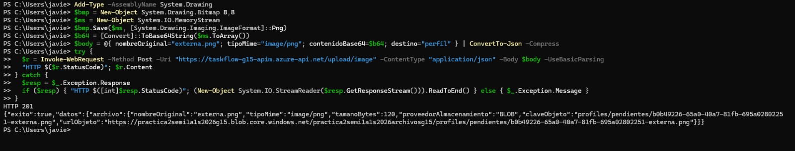

12. **Texto con token.** `POST /upload/text` con `Authorization: Bearer`
    responde `201`. El token se firma localmente y nunca se imprime.

    

13. **Archivo genérico con token.** `POST /upload/file` con un JSON responde
    `201` con `tipoMime: "application/json"`.

    

14. **Comprobación previa de CORS.** `OPTIONS /upload/image` con un origen
    externo responde `200` con los encabezados de la política.

    

15. **Objetos en el contenedor.** `profiles/pendientes/` contiene las tres
    imágenes de prueba de 120 B: la directa, la del portal y la externa.

    

### Validaciones

| Validación | Resultado | Evidencia |
|---|---|---|
| Las tres rutas funcionan por API Management | `201` en `/upload/image`, `/upload/text` y `/upload/file` | Capturas [10](../Document/img/pra2-14-azure-serverless/10-apim-prueba-portal-imagen-201.jpeg) a [13](../Document/img/pra2-14-azure-serverless/13-apim-archivo-con-token-201.jpeg) |
| El perfil se sube sin token | `201` con clave `profiles/pendientes/...` | [Captura 11](../Document/img/pra2-14-azure-serverless/11-apim-imagen-sin-clave-201.jpeg) |
| El frontend no necesita clave | `201` sin clave de suscripción (antes, `401`) | [Captura 11](../Document/img/pra2-14-azure-serverless/11-apim-imagen-sin-clave-201.jpeg) |
| Los objetos son legibles por URL | Abiertos en el navegador | Capturas [5](../Document/img/pra2-14-azure-serverless/05-blob-lectura-imagen.jpeg) y [6](../Document/img/pra2-14-azure-serverless/06-blob-lectura-texto.jpeg) |
| CORS en la capa de API | `OPTIONS` → `200` con los cuatro encabezados | [Captura 14](../Document/img/pra2-14-azure-serverless/14-apim-cors-preflight.jpeg) |
| Escritura con identidad, no con claves | Rol sobre el contenedor; sin connection strings | [Captura 3](../Document/img/pra2-14-azure-serverless/03-rol-blob-identidad-administrada.jpeg) |

### Artefactos entregados

- [Código de las funciones](../azure/functions/) y su [README](../azure/functions/README.md)
- [Configuración local de ejemplo](../azure/functions/local.settings.json.example), sin valores reales
- [Política CORS de API Management](../azure/apim/cors-policy.xml) y sus [instrucciones](../azure/apim/README.md)
- [Contrato serverless](contrato-serverless.md)
- [Procedimiento de asignación del rol](azure-functions-handoff.md)

## Pruebas y evidencia

Salidas reales verificadas. Los tokens, las contraseñas y las claves no se
imprimieron en ninguna prueba.

### `GET /health`

Comprobado el 5 de octubre de 2026 en la EC2 de AWS y en la VM de Azure:

```text
HTTP/1.1 200 OK
content-type: application/json

{"exito":true,"datos":{"estado":"ok","servicio":"taskflow-api","implementacion":"python"}}
```

### Prueba de humo

`python scripts/smoke_test.py <url-base>` contra cada servidor, con el RDS
real:

| Servidor | Fecha | Resultado |
|---|---|---|
| EC2 `taskflow-g15-python` | 3 y 4 de octubre de 2026 | 20/20 OK, 0 FALLO |
| VM `taskflow-g15-python-azure` | 5 de octubre de 2026 | 20/20 OK, 0 FALLO |

| Bloque | Comprobaciones |
|---|---|
| Salud | `GET /health` (200, `implementacion=python`) |
| Autenticación | Registro (201), registro repetido (409), login incorrecto (401), login correcto (200) |
| Tareas | Crear, listar, obtener, editar, completar, descompletar, eliminar y 404 posterior |
| Archivos `S3` | Registrar, listar y eliminar el metadato |
| Archivos `BLOB` | Registrar, listar y eliminar el metadato |
| Seguridad | `GET /api/v1/tasks` sin token (401) |

### Cargas por API Management

Base `https://taskflow-g15-apim.azure-api.net`, sin clave de suscripción. En
las tres respuestas, `proveedorAlmacenamiento` es `BLOB` y `urlObjeto` es
`https://practica2semi1a1s2026g15.blob.core.windows.net/practica2semi1a1s2026archivosg15/`
seguido de `claveObjeto`. Los tres objetos se leyeron por esa URL pública en el
navegador.

| Petición | Autenticación | HTTP | `tipoMime` | `tamanoBytes` | `claveObjeto` |
|---|---|---|---|---|---|
| `POST /upload/image` con `destino: "perfil"` | Sin token | `201` | `image/png` | `120` | `profiles/pendientes/69a0737c-7479-4737-82b3-f047bf91d051-apim.png` |
| `POST /upload/text` | Token Bearer | `201` | — | `24` | `files/1/c1c8e1e1-7d66-4867-ba79-14cd9355fc3e-apim.txt` |
| `POST /upload/file` | Token Bearer | `201` | `application/json` | `43` | `files/1/8d3d7051-40c3-4317-b1e7-a503c056964d-datos.json` |

### Comprobación previa de CORS y suscripción

```text
OPTIONS /upload/image  ->  HTTP 200
Access-Control-Allow-Origin: *
Access-Control-Allow-Methods: POST
Access-Control-Allow-Headers: content-type,authorization
Access-Control-Max-Age: 300
```

| Llamada sin clave de suscripción | Resultado |
|---|---|
| Con la suscripción obligatoria | `401` de API Management |
| Tras desmarcar la suscripción obligatoria | `201` |

### Usuario de base de datos

La creación de `taskflow_api` terminó con `COMMIT` y el aviso de rol listo
con `LOGIN`, miembro de `taskflow_app` y sin privilegios de administración
(salida completa en [PRA2-12](#usuario-de-base-de-datos-taskflow_api)).

## Artefactos reproducibles versionados

| Artefacto | Ticket | Uso |
|---|---|---|
| [`api-python/`](../api-python/README.md) | PRA2-11 | Backend Python, pruebas y README |
| [`api-python/app/acuerdos.py`](../api-python/app/acuerdos.py) | PRA2-11 | Decisiones de paridad en código |
| [`docs/paridad-backends.md`](paridad-backends.md) | PRA2-11 | Especificación de paridad Node.js / Python |
| [`api-python/scripts/smoke_test.py`](../api-python/scripts/smoke_test.py) | PRA2-11 a PRA2-13 | Prueba de humo para cualquier backend |
| [`api-python/deploy/instalar_ec2.sh`](../api-python/deploy/instalar_ec2.sh) | PRA2-12 y PRA2-13 | Instalador idempotente del servicio |
| [`api-python/deploy/taskflow-python.service`](../api-python/deploy/taskflow-python.service) | PRA2-12 y PRA2-13 | Unidad systemd endurecida |
| [`api-python/deploy/python.env.example`](../api-python/deploy/python.env.example) | PRA2-12 y PRA2-13 | Plantilla del archivo de entorno, sin secretos |
| [`aws/iam/pra2-12-ec2-python-policy.json`](../aws/iam/pra2-12-ec2-python-policy.json) | PRA2-12 | Política IAM de mínimo privilegio |
| [`aws/scripts/deploy-ec2-python.sh`](../aws/scripts/deploy-ec2-python.sh) | PRA2-12 | Despliegue de referencia en la EC2 |
| [`database/crear_usuario_api.sql`](../database/crear_usuario_api.sql) | PRA2-12 | Creación y verificación de `taskflow_api` |
| [`azure/vm-python/deploy-azure-vm-python.sh`](../azure/vm-python/deploy-azure-vm-python.sh) | PRA2-13 | Creación de la VM, regla del RDS y despliegue de referencia |
| [`azure/functions/`](../azure/functions/README.md) | PRA2-14 | Código y pruebas de las Azure Functions |
| [`azure/apim/cors-policy.xml`](../azure/apim/cors-policy.xml) | PRA2-14 | Política CORS de API Management |
| [`docs/contrato-serverless.md`](contrato-serverless.md) | PRA2-14 | Contrato común Lambda / Azure Function |
| [`docs/pra2-13-14-despliegue-azure-python.md`](pra2-13-14-despliegue-azure-python.md) | PRA2-13 y PRA2-14 | Registro del despliegue en Azure |

## Decisiones técnicas y limitaciones conocidas

| Decisión | Motivo |
|---|---|
| Un instalador para la EC2 y la VM | El mismo servicio, los mismos permisos y la misma verificación en las dos nubes |
| Secretos solo en `/etc/taskflow/python.env` (`root:taskflow 640`) y en la configuración de la Function App | Nunca en el repositorio ni en argumentos de comandos |
| Regla del RDS por security group en AWS y por IP `/32` en Azure | Azure no puede referenciar un security group de AWS; la IP de la VM es estática |
| Rol de Blob acotado al contenedor | Mínimo privilegio: la Function App no puede tocar otros contenedores |
| Suscripción de API Management no requerida | El frontend es público; la función queda protegida por su clave, que inyecta API Management |
| CORS en API Management y no en la Function App | Lo exige el contrato §10, igual que en API Gateway |

| Limitación conocida | Impacto | Cierre previsto |
|---|---|---|
| CORS de API Management con origen `*` | Cualquier origen puede llamar a las rutas de carga desde un navegador | Reemplazar por el origen del frontend publicado (PRA2-17 y PRA2-18), igual que `CORS_ORIGINS` de los backends |
| SSH `22` de la VM abierto a cualquier origen en el NSG | Superficie de ataque mayor; el acceso exige igualmente la llave SSH | Limitarlo a la IP del administrador al terminar |
| Sin política de 404 en API Management | Una ruta o método inexistente no devuelve el sobre `NO_ENCONTRADO` del contrato §10, sino la respuesta propia de API Management | Agregar la política de error global |
| Caché de la comprobación previa de `300` s | El contrato §10 fija `600` s; el navegador repite la comprobación previa con más frecuencia | Alinear `preflight-result-max-age` a `600` |
| TCP `3000` de la EC2 abierto a `0.0.0.0/0` | La API es alcanzable sin pasar por el balanceador | Restringirlo al security group del balanceador cuando exista (PRA2-19) |

## Conclusión: AWS frente a Azure

| Aspecto | AWS | Azure |
|---|---|---|
| Cuotas y tamaños de VM | `t3.micro` se lanzó sin ajustes de cuota | La cuota de la familia Bsv2 era 0: hubo que cambiar de familia y elegir `Standard_D2als_v7` |
| Acceso a la base de datos | La regla del RDS referencia el security group de la EC2 y sobrevive a cambios de IP | La VM está en otra nube: la regla del RDS es por IP y exige una IP pública estática |
| Identidad | El backend no usa APIs de AWS; IAM se usó para limitar a quien administra la EC2 (región y acciones) | La Function App escribe en Blob con identidad administrada y RBAC sobre el contenedor, sin ningún secreto de almacenamiento |
| Capa de API serverless | API Gateway HTTP API (Daniel), con CORS integrado en su configuración | API Management: importación directa de la Function App, inyección de la clave de función y CORS como política XML; exige suscripción por defecto, y hubo que desactivarla |
| Aprovisionamiento | La EC2 se lanzó directamente desde el asistente, sin pasos previos de cuota | El nivel Consumo de API Management evitó la espera larga de los niveles dedicados: la implementación se inició a las 23:04 del 4 de octubre y la API quedó creada a las 23:17 |

En la práctica, AWS resultó más directo para el cómputo y la red (cuotas
holgadas y reglas entre security groups). Azure fue más cómodo para la parte
serverless segura: la identidad administrada eliminó las claves de
almacenamiento, y API Management resolvió en un solo recurso la clave de
función, el CORS y la publicación. Las dos nubes sirven el mismo backend contra
la misma base, con la misma prueba de humo en 20/20.
