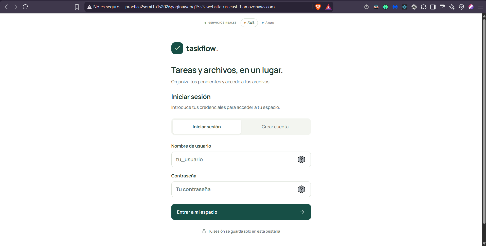
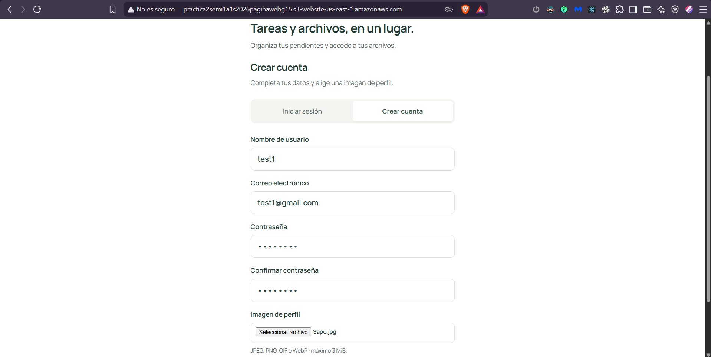
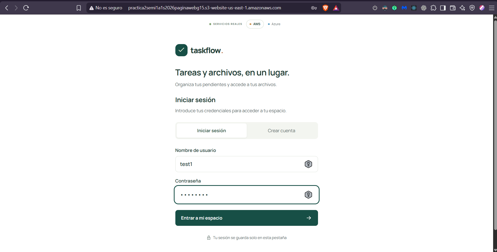
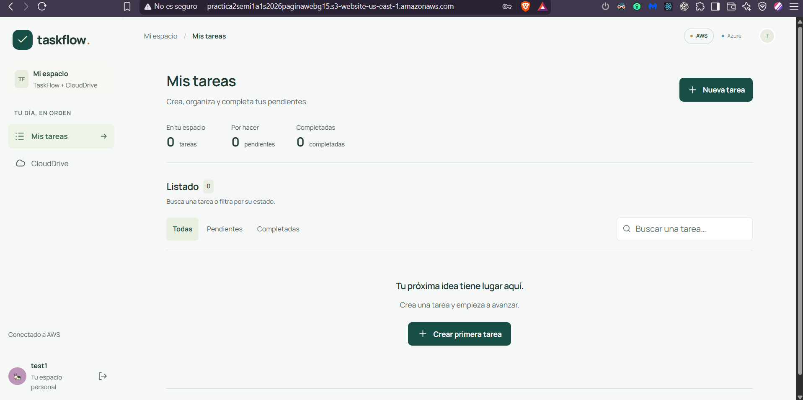
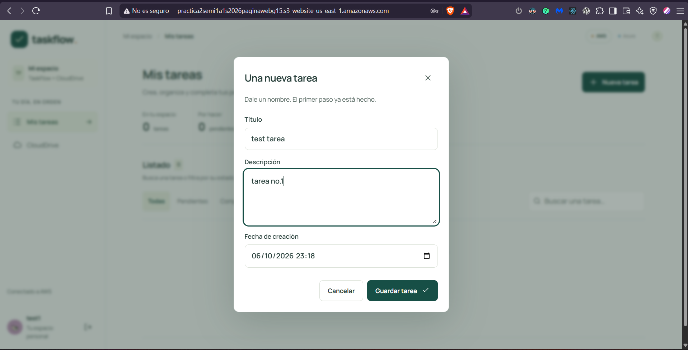
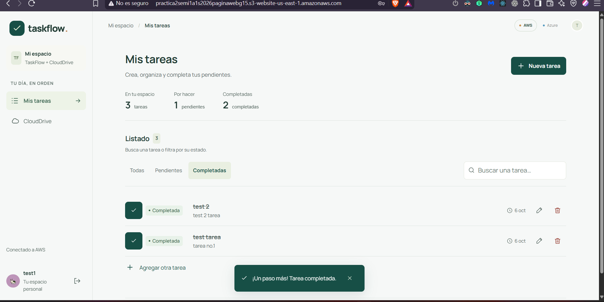
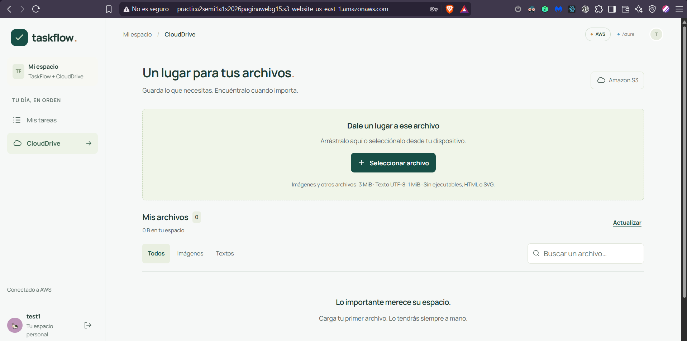
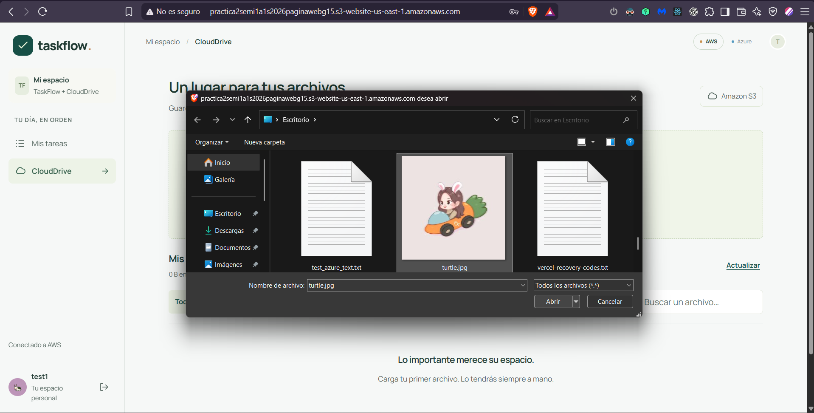
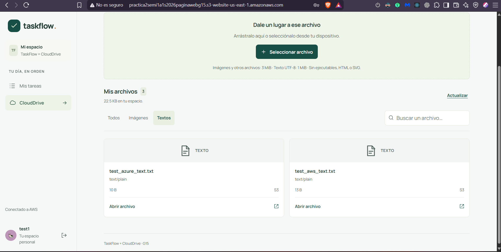

# Guía de usuario — TaskFlow + CloudDrive

TaskFlow te ayuda a organizar tareas y CloudDrive reúne tus archivos en un mismo espacio. Esta guía muestra cómo entrar, crear una cuenta, administrar tareas y guardar archivos desde el navegador.

Las capturas de esta guía se guardan en `Practica_2/docs/evidence/frontend/`. Los nombres ya están enlazados aquí: guarda cada captura con el nombre indicado y aparecerá en su sección.

## Acceso

Abre el sitio que quieras utilizar:

| Publicación | Dirección |
|---|---|
| AWS | [TaskFlow en AWS](http://practica2semi1a1s2026paginawebg15.s3-website-us-east-1.amazonaws.com) |
| Azure | [TaskFlow en Azure](https://pra2semi1a1s2026webg15.z13.web.core.windows.net) |

En la pantalla de acceso, selecciona **AWS** o **Azure**. Esta elección indica qué ambiente usarán las operaciones; no cambia la dirección del sitio que ya abriste.

Si aparece la opción **Probar con la cuenta demo**, puedes usarla para explorar la interfaz. La demostración guarda datos en ese navegador y no acredita una operación contra servicios cloud. Para una prueba real, inicia sesión o crea una cuenta en el ambiente seleccionado.

### Crear una cuenta

1. Selecciona **Crear cuenta**.
2. Escribe un nombre de usuario de 3 a 50 caracteres: letras minúsculas, números o guion bajo (`_`).
3. Ingresa un correo electrónico y una contraseña de 8 a 72 caracteres (máximo 72 bytes UTF-8); vuelve a escribirla para confirmarla.
4. Selecciona una foto JPEG, PNG, GIF o WebP de hasta 3 MiB.
5. Pulsa **Crear mi cuenta**. Si el registro se completa, la aplicación inicia la sesión.

Si el nombre de usuario ya existe, vuelve a **Iniciar sesión** e ingresa con esa cuenta.

### Iniciar sesión

1. Selecciona **Iniciar sesión**.
2. Ingresa tu nombre de usuario y contraseña.
3. Pulsa **Entrar a mi espacio**.

Si no puedes entrar, revisa que seleccionaste el ambiente correcto y que escribiste bien tus datos. La aplicación no incluye recuperación de contraseña.

## Navegación

Después de iniciar sesión, el menú principal permite abrir:

| Sección | Para qué sirve |
|---|---|
| **Mis tareas** | Crear, consultar, buscar y actualizar tus tareas. |
| **CloudDrive** | Guardar y encontrar tus archivos. |

El selector **AWS / Azure** permanece en la parte superior. Al cambiar de ambiente se cierra la sesión actual; inicia sesión nuevamente para continuar en el ambiente elegido. El botón de salida está junto a tu usuario, en la parte inferior del menú lateral.

## Mis tareas

### Crear una tarea

1. Abre **Mis tareas** y pulsa **Nueva tarea**.
2. Escribe un título. Si lo necesitas, agrega una descripción y ajusta la fecha de creación.
3. Pulsa **Guardar tarea**.

El resumen superior muestra el total de tareas, las que están **Por hacer** y las **Completadas**.

### Completar, editar o eliminar

- Pulsa el círculo de verificación para marcar una tarea como completada. Vuelve a pulsarlo para dejarla **Por hacer**.
- Pulsa el lápiz para editar el título o la descripción. La fecha de creación no cambia al editar.
- Pulsa la papelera para eliminarla y confirma la acción. La eliminación no se puede deshacer.

Usa **Todas**, **Pendientes** o **Completadas** para filtrar la lista. El campo de búsqueda encuentra coincidencias en el título y la descripción.

## CloudDrive

### Guardar un archivo

1. Abre **CloudDrive**.
2. Arrastra un archivo a la zona de carga o pulsa **Seleccionar archivo**. Se carga un archivo a la vez.
3. Espera a que finalice el guardado; después aparecerá en **Mis archivos**.

Límites y formatos:

- Imágenes JPEG, PNG, GIF o WebP: hasta **3 MiB**.
- Archivos de texto TXT, Markdown o CSV: UTF-8 y hasta **1 MiB**.
- Otros archivos: hasta **3 MiB**.
- Por seguridad se bloquean ejecutables, scripts, HTML y SVG. Los archivos vacíos tampoco se aceptan.

Al pulsar **Seleccionar archivo**, el navegador abre el selector de archivos del dispositivo:

### Buscar y abrir archivos

- Usa **Todos**, **Imágenes** o **Textos** para filtrar la lista.
- Escribe el nombre en **Buscar un archivo…** para localizarlo.
- Pulsa **Actualizar** para volver a cargar la lista.
- Pulsa **Abrir archivo** para abrir el objeto en otra pestaña. En la demostración, los archivos genéricos muestran **Descargar archivo**. Según el formato, el navegador puede mostrar el contenido o descargarlo.

Si aparece **La carga está hecha; falta registrar el archivo**, pulsa **Reintentar registro**. La aplicación reintenta guardar los datos del archivo en CloudDrive; no vuelve a subir el contenido.

## Sesión y ayuda

- La sesión se conserva en la pestaña actual. Si cierras la pestaña, tendrás que iniciar sesión otra vez.
- En modo demo, los datos se guardan en el navegador y no se sincronizan con AWS o Azure. No uses información sensible en esa modalidad.
- Si una operación muestra un error, confirma que el ambiente seleccionado sea el correcto e inténtalo de nuevo. En CloudDrive puedes usar **Actualizar** para volver a consultar tus archivos.
