# CloudCinema — Manual técnico

CloudCinema es una plataforma web de streaming desarrollada para la Práctica 1
de Seminario de Sistemas 1. Este manual reúne únicamente la información técnica
solicitada para la entrega: integrantes, arquitectura, identidades IAM, modelo
de datos y evidencias del despliegue.

## 1. Datos de los estudiantes

| Dato | Valor |
|---|---|
| Curso | Seminario de Sistemas 1 |
| Práctica | Práctica 1 |
| Grupo | 15 |
| Periodo | Segundo semestre de 2026 |

| Nombre completo | Carné |
|---|---|
| **Pendiente de completar** | **Pendiente de completar** |
| **Pendiente de completar** | **Pendiente de completar** |
| **Pendiente de completar** | **Pendiente de completar** |
| **Pendiente de completar** | **Pendiente de completar** |

> Antes de entregar, sustituir las filas pendientes con los nombres y carnés
> oficiales del grupo. Estos datos no se deducen de los usuarios de GitHub.

## 2. Arquitectura

### 2.1 Diagrama

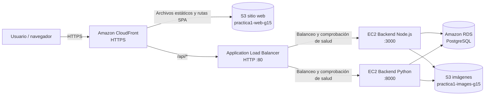

### 2.2 Descripción

1. El usuario accede por HTTPS al dominio de CloudFront. Esto entrega una
   conexión segura y permite utilizar funciones del navegador como la cámara.
2. CloudFront utiliza el sitio web estático de S3 como origen predeterminado.
   Una CloudFront Function reescribe las rutas de la SPA a `index.html`.
3. Las solicitudes `/api/*` se envían al Application Load Balancer (ALB).
4. El ALB reparte las solicitudes entre las implementaciones Node.js y Python.
   Si un destino falla su comprobación de salud, deja de recibir tráfico.
5. Ambos backends implementan el mismo contrato, comparten la base PostgreSQL
   en RDS y almacenan fotografías y portadas en un bucket S3 independiente.

| Componente | Recurso o tecnología | Responsabilidad |
|---|---|---|
| CDN y entrada web | CloudFront `dztmn2ph7ok4j.cloudfront.net` | HTTPS, caché, enrutamiento SPA y proxy de `/api/*`. |
| Frontend | React, TypeScript, Vite y Tailwind CSS | Interfaz de usuario compilada como archivos estáticos. |
| Sitio estático | S3 `practica1-web-g15` | Aloja el contenido generado en `dist/`. |
| Balanceador | ALB `cloudcinema-load-balancer` | Distribuye las solicitudes y ejecuta health checks. |
| API Node.js | EC2, puerto `3000` | Primera implementación del contrato HTTP. |
| API Python | EC2, puerto `8000` | Segunda implementación intercambiable del contrato HTTP. |
| Datos | RDS PostgreSQL `cloudcinema-g15` | Persiste usuarios, películas y listas de reproducción. |
| Imágenes | S3 `practica1-images-g15` | Guarda fotografías de perfil y portadas. |

El contrato completo de la API está en
[`Practica_1/contracts/openapi.yaml`](Practica_1/contracts/openapi.yaml), y la
configuración operativa ampliada está en
[`Practica_1/docs/infrastructure.md`](Practica_1/docs/infrastructure.md).

## 3. Usuarios y políticas de IAM

Se aplicó el principio de mínimo privilegio: cada identidad operativa recibe
solo las acciones necesarias para su responsabilidad. Las credenciales no se
almacenan en el repositorio.

### 3.1 Usuarios IAM

| Usuario | Política o grupo | Uso |
|---|---|---|
| `CloudCinema-Admin` | Grupo `CloudCinema-Administradores`, política administrada `AdministratorAccess` | Administración compartida de la cuenta y configuración de recursos como CloudFront. |
| `CloudCinema-Sitio-Web` | Política propia `CloudCinema-Sitio-Web-Policy` | Crear y administrar el bucket web `practica1-web-g15`, configurar el hosting y publicar el contenido de `dist/`. |
| `CloudCinema-Load-Balancer` | Política propia `CloudCinema-Load-Balancer-Policy` | Crear y administrar el ALB, listener, target group y security groups necesarios; detener o iniciar las dos EC2 para comprobar el failover. |

> **Pendiente del equipo:** incorporar en esta tabla los usuarios IAM creados
> por los responsables de EC2 y RDS, junto con el nombre y alcance real de sus
> políticas. No deben documentarse permisos que no hayan sido comprobados.

#### Alcance de las políticas

| Política | Acciones autorizadas | Recursos o restricciones |
|---|---|---|
| `AdministratorAccess` | Todas las acciones de AWS | Se hereda únicamente mediante el grupo administrativo. |
| `CloudCinema-Sitio-Web-Policy` | Crear bucket en `us-east-1`; consultar y configurar hosting, política, acceso público, propiedad y cifrado; listar, leer, subir y eliminar objetos; eliminar el bucket autorizado. | Bucket `arn:aws:s3:::practica1-web-g15` y objetos `arn:aws:s3:::practica1-web-g15/*`. No concede acceso a EC2, RDS, IAM ni ELB. |
| `CloudCinema-Load-Balancer-Policy` | Crear, consultar y modificar ALB, target groups, listeners y reglas; consultar VPC, subredes, EC2 y security groups; administrar las reglas de red; iniciar y detener instancias para failover. | Las acciones de `StartInstances` y `StopInstances` se limitan a las EC2 Node.js y Python del proyecto. |
| `CloudCinema-S3-Imagenes-PRA3` | `s3:ListBucket`, `s3:GetObject` y `s3:PutObject`. | Solo `practica1-images-g15` y sus prefijos `Fotos_Perfil/` y `Fotos_Peliculas/`. |

La consola también conserva la identidad histórica `Administrador_202300503`.
No se le atribuye una política en este manual porque no forma parte de las
identidades operativas creadas para el despliegue documentado.

### 3.2 Roles de las instancias

Los backends no usan access keys permanentes. Cada EC2 asume un rol y obtiene
credenciales temporales automáticamente.

| Rol | Política | Permisos principales |
|---|---|---|
| `CloudCinema-Node-S3-PRA3` | `CloudCinema-S3-Imagenes-PRA3` | Listar los prefijos autorizados y leer/escribir objetos de fotografías y portadas. |
| `CloudCinema-Python-S3-PRA3` | `CloudCinema-S3-Imagenes-PRA3` | Los mismos permisos sobre el bucket de imágenes para mantener ambos backends compatibles. |

Los roles con prefijo `AWSServiceRoleFor...` son roles vinculados a servicios
creados y administrados automáticamente por AWS para CloudFront, ELB, RDS y
otros servicios; no sustituyen a los usuarios humanos anteriores.

### 3.3 Evidencia de IAM

**Usuarios utilizados**

La captura reúne las identidades humanas usadas en la consola. Se crearon
usuarios separados para administración general, publicación del sitio y
configuración del balanceador, evitando compartir la cuenta raíz o entregar
permisos administrativos a quienes solo necesitan operar un servicio.

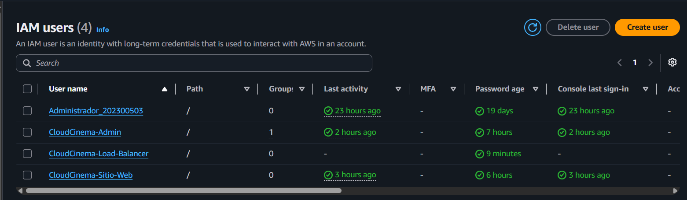

**Políticas propias**

Las políticas propias implementan el mínimo privilegio. La política del sitio
web se limita al bucket `practica1-web-g15`; la del balanceador autoriza las
operaciones de ELB y red necesarias, y restringe el encendido y apagado a las
dos EC2 del proyecto; la política de imágenes permite a los roles de backend
trabajar únicamente con los prefijos destinados a fotografías y portadas.

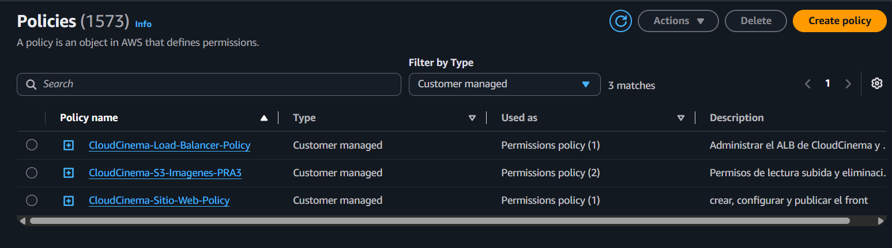

**Roles de las instancias y roles de servicio**

Los roles `CloudCinema-Node-S3-PRA3` y `CloudCinema-Python-S3-PRA3` están
diseñados para ser asumidos por EC2. Así, los SDK de ambos backends obtienen
credenciales temporales para S3 sin guardar access keys en código, archivos
`.env` o en las propias instancias. Los demás roles mostrados son roles
vinculados a servicios que AWS administra automáticamente.

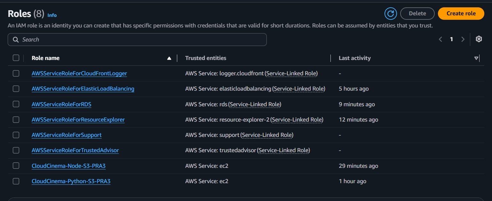

## 4. Base de datos PostgreSQL en Amazon RDS

Amazon RDS centraliza la información utilizada por las implementaciones Node.js
y Python. Al compartir una sola fuente de datos, cualquier solicitud produce
el mismo resultado independientemente del backend elegido por el ALB.

### 4.1 Modelo entidad-relación

El diagrama representa el esquema PostgreSQL compartido por los backends Node.js
y Python. La relación muchos a muchos entre usuarios y películas se resuelve
mediante `lista_reproduccion`, lo que permite consultar y modificar “Mi lista”
sin duplicar datos de las películas.

El modelo contiene tres entidades principales:

- `usuario` almacena los datos de la cuenta y la clave de la fotografía de
  perfil en S3.
- `pelicula` almacena metadatos, URL del video y clave de la portada.
- `lista_reproduccion` relaciona usuarios y películas. Su llave primaria
  compuesta evita agregar una misma película dos veces a la lista de un usuario.

Las columnas, restricciones y correspondencia entre SQL y JSON se detallan en
[`Practica_1/docs/data-model/model.md`](Practica_1/docs/data-model/model.md).

### 4.2 Instancia y configuración de RDS

La instancia `cloudcinema-g15` utiliza PostgreSQL 16 y permanece en estado
`Available`. Se configuró en la VPC del proyecto, sin acceso público, en el
puerto `5432`, con almacenamiento cifrado y conexión SSL. El security group de
RDS solo admite conexiones originadas en las EC2 autorizadas.

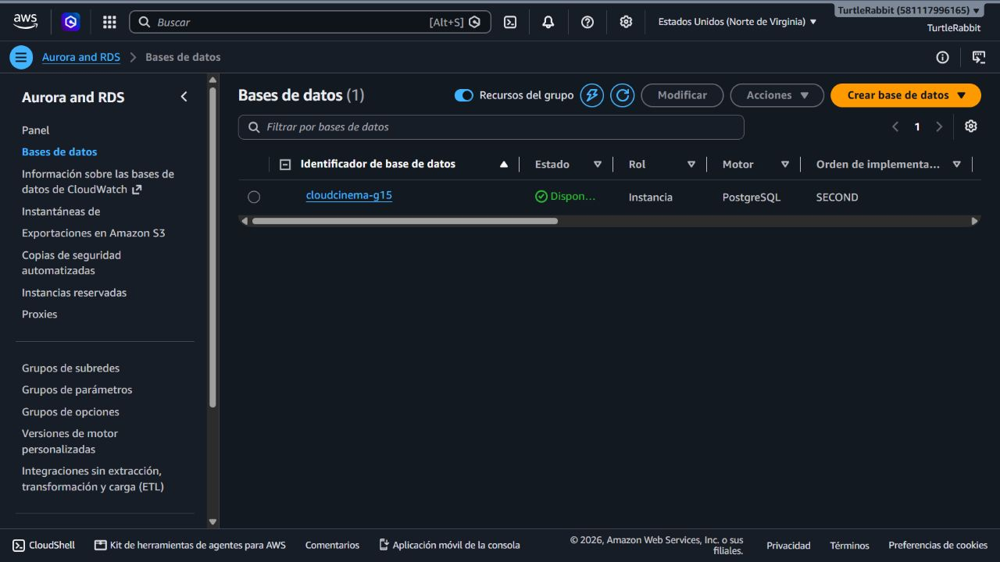

La configuración final mantiene la base aislada de Internet. Las credenciales,
el endpoint y el certificado se proporcionan a los backends mediante variables
de entorno y no se almacenan en el repositorio.

### 4.3 Verificación de conectividad

La prueba confirma que una instancia autorizada puede establecer una conexión
SSL con PostgreSQL y ejecutar consultas sobre el esquema. Esto valida en
conjunto la resolución del endpoint, las credenciales, el certificado, la regla
del security group y los permisos del usuario de base de datos.

Los detalles de conectividad muestran que la instancia no tiene gateway de
Internet y que la conexión se realiza mediante el endpoint privado de RDS,
puerto `5432`, usando el certificado global de AWS y `sslmode=verify-full`.

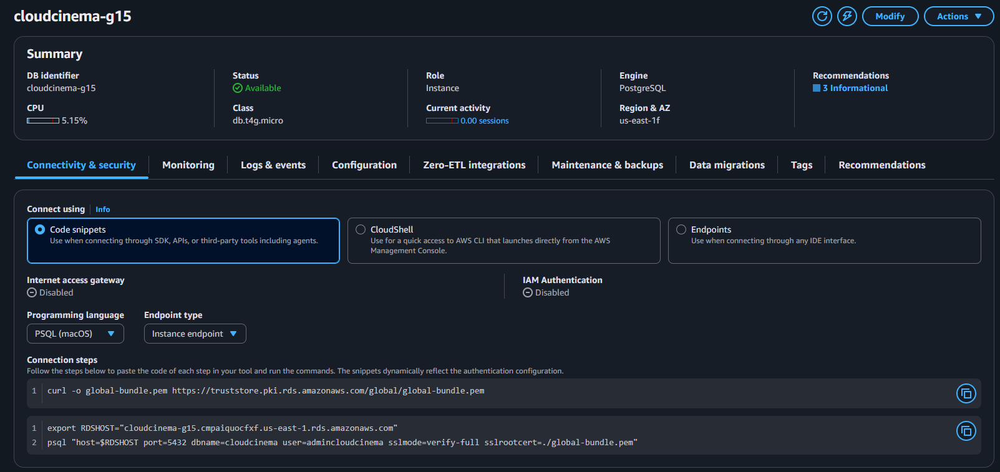

Las reglas del security group de RDS permiten entrada únicamente desde los
security groups de Node.js y Python. La salida se mantiene bajo las reglas
predeterminadas de la VPC, pero no existe una regla de entrada abierta a
`0.0.0.0/0` para PostgreSQL.

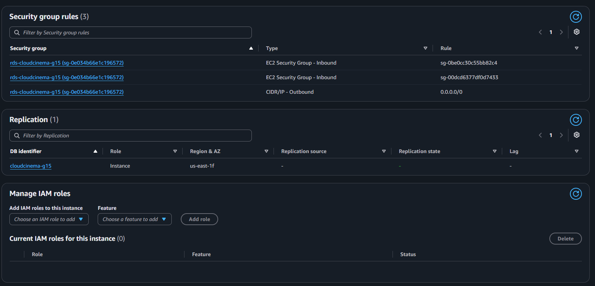

## 5. Almacenamiento de archivos en Amazon S3

CloudCinema utiliza S3 para dos necesidades distintas: publicar el frontend
compilado y almacenar las imágenes administradas por los backends.

### 5.1 Separación de buckets

Se utilizaron dos buckets para separar responsabilidades. `practica1-web-g15`
aloja exclusivamente los archivos estáticos compilados del frontend, mientras
que `practica1-images-g15` almacena fotografías de perfil y portadas cargadas
por las APIs. Esta separación permite aplicar políticas, permisos y ciclos de
vida distintos sin conceder a la publicación del frontend acceso de escritura
sobre las imágenes de los usuarios.

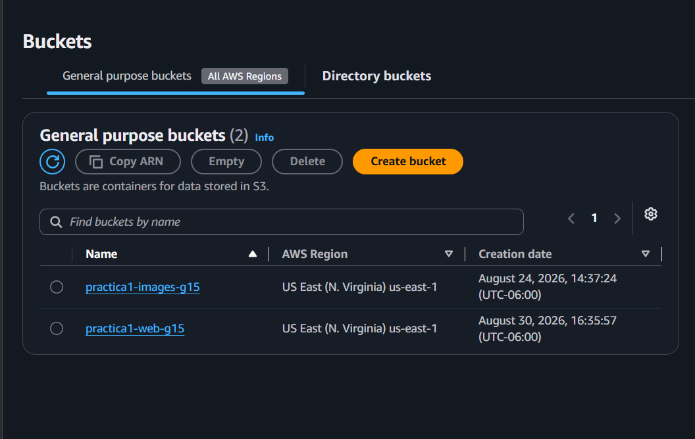

### 5.2 Bucket del sitio web

El contenido interno de `dist/` se cargó directamente en la raíz del bucket:
`index.html` funciona como documento principal, `assets/` contiene los recursos
generados por Vite y los archivos SVG corresponden a los recursos globales de
la interfaz. No se subió la carpeta `dist` como un nivel adicional, porque eso
impediría que S3 y CloudFront encontraran `index.html` en la ruta esperada.

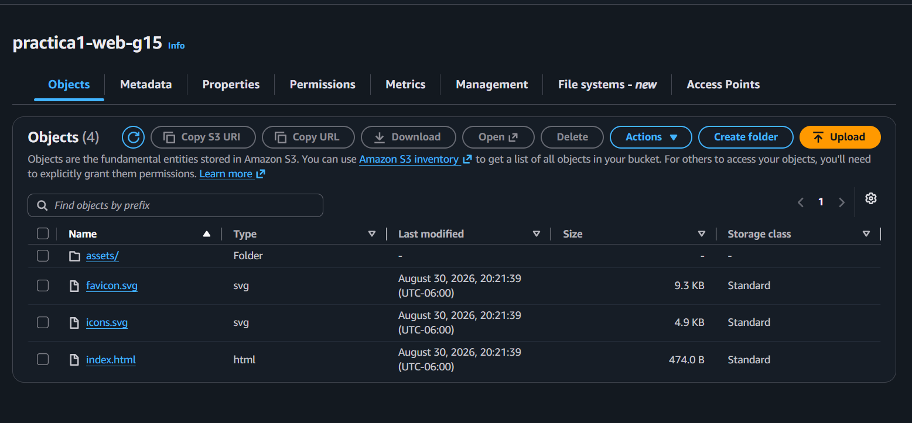

### 5.3 Bucket de fotografías y portadas

El bucket de imágenes organiza los objetos en `Fotos_Perfil/` y
`Fotos_Peliculas/`. Los backends guardan únicamente la clave del objeto en RDS
y usan sus roles IAM para leer o escribir en estos prefijos. De esta manera los
archivos binarios permanecen fuera de PostgreSQL y ambos backends comparten el
mismo almacenamiento.

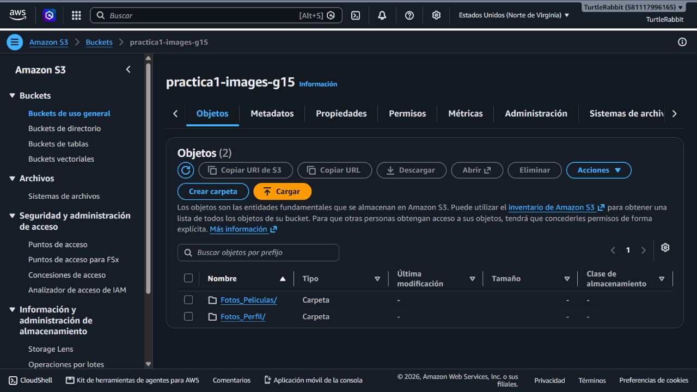

## 6. Backends, red y balanceo de carga

La capa de API se ejecuta en dos EC2 independientes y se expone únicamente a
través de un Application Load Balancer. Esta configuración permite distribuir
tráfico y mantener disponible el servicio cuando uno de los backends falla.

### 6.1 Instancias EC2

Node.js y Python fueron desplegados en instancias independientes dentro de la
misma VPC y en zonas de disponibilidad diferentes (`us-east-1d` y
`us-east-1c`). Node.js escucha en el puerto `3000` y Python en el `8000`. Las
instancias aparecen en estado `Running`; en el momento de la captura Python aún
completaba sus comprobaciones de estado de EC2.

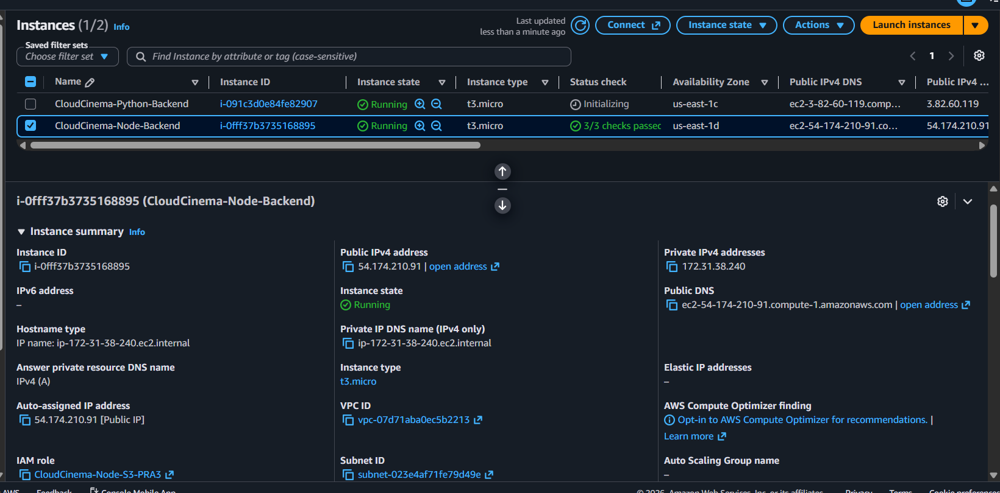

### 6.2 Target group y comprobaciones de salud

El target group `cloudcinema-backends-tg` es el conjunto de destinos al que el
ALB puede enviar solicitudes. Se creó con tipo de destino **Instance**,
protocolo HTTP y versión HTTP/1. Node.js se registró en el puerto `3000` y
Python sobrescribió el puerto por destino a `8000`. La comprobación
`GET /salud` espera el código `200`; por eso la captura muestra dos destinos
`Healthy`, cero `Unhealthy` y ambos disponibles para recibir tráfico.

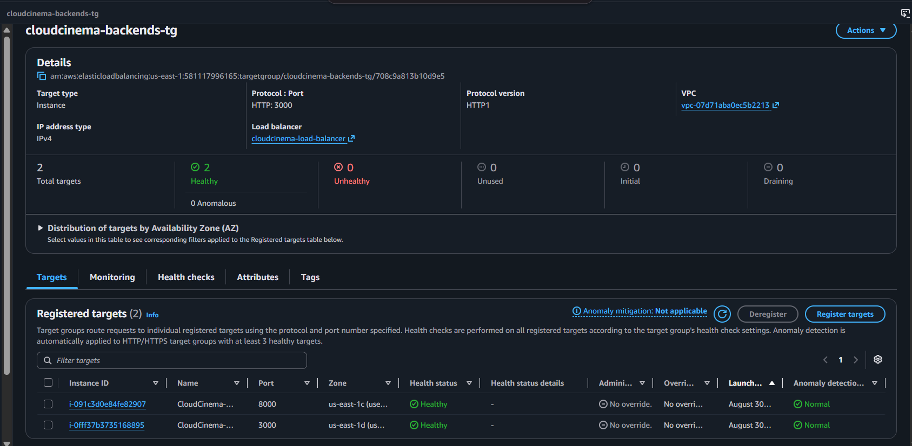

### 6.3 Prueba de failover

La captura muestra Node.js en ejecución y Python detenida intencionalmente para
comprobar que la aplicación continúa disponible con un solo backend. Esta no es
una condición de error del despliegue, sino una prueba controlada de tolerancia
a fallos.

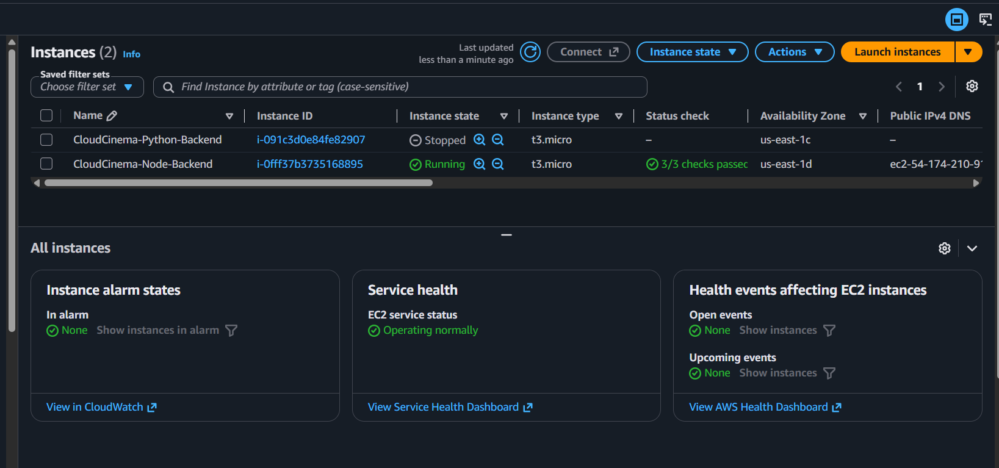

Al detener Python, el target group deja de considerarlo un destino utilizable y
mantiene Node.js como `Healthy`. Como el frontend continúa utilizando la misma
URL y el mismo ALB, no requiere cambios de configuración para seguir operando.
La prueba demuestra que el balanceador retira destinos no disponibles sin
exponer directamente las IP de las EC2 al navegador.

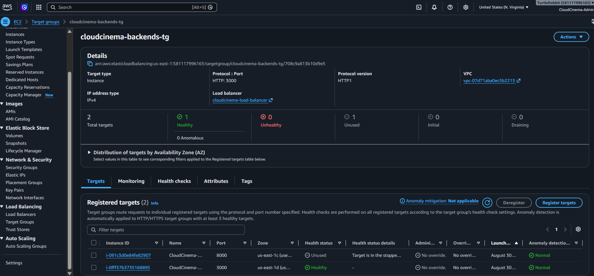

### 6.4 Reglas de red y security groups

El security group del ALB permite entrada pública HTTP por el puerto `80`. Los
security groups de Node.js y Python aceptan los puertos `3000` y `8000`
respectivamente desde el security group del ALB, no desde Internet. RDS permite
PostgreSQL `5432` únicamente desde los security groups de ambos backends. Estas
reglas mantienen el flujo de red alineado con la arquitectura y evitan acceder
directamente a la base de datos o a las APIs.

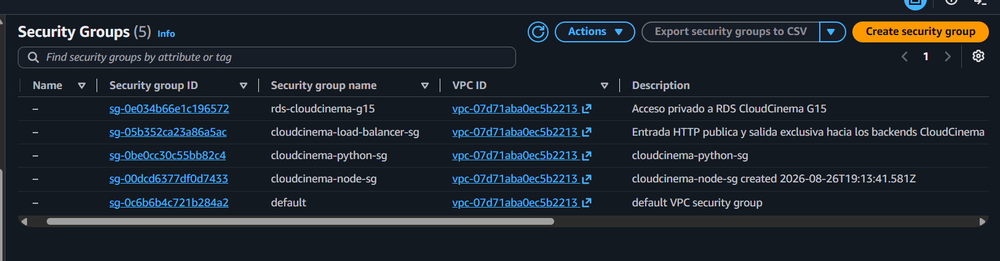

### 6.5 Application Load Balancer

El ALB `cloudcinema-load-balancer` se configuró como **Internet-facing**, con
IPv4 y dos subredes públicas pertenecientes a zonas diferentes. Su estado
`Active` confirma que AWS terminó el aprovisionamiento. Distribuir el
balanceador en dos zonas permite alcanzar las dos implementaciones aunque una
instancia o zona deje de estar disponible.

Durante la creación se seleccionó **Application Load Balancer** porque trabaja
en la capa HTTP y permite asociar listeners, reglas y target groups. Se eligió
el esquema Internet-facing, direccionamiento IPv4 y las subredes públicas de
`us-east-1c` y `us-east-1d`.

En el mapeo de red se utilizó la VPC `vpc-07d71aba0ec5b2213` y se seleccionó
una subred pública por zona: `subnet-01e647a14d720ed46` en `us-east-1c` y
`subnet-023e4af71fe79d49e` en `us-east-1d`. Ambas subredes tienen ruta hacia el
Internet Gateway, requisito para que el ALB Internet-facing reciba tráfico.

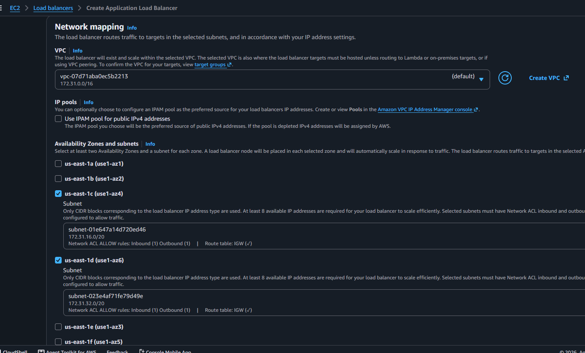

La vista de detalles confirma el estado `Active`, el tipo `application`, el
esquema `Internet-facing`, la VPC, las dos zonas de disponibilidad, el security
group y el DNS que utilizan los orígenes de CloudFront.

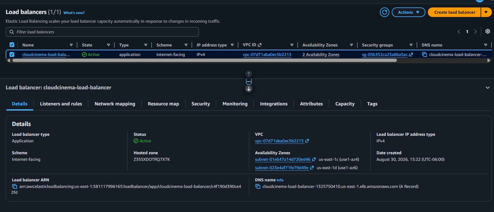

Al asociar el security group se seleccionó únicamente
`cloudcinema-load-balancer-sg`, que contiene la entrada pública HTTP `80` y
las salidas hacia los grupos de Node.js y Python. No se utilizó el security
group predeterminado de la VPC.

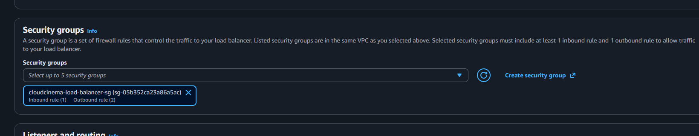

### 6.6 Listener HTTP

El listener recibe solicitudes HTTP en el puerto `80` y utiliza como acción
predeterminada **Forward to** `cloudcinema-backends-tg`. Como solo existe un
target group en esta acción, se configuró con peso `1`, equivalente al 100 %
del tráfico. La distribución entre Node.js y Python ocurre dentro del target
group usando únicamente destinos saludables.

Durante la creación se registró `HTTP:80` y se seleccionó
`cloudcinema-backends-tg` como target group de destino. La consola muestra el
target group disponible para el reenvío antes de guardar el listener.

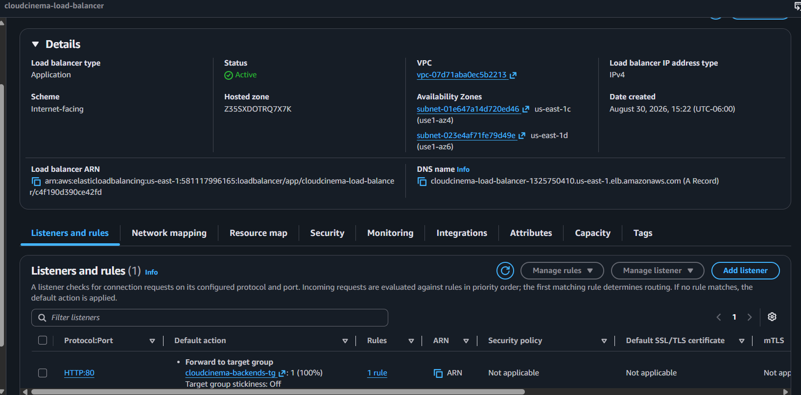

### 6.7 Comprobación del balanceo

Se enviaron varias solicitudes consecutivas a `GET /salud` mediante el DNS del
ALB. Las respuestas identifican alternativamente las implementaciones Python
(`uvicorn`) y Node.js (`Express`), comprobando que ambas reciben tráfico a
través del mismo punto de entrada y respetan el mismo contrato de salud.

## 7. Distribución web segura con Amazon CloudFront

CloudFront es el punto de entrada público de la aplicación. El comportamiento
predeterminado entrega los archivos del website endpoint de S3 y redirige HTTP
a HTTPS. Un segundo comportamiento para `/api/*` usa el ALB como origen,
permite los métodos de la API, deshabilita la caché y reenvía el encabezado
`Authorization`. La función `cloudcinema-spa-routes` reescribe rutas sin
extensión a `/index.html`, permitiendo abrir directamente `/login`, `/perfil` o
`/mi-lista`. HTTPS proporciona además el contexto seguro requerido por la API
de cámara del navegador.

| Configuración | Valor aplicado | Propósito |
|---|---|---|
| Origen predeterminado | Website endpoint de `practica1-web-g15` por HTTP | Entregar `index.html` y los recursos compilados almacenados en S3. |
| Behavior predeterminado | `GET`, `HEAD`, `CachingOptimized` y redirección HTTP → HTTPS | Comprimir y cachear archivos estáticos de forma segura. |
| Origen de API | DNS de `cloudcinema-load-balancer` por HTTP | Mantener el ALB como única entrada de los backends. |
| Behavior `/api/*` | Todos los métodos, `CachingDisabled` y `AllViewerExceptHostHeader` | Enviar autenticación y cuerpos al ALB sin almacenar respuestas privadas en caché. |
| Default root object | `index.html` | Cargar la aplicación al visitar el dominio raíz. |
| Viewer request function | `cloudcinema-spa-routes` | Entregar `index.html` para las rutas internas de React Router. |

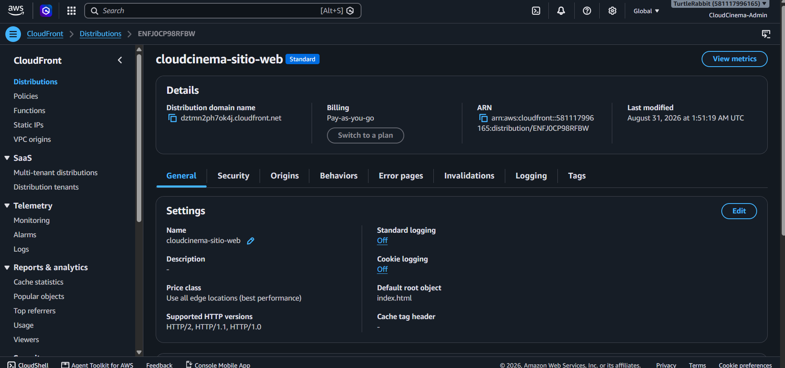

## 8. Aplicación web

La interfaz React consume la API mediante rutas relativas `/api/*`, por lo que
el navegador mantiene un único origen HTTPS en CloudFront. Las siguientes
secciones muestran los principales flujos disponibles para el usuario.

### 8.1 Inicio de sesión

La vista solicita las credenciales y envía la petición al endpoint de
autenticación mediante `/api/*`. Al obtener un JWT válido, el frontend conserva
la sesión y navega al catálogo. Los errores de credenciales o de conexión se
presentan dentro del formulario sin exponer información interna del backend.

### 8.2 Creación de cuenta

El registro recopila los datos requeridos por el contrato, valida la fortaleza
y coincidencia de las contraseñas y permite adjuntar una fotografía compatible.
La cuenta se crea mediante la API compartida y luego el usuario puede iniciar
sesión con las credenciales registradas.

### 8.3 Catálogo de películas

Después de autenticarse, el usuario consulta el catálogo servido por cualquiera
de los dos backends. La interfaz presenta las portadas provenientes del bucket
de imágenes, ofrece búsqueda, acceso al detalle y la acción para agregar o
eliminar una película de “Mi lista”.

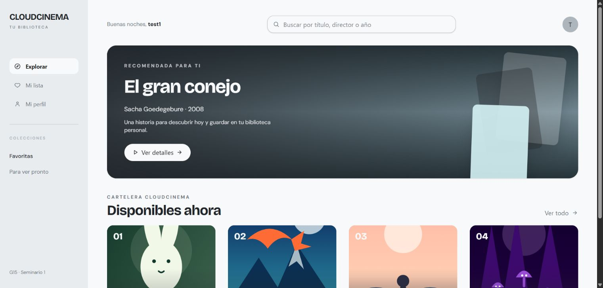

### 8.4 Mi lista de reproducción

Esta vista consulta la relación `lista_reproduccion` del usuario autenticado y
muestra únicamente sus películas guardadas. Desde aquí puede abrir el recurso
de video o retirar elementos; los cambios persisten en RDS y se reflejan al
regresar al catálogo.

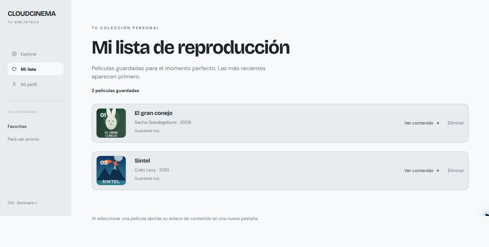

El recorrido funcional completo se encuentra en la
[`Guía de usuario`](Practica_1/docs/user-guide.md).
