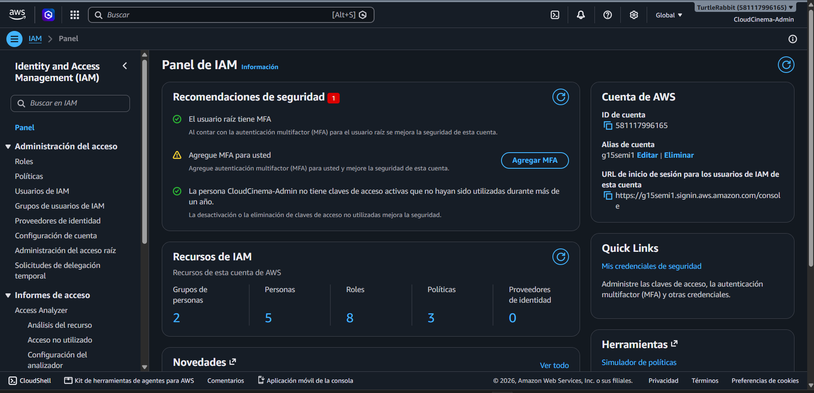
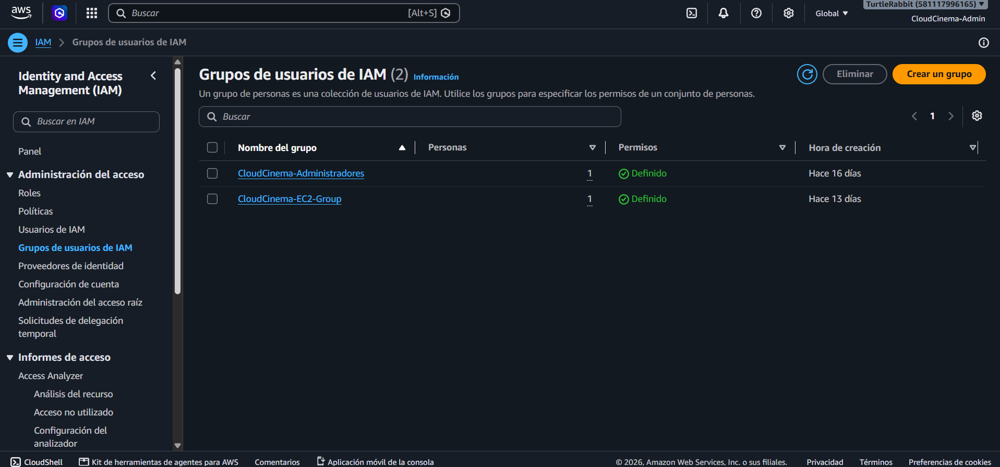
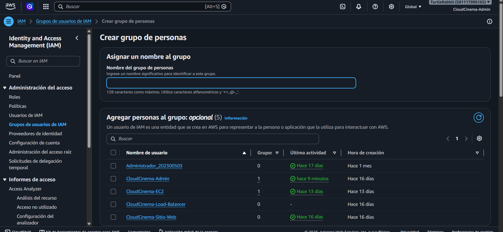
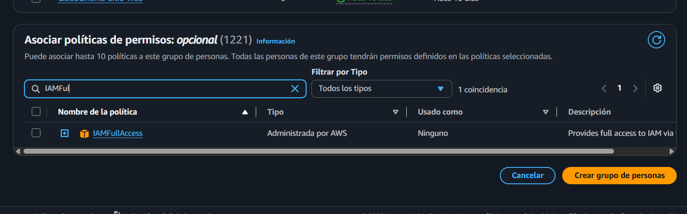
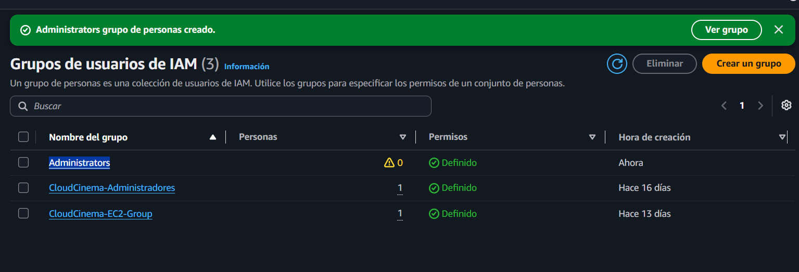
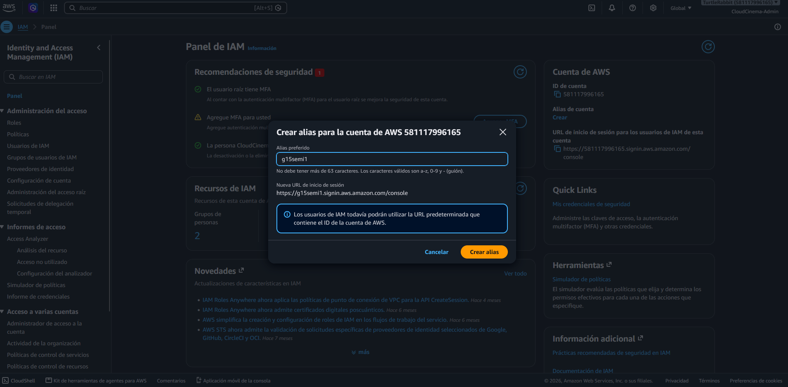
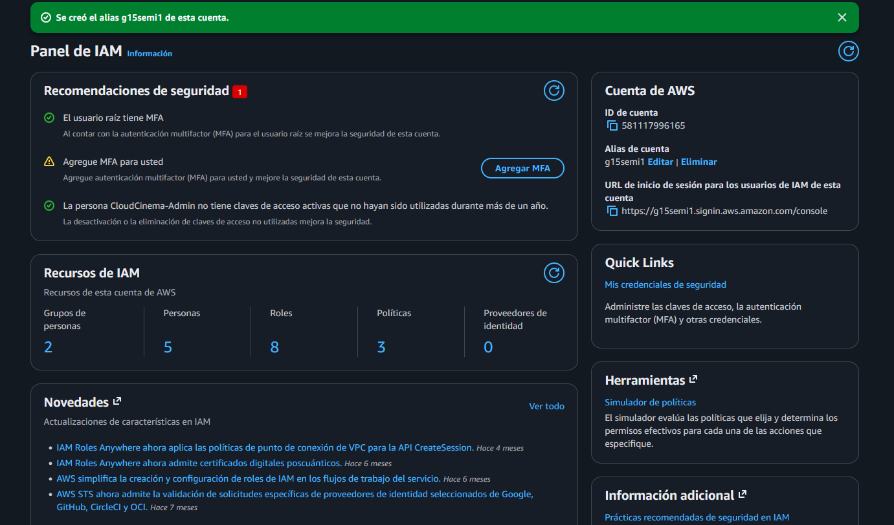
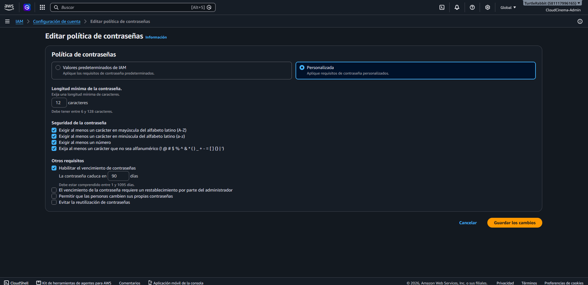
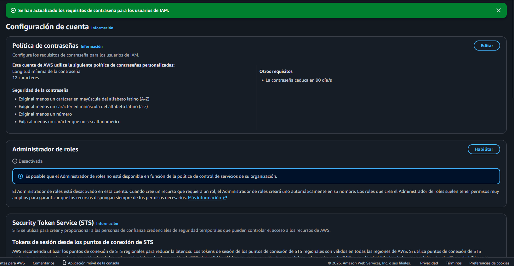

# Unidad 6 - Ejercicios AWS IAM

## Integrantes
- Rabbi
- Isai
- Javier
- Daniel

## Introducción
Breve explicación de AWS IAM.

---

# Ejercicio 6.1 - Crear un grupo IAM

**Responsables:** Rabbi e Isai

## Objetivo

Crear el grupo de usuarios de IAM `Administrators` y asociarle la política administrada por AWS `IAMFullAccess`, para gestionar los permisos de IAM de sus futuros integrantes mediante un grupo. `IAMFullAccess` concede acceso amplio a **IAM**, no equivale a acceso administrativo a todos los servicios de AWS.

## Procedimiento

### 1. Acceso a IAM y a los grupos de usuarios

Desde una sesión de la consola de AWS se abrió el panel de **Identity and Access Management (IAM)**. La captura muestra una sesión con el usuario `CloudCinema-Admin`; por ello, no se describe como un inicio de sesión con el usuario raíz.

En el menú lateral se seleccionó **Grupos de usuarios de IAM**. Antes de la creación se observaban dos grupos existentes y estaba disponible la opción **Crear un grupo**.

### 2. Creación del grupo Administrators

Se abrió el formulario **Crear grupo de personas**, donde se debía ingresar el nombre `Administrators`. Agregar usuarios al grupo era opcional y no se seleccionó ninguno en la evidencia disponible.

### 3. Asignación de IAMFullAccess

En **Asociar políticas de permisos**, se buscó `IAMFullAccess`, una política administrada por AWS, antes de crear el grupo. **La captura muestra la política encontrada, pero su casilla aún no está marcada**; por tanto, esta imagen no demuestra por sí sola que se haya asociado al grupo.

### 4. Confirmación de creación

La consola mostró el mensaje de confirmación de creación y el grupo `Administrators` apareció en el listado, con **0 usuarios** y permisos indicados como **Definido**.

## Resultado

Se verificó la creación del grupo `Administrators` sin usuarios agregados. El listado señala que tiene permisos definidos, pero no identifica la política concreta. **Queda pendiente abrir el grupo y capturar la pestaña Permisos para confirmar que `IAMFullAccess` esté adjunta**. Si no lo está, debe asociarse antes de afirmar que el objetivo se completó en su totalidad.

## Referencia oficial de AWS

- AWS Identity and Access Management. [Crear grupos de usuarios de IAM y adjuntar políticas](https://docs.aws.amazon.com/IAM/latest/UserGuide/id_groups_create.html).
- AWS. [Política administrada `IAMFullAccess`](https://docs.aws.amazon.com/es_es/aws-managed-policy/latest/reference/IAMFullAccess.html).

---

# Ejercicio 6.2 - Link personalizado y política de contraseñas

**Responsables:** Javier y Daniel

## Objetivo

Personalizar el enlace de inicio de sesión de la cuenta de AWS mediante un alias de cuenta, y configurar una política de contraseñas (password policy) personalizada para reforzar la seguridad de los usuarios de IAM, estableciendo requisitos mínimos de complejidad y un período de expiración.

## Procedimiento

### 1. Personalización del enlace de inicio de sesión

Desde el Panel de IAM, en la sección **Cuenta de AWS**, se seleccionó la opción **Crear** alias de cuenta. En el cuadro de diálogo se definió el alias `g15semi1`, con lo cual la URL de inicio de sesión para los usuarios de IAM cambió de la URL predeterminada (basada en el ID de cuenta `581117996165`) a la nueva URL personalizada `https://g15semi1.signin.aws.amazon.com/console`.

Tras confirmar con el botón **Crear alias**, el sistema mostró el mensaje de confirmación *"Se creó el alias g15semi1 de esta cuenta"*, y el Panel de IAM quedó actualizado reflejando el nuevo alias y la nueva URL de acceso.

### 2. Configuración de la política de contraseñas

En **Configuración de cuenta > Política de contraseñas**, se seleccionó la opción **Editar** y se eligió **Personalizada** en lugar de los valores predeterminados de IAM. Se configuraron los siguientes requisitos:

- Longitud mínima de la contraseña: **12 caracteres**
- Exigir al menos un carácter en mayúscula (A-Z)
- Exigir al menos un carácter en minúscula (a-z)
- Exigir al menos un número
- Exigir al menos un carácter no alfanumérico
- Habilitar el vencimiento de contraseñas: expiración cada **90 días**

Al guardar los cambios, la consola confirmó la actualización con el mensaje *"Se han actualizado los requisitos de contraseña para los usuarios de IAM"*, y la sección de Configuración de cuenta mostró la nueva política de contraseñas personalizada aplicada correctamente.

## Resultado

Se logró personalizar el acceso a la cuenta de AWS mediante el alias `g15semi1`, simplificando la URL de inicio de sesión para los usuarios de IAM. Adicionalmente, se estableció una política de contraseñas robusta (mínimo 12 caracteres, combinación de mayúsculas, minúsculas, números y símbolos, con expiración cada 90 días), lo que reduce el riesgo de accesos no autorizados y refuerza las buenas prácticas de seguridad en la gestión de credenciales de la cuenta.

## Referencia oficial de AWS

- AWS Identity and Access Management. *Configurar una política de contraseñas de IAM para usuarios de IAM*. Documentación de AWS IAM. https://docs.aws.amazon.com/es_es/IAM/latest/UserGuide/id_credentials_passwords_account-policy.html
- AWS Identity and Access Management. *Su ID de cuenta de AWS y su alias*. Documentación de AWS IAM. https://docs.aws.amazon.com/es_es/IAM/latest/UserGuide/console_account-alias.html

---

# Conclusiones

# Referencias
